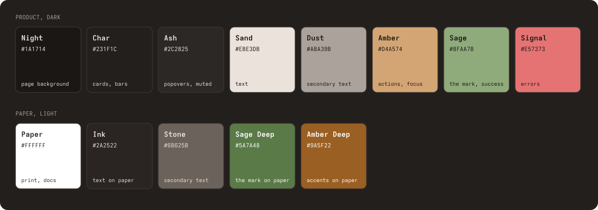
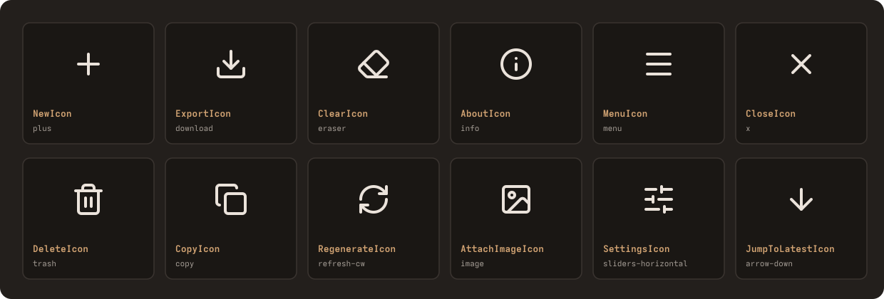

# Agave brand

How Agave looks and talks: the mark, the palette, type, icons, the component
rules the linter enforces, and the wording rules. The chat UI tokens in
[src/web/ui/theme.css](../../src/web/ui/theme.css) are the source of truth for
color values; this page names them and says where each one goes.

<p align="center">
  <picture>
    <source media="(prefers-color-scheme: dark)" srcset="lockup-dark.svg">
    
  </picture>
</p>

## The mark

Five broad blades on a flat ground line, widest at the base and tapering to a
spine tip: an agave rosette, not a leaf. Each front blade cuts a thin gap into
the blades behind it, so the mark stays one flat color and still separates into
leaves at 16px.

| File | Use |
|------|-----|
| [mark.svg](mark.svg) | Sage mark on a dark surface (the product default) |
| [mark-deep.svg](mark-deep.svg) | Sage Deep mark on paper and light pages |
| [mark-sand.svg](mark-sand.svg), [mark-ink.svg](mark-ink.svg) | One-color use where green is not available |
| [lockup-dark.svg](lockup-dark.svg), [lockup-light.svg](lockup-light.svg) | Mark, wordmark and tagline, for README heads and slides |
| [app-icon.svg](app-icon.svg) | The mark on a Night tile: favicons, app icons, avatars |
| [social-card.svg](social-card.svg), [social-card.png](social-card.png) | 1280x640 repository social preview (GitHub takes the PNG) |

Rules:

- Clear space around the mark is at least the width of one outer blade on
  every side. Nothing else sits inside it.
- The mark's ground line aligns with the wordmark baseline in every lockup.
- Minimum size: 14px wide on screen (the assistant-turn label), 10mm in print.
- Do not outline, rotate, recolor outside the palette, add a gradient or
  shadow, or put the mark on a photo.
- In the UI the mark is the `Mark` component (`src/web/ui/icons.tsx`), a CSS
  mask over `--mark` in theme.css, always decorative (`aria-hidden`) because
  the word "agave" sits beside it.

## Wordmark and type

The wordmark is "agave" in lowercase, set in Adwaita Mono Bold (SIL Open Font
License) and converted to outlines, so it renders the same everywhere. The
tagline under it is Adwaita Mono Regular in capitals with wide tracking. Write
the name as "Agave" in running text and `agave` for the binary.

The product UI uses system stacks, no web fonts, because both chat surfaces
ship as one self-contained page:

| Role | Stack | Where |
|------|-------|-------|
| Prose | `--font-sans`: system UI, Noto for CJK and Arabic | Model output, user turns, dialog copy |
| Chrome | `--font-mono`: `ui-monospace`, Cascadia Code, Menlo, Consolas | Buttons, labels, badges, stats, the wordmark in headers |

The type scale has five steps, about 1.2 apart: `2xs` 11px, `xs` 12px, `sm`
13px, `base` 15px, `lg` 18px, plus `touch` 16px for text fields in the phone
layout (iOS zooms into anything smaller).

## Color



The product is dark only: warm near-blacks with amber for every action and sage
for the mark. The paper set is for docs, diagrams and print.

| Token (theme.css) | Name | Hex | Use | Measured |
|-------------------|------|-----|-----|----------|
| `background` | Night | `#1a1714` | Page | |
| `card` | Char | `#231f1c` | Header, sidebar, composer | |
| `popover`, `muted` | Ash | `#2c2825` | Dialogs, hover fills | |
| `divider` | | `#3a3430` | Layout separators, table and code frames | Decorative, exempt from 1.4.11 |
| `border`, `input` | | `#77716d` | Control edges | 3:1 or better on every surface |
| `foreground` | Sand | `#ebe3db` | Text | 11.5:1 on Ash |
| `muted-foreground` | Dust | `#aba39b` | Secondary text | 5.9:1 on Ash |
| `faint` | | `#9a928b` | Tertiary text, hints | 4.8:1 on Ash |
| `primary` | Amber | `#d4a574` | Actions, focus ring, links | 6.9:1 on a user turn |
| `success` | Sage | `#8faa7b` | The mark, success states | 7.0:1 on Night |
| `destructive` | Signal | `#e57373` | Errors, destructive keys | |
| | Ink | `#2a2522` | Text on paper | 15.2:1 on white |
| | Stone | `#6b625b` | Secondary text on paper | 6.0:1 on white |
| | Sage Deep | `#5a7a48` | The mark on paper | 4.9:1 on white |
| | Amber Deep | `#9a5f22` | Accents on paper | 5.2:1 on white |

Use the token, never the hex, in UI code: `@shadcn/lint`'s `no-raw-colors` and
`no-arbitrary-values` fail the build on a palette color or a bracketed value.
Diagrams have their own role palette, derived from these values, in
[docs/CONTRIBUTING.md](../CONTRIBUTING.md#diagram-palette).

The CLI does not use the brand colors. Terminal output sticks to the eight ANSI
colors plus bold and dim, so it follows whatever theme the reader's terminal
uses.

## Icons



Icons are [Lucide](https://lucide.dev) (ISC), imported only through
[src/web/ui/icons.tsx](../../src/web/ui/icons.tsx), which names each glyph for
the action it stands for. One action keeps one glyph on both surfaces; oxlint's
`no-restricted-imports` rejects `lucide-react` anywhere else.

- 24px grid, 2px stroke, round caps and joins, `currentColor`.
- Size by context: `size-3.5` beside `2xs` text (message actions), `size-4`
  beside `xs` and `sm` text (toolbar keys), `size-5` on icon-only keys.
- Always `aria-hidden="true"`. The button carries the name, through visible text
  or `aria-label`.
- A new action gets a new semantic export in icons.tsx and a tile in the sheet
  above; it does not reuse a glyph that already means something else.

## Components

Both chat surfaces build from the shadcn primitives in
[src/web/ui/](../../src/web/ui/). `@shadcn/lint` runs every rule at error, and
`no-restyle` allows only layout classes on a design-system component, so a new
look is a new variant in the component file, not a `className` at the call
site.

| Component | Variants |
|-----------|----------|
| `Button` | `solid` (send), `primaryOutline` (the agave action), `ghost` (bordered chrome), `plain` (borderless toolbar key), `destructive`, `plainDestructive`, `destructiveSolid`, `floating` (over the transcript); sizes `xs`, `sm`, `default`, `lg`, `icon`, `iconSm`, `iconRound` |
| `Input` | `font`: `sans`, `mono`; `size`: `default`, `lg` (composer, 16px on phones) |
| `Badge` | `default`, `warning`, `primary`, `invisible` |
| `DialogContent` | `side`: `center`, `left` (the phone drawer) |
| `HintChip`, `HintAction` | A static hint is plain text; only the action wears a frame |

Every control keeps a 44px target. Borders mark controls; layout separators use
`divider`, which is decorative.

## Voice

The product and the docs say what happens, in plain words, and stop.

- Name the mechanism and the number: "23 tok, 4.6 tok/s", not "blazing fast".
- Status text states the state: "Loading conversation…", "Model URL was not
  found. Check the link."
- No marketing adjectives and no filler: not "seamless", "robust",
  "leverage", "cutting-edge", "comprehensive", "effortless".
- No em dashes; use a comma, colon, period or parentheses.
- Sentence case for headings and buttons ("New", "Export", "Clear"), lowercase
  `agave` only in the wordmark and the header brand.
- Honest status: the README says what is partial. The WASM build runs init,
  parse and tokenize only, and nothing may present it as a working chat.

## Regenerating the assets

Every file here is generated by [scripts/build-brand.ts](../../scripts/build-brand.ts)
from the mark geometry in that script, with text outlined from Adwaita Mono by
[scripts/brand-glyphs.py](../../scripts/brand-glyphs.py). It needs `uv` and
`rsvg-convert`:

```console
$ BRAND_FONT_BOLD="$(fc-match -f '%{file}' 'Adwaita Mono:bold')" \
  BRAND_FONT_REGULAR="$(fc-match -f '%{file}' 'Adwaita Mono')" \
  bun scripts/build-brand.ts
```

It prints the `--mark` mask and the favicon data URIs last. A change to the
mark or the icon set is not done until those are pasted into
`src/web/ui/theme.css`, `src/web/head.html` and `web/index.html`, the web
bundles are rebuilt (`scripts/build-web.sh`), and the new files have been
looked at in a browser at 16px, 32px and full size.
