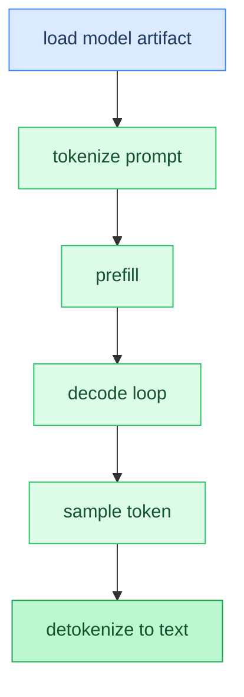

# Chapter 0: Getting Started

**Time:** ~15 min

> After this chapter you can explain the path from a model file on disk to sampled text tokens.

<!-- TODO: Task 2 — full prose -->

### Code Flow



## Gotchas

- Placeholder — filled in Task 2.

## How This Relates to the Code

**In the code:** [`main` generation path](../../src/main.zig)

```text
load → tokenize → prefill → (forward → sample → append)* → text
```

**Next:** [Chapter 1: Tokens and Text →](01-tokens-and-text.md) | **Product docs:** [README](../../README.md)

---

## Glossary

(Terms added in Task 2.)
