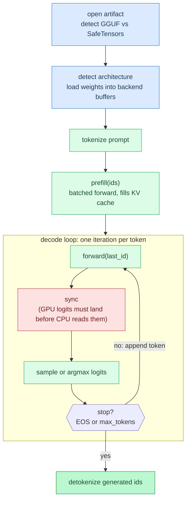

# Chapter 0: Getting Started

**Time:** ~15 min

> After this chapter you can explain the path from a model file on disk to sampled text tokens.

This chapter walks the full pipeline once, at the level of "what happens and why," before the rest of the tutorial zooms into each stage. Nothing here requires understanding neural networks yet: it's a map of the territory so the deep dives in later chapters have somewhere to attach.

## 1. The Model Artifact on Disk

A trained model ships as one of two **artifacts** (the file or directory Agave loads):

- A single **GGUF** file: a binary format designed by the llama.cpp project. All tensors (weight matrices) and metadata (architecture name, tokenizer vocabulary, hyperparameters) live in one file, laid out so it can be **memory-mapped** (`mmap`, meaning the OS maps the file's bytes directly into the process's address space instead of copying them into a heap buffer). Loading a 30 GB model this way doesn't require 30 GB of upfront read time.
- A **directory** of **SafeTensors** shards plus a `config.json`: the format HuggingFace/PyTorch tooling produces. Multiple `.safetensors` files split the weights, and the JSON config carries the metadata that GGUF would store inline.

Agave tells them apart by inspecting the path. If it's a directory, it's SafeTensors; otherwise it opens the single file as GGUF and checks the magic bytes. Both formats end up behind one internal `Format` interface, so everything downstream (tokenizer loading, weight lookup, metadata queries) reads either one the same way. The two formats disagree on tensor naming, dimension order, and a few numeric conventions. Chapter 14 covers those differences and why getting them wrong produces wrong output instead of a crash.

Agave can also download models directly from Hugging Face Hub using the `pull` subcommand, which selects the best file(s) based on quantization preference:

```bash
agave pull Qwen/Qwen3.5-0.6B-GGUF
agave pull Qwen/Qwen3.5-0.6B-GGUF --quant Q4_K_M
agave pull Qwen/Qwen3.5-0.6B-GGUF --list    # list available files without downloading
```

See [`src/pull.zig`](../../src/pull.zig) for the download implementation.

## 2. Architecture Detection and Weight Load

Once the artifact is open, Agave reads an architecture string from its metadata (`general.architecture` for GGUF, `model_type` for SafeTensors config) and matches it against the model implementations it was compiled with: Gemma3, Gemma4, DiffusionGemma, Qwen 3.5, Qwen4-Exp, GPT-OSS, Nemotron-H/Nano, GLM-4, DeepSeek V4, Llama 4, or the DFlash2 drafter. An unrecognized string is a hard, immediate error. A *misidentified* one is not: two architectures can share a metadata string family closely enough that detection guesses wrong, and the model will still build and run, just against the wrong tensor layout.

With the architecture chosen, Agave picks a compute **backend** (CPU, Metal, CUDA, Vulkan, ROCm, or WebGPU; Chapter 8 covers selection) and loads weights into that backend's buffers.

"Loads" doesn't mean "converts to float32": quantized tensors (weights compressed to formats like Q4_0 or BF16 to save memory, covered in Chapter 4) stay in their compressed form. The GEMV/GEMM kernels (GEMV = matrix-**v**ector multiply, used in decode; GEMM = matrix-**m**atrix multiply, used in prefill) dequantize each block on the fly as they read it, so the working set in memory (and, for GPU backends, in VRAM) stays close to the file's on-disk size rather than ballooning to full precision.

On unified-memory hardware (CPU and GPU sharing the same physical RAM, called **UMA**, covered in Chapter 8 and Chapter 11) the mmap'd file region can be registered directly with the backend, letting the GPU read weights without a separate copy.

## 3. Tokenization of the Prompt

The model doesn't accept text; it accepts a sequence of integer **token IDs**. Before the prompt reaches the model, Agave applies any **chat template** the architecture defines (wrapping the raw prompt in role markers like a system/user turn structure, covered in Chapter 15), then runs the tokenizer to turn that formatted string into IDs. Chapter 1 covers the tokenizer algorithm (BPE or SentencePiece) in depth. For this chapter, the important part is just that tokenization is a pure, fast, CPU-side string-to-integers step that happens once per prompt, before any model computation.

## 4. Prefill vs. Decode

Generation runs in two distinct phases that share the same underlying computation (a forward pass through every model layer) but differ in shape and cost:

- **Prefill** processes the entire prompt's token IDs in one batched call. Every layer computes attention and feed-forward outputs for all prompt positions at once, and, critically, populates the **KV cache**, a per-layer store of previously computed Key/Value vectors (Chapter 5). Prefill is **compute-bound**: it's dominated by large matrix-matrix multiplies (GEMM), which parallelize well across GPU cores.

- **Decode** is the token-by-token loop that follows. Each iteration runs `forward()` on exactly one token (the last one produced), attending against the KV cache built by prefill and every prior decode step, so it never reprocesses earlier tokens. Decode is **memory-bandwidth-bound**: each step is dominated by matrix-vector multiplies (GEMV), where the bottleneck is reading weights from memory, not raw arithmetic.

This split exists because generation is **autoregressive**, every output token becomes the input to produce the next one, so there is no way to batch the unknown future tokens the way the known prompt tokens can be batched.

That asymmetry (batched prefill followed by sequential decode) is why prefill and decode get reported as separate throughput numbers rather than one blended figure.

## 5. Sampling and Detokenization

Each `forward()` call ends with a **vocabulary projection**: a matrix multiply that turns the model's final hidden state into **logits**, one raw, unnormalized score per vocabulary entry. Picking the next token from those logits is either:

- **Greedy**: take the highest-scoring logit (**argmax**), or
- **Sampled**: apply temperature, top-k, top-p, or other filters to turn logits into a probability distribution and draw from it (Chapter 7).

On GPU backends the logits are written by the GPU asynchronously, so the CPU must **synchronize** (block until the GPU finishes and its writes are visible) before reading them for argmax or sampling. See the first gotcha below.

Once a token ID is chosen, it's appended to the running list of generated IDs and checked against the model's end-of-sequence markers. When generation stops (end-of-sequence token, or a max-token limit), the full list of generated IDs is **detokenized**, converted back to a text string in one pass, the mirror image of the tokenization step in section 3.

## 6. Timings and Tokens as Pipeline Artifacts

Every run reports something like `5 tok, 10.4 tok/s, prefill 200ms, gen 480ms`. Those numbers are direct artifacts of the pipeline shape from section 4, not arbitrary stats:

- **Prefill time** scales with prompt length and reflects GEMM throughput: how fast the backend can chew through the whole prompt in parallel.
- **Decode time** and its tok/s rate reflect GEMV throughput per step: how fast the backend can stream weights through memory once per generated token. Because decode is memory-bound, tok/s is largely a function of weight size divided by memory bandwidth, not raw compute.
- **Time-to-first-token (TTFT)** is effectively the prefill time: the delay before the first generated token can appear.

Reading these two numbers separately, instead of one average, tells you which phase to optimize. A slow prefill on a long prompt points at compute throughput and batching (Chapters 9, 13); a slow decode rate points at memory bandwidth, quantization, and kernel efficiency (Chapters 4, 8, 11).

## 7. Where the Rest of This Tutorial Fits

Chapters 1 through 8 build the foundations this chapter glossed over, in pipeline order: how tokens become vectors and back (Ch 1), the transformer layer that `forward()` runs (Ch 2), the feed-forward block inside each layer (Ch 3), how weights stay compressed in memory (Ch 4), how the KV cache from section 4 is actually stored (Ch 5), an alternative to attention entirely (Ch 6), the sampling strategies from section 5 in full (Ch 7), and how backend dispatch from section 2 works (Ch 8). Chapters 9 onward go deeper into performance (SIMD, Metal internals, parallelism, fusion), model-specific mechanics (formats, chat templates, recipes, speculative decoding, diffusion), and finally the surrounding systems (Ch 21 LoRA, Ch 22 distributed inference, Ch 23 the HTTP server), all of which sit on top of the same load, tokenize, prefill, decode, detokenize pipeline described here.

### Code Flow



## Gotchas

- **Stale logits from missing sync.** GPU backends write the vocabulary-projection output asynchronously: the dispatch call returns before the GPU has actually finished writing `logits`. Every model's `forward()` calls `be.sync()` immediately after the final projection GEMV and before `math_ops.argmax()` reads the buffer (see `self.be.sync()` right before `argmax` in `src/models/qwen35.zig`). Skip that sync in custom code and you'll read whatever was in the buffer before the GPU wrote to it, most visible on UMA (Unified Memory Architecture: CPU and GPU share the same physical RAM) systems, where the read doesn't fault, it just silently returns garbage.
- **Format or architecture mismatch is silent, not a crash.** An unrecognized architecture string is a hard error, but a *misdetected* one, or a tensor-naming convention borrowed from the wrong format (GGUF's llama.cpp conventions vs. SafeTensors' HuggingFace conventions), is not. The model builds, runs, and produces low-quality or nonsensical output with no error message, what Chapter 14 calls a "silent correctness failure." If a model that should work produces garbage, format/architecture mismatch is the first thing to check.

**In the code:** [`main` generation path](../../src/main.zig), [Model interface](../../src/models/model.zig)

```text
open artifact
detect format and architecture
load weights into backend buffers
ids = tokenize(prompt)
prefill(ids)                    # fill KV for the prompt
loop:
  logits = forward(last_id)
  be.sync()                       # called unconditionally; no-op on CPU, flushes pending work on GPU backends
  next = sample(logits)
  append next; break on stop
text = detokenize(generated_ids)
```

Link: [`src/main.zig`](../../src/main.zig), [`src/models/model.zig`](../../src/models/model.zig).

**Next:** [Chapter 1: Tokens and Text →](01-tokens-and-text.md) | **Product docs:** [README](../../README.md)

---

## Glossary

**artifact**: The model file or directory Agave loads: a single GGUF file, or a directory of SafeTensors shards plus `config.json`.

**argmax**: The operation that finds the index of the highest-scoring logit; used for greedy (non-random) token selection.

**autoregressive**: A generation mode where each output token is fed back as input to produce the next token, so tokens must be produced one at a time.

**backend**: The compute target that executes kernels: CPU, Metal, CUDA, Vulkan, ROCm, or WebGPU.

**decode**: The token-by-token generation loop following prefill; each step runs one `forward()` call on the most recently produced token.

**detokenize**: Convert a sequence of token IDs back into a text string.

**GGUF**: A single-file binary model format from the llama.cpp project, designed for mmap and quantized inference.

**KV cache**: Per-layer storage of previously computed Key/Value vectors, so decode steps attend to prior context without recomputing it.

**logits**: Raw, unnormalized scores output by the model's vocabulary projection, one per vocabulary token, before any sampling is applied.

**mmap (memory-mapped file)**: Mapping a file's bytes directly into a process's address space instead of copying them into a heap buffer.

**prefill**: The batched forward pass over all prompt tokens that populates the KV cache before decode begins.

**quantized**: Compressed to a lower-precision numerical format (e.g. Q4_0, BF16) to reduce memory footprint; dequantized on the fly inside compute kernels.

**SafeTensors**: A multi-file model format from HuggingFace/PyTorch, paired with a `config.json` for metadata.

**sync (synchronize)**: Blocking until a GPU backend finishes pending work and its writes to memory are visible to the CPU.

**TTFT (time to first token)**: The latency before the first generated token appears, dominated by prefill time.

**UMA (Unified Memory Architecture)**: A system where CPU and GPU share the same physical memory (e.g., Apple Silicon).
