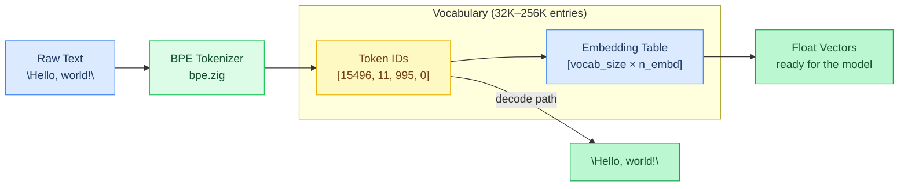
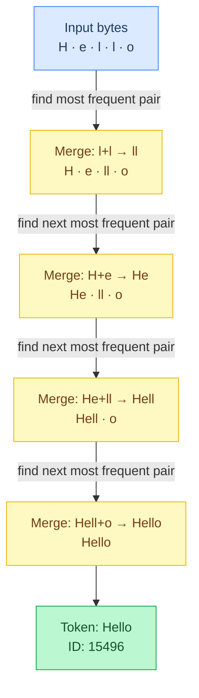
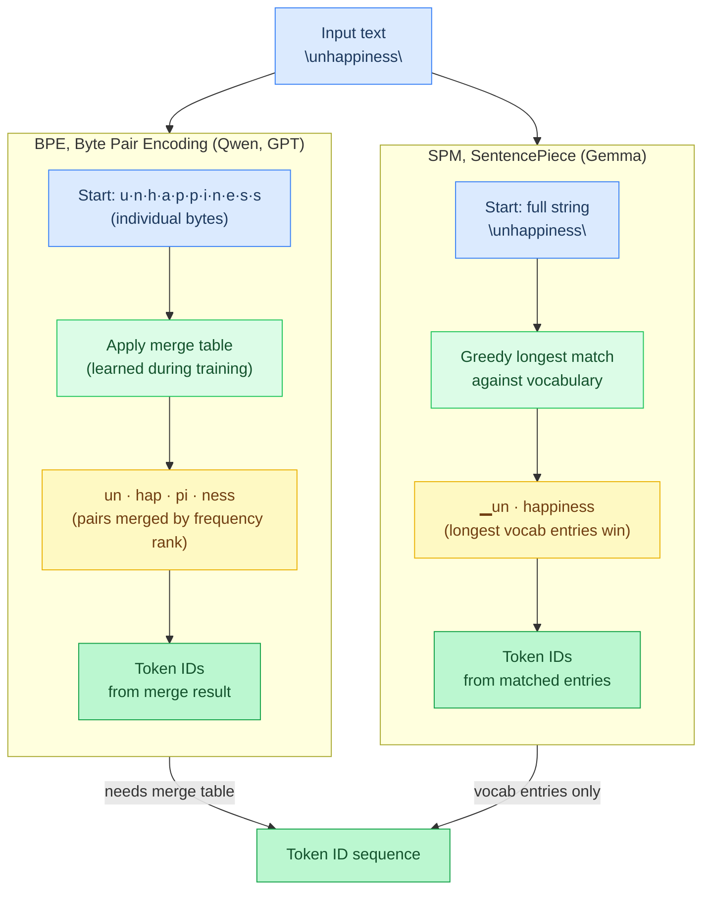
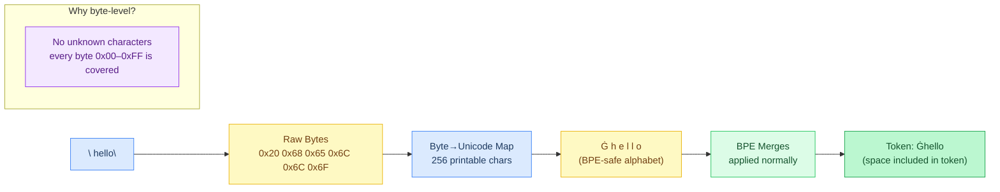
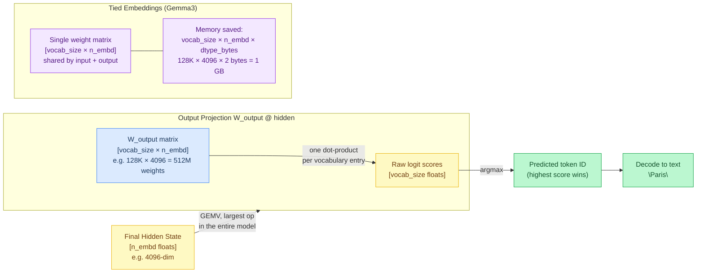
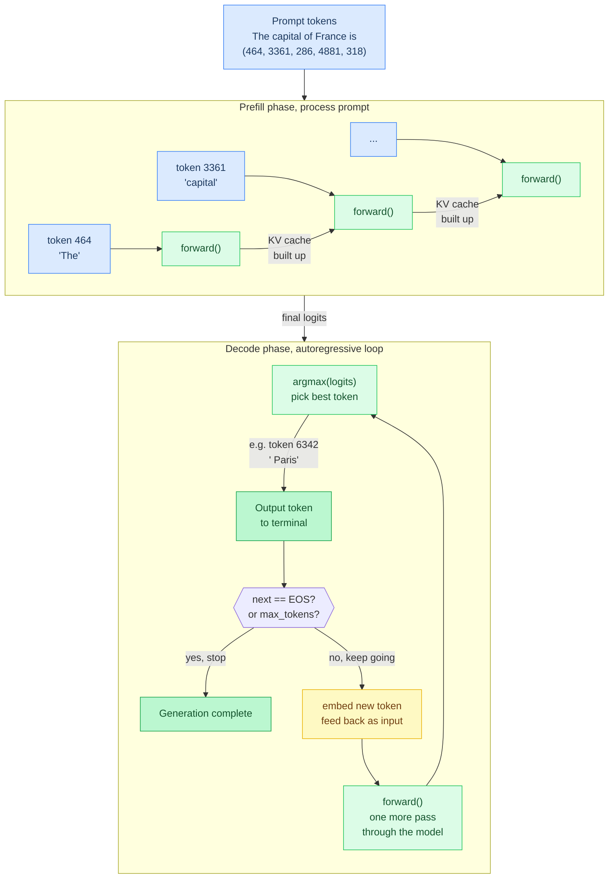

# Chapter 1: Tokens and Text

**Prerequisites:** [Chapter 0: Getting Started](00-getting-started.md)

**Time:** ~12 min

> After this chapter you can explain BPE and SentencePiece tokenization, embedding lookup, and vocabulary projection.

Language models don't see text, they see **tokens**, which are integer IDs representing subword pieces (fragments like "Hello" → "He" + "llo" that are smaller than words but larger than individual characters). Before anything else happens, we need to convert text to numbers and back.

## Code Flow

```mermaid
flowchart LR
    classDef setup     fill:#dbeafe,stroke:#3b82f6,color:#1e3a5f
    classDef sync      fill:#dcfce7,stroke:#22c55e,color:#14532d
    classDef migration fill:#fef9c3,stroke:#eab308,color:#713f12
    classDef success   fill:#bbf7d0,stroke:#16a34a,color:#14532d

    Text["Raw text"]:::setup
    Tok["tokenize()\nBPE or SPM"]:::sync
    Ids["Token IDs"]:::migration
    Emb["embed()\ntable lookup"]:::sync
    Layers["N transformer layers\n(Chapters 2-3)"]:::migration
    Proj["vocab projection\nW_output @ hidden"]:::sync
    Logits["Logits"]:::migration
    Next["argmax / sample\n→ next token ID"]:::success

    Text --> Tok --> Ids --> Emb --> Layers --> Proj --> Logits --> Next
```



This chapter covers the first and last legs of that path (tokenize, embed, project); the layers in between are Chapters 2-3.

## What is Inference?

**Training** teaches a model by adjusting billions of **weights** (learned parameters, the numbers in matrices and vectors that encode the model's knowledge) over trillions of tokens. **Inference** uses those **frozen** (fixed, no longer changing) weights to generate new text. Agave only does inference, it loads **pre-trained** (already trained by someone else, ready to use) weights and runs the model forward (a single pass through the network layers to produce output).

## Tokenization

The tokenizer converts between text and token IDs:



```
"Hello, world!" → [15496, 11, 995, 0]     (encode)
[15496, 11, 995, 0] → "Hello, world!"     (decode)
```

**BPE (Byte Pair Encoding)** is the most common algorithm. It works by iteratively merging the most frequent pair of adjacent symbols:



1. Start with individual bytes: `H e l l o`
2. Most frequent pair is `l l` → merge to `ll`: `H e ll o`
3. Next most frequent is `H e` → merge to `He`: `He ll o`
4. Continue until vocabulary is built: `Hello`

The merge rules are learned during training and stored alongside the model. This process creates the **vocabulary**, the complete set of all possible tokens the model knows about. Each token gets a unique ID (0 to vocab_size-1). For example:

```
Token ID 0:    "<pad>" (padding, fills empty space when batching multiple sequences of different lengths)
Token ID 1:    "<s>" (start of sequence)
Token ID 15496: "Hello"
Token ID 11:    ","
Token ID 128000: (last valid token)
```

The **vocabulary size** (vocab_size) is the total number of distinct tokens. Modern models have vocabularies of 32K–256K tokens. Larger vocabularies encode text more efficiently (fewer tokens per sentence) but increase memory and compute costs.

### Tokenizer Strategies

| Strategy | Algorithm | Models | Merge Table |
|----------|-----------|--------|-------------|
| **BPE** | Iterative pair merging | Qwen, GPT | Required, learned merge priority list |
| **SPM** | Greedy longest-match | Gemma | Not needed, matches vocabulary entries directly |



Agave's tokenizer (`src/tokenizer/bpe.zig`) supports both:
- **BPE mode**: uses merge rules to decide which byte pairs to combine first
- **SPM mode**: greedy longest-match without merges, including a "no dummy" variant for Gemma

### Token Statistics

| Model | Vocab Size | Avg Tokens/Word | Encoding |
|-------|:----------:|:---------------:|----------|
| Qwen 3.5 | 248,320 | ~1.3 | BPE (GPT-2 style, byte-level) |
| Gemma 3/4 | 262,144 | ~1.1 | SentencePiece |
| GPT-OSS | 201,088 | ~1.3 | BPE |
| GLM-4 | 154,880 | ~1.3 | BPE |

Larger vocabularies encode text more efficiently (fewer tokens per sentence) but increase the embedding table size, a 256K vocabulary with 4096-dim embeddings takes 4 GB in FP32.

### Special Tokens

Every vocabulary includes reserved tokens with structural meaning:

| Token | Purpose | Typical ID |
|-------|---------|:----------:|
| `<bos>` | Beginning of sequence, signals the model to start generating | 1 |
| `<eos>` | End of sequence, signals generation should stop | 2 |
| `<pad>` | Padding, fills unused positions in batched inputs | 0 |
| `<|im_start|>` | Chat role marker (Qwen), marks the beginning of a message | varies |
| `<start_of_turn>` | Chat role marker (Gemma) | varies |

The tokenizer tracks these IDs for chat template formatting and end-of-generation detection. Some models define additional **end-of-generation (EOG)** tokens beyond `<eos>`, for example, Qwen uses `<|endoftext|>` and `<|im_end|>`.

### Byte-Level BPE Encoding

Qwen/GPT-style tokenizers use **byte-level** encoding where every possible byte (0x00–0xFF) maps to a printable Unicode character. For example, a space (0x20) is represented as `Ġ` (U+0120). This means:



- Every text can be tokenized (no unknown characters)
- Token text looks odd in raw form: `"Ġhello"` = `" hello"` (space prefix)
- Grammar-constrained decoding must strip these prefixes via `getEffectiveText()`

## Embedding Lookup

The first operation in the forward pass converts a token ID into a **vector** (a 1D array of numbers).

The model has an **embedding table**, a **matrix** (2D array) of shape `[vocab_size × n_embd]`:

- **vocab_size**: the total number of tokens in the vocabulary (e.g., 128K)
- **n_embd**: the **embedding dimension**, how many floats each vector contains (typically 1024–8192)

Each row is the learned representation of one token. An **embedding** is just this fixed-size array of floats that encodes a token's meaning.

```mermaid
flowchart LR
    classDef setup     fill:#dbeafe,stroke:#3b82f6,color:#1e3a5f
    classDef sync      fill:#dcfce7,stroke:#22c55e,color:#14532d
    classDef migration fill:#fef9c3,stroke:#eab308,color:#713f12
    classDef success   fill:#bbf7d0,stroke:#16a34a,color:#14532d
    classDef danger    fill:#fee2e2,stroke:#ef4444,color:#7f1d1d
    classDef optional  fill:#f3e8ff,stroke:#9333ea,color:#581c87

    TID["Token ID\ne.g. 15496"]:::setup
    Lookup["Embedding Table\n[vocab_size × n_embd]\ne.g. 128K × 4096"]:::setup
    Vec["Float Vector\n[4096 float32s]\n≈ 16 KB"]:::success
    Layers["Transformer Layers\nattention + FFN × N"]:::sync
    Hidden["Final Hidden State\n[4096 float32s]"]:::migration
    Proj["Output Projection\n[vocab_size × n_embd]"]:::setup
    Logits["Logits\n[vocab_size scores]"]:::migration
    NextTok["Next Token ID"]:::success

    TID -->|"row index"| Lookup
    Lookup -->|"read one row"| Vec
    Vec --> Layers
    Layers --> Hidden
    Hidden --> Proj
    Proj --> Logits
    Logits -->|"argmax"| NextTok
```



**Note on terminology:** Machine learning uses the term **tensor** for multi-dimensional arrays, a **scalar** (single number, 0D), vector (1D), matrix (2D), or higher-dimensional array (3D, 4D, etc.) are all tensors. Throughout this tutorial we use the more specific terms (scalar/vector/matrix) since nearly all operations are 0D, 1D, or 2D, but you'll see "tensor" in the code and documentation referring to these same arrays.

Embedding lookup is just a table read: take row `token_id` from the matrix.

**Why vectors, not just integer IDs?** Because vectors let the model represent *relationships*. During training, words that appear in similar contexts end up with similar vectors, "cat" and "dog" are close together, while "cat" and "database" are far apart. The distance and direction between vectors encode meaning. Integer IDs can't do this, ID 4517 and ID 4518 have no meaningful relationship. Vectors give the model a continuous space where it can generalize: if it knows about "cat" and "dog", it can infer things about "kitten" because its vector is nearby.

Embedding lookup is so simple that CPU memcpy is faster than GPU **dispatch** overhead (the cost of sending work to the GPU and synchronizing), which is why all backends run this on the CPU.

The table may be **quantized** (compressed to lower **precision**, fewer bits per number, less accurate, formats like Q4_0 or BF16 to save memory). The implementation **dequantizes** (converts back to full precision) on the fly during the lookup.

Gemma3 scales embeddings by `sqrt(n_embd)` after lookup, **amplifying the signal** (making the values larger to increase their influence) for its architecture.

## Vocabulary Projection

At the end of the forward pass, we need to go back from a vector to token probabilities. This is a matrix multiply: `logits = W_output @ hidden`, where **hidden** is the output vector from the final layer and **logits** are the raw scores (unnormalized probabilities), one score per vocabulary token.

This is the **largest single GEMV** (matrix-vector multiply, multiplying a weight matrix by a single hidden state vector) in the model, for a 128K-token vocabulary, it's 128K output rows.

For models with **tied embeddings** (Gemma3), the output weight matrix is the same as the embedding table (reusing the same parameters for both input and output), saving memory.

After projection, **argmax** (the operation that finds the index of the maximum value) over the logits gives the predicted next token ID.



## The Generation Loop

Text generation is **autoregressive**, each generated token becomes the input for the next step:

```
tokens = tokenize("The capital of France is")
for each token in tokens:
    logits = forward(token)           // process prompt tokens one at a time

while not done:
    next_token = argmax(logits)       // pick highest-scoring token
    if next_token == EOS: break       // stop at end-of-sequence
    print(decode(next_token))         // output: " Paris"
    logits = forward(next_token)      // feed output back as input
```



This is why inference speed matters, generating 100 tokens requires 100 sequential forward passes through the entire model. Each pass is dominated by GEMV (matrix-vector multiply), which is memory-bandwidth bound. The rest of this tutorial series explains every component of that forward pass and how Agave optimizes it.

---

## Tokenizer Performance: Word-Level BPE Cache

The `applyBpe` function runs a merge loop that can iterate many times per pretoken, for a word like `" transformer"`, it starts with individual bytes and merges pairs until no merge rule applies. Adjacent pairs sit in a min-heap so each merge is O(log n) rather than a full rescan of the piece list. This is still expensive for a unique long segment.

The key insight: the same pretokens appear repeatedly. In any English prompt, words like `" the"`, `" is"`, `" model"`, and code keywords appear constantly. After the first encode, the merge result for each word is already known.

Agave's tokenizer caches these results in `word_cache: StringHashMapUnmanaged([]u32)`:

```text
lookup seg in word_cache
if hit:  append cached token ids to result          # skip merge loop entirely
if miss: unicode_text = bytesToUnicode(seg)
         seg_ids = splitUtfChars(unicode_text) → applyBpe(...)
         store (seg copy, seg_ids copy) in word_cache for future calls
```

**Implementation:** [`src/tokenizer/bpe.zig`](../../src/tokenizer/bpe.zig) (`word_cache`, `applyBpe`)

On cache hit, three allocations and the entire merge loop are skipped. In practice, most pretokens in a repeated system prompt hit the cache after the first call (illustrative estimate, not a BENCHMARKS.md measurement).

This technique is adapted from [gigatoken](https://github.com/marcelroed/gigatoken), which applies the same principle at much larger scale for training data ingestion.

## Gotchas

- **Special tokens match on literal substring, not intent.** `encode()` scans the raw text for `<` and checks every registered special token for an exact substring match at that position (`src/tokenizer/bpe.zig`, the special-token scan inside `encode()`). If a prompt happens to contain the literal text of a special token, for example a user pastes `<|im_start|>` into a chat message, it's consumed as that control token rather than encoded as ordinary text. Untrusted input that isn't escaped can inject role markers into the token stream this way.
- **A BPE piece missing from the vocabulary falls back to token ID 0, silently.** If `applyBpe()`'s merge result produces a piece that `token_to_id` doesn't have an entry for (shouldn't happen with a matched vocabulary and merge table, but can with a corrupted or mismatched one), `encode()` appends ID 0 with no error. ID 0 is typically `<pad>`, so a broken vocab produces plausible-looking padding tokens instead of a crash you'd notice.

**In the code:** [src/tokenizer/bpe.zig](../../src/tokenizer/bpe.zig) (tokenizer, word cache), [src/backend/kernels/cpu/embedding.zig](../../src/backend/kernels/cpu/embedding.zig) (embedding lookup), [src/ops/math.zig](../../src/ops/math.zig) (argmax, sampleToken)

```text
bytes → pretokens → BPE merges → token ids
emb[i] = table[token_id]
logits = emb_out @ W_vocab   # or tied embeddings
```

**Next:** [Chapter 2: The Transformer →](02-the-transformer.md) | **Back:** [Chapter 0: Getting Started ←](00-getting-started.md) | **Product docs:** [Architecture](../ARCHITECTURE.md)

---

## Glossary

**argmax**, The operation that finds the index of the highest value in an array; used for greedy decoding.

**autoregressive**, A generation mode where each output token is fed back as input to produce the next token.

**BOS (Beginning of Sequence)**, A special token signaling the start of a sequence.

**BPE (Byte Pair Encoding)**, A tokenization algorithm that iteratively merges the most frequent adjacent byte/character pairs to build a vocabulary.

**byte-level BPE**, A BPE variant where every possible byte (0x00–0xFF) maps to a printable character, ensuring any input can be tokenized.

**dequantize**, Convert quantized (compressed) values back to full-precision floats.

**dispatch overhead**, The cost of sending work to an accelerator (GPU) and synchronizing, which can exceed compute cost for small operations.

**embedding**, A learned fixed-size float vector that encodes a token's meaning; looked up from a table by token ID.

**embedding dimension (n_embd)**, The number of floats in each embedding vector (typically 1024–8192).

**EOS (End of Sequence)**, A special token signaling that generation should stop.

**FP32**, 32-bit floating-point format; 4 bytes per value, full precision.

**BF16 (bfloat16)**, 16-bit brain floating-point format; same exponent range as FP32 but fewer mantissa bits.

**forward pass**, A single pass of input data through all model layers to produce output.

**frozen weights**, Model parameters that are fixed and no longer updated (inference-only).

**GEMV (General Matrix-Vector multiply)**, Multiplying a weight matrix by a single input vector to produce one output vector.

**inference**, Using a trained model's frozen weights to generate new output, as opposed to training.

**logits**, Raw, unnormalized scores output by the model, one per vocabulary token, before conversion to probabilities.

**pre-trained**, A model whose weights have already been learned through training.

**quantized**, Compressed to a lower-precision numerical format to save memory.

**SPM (SentencePiece)**, A tokenization algorithm that uses greedy longest-match against a vocabulary, without requiring a merge table.

**tensor**, A general multi-dimensional array (scalar = 0D, vector = 1D, matrix = 2D, etc.).

**tied embeddings**, When input embedding and output projection share the same weight matrix, saving memory.

**token**, An integer ID representing a subword piece of text, the basic unit language models operate on.

**tokenizer**, A component that converts between text strings and sequences of token IDs.

**vocabulary**, The complete set of all tokens a model can recognize, each mapped to a unique integer ID.

**weights**, The learned numerical parameters (matrix/vector values) that encode a model's knowledge.
