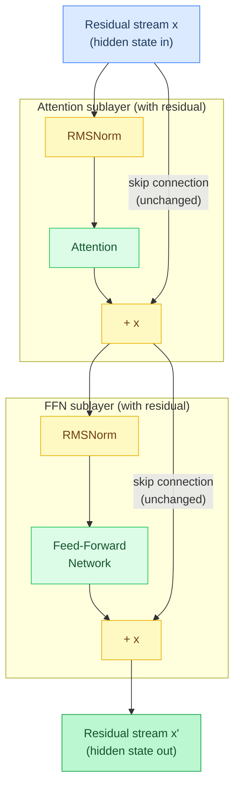
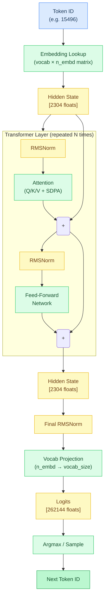
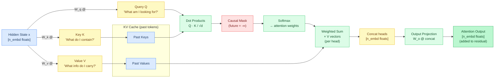
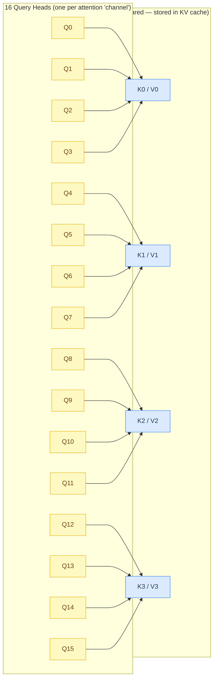
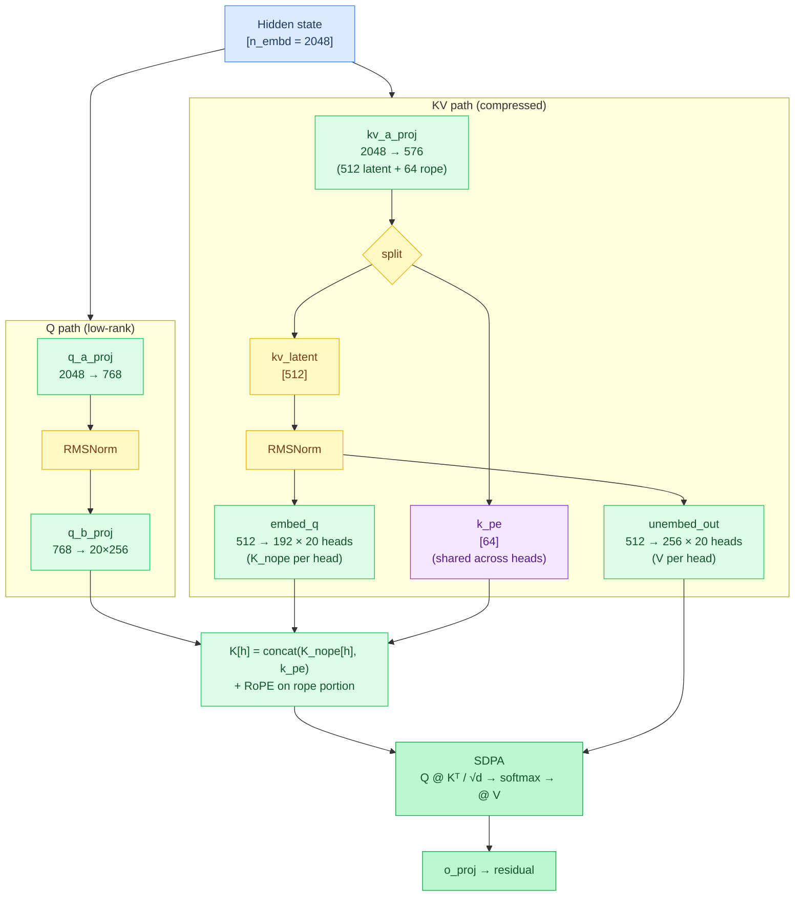
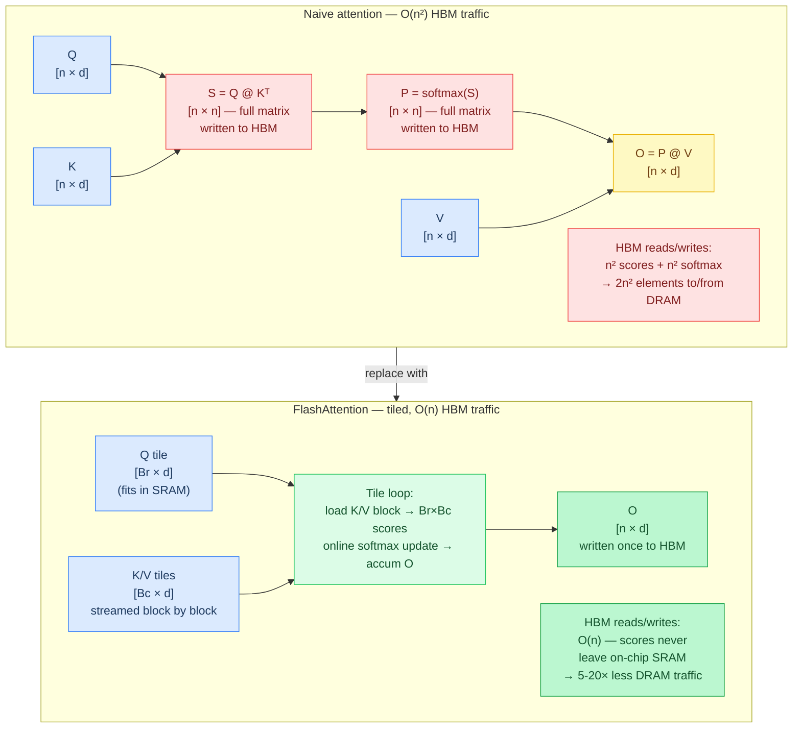
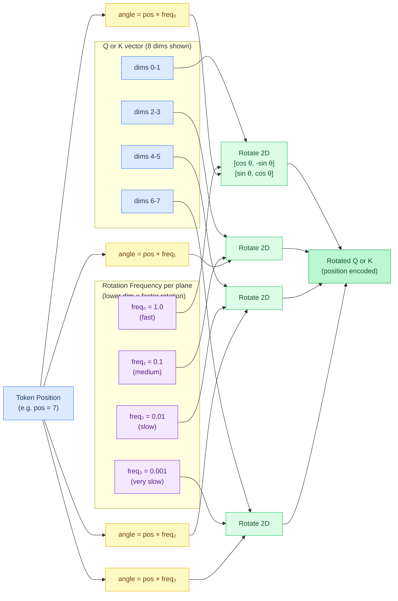
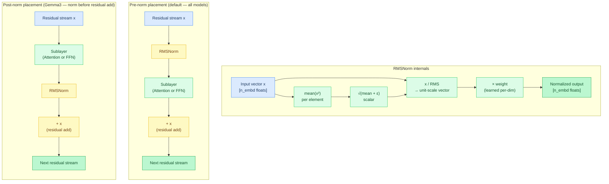
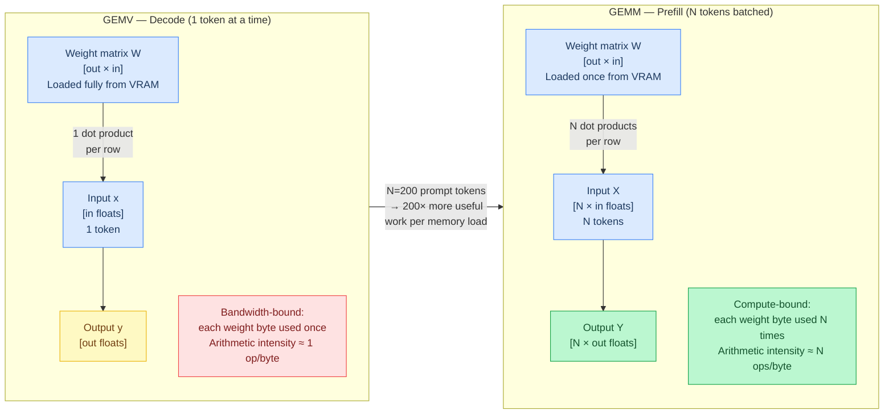

# Chapter 2: The Transformer

**Prerequisites:** [Chapter 1: Tokens and Text](01-tokens-and-text.md)

**Time:** ~18 min

> After this chapter you can trace a single token through attention, RoPE, normalization, and residual connections.

The forward pass is the core computation: given a token, predict the next one.

```
Token ID → Embedding → N Transformer Layers → Final Norm → Logits → Argmax → Next Token
```

Concrete example (Gemma4 E2B, 2.6B parameters):

```
Token 15496     → embed → [2304 floats]  → 35 layers → [2304 floats]  → norm → [2304 floats]
("Hello")          lookup    hidden state     attention+FFN    hidden state            
                                                              → vocab proj → [262144 floats] → argmax → Token 11
                                                                 logits (one per vocab entry)            (",")
```

The **hidden state** (the internal vector representation flowing through each layer) is a fixed-size vector (2304 floats = 9 KB) that flows through every layer. Each layer reads its weight matrices (~180 MB total for this model) to transform it.

Each **transformer layer** has two sublayers:
1. **Attention** — lets the model look at previous tokens
2. **FFN** (Feed-Forward Network) — processes each position independently

A model has N layers stacked in sequence (e.g., 35 for Gemma4 E2B, 64 for Qwen3.5 0.8B). Each layer has its own **independent weight matrices** — layer 0's attention weights are completely different from layer 15's.

The hidden state vector passes through all N layers, getting progressively refined:
- **Early layers** tend to learn basic features (syntax, word relationships)
- **Later layers** learn more abstract ones (reasoning, facts)

Both sublayers use **residual connections** (`output = input + sublayer(input)`) so information flows through unchanged. This prevents the **vanishing gradient problem** — where gradients get exponentially smaller in deep networks during training, making learning impossible.






## Attention

Attention answers: "which previous tokens should I pay attention to?"

### Code Flow



**What are Q, K, V?** They're three different **linear projections** (matrix-vector multiplies) of the same input hidden state `x`:

```
Q = W_q @ x    (Query: "What am I looking for?")
K = W_k @ x    (Key: "What do I contain?")
V = W_v @ x    (Value: "What information do I carry?")
```

Each token produces its own Q, K, and V by multiplying `x` by three different learned weight matrices. These projections transform the hidden state into three different "views" that serve different roles in the attention mechanism.

This mechanism was introduced in [Attention Is All You Need (Vaswani et al., 2017)](https://arxiv.org/abs/1706.03762), the paper that defined the transformer architecture.

The attention score between positions i and j is `Q_i · K_j / sqrt(d)`. After **softmax** normalization (converts raw scores into probabilities that sum to 1.0), these scores weight the V vectors:

```
output = softmax(Q @ K^T / sqrt(d)) @ V
       where K^T = transpose of K (flip rows and columns)
             sqrt(d) = scale factor = 1/sqrt(head_dim, the number of floats per attention head)
```

This is **O(n²)** in sequence length — every token attends to every previous token. At 1K tokens that's 1M score computations per head; at 32K tokens it's 1 billion. This is why long-context models are expensive.

**Worked example** — 3 tokens, head_dim=4, 1 head:

```
Tokens: "The cat sat"
After Q/K/V projection (each token × its weight matrix):

  Q₁ = [1.0, 0.2, -0.5, 0.3]    K₁ = [0.8, 0.1, -0.3, 0.5]    V₁ = [0.1, 0.9, 0.2, 0.4]
  Q₂ = [0.3, 0.7,  0.1, 0.8]    K₂ = [0.2, 0.6,  0.0, 0.7]    V₂ = [0.5, 0.3, 0.8, 0.1]
  Q₃ = [0.5, 0.4,  0.2, 0.1]    K₃ = [0.4, 0.3,  0.1, 0.2]    V₃ = [0.7, 0.1, 0.4, 0.6]

Step 1: Compute attention scores for token 3 ("sat")
  Q₃ · K₁ = 0.5×0.8 + 0.4×0.1 + 0.2×(-0.3) + 0.1×0.5 = 0.43
  Q₃ · K₂ = 0.5×0.2 + 0.4×0.6 + 0.2×0.0   + 0.1×0.7 = 0.41
  Q₃ · K₃ = 0.5×0.4 + 0.4×0.3 + 0.2×0.1   + 0.1×0.2 = 0.36

Step 2: Scale by 1/√d = 1/√4 = 0.5
  scores = [0.215, 0.205, 0.180]

Step 3: Softmax (convert to probabilities summing to 1.0)
  exp(scores) = [1.240, 1.228, 1.197]   sum = 3.665
  weights     = [0.338, 0.335, 0.327]   ← nearly uniform (scores were close)

Step 4: Weighted sum of V vectors
  output = 0.338×V₁ + 0.335×V₂ + 0.327×V₃
         = [0.430, 0.437, 0.466, 0.365]

This output is what token 3 "learned" from attending to all previous tokens.
With 20 heads, 20 independent versions of this run in parallel, each
learning different relationships (syntax, semantics, position, etc.)
```

**Causal masking:** During generation, token at position `i` must only attend to positions `≤ i` — it cannot look at future tokens that haven't been generated yet. This is enforced by setting attention scores for future positions to `-∞` before softmax, which zeroes them out. The resulting lower-triangular attention matrix is called a **causal mask**. (Some models like GPT-OSS use a sliding window variant where even-numbered layers only attend to the most recent 128 tokens.)

**Output projection:** Every head's weighted-sum output is concatenated back into one `[n_embd]`-wide vector, then passed through one more learned matrix, `W_o` (`attn_output.weight` in the GGUF layout), before the result is added to the residual stream. This final projection mixes information across heads: without it, each head's contribution would stay in its own isolated slice of the output vector.

### GQA (Grouped Query Attention)

Attention is computed **in parallel** (all heads compute simultaneously, not one after another) across multiple **heads** (independent attention mechanisms, each focusing on different aspects of the input). [GQA (Ainslie et al., 2023)](https://arxiv.org/abs/2305.13245) reduces memory by sharing K/V heads across multiple Q heads. With 16 Q heads and 4 KV heads (as in Qwen3.5), each KV head serves 4 Q heads, cutting KV cache memory by 4×.



| Model | Q heads | KV heads | Ratio |
| :--- | :--- | :--- | :--- |
| Gemma3 1B | 4 | 1 | 4:1 |
| Qwen3.5 | 16 | 4 | 4:1 |
| GPT-OSS | 64 | 8 | 8:1 |
| Nemotron-H | 40 | 8 | 5:1 |

**GQA Head Mapping Visualization** (Qwen3.5: 16 Q heads, 4 KV heads):

```
Q heads:  [Q0] [Q1] [Q2] [Q3] [Q4] [Q5] [Q6] [Q7] [Q8] [Q9] [Q10] [Q11] [Q12] [Q13] [Q14] [Q15]
           │    │    │    │    │    │    │    │    │    │     │     │     │     │     │     │
           └────┴────┴────┘    └────┴────┴────┘    └────┴─────┘     └─────┴─────┴─────┘
                 │                   │                   │                   │
KV heads:       [K0,V0]            [K1,V1]            [K2,V2]            [K3,V3]

Each KV head is shared by 4 Q heads (16 / 4 = 4 heads per group)
Memory: 4× smaller KV cache vs full Multi-Head Attention (MHA)
```

### MLA (Multi-head Latent Attention)

[MLA (DeepSeek-AI, 2024)](https://arxiv.org/abs/2405.04434) goes further than GQA — instead of sharing K/V heads, it compresses K and V into a **low-rank latent vector** before generating per-head keys and values. Used by GLM-4 and DeepSeek V2/V3 (`src/models/glm4.zig`).

**The problem MLA solves:** GQA reduces KV cache by sharing heads (4× with 16Q/4KV). But the cache still stores one full K vector and one full V vector per head per position. MLA compresses further by factoring the K/V computation through a narrow bottleneck.

**How it works:**

1. **Compress** — Project the hidden state into a small **KV latent** vector of dimension `kv_lora_rank` (512 in GLM-4), plus a separate rotary-position component `k_pe` of dimension `qk_rope_head_dim` (64):

   ```text
   kv_proj = hidden @ W_kv_a          # [n_embd] → [kv_lora_rank + rope_dim]
   kv_latent = kv_proj[0..kv_lora_rank]   # the compressed representation
   k_pe      = kv_proj[kv_lora_rank..]    # position info (shared across heads)
   ```

2. **Expand** — For each of the `n_head` attention heads, project the latent into per-head K_nope and V vectors using small per-head matrices:

   ```text
   K_nope[h] = kv_latent @ W_embed_q[h]      # [kv_lora_rank] → [nope_dim] per head
   V[h]      = kv_latent @ W_unembed_out[h]   # [kv_lora_rank] → [v_head_dim] per head
   K[h]      = concat(K_nope[h], k_pe)         # [nope_dim + rope_dim] per head
   ```

3. **Q also uses low-rank factorization** — Q goes through its own compress/expand path (`q_a_proj` → layernorm → `q_b_proj`), reducing the Q projection parameter count.

4. **RoPE on the rope portion only** — Rotary position encoding is applied only to the `rope_dim` slice of each head's K and Q (`qk_rope_head_dim = 64`), not the full head dimension. The `nope_dim` portion (192) carries position-independent features.



**KV cache trade-off:** A fully absorbed MLA implementation would cache only the latent vector (`kv_lora_rank + rope_dim = 576` floats per position, shared across all heads). Agave's current implementation reconstructs the full per-head K and V from the latent and caches the expanded result (`n_head × (nope_dim + rope_dim) + n_head × v_head_dim = 20×256 + 20×256 = 10,240` floats per position). This trades higher cache memory for simpler attention dispatch — the SDPA kernel sees standard per-head K/V arrays identical to GQA, so no attention-kernel changes are needed. A future absorbed-KV path would cut cache memory by ~18× at the cost of re-expanding the latent for every cached position during every attention computation.

**Implementation:** [`src/models/glm4.zig`](../../src/models/glm4.zig) (`mlaAttention`, `multiLinearGemv`). Architecture string `deepseek2` maps to `glm4` in [`src/arch.zig`](../../src/arch.zig).

### SDPA (Scaled Dot-Product Attention)

SDPA is the core attention computation, extracted into a shared **kernel** (a single computational function that runs on the CPU or GPU) (`src/ops/attention.zig`):

```
SDPA(Q, K, V, scale) = softmax(Q @ K^T * scale) @ V
```

The implementation handles KV cache append, GQA head mapping, sliding window, attention sinks, and KV cache quantization — all dispatched to the active backend.

**[FlashAttention (Dao et al., 2022)](https://arxiv.org/abs/2205.14135)** is an optimization that computes attention in **tiles** (small rectangular blocks of the attention matrix processed one at a time) using **online softmax** (incrementally updating the softmax result as new tiles arrive, avoiding the need to store all scores at once), never **materializing** (allocating memory for and storing) the full scores matrix. Metal and CUDA backends implement [FlashAttention-2 (Dao, 2023)](https://arxiv.org/abs/2307.08691); the CPU backend uses a **SIMD-vectorized** (using Single Instruction Multiple Data — processing multiple values at once with one CPU instruction) **fallback** (alternative implementation used when the primary method isn't available).



### Attention Variants

| Variant | Models | Where | What it does |
|---------|--------|-------|-------------|
| Per-Head QK Norm | Gemma3, Qwen3.5 | Before SDPA | RMS-normalizes Q and K per head |
| Sliding Window | GPT-OSS | Even layers | Attend only to most recent 128 tokens |
| Attention Sinks | GPT-OSS | Before softmax | Learned sink absorbs excess attention |
| Sigmoid Gate | Qwen3.5 | After SDPA | Element-wise gate on attention output |
| Logit Softcapping | Gemma3 | After logits | Smooth clamp to [−cap, +cap] |
| iRoPE | Llama 4 | Q/K rotation | Interleaved RoPE (local) and NoPE (global) layers |
| Chunked Attention | Llama 4 | SDPA | Local layers attend within fixed-size chunks |

**iRoPE (interleaved RoPE)** (Llama 4): Alternates between local layers with standard RoPE and global NoPE layers that skip rotation entirely. A layer is NoPE when `(layer_id + 1) % nope_interval == 0` (default interval 4, so layers 3, 7, 11, … are global). Local layers use **chunked attention** — each token only attends within a fixed-size chunk, reducing cost to O(chunk²) instead of O(n²). NoPE global layers attend to the full sequence and apply learned **temperature scaling** to Q vectors, giving the model position-independent global context at periodic checkpoints. See [`src/models/llama4.zig`](../../src/models/llama4.zig). Llama 4 also uses Mixture-of-Experts routing (top-1 with an optional shared expert; some layers fall back to dense FFN when no router tensor is present — see [Chapter 3](03-feed-forward-networks.md)).

**Per-Head QK Normalization** (Gemma3, Qwen3.5): RMS-normalizes Q and K per head before computing scores, stabilizing attention regardless of embedding **magnitude** (the size/scale of the values — how large the numbers are).

**Sliding Window** (GPT-OSS): Even layers attend only to the most recent 128 tokens. Odd layers attend to the full sequence. This halves KV cache cost while maintaining global context through **alternation** (switching back and forth between limited and full attention across layers).

**Attention Sinks** (GPT-OSS): A learned per-head **scalar** (single number, not a vector) logit **prepended** (added to the beginning) to attention scores. Acts as a "sink" that absorbs excess probability, preventing **over-concentration** (too much attention weight) on early positions.

**Sigmoid Gate** (Qwen3.5): After SDPA, output is gated **element-wise** (applied independently to each element, not as a matrix operation) by `sigmoid(gate)`, giving learned per-element control over how much attention output reaches the **residual stream** (the main path through the model where outputs accumulate via residual connections `output = input + sublayer(input)`).

**Logit Softcapping** (Gemma3): `tanh(logits / cap) * cap` — **soft-clamps** (gently constrains via a smooth curve, unlike hard clamping which abruptly cuts off) final logits to `[-cap, +cap]`, preventing extreme values while **preserving relative ordering** (keeping the same rank order — if A > B before, then A > B after).

## RoPE (Rotary Position Encoding)

Transformers are **position-agnostic** by default (they don't know the order of tokens) — without position information, "the cat sat" and "sat the cat" look identical. Earlier models added absolute position embeddings (e.g., "this is position 5"), but [RoPE (Su et al., 2021)](https://arxiv.org/abs/2104.09864) encodes position through **rotation** because it has a key geometric property: **the angle difference between two rotated vectors depends only on their relative distance, not their absolute positions**.



When we rotate Q at position `i` by angle `θ_i` and K at position `j` by angle `θ_j`, their dot product includes a term `cos(θ_i - θ_j)`. Since angles are proportional to position (`θ = pos × freq`), the difference `θ_i - θ_j = (i - j) × freq` captures the *relative* distance `(i - j)` between tokens. This means attention naturally focuses on how far apart tokens are, not where they appear absolutely — which is what matters for language ("the cat" should attend the same way whether it's at the start or middle of a sentence).

**How it works:** RoPE rotates Q and K vectors in 2D planes using standard **rotation matrices** (mathematical transformations that rotate vectors by an angle without changing their length):

```
freq[i] = 1 / (theta ^ (2i / rope_dim))
angle   = pos * freq[i]

x'[i]        = x[i] * cos(angle) - x[i + half] * sin(angle)
x'[i + half] = x[i] * sin(angle) + x[i + half] * cos(angle)
```

Each pair of dimensions `[i, i+rope_dim/2]` forms a 2D plane rotated by `angle`. Different planes use different frequencies (lower dimensions rotate faster, higher dimensions rotate slower), giving the model a range of **"wavelengths"** (cycles per distance — like how light has different wavelengths for different colors) to detect patterns at different distances.

**RoPE Rotation Visualization:**

```
Original vector:      [x0, x1, x2, x3, x4, x5, x6, x7]
                       └──┬──┘ └──┬──┘ └──┬──┘ └──┬──┘
                       plane0  plane1  plane2  plane3
                       (fast)  (med)   (med)   (slow)

Position i=0 (θ=0):   [x0, x1, x2, x3, x4, x5, x6, x7]   (no rotation)

Position i=1:         [x0', x1', x2', x3', x4', x5', x6', x7']
                       └───┬───┘  rotation by θ*freq[0] (large angle)
                              └───┬───┘  rotation by θ*freq[1] (medium angle)
                                     └───┬───┘  rotation by θ*freq[2] (small angle)

Position i=2:         [x0'', x1'', x2'', x3'', x4'', x5'', x6'', x7'']
                       └────┬────┘  rotation by 2θ*freq[0] (2× plane0 angle)

Dot product Q₁ · K₂ includes cos(θ₁ - θ₂) terms → relative distance (1-2) = -1 encoded
Key insight: Attention score depends on distance between positions, not absolute positions
```

Higher theta values produce lower-frequency rotations for better long-range discrimination (allowing the model to handle longer sequences):

| Model | theta | Effect |
| :--- | :--- | :--- |
| Nemotron-H | 10,000 | Standard range |
| GPT-OSS | 150,000 | Extended **context** (context = maximum sequence length the model can process) |
| Gemma3 | 1,000,000 | Very long context |
| Qwen3.5 | 10,000,000 | Ultra-long context |

**Partial RoPE**: Some models (Qwen3.5, Nemotron-H) only rotate a subset of dimensions (e.g., first 78 out of 128), leaving the rest for non-positional features.

## RMS Normalization

RMSNorm stabilizes the forward pass by normalizing each vector to **unit RMS** (Root Mean Square — scaling so the average squared value equals 1):

```
rmsNorm(x, weight, eps) = x / sqrt(mean(x²) + eps) * weight
       where eps = epsilon, a tiny constant (e.g., 1e-6) to prevent division by zero
```

Unlike **LayerNorm** (an older normalization method that also subtracts the mean), RMSNorm has no mean subtraction — simpler and empirically just as effective. Every layer applies RMSNorm **before** attention and before FFN (**pre-norm** — normalizing the input to each sublayer). Some models add **post-norms** (normalizing the output after the sublayer, as in Gemma3) or per-head QK norms (Gemma3, Qwen3.5).



**L2 Normalization** is unit-norm without **learnable weights** (parameters that the model adjusts during training — L2 norm just scales to unit length, doesn't multiply by learned values): `x[i] /= sqrt(sum(x²) + eps)`. Used by **DeltaNet** (a linear-complexity alternative to attention covered in [Chapter 6](06-state-space-models.md#deltanet-qwen35)) to normalize Q and K before the recurrence.

---

## GEMV vs GEMM (Decode vs Prefill)

During **decode** (one token at a time), each weight matrix computes one output vector: `y = W @ x`. This is a **GEMV** (General Matrix-Vector multiply) — bandwidth-bound because each weight element is loaded from memory, multiplied once, and discarded. For a 2560×2560 matrix in Q4_0 (4-bit), that's ~3.3 MB of weights read for a single GEMV, producing just 2560 output floats. On a system with 400 GB/s memory bandwidth, this takes ~8 µs — during which the CPU/GPU does only 6.5M multiply-adds. The hardware could do 100× more math in the same time, but it's starved for data.

During **prefill** (processing the entire prompt), all N prompt tokens can be processed through each layer together. The GEMV becomes a **GEMM** (General Matrix-Matrix multiply): `Y[N×out] = X[N×in] @ W[out×in]^T`. The key difference: each weight row is loaded once and multiplied against N input vectors. This gives **N× bandwidth savings** — the same weight data does N× more useful work.

```
GEMV (decode, 1 token):   load weight row → 1 dot product  → discard
GEMM (prefill, N tokens): load weight row → N dot products → discard
                                             ↑ N× more compute per byte loaded
```

With N=200 tokens, GEMM has 200× higher **arithmetic intensity** (compute-to-memory ratio), shifting the bottleneck from memory bandwidth to compute throughput. This is why batched prefill is dramatically faster for long prompts.



**Chunked prefill** (`--prefill-batch-size N`, default 512) splits long prompts into fixed-size chunks. Each chunk is one batched pass through all layers. Memory overhead is bounded by the chunk size, not the full prompt length.

## Gotchas

- **GPU sync before argmax**: After the final GEMV (vocab projection), logits are written by the GPU. CPU argmax must call `be.sync()` first — without it, you read stale data on UMA platforms.
- **KV cache overflow**: The cache has a fixed context size. Models must call `ensureKvBlock()` before each forward to allocate new blocks. If the cache is full, return `error.KVCacheFull` (or evict via `--kv-eviction`).
- **RoPE dim mismatch**: Some models rotate only a fraction of head_dim (`rope_dim` in `src/backend/kernels/cpu/rope.zig`, e.g. Gemma4 global layers: 25%). The non-rotated dimensions carry non-positional features, don't zero them, and don't assume `rope_dim == head_dim` when wiring a new architecture.
- **GQA kv head mismatch**: GQA head grouping is a plain integer division, `hpg = n_head / n_head_kv` (`src/ops/attention.zig`). `src/models/qwen35.zig` asserts `n_head % n_head_kv == 0` at model construction, but `std.debug.assert` compiles out in `ReleaseFast`. A GGUF with a wrong `attention.head_count_kv` value that isn't an exact divisor of `head_count` won't crash in production, it'll quietly compute the wrong Q-to-KV head grouping and produce degraded output with no error.

**In the code:** [src/ops/attention.zig](../../src/ops/attention.zig) (SDPA), [src/backend/kernels/cpu/rope.zig](../../src/backend/kernels/cpu/rope.zig) (RoPE), [src/backend/kernels/cpu/norm.zig](../../src/backend/kernels/cpu/norm.zig) (RMSNorm, L2Norm), [src/backend/kernels/cpu/sdpa.zig](../../src/backend/kernels/cpu/sdpa.zig) (CPU FlashAttention), [src/backend/cpu.zig](../../src/backend/cpu.zig) (CPU GEMM), [src/backend/kernels/metal/gemm.metal](../../src/backend/kernels/metal/gemm.metal) (Metal GEMM), [src/backend/kernels/cuda/gemm_q8_0.zig](../../src/backend/kernels/cuda/gemm_q8_0.zig) (CUDA GEMM)

```text
Q, K, V = Wq @ x, Wk @ x, Wv @ x        # src/ops/attention.zig
scores  = (Q @ Kᵀ) * scale               # causal mask applied here
weights = softmax(scores)
attn    = weights @ V                    # per head, KV heads shared across Q-head groups
out     = Wo @ concat(attn heads)
```

**Math reference:** [Q/K/V projections](appendix-math.md#qkv-projections), [Attention scores](appendix-math.md#attention-score-computation), [Dot product](appendix-math.md#dot-product), [Softmax](appendix-math.md#softmax), [RMSNorm](appendix-math.md#rms-normalization-rmsnorm), [L2 norm](appendix-math.md#l2-normalization)

**Next:** [Chapter 3: Feed-Forward Networks →](03-feed-forward-networks.md) | **Back:** [Chapter 1: Tokens and Text ←](01-tokens-and-text.md) | **Product docs:** [Architecture](../ARCHITECTURE.md)

---

## Glossary

**attention** — A mechanism that lets each token decide which previous tokens to focus on by computing similarity scores.

**attention head** — One independent attention computation; multiple heads run in parallel, each learning different relationships.

**attention sinks** — Learned per-head scalar values that absorb excess attention probability, preventing over-concentration on early positions.

**causal mask** — A constraint that prevents tokens from attending to future positions, enforced by setting future scores to −∞.

**chunked attention** — An attention variant where each token only attends within a fixed-size chunk, reducing cost from O(n²) to O(chunk²); used by Llama 4 local layers.

**decode** — Generating tokens one at a time in the autoregressive loop (GEMV, sequential).

**FlashAttention** — An optimization that computes attention in tiles using online softmax, avoiding materializing the full score matrix.

**GEMM (General Matrix-Matrix multiply)** — Multiplying a weight matrix by multiple vectors at once; more compute-efficient per byte loaded.

**GQA (Grouped Query Attention)** — An optimization that shares K/V heads across multiple Q heads to reduce KV cache memory.

**HBM (High Bandwidth Memory)** — Off-chip DRAM on GPUs; fast but slower than on-chip SRAM.

**hidden state** — The fixed-size internal vector representation that flows through each transformer layer, being progressively refined.

**iRoPE (interleaved RoPE)** — Llama 4's attention pattern that alternates between local layers with standard RoPE and global NoPE layers that skip rotation.

**kernel (compute)** — A single computational function dispatched to run on CPU or GPU hardware.

**L2 normalization** — Scaling a vector to unit length (norm = 1) without learned weights.

**linear projection** — A matrix-vector multiply that transforms a vector into a different representation.

**MHA (Multi-Head Attention)** — Standard attention where each Q head has its own dedicated K and V heads.

**MLA (Multi-head Latent Attention)** — An attention variant that projects the hidden state into a small shared latent vector, then expands it into per-head K and V via small per-head matrices. Reduces the KV projection parameter count and, in an absorbed implementation, the KV cache size. Used by GLM-4 and DeepSeek V2/V3.

**NoPE (No Position Encoding)** — An attention layer that skips rotary position encoding entirely, attending to the full sequence with position-independent Q/K vectors and learned temperature scaling.

**online softmax** — Incrementally computing softmax as tiles arrive, without storing all scores in memory at once.

**prefill** — Processing all prompt tokens at once through the model (GEMM, batched).

**Q (Query) / K (Key) / V (Value)** — Linear projections of the hidden state used in attention: Q = what this token looks for, K = what it contains, V = information it carries.

**residual connection** — Adding the input directly to the sublayer output (`output = input + sublayer(input)`), preserving information flow.

**RMSNorm (Root Mean Square Normalization)** — Scales a vector so its average squared value equals 1, then applies learned weights.

**RoPE (Rotary Position Encoding)** — A position encoding method that rotates Q and K vectors by position-dependent angles, encoding relative distance.

**SDPA (Scaled Dot-Product Attention)** — The core attention formula: softmax(Q·Kᵀ/√d)·V, extracted as a reusable kernel.

**SIMD (Single Instruction Multiple Data)** — Processing multiple values simultaneously with one CPU instruction.

**sliding window attention** — An attention variant where each layer only attends to the most recent N tokens instead of the full sequence.

**softmax** — A function that converts a vector of raw scores into probabilities summing to 1.0.

**SRAM (Static RAM)** — Fast on-chip memory used for caches and registers on GPUs.

**transformer layer** — A processing unit consisting of an attention sublayer and a feed-forward network sublayer, stacked N times.

**UMA (Unified Memory Architecture)** — A system where CPU and GPU share the same physical memory (e.g., Apple Silicon).

**VRAM (Video RAM)** — GPU-attached memory for model weights and intermediate data.
