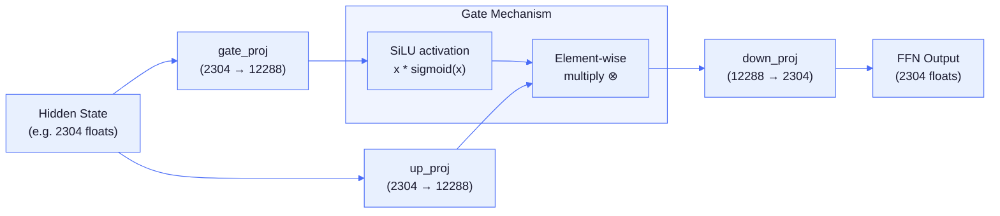

# Chapter 3: Feed-Forward Networks

The **FFN (Feed-Forward Network)** is the second **sublayer** (component within a transformer layer) in each transformer layer. "Feed-forward" means data flows in one direction through the network — input → hidden layer → output, with no loops or **recurrence** (unlike **RNNs** — Recurrent Neural Networks — which cycle back on themselves, feeding outputs back as inputs).

While attention lets tokens communicate with each other, the FFN processes each position **independently** — it's a separate computation per token that doesn't look at neighboring tokens.

**Why does the FFN store "knowledge"?** The FFN expands the hidden state to a much larger intermediate dimension (e.g., 2304 → 12,288 in Gemma4 E2B), applies a nonlinear activation, then compresses back. Research ([Geva et al., 2021](https://arxiv.org/abs/2012.14913)) showed that rows of the up-projection act as **pattern detectors** — each row activates strongly for specific input patterns (e.g., "capital of [country]", "past tense verb", "python function definition"). The corresponding down-projection row then adds the associated output (e.g., the embedding direction for the country's capital). The gate controls which patterns fire. With 12,288 intermediate neurons, the FFN has 12,288 independent "if pattern X, then add Y" slots — this is where factual associations live. Attention routes information between positions; the FFN transforms it at each position.

## SwiGLU

The standard FFN structure in modern transformers:


FFN(x) = down_proj(activation(gate_proj(x)) * up_proj(x))
```

Three matrix multiplies per FFN call, expanding to a larger **intermediate dimension** (the expanded size between projections, typically 4-8× the hidden size) and projecting back. The **activation function** is a **nonlinear** transformation (output is not proportional to input — e.g., sigmoid curves, not straight lines) applied element-wise (e.g., SiLU, GELU).

Notice the structure: `activation(gate_proj(x)) * up_proj(x)`. The `gate_proj` output is passed through an activation function and then multiplied element-wise with `up_proj`, **gating** (controlling) how much of the up-projection passes through. This gating pattern is called a **GLU** (Gated Linear Unit). **SwiGLU**, introduced in [GLU Variants Improve Transformer (Shazeer, 2020)](https://arxiv.org/abs/2002.05202), uses **SiLU** (Sigmoid Linear Unit, also called Swish) as the activation — hence the name: **Swi**sh + **GLU** = SwiGLU.

## Activation Functions

```mermaid
%%{init: {'theme': 'base', 'themeVariables': {
  'primaryColor': '#e8f0fe',
  'primaryTextColor': '#1a1a2e',
  'primaryBorderColor': '#4a6cf7',
  'lineColor': '#4a6cf7',
  'secondaryColor': '#f0f4ff',
  'tertiaryColor': '#f8f9ff',
  'edgeLabelBackground': '#ffffff',
  'clusterBkg': '#f0f4ff',
  'clusterBorder': '#4a6cf7',
  'titleColor': '#1a1a2e',
  'nodeTextColor': '#1a1a2e',
  'fontFamily': 'ui-monospace, SFMono-Regular, monospace'
}}}%%
flowchart LR
    Input["Input value x"] --> SiLU["SiLU / Swish\nx · sigmoid(x)\n\nSmooth, passes positive,\ndampens negative"]
    Input --> GELU["GELU\n≈ 0.5x(1 + tanh(...))\n\nSimilar to SiLU,\nGaussian-weighted"]
    Input --> ReLU2["ReLU²\nmax(0, x)²\n\nHard zero cutoff,\nsquared positives"]
    Input --> Sigmoid["Sigmoid\n1 / (1 + e^-x)\n\nOutput in (0, 1)\nUsed for gates/routing"]

    SiLU --> FFN["FFN gate\n(most models)"]
    GELU --> FFN2["FFN gate\n(Gemma 3)"]
    ReLU2 --> FFN3["FFN gate\n(Nemotron-Nano MoE)"]
    Sigmoid --> Router["MoE router\n(GLM-4)"]


| Function | Formula | Used by |
| :--- | :--- | :--- |
| **SiLU/Swish** | `x * sigmoid(x)` = `x / (1 + exp(-x))` | Most FFN layers, conv1d, SSM gating |
| **GELU** | `0.5x(1 + tanh(sqrt(2/pi)(x + 0.044715x³)))` (tanh approx.) | Gemma3 FFN |
| **Softplus** | `log(1 + exp(x))`, linear for x>20 | SSM dt computation |
| **Sigmoid** | `1 / (1 + exp(-x))` | DeltaNet beta, attention gate, MoE routing |
| **ReLU²** | `max(0, x)²` | Nemotron-Nano MoE FFN |

**Clamped SwiGLU** (GPT-OSS MoE): Adds **hard clamping** (forcing values to stay within fixed bounds) `[-7.0, +7.0]` to prevent **overflow** (values becoming too large to represent, causing errors or infinity) during **mixed-precision** (using different bit widths for different operations — e.g., 16-bit for some, 32-bit for others) expert computation.

## Mixture of Experts (MoE)

Standard transformers use the same FFN weights for every token. MoE models have multiple FFN "experts" and a **router** (a learned selection mechanism that scores and picks which experts should process each token) that selects which ones to use:

```mermaid
%%{init: {'theme': 'base', 'themeVariables': {
  'primaryColor': '#e8f0fe',
  'primaryTextColor': '#1a1a2e',
  'primaryBorderColor': '#4a6cf7',
  'lineColor': '#4a6cf7',
  'secondaryColor': '#f0f4ff',
  'tertiaryColor': '#f8f9ff',
  'edgeLabelBackground': '#ffffff',
  'clusterBkg': '#f0f4ff',
  'clusterBorder': '#4a6cf7',
  'titleColor': '#1a1a2e',
  'nodeTextColor': '#1a1a2e',
  'fontFamily': 'ui-monospace, SFMono-Regular, monospace'
}}}%%
flowchart TD
    Token["Token hidden state\n(e.g. 7168 floats)"] --> Router["Router\nhidden @ gate_weight\n→ 128 scores"]

    Router -->|"top-6\nscores"| Norm["Softmax normalize\nselected scores\n→ weights [0.19, 0.18, ...]"]

    Norm --> E3["Expert 3\n'programming'\nFFN(hidden)"]
    Norm --> E1["Expert 1\n'syntax'\nFFN(hidden)"]
    Norm --> E87["Expert 87\n'nouns'\nFFN(hidden)"]
    Norm --> Edots["... 3 more\nexperts ..."]

    Token --> Shared["Shared Expert\n(always active)\nFFN(hidden)"]

    E3 -->|"× 0.193"| Sum["Weighted sum\nΣ weight_i · expert_i(x)"]
    E1 -->|"× 0.182"| Sum
    E87 -->|"× 0.169"| Sum
    Edots -->|"× ..."| Sum
    Shared -->|"+ 1.0"| Sum

    Sum --> Output["FFN Output"]


```
1. Router: scores = sigmoid(hidden @ gate_weight)     # score each expert
2. Select: top_k = top-4 experts by score             # pick best K
3. Normalize: weights = softmax(top_k_scores)         # normalize selected
4. Compute: output = Σ weight[i] * expert_i(hidden)   # weighted sum (each expert's output multiplied by its weight, then added together)
5. Shared: output += shared_expert(hidden)             # always-active (if present)
```

This gives the **capacity** (total model size/knowledge) of a large model (30B total parameters) with the compute cost of a small one (3B active per token).

**Worked example** — Nemotron-Nano with 128 experts, top-6 routing, and 1 shared expert:

```
Input: hidden state for the word "Python" (after attention)

1. Router scores = sigmoid(hidden @ gate_weight)   # 128 scores
   Expert scores: [0.02, 0.85, 0.11, 0.91, 0.03, ..., 0.78, ..., 0.44]
                          ↑exp1        ↑exp3                ↑exp87

2. Top-6 by score: experts [3, 1, 87, 120, 15, 42]
   Raw scores:     [0.91, 0.85, 0.78, 0.72, 0.68, 0.55]

3. Normalize: weights = softmax([0.91, 0.85, 0.78, 0.72, 0.68, 0.55])
              weights = [0.193, 0.182, 0.169, 0.160, 0.153, 0.134]

4. Run each expert's FFN:
   out = 0.193 × expert_3(hidden) + 0.182 × expert_1(hidden) + ...

5. Add shared expert (always active):
   out += shared_expert(hidden)

Result: 7 FFN evaluations (6 routed + 1 shared) instead of 128.
        Expert 3 might specialize in "programming", expert 87 in "nouns".
```

Expert selection uses **stack-allocated** arrays (fixed-size buffers on the call stack, automatically freed when the function returns) — zero **heap allocation** (dynamic memory from the system allocator, requires explicit free) in the hot path.

| Model | Routed Experts | Top-K | Shared Expert | Routing |
| :--- | :--- | :--- | :--- | :--- |
| Qwen 3.5/3.6 MoE | 128/256 | 8 | Yes (1) | Softmax |
| GPT-OSS | 32 | 4 | No | Softmax |
| GLM-4 | varies | varies | No | Sigmoid (independent gates) |
| Nemotron-Nano | 128 | 6 | Yes (1, 2x hidden dim) | Softmax |
| Gemma 4 26B-A4B | 128 | 8 | No (dual path: dense + MoE per layer) | Softmax |

**Sigmoid routing** (GLM-4): Each expert gate is **independent** (evaluated separately, not competing with each other for probability mass like softmax does) — multiple experts can have high activation simultaneously without competing.

**Shared expert** (Nemotron-Nano): One expert is always active regardless of router output, providing a stable **baseline** (consistent minimum contribution that all tokens receive, ensuring basic functionality).

### MoE Performance

MoE's key advantage is **sparse activation** — only K of N experts run per token:

```
Dense 30B model:   30B multiplies per token
MoE 30B (top-2/128): ~0.5B multiplies per token (2 experts × 704-dim FFN)
```

This gives large-model quality at small-model compute cost. The tradeoff: all expert weights must fit in memory even though most are idle. A 128-expert MoE model stores 128× the FFN weights but only activates 2× per token.

### Expert Weight Layout

Expert weights are stored as 3D tensors: `[n_experts, rows, cols]`. The **expert stride** is the byte offset between consecutive experts. For quantized formats (Q4_K, Q8_0), the stride accounts for block structure:

```
expert_stride = dims[0] * dims[1]    (for 3D: per-expert = rows × cols)
expert_data = base_ptr + expert_id * stride
```

Some models store fused `gate_up_exps` (gate and up projections concatenated per expert) to reduce tensor count. The GEMV dispatch slices the fused tensor into gate and up halves.

### Batched Expert Dispatch

When multiple experts share the same input vector (common in decode), Agave batches their gate+up GEMVs into a single `gemvMulti` dispatch. This parallelizes all output rows across both experts in one thread pool call instead of two separate dispatches:

```zig
const ops = [_]GemvOp{
    .{ .w = gate_data, .y = gate_buf, .n = ff },
    .{ .w = up_data,   .y = up_buf,   .n = ff },
};
be.gemvMulti(input, &ops, k);
```

## Megakernel Fusion

On Metal GPU, the three FFN GEMVs (gate + up + down) can be fused into a single dispatch via the **megakernel** system. Instead of 3 separate GPU launches with memory round-trips, one kernel reads the input once, computes all three projections plus the activation, and writes the final output. This eliminates inter-kernel memory traffic and reduces dispatch overhead.

Enable with `--megakernel`. See [Chapter 13](13-batched-dispatch-and-fusion.md) for details.

---

**In the code:** [src/backend/kernels/cpu/activation.zig](../../src/backend/kernels/cpu/activation.zig) (SiLU, GELU), [src/ops/math.zig](../../src/ops/math.zig) (softplus, sigmoid, topKExperts), [src/models/gpt_oss.zig](../../src/models/gpt_oss.zig) (MoE implementation)

**Math reference:** [SiLU](appendix-math.md#silu-swish), [GELU](appendix-math.md#gelu-gaussian-error-linear-unit), [Sigmoid](appendix-math.md#sigmoid), [Softplus](appendix-math.md#softplus)

**Next:** [Chapter 4: Quantization →](04-quantization.md) | **Back:** [Chapter 2: The Transformer ←](02-the-transformer.md) | **Product docs:** [Architecture](../ARCHITECTURE.md)
