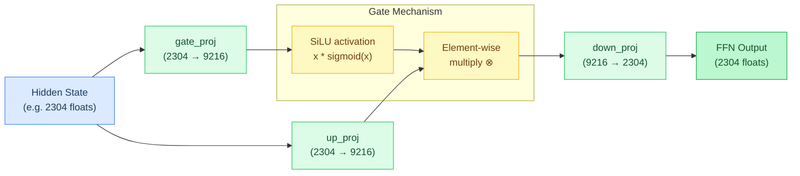
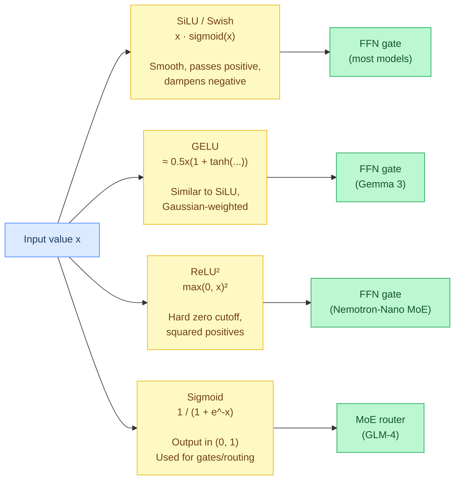
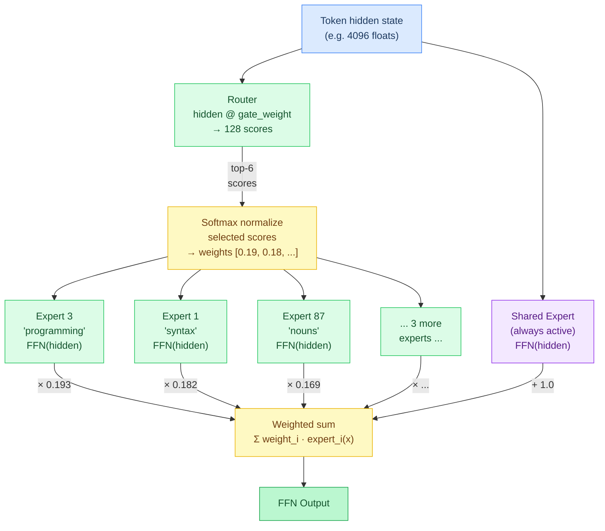
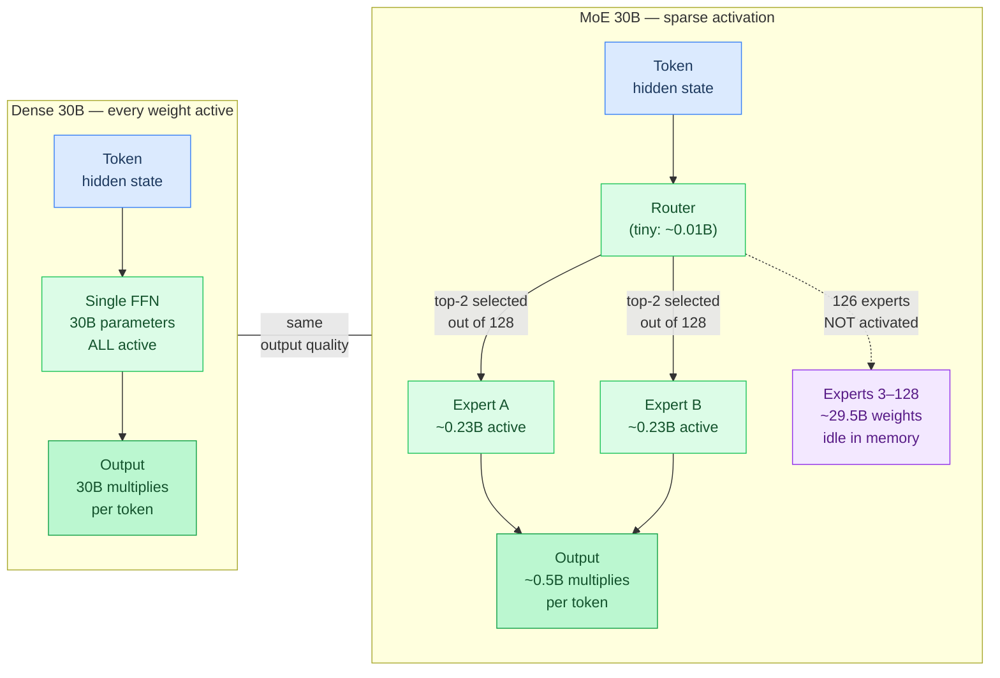
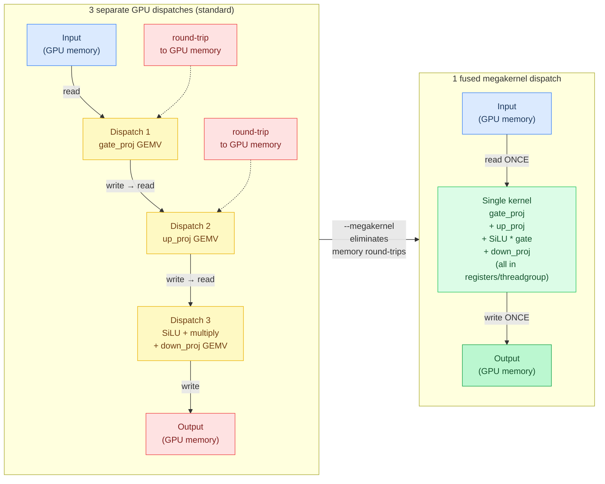

# Chapter 3: Feed-Forward Networks

**Prerequisites:** [Chapter 2: The Transformer](02-the-transformer.md)

**Time:** ~15 min

> After this chapter you can explain SwiGLU, activation functions, Mixture-of-Experts routing, and megakernel fusion.

The **FFN (Feed-Forward Network)** is the second **sublayer** (component within a transformer layer) in each transformer layer. "Feed-forward" means data flows in one direction through the network — input → hidden layer → output, with no loops or **recurrence** (unlike **RNNs** — Recurrent Neural Networks — which cycle back on themselves, feeding outputs back as inputs).

While attention lets tokens communicate with each other, the FFN processes each position **independently** — it's a separate computation per token that doesn't look at neighboring tokens.

**Why does the FFN store "knowledge"?** The FFN expands the hidden state to a much larger intermediate dimension (e.g., 2304 → 9,216 in Gemma4 E2B), applies a nonlinear activation, then compresses back. Research ([Geva et al., 2021](https://arxiv.org/abs/2012.14913)) showed that rows of the up-projection act as **pattern detectors** — each row activates strongly for specific input patterns (e.g., "capital of [country]", "past tense verb", "python function definition"). The corresponding down-projection row then adds the associated output (e.g., the embedding direction for the country's capital). The gate controls which patterns fire. With 9,216 intermediate neurons, the FFN has 9,216 independent "if pattern X, then add Y" slots — this is where factual associations live. Attention routes information between positions; the FFN transforms it at each position.

## SwiGLU

The standard FFN structure in modern transformers:

### Code Flow



```text
silu(xW_g) ⊙ (xW_u) → W_d
```

```
FFN(x) = down_proj(activation(gate_proj(x)) * up_proj(x))
```

Three matrix multiplies per FFN call, expanding to a larger **intermediate dimension** (the expanded size between projections, typically 4-8× the hidden size) and projecting back. The **activation function** is a **nonlinear** transformation (output is not proportional to input — e.g., sigmoid curves, not straight lines) applied element-wise (e.g., SiLU, GELU).

Notice the structure: `activation(gate_proj(x)) * up_proj(x)`. The `gate_proj` output is passed through an activation function and then multiplied element-wise with `up_proj`, **gating** (controlling) how much of the up-projection passes through. This gating pattern is called a **GLU** (Gated Linear Unit). **SwiGLU**, introduced in [GLU Variants Improve Transformer (Shazeer, 2020)](https://arxiv.org/abs/2002.05202), uses **SiLU** (Sigmoid Linear Unit, also called Swish) as the activation — hence the name: **Swi**sh + **GLU** = SwiGLU.

## Activation Functions



| Function | Formula | Used by |
| :--- | :--- | :--- |
| **SiLU/Swish** | `x * sigmoid(x)` = `x / (1 + exp(-x))` | Most FFN layers, conv1d, SSM gating |
| **GELU** | `0.5x(1 + tanh(sqrt(2/pi)(x + 0.044715x³)))` (tanh approx.) | Gemma3 FFN |
| **Softplus** | `log(1 + exp(x))`, linear for x>20 | SSM dt computation |
| **Sigmoid** | `1 / (1 + exp(-x))` | DeltaNet beta, attention gate, MoE routing |
| **ReLU²** | `max(0, x)²` | Nemotron-Nano MoE FFN |

**Clamped SwiGLU** (GPT-OSS MoE): Adds **hard clamping** (forcing values to stay within fixed bounds) `[-7.0, +7.0]` to prevent **overflow** (values becoming too large to represent, causing errors or infinity) during **mixed-precision** (using different bit widths for different operations — e.g., 16-bit for some, 32-bit for others) expert computation.

## Mixture of Experts (MoE)

Standard transformers use the same FFN weights for every token. MoE models have multiple FFN "experts" and a **router** (a learned selection mechanism that scores and picks which experts should process each token) that selects which ones to use:



```
1. Router: scores = softmax(hidden @ gate_weight)     # score each expert (Qwen 3.5 MoE: softmax+top-8; GPT-OSS: top-4 then softmax)
2. Select: top_k = top-8 experts by score             # pick best K
3. Normalize: weights = softmax(top_k_scores)         # normalize selected
4. Compute: output = Σ weight[i] * expert_i(hidden)   # weighted sum (each expert's output multiplied by its weight, then added together)
5. Shared: output += shared_expert(hidden)             # always-active (if present)
```

**Route note:** Selection and weighting aren't always the same score. Nemotron-Nano and GLM-4 add a per-expert **bias** to the raw router score before calling `topKExperts` (`src/ops/math.zig`): the bias shifts *which* experts win the top-k cut, but the mixing weight applied to each selected expert's output still uses the original, unbiased score. This lets the router steer selection toward under-used experts (a training-time load-balancing signal) without that artificial nudge leaking into the output magnitude. `topKExperts` also breaks ties by position: when two experts score identically, the lower-indexed one wins, so router output isn't perfectly symmetric under reordering.

This gives the **capacity** (total model size/knowledge) of a large model (30B total parameters) with the compute cost of a small one (3B active per token).

**Worked example** — Nemotron-Nano with 128 experts, top-6 routing, and 1 shared expert:

```
Input: hidden state for the word "Python" (after attention)

1. Router scores = sigmoid(hidden @ gate_weight)   # 128 scores
   Expert scores: [0.02, 0.85, 0.11, 0.91, 0.03, ..., 0.78, ..., 0.44]
                          ↑exp1        ↑exp3                ↑exp87

2. Top-6 by score: experts [3, 1, 87, 120, 15, 42]
   Raw scores:     [0.91, 0.85, 0.78, 0.72, 0.68, 0.55]

3. Normalize + scale: weights = [s/Σs] × 2.5 (L1 norm, then routed_scaling_factor)
              Σs = 0.91+0.85+0.78+0.72+0.68+0.55 = 4.49
              weights = [0.507, 0.473, 0.434, 0.401, 0.379, 0.306]

4. Run each expert's FFN:
   out = 0.193 × expert_3(hidden) + 0.182 × expert_1(hidden) + ...

5. Add shared expert (always active):
   out += shared_expert(hidden)

Result: 7 FFN evaluations (6 routed + 1 shared) instead of 128.
        Expert 3 might specialize in "programming", expert 87 in "nouns".
```

Expert selection uses **stack-allocated** arrays (fixed-size buffers on the call stack, automatically freed when the function returns) — zero **heap allocation** (dynamic memory from the system allocator, requires explicit free) in the hot path.

| Model | Routed Experts | Top-K | Shared Expert | Routing |
| :--- | :--- | :--- | :--- | :--- |
| Qwen 3.5/3.6 MoE | 256 | 8 | Yes (1) | Softmax |
| GPT-OSS | 32 | 4 | No | Softmax |
| GLM-4 | varies | varies | Yes (1) | Sigmoid (independent gates) |
| Nemotron-Nano | 128 | 6 | Yes (1, 2x routed FFN dim) | Sigmoid |
| Gemma 4 26B-A4B | 128 | 8 | No (dual path: dense + MoE per layer) | Softmax |

**Sigmoid routing** (GLM-4): Each expert gate is **independent** (evaluated separately, not competing with each other for probability mass like softmax does) — multiple experts can have high activation simultaneously without competing.

**Shared expert** (Nemotron-Nano): One expert is always active regardless of router output, providing a stable **baseline** (consistent minimum contribution that all tokens receive, ensuring basic functionality).

### MoE Sparse Activation: Dense vs. MoE Compute

MoE's key advantage is **sparse activation** — only K of N experts run per token. The diagram below compares how much compute each model actually performs versus how many weights it stores:



```
Dense 30B model:       30B multiplies per token   (all weights active)
MoE 30B (top-2/128):  ~0.5B multiplies per token  (2 experts active)
                        ↑ 60x fewer operations, similar quality
Tradeoff: 30B weights still occupy memory — only the compute is sparse.
```

| | Weights resident in memory | Compute active per token |
| :--- | :--- | :--- |
| Dense 30B | 30B (100%) | 30B (100%) |
| MoE 30B (top-2/128) | 30B (100%) | ~0.5B (~1.7%) |

Memory footprint is identical between the two rows; only the multiply count drops. This gives large-model quality at small-model compute cost, but all expert weights must still fit in memory even though most sit idle: a 128-expert MoE model stores 128× the FFN weights of a single expert while activating only 2× per token.

### Expert Weight Layout

Expert weights are stored as 3D tensors: `[n_experts, rows, cols]`. The **expert stride** is the byte offset between consecutive experts. For quantized formats (Q4_K, Q8_0), the stride accounts for block structure:

```
expert_stride = dims[1] * dims[2]    (for 3D [n_experts, rows, cols]: per-expert = rows × cols, element count only)
expert_data = base_ptr + expert_id * stride
```

> **Note:** This formula gives the element count per expert and applies directly to float/packed formats. For quantized formats (Q4_K, Q8_0, etc.) the actual byte stride accounts for block headers and is computed by a format-aware function — the raw `dims[0] * dims[1]` product is not the byte stride in those cases.

Some models store fused `gate_up_exps` (gate and up projections concatenated per expert) to reduce tensor count. The GEMV dispatch slices the fused tensor into gate and up halves.

### Batched Expert Dispatch

When multiple experts share the same input vector (common in decode), Agave batches their gate+up GEMVs into a single `gemvMulti` dispatch. This parallelizes all output rows across both experts in one thread pool call instead of two separate dispatches:

```mermaid
flowchart TD
    classDef setup     fill:#dbeafe,stroke:#3b82f6,color:#1e3a5f
    classDef sync      fill:#dcfce7,stroke:#22c55e,color:#14532d
    classDef migration fill:#fef9c3,stroke:#eab308,color:#713f12
    classDef success   fill:#bbf7d0,stroke:#16a34a,color:#14532d
    classDef danger    fill:#fee2e2,stroke:#ef4444,color:#7f1d1d
    classDef optional  fill:#f3e8ff,stroke:#9333ea,color:#581c87

    subgraph Sequential["Sequential dispatch — 2 thread pool calls"]
        S_in["Input vector x\n(shared by all experts)"]:::setup
        S_D1["Dispatch 1\ngate_proj expert A\nthread pool: serialize"]:::migration
        S_W1["Wait for completion"]:::danger
        S_D2["Dispatch 2\nup_proj expert A\nthread pool: serialize"]:::migration
        S_W2["Wait for completion"]:::danger
        S_D3["Dispatch 3..N\nrepeat for expert B, C...\n2 calls per expert"]:::migration

        S_in --> S_D1
        S_D1 --> S_W1
        S_W1 --> S_D2
        S_D2 --> S_W2
        S_W2 --> S_D3
    end

    subgraph Batched["gemvMulti — 1 thread pool call"]
        B_in["Input vector x\n(shared by all experts)"]:::setup
        B_ops["Build GemvOp array\nop[0]: gate expert A\nop[1]: up expert A\nop[2]: gate expert B\nop[3]: up expert B\n..."]:::migration
        B_dispatch["gemvMulti dispatch\nall output rows\nin parallel"]:::sync
        B_gate_A["gate buf A\n(parallel)"]:::sync
        B_up_A["up buf A\n(parallel)"]:::sync
        B_gate_B["gate buf B\n(parallel)"]:::sync
        B_up_B["up buf B\n(parallel)"]:::sync
        B_out["Results ready\n(single barrier)"]:::success

        B_in --> B_ops
        B_ops --> B_dispatch
        B_dispatch --> B_gate_A
        B_dispatch --> B_up_A
        B_dispatch --> B_gate_B
        B_dispatch --> B_up_B
        B_gate_A --> B_out
        B_up_A --> B_out
        B_gate_B --> B_out
        B_up_B --> B_out
    end
```



```text
ops = [ {w: gate_data, dtype: gate.dtype, y: gate_buf, n: ff},
        {w: up_data,   dtype: up.dtype,   y: up_buf,   n: ff} ]
be.gemvMulti(input, ops, k)        # one thread-pool dispatch, both rows in parallel
```

**Implementation:** [`src/backend/backend.zig`](../../src/backend/backend.zig) (`GemvOp`, `gemvMulti`), [`src/models/gpt_oss.zig`](../../src/models/gpt_oss.zig) (batched expert gate+up dispatch)

## Megakernel Fusion

On Metal GPU, the three FFN GEMVs (gate + up + down) can be fused into a single dispatch via the **megakernel** system. Instead of 3 separate GPU launches with memory round-trips, one kernel reads the input once, computes all three projections plus the activation, and writes the final output. This eliminates inter-kernel memory traffic and reduces dispatch overhead.



Enable with `--megakernel`. See [Chapter 13](13-batched-dispatch-and-fusion.md) for details.

## Gotchas

**Expert stride isn't a plain element count for quantized formats**: `expert_stride = dims[1] * dims[2]` (the formula in [Expert Weight Layout](#expert-weight-layout)) gives the *element* count per expert, not the byte offset. `expertWeightStride()` (`src/models/model.zig`) is the format-aware function that actually computes the byte stride, accounting for block headers in Q4_K/Q8_0 and the packed-nibble layout in NVFP4. Reimplementing the raw multiply instead of calling this function silently misreads every expert past the first.

**Clamp before mixed-precision expert compute**: GPT-OSS's clamped SwiGLU clamps the `silu(gate) * up` product into `[-7.0, +7.0]` after the gate/up activation is computed. Skipping the clamp when wiring a new MoE model risks overflow in the lower-precision accumulation path, producing NaNs that only show up with certain input distributions.

**`gemvMulti` assumes a shared input vector**: Batched expert dispatch (`gemvMulti`) parallelizes gate+up GEMVs for multiple experts against the *same* `x`. It's only valid when all batched ops read the same input: mixing GEMVs from different tokens or different hidden states into one `gemvMulti` call silently computes the wrong outputs for whichever ops don't share `x`.

---

**In the code:** [src/backend/kernels/cpu/activation.zig](../../src/backend/kernels/cpu/activation.zig) (SiLU, GELU), [src/ops/math.zig](../../src/ops/math.zig) (softplus, sigmoid, topKExperts), [src/models/gpt_oss.zig](../../src/models/gpt_oss.zig) (MoE implementation)

```text
gate = silu(x @ W_gate)              # src/backend/kernels/cpu/activation.zig
up   = x @ W_up
h    = gate ⊙ up                     # element-wise
y    = h @ W_down
# MoE: y = Σ weight_i * FFN_i(x) for top-k routed experts, + shared_expert(x) if present
```

**Math reference:** [SiLU](appendix-math.md#silu-swish), [GELU](appendix-math.md#gelu-gaussian-error-linear-unit), [Sigmoid](appendix-math.md#sigmoid), [Softplus](appendix-math.md#softplus)

**Next:** [Chapter 4: Quantization →](04-quantization.md) | **Back:** [Chapter 2: The Transformer ←](02-the-transformer.md) | **Product docs:** [Architecture](../ARCHITECTURE.md)

---

## Glossary

**activation function** — A nonlinear transformation applied element-wise to introduce non-linearity into the network.

**FFN (Feed-Forward Network)** — The second sublayer in each transformer layer; processes each position independently through expansion, activation, and compression.

**gate projection** — A linear projection whose output is passed through an activation and used to gate another projection.

**GELU (Gaussian Error Linear Unit)** — An activation function similar to SiLU but using a Gaussian-weighted smoothing.

**GLU (Gated Linear Unit)** — A structure where one projection's output gates (controls) another via element-wise multiplication.

**megakernel fusion** — Combining multiple GPU dispatches (e.g., gate + up + down projections) into a single kernel to eliminate memory round-trips.

**MoE (Mixture of Experts)** — An architecture with multiple FFN "experts" where a router selects a subset to process each token, enabling large capacity with sparse activation.

**ReLU (Rectified Linear Unit)** — Activation function: max(0, x); sets negatives to zero. ReLU² squares the result.

**router** — A small learned network that scores and selects which experts should process each token.

**shared expert** — An expert that is always active regardless of router output, providing a baseline contribution.

**sigmoid** — The function 1/(1 + e^(−x)) mapping any value to (0, 1), used for gates and routing.

**SiLU / Swish** — Activation function: x × sigmoid(x); smooth, passes positive values, dampens negatives.

**Softplus** — Activation function: log(1 + exp(x)); a smooth approximation ensuring positive output, used for SSM timestep computation.

**sparse activation** — Only a small subset of total parameters is used per token; the rest remain idle, reducing compute cost.

**SwiGLU (Swish-Gated Linear Unit)** — A gated FFN architecture using SiLU activation on a gate projection multiplied element-wise with an up-projection.

**top-K routing** — Selecting the K highest-scoring experts for each token in a MoE layer.
