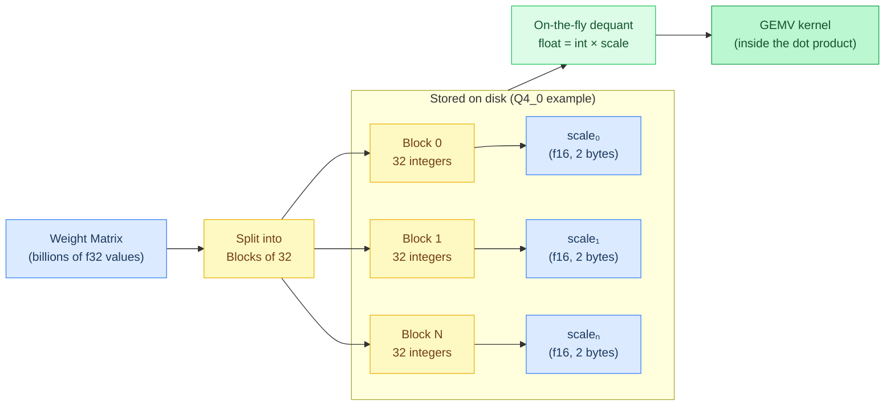
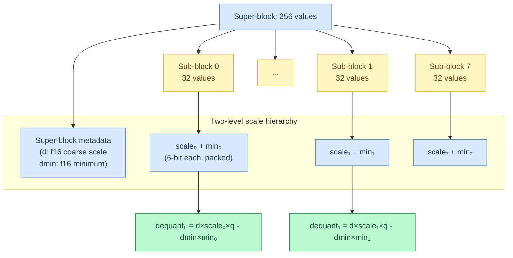
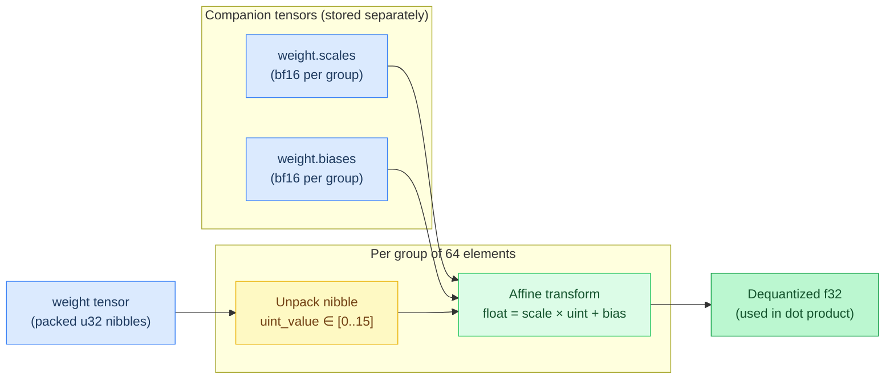
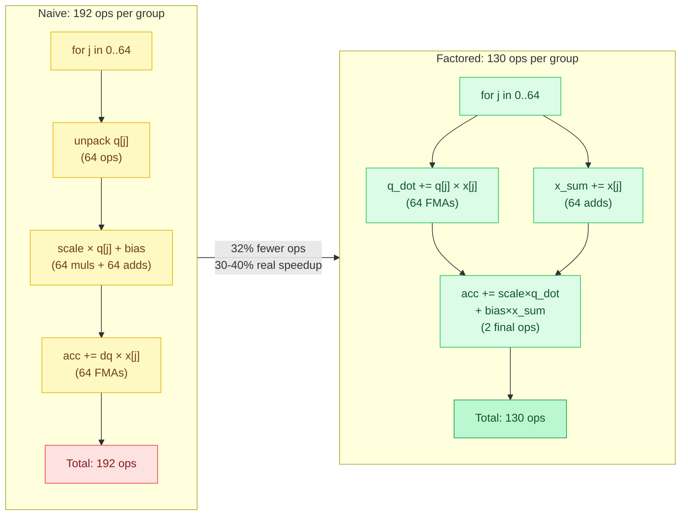
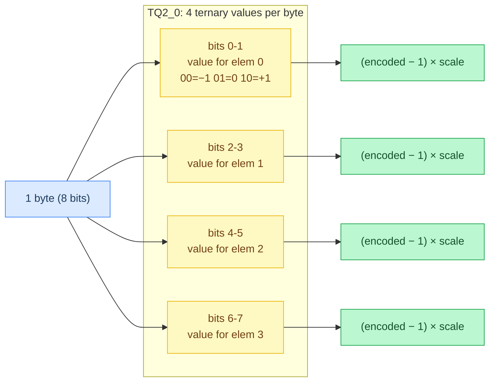
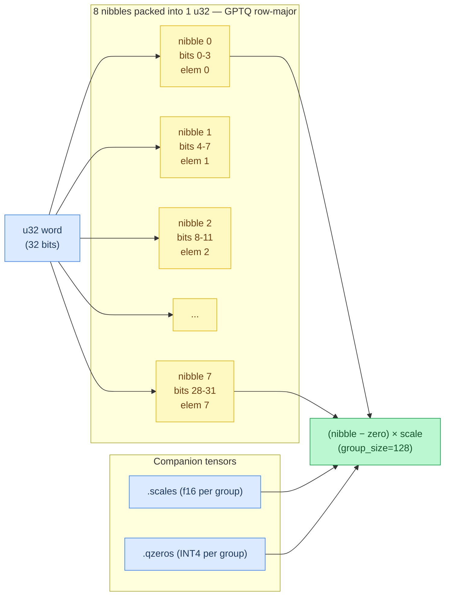
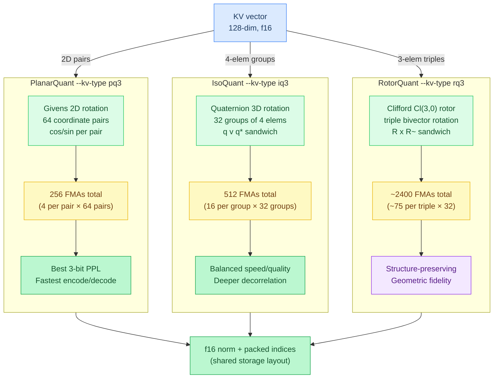
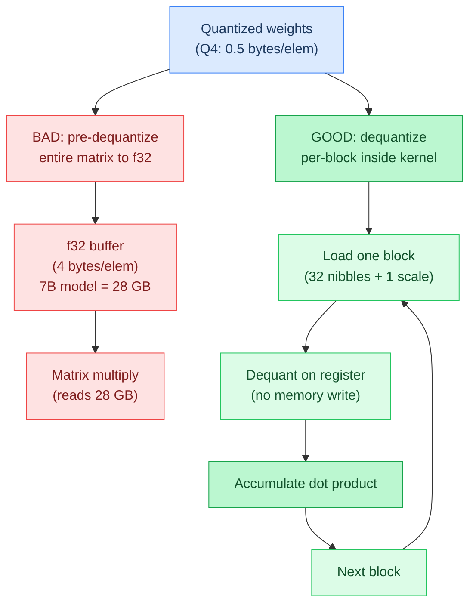
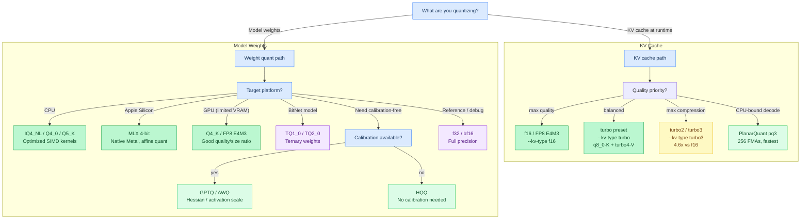

# Chapter 4: Quantization

**Prerequisites:** [Chapter 2: The Transformer](02-the-transformer.md)

**Time:** ~25 min

Model weights are trained in float32 (32 bits per value) but stored compressed for inference. **Quantization** maps floating-point values to lower-**precision** (fewer bits per number, less accurate but smaller) representations, trading a small amount of accuracy for massive memory and speed gains.

## Why Quantize?

A 7B parameter model (7 billion weight values — the "B" in model names like "Qwen3.5-7B") in float32 needs 28 GB of memory (`7 × 10⁹ × 4 bytes = 28 GB`). In 4-bit quantization, it needs ~3.5 GB (`7 × 10⁹ × 0.5 bytes = 3.5 GB`) — small enough to fit in a laptop's GPU memory. Inference is almost always **memory-bandwidth bound** (the bottleneck is reading weights from RAM/VRAM, not arithmetic operations), so smaller weights = faster inference: half the bits means half the bytes to read from memory, which roughly doubles throughput.

## Block Quantization



**Q4_0, Q8_0** (GGUF-style): Groups of 32 values share a single **scale factor** (a multiplier that converts small integers back to approximate float values). Each value is stored as a small integer, dequantized on-the-fly:

```
float_value = integer_value * scale
```

**Super-block formats** (Q4_K, Q5_K, Q6_K): Groups of 256 values with **hierarchical scales** (multiple levels of scale factors — a coarse scale for the whole block, then fine-grained adjustments per sub-block) — a block scale plus per-sub-block adjustments.



## MLX Affine Quantization



Used by Apple MLX models (Gemma QAT 4-bit, GLM-4 6-bit). Each group of 64 values has a scale and bias:

```
float_value = scale * uint_value + bias
```

Scales and biases are stored as bf16 in **companion tensors** (separate tensors with matching names like `weight.scales` and `weight.biases` that store per-group quantization parameters).

### MLX Memory Layout

**Quantized weights:** Packed into `u32` words (8 nibbles per word for 4-bit, 12 words per group for 6-bit):

```
4-bit: 64 elements × 4 bits = 256 bits = 8 u32 words
6-bit: 64 elements × 6 bits = 384 bits = 12 u32 words
8-bit: 64 elements × 8 bits = 512 bits = 16 u32 words
```

**Example:** 4-bit group `[0, 1, 2, ..., 63]` is packed as:

```
word[0] = elem[0..7]   (8 nibbles, low-to-high)
word[1] = elem[8..15]
...
word[7] = elem[56..63]
```

Nibble extraction:

```zig
const word_idx = elem_idx / 8;
const bit_offset = (elem_idx % 8) * 4;
const nibble = (words[word_idx] >> bit_offset) & 0xF;
```

**Scales and biases:** Separate bf16 arrays (2 bytes per value):

```
scales[group] → bf16 scale for group
biases[group] → bf16 bias for group
```

### Factored Dequantization (30-40% Speedup)

**Naive approach:** Dequantize each element before multiplying:

```zig
for (0..64) |j| {  // For each element in group
    const q = unpack(quant, j);        // Extract quantized value
    const dq = scale * q + bias;       // Dequantize
    acc += dq * x[j];                  // Multiply by input
}
```

**Cost:** 64 multiplies (scale × q) + 64 adds (+ bias) + 64 FMAs (dq × x) = **192 operations per group**.

**Optimized approach:** Factor out the scale and bias using algebra:

```
sum(x[j] * (scale * q[j] + bias)) = scale * sum(x[j] * q[j]) + bias * sum(x[j])
```

This is the **distributive property** — pull the constant scale and bias outside the sum:

```zig
var q_dot: f32 = 0;  // dot(quantized, input)
var x_sum: f32 = 0;  // sum(input)

for (0..64) |j| {
    const q = unpack(quant, j);
    q_dot += q * x[j];  // Accumulate q·x
    x_sum += x[j];      // Accumulate sum(x)
}

acc += scale * q_dot + bias * x_sum;  // Apply scale/bias ONCE
```

**Cost:** 64 FMAs (q × x, fused multiply-add) + 64 adds (sum x) + **2 final ops** = **130 operations per group**.

**Savings:** 192 → 130 ops = **32% reduction** in arithmetic. Real-world speedup: **30-40%** (measured on Apple M4 with Gemma3 27B QAT).



**Why this works:**

- Scale and bias are **constant per group** (same for all 64 elements)
- We can compute the dot product `sum(q × x)` and sum `sum(x)` separately
- Then apply scale and bias **once** at the end

**SIMD implementation** (pseudocode illustrating the vectorized approach):

```zig
var q_dot_acc: V8 = @splat(0.0);
var x_sum_acc: V8 = @splat(0.0);

var j: usize = 0;
while (j + 8 <= 64) : (j += 8) {
    // Unpack 8 quantized values
    const qv = unpackU4x8(quant, j);  // V8 of quantized values

    // Load 8 input values
    const xv: V8 = x[base + j ..][0..8].*;

    // FMA: q_dot += qv * xv
    q_dot_acc = @mulAdd(V8, qv, xv, q_dot_acc);

    // Accumulate x sum
    x_sum_acc += xv;
}

// Horizontal reduce
const q_dot = @reduce(.Add, q_dot_acc);
const x_sum = @reduce(.Add, x_sum_acc);

// Apply scale/bias once
acc += scale * q_dot + bias * x_sum;
```

**Additional optimization:** `@mulAdd` maps to NEON `vfma` (fused multiply-add) — 1 instruction instead of separate multiply + add.

### When to Use MLX Quantization

**Advantages:**

- **Better quality** than integer quantization at the same bit width (affine transform vs simple scaling)
- **Native Apple Silicon support** — MLX models load directly on Metal without conversion
- **Flexible bit widths** — 4-bit, 6-bit, 8-bit (GGUF typically only 4-bit or 8-bit)

**Disadvantages:**

- **Format compatibility** — only MLX and Agave support it (not llama.cpp, vLLM, etc.)
- **Larger metadata** — scales + biases = 2× overhead vs scale-only (4 bytes vs 2 bytes per group)
- **6-bit GPU support** — Metal kernel exists but not in all backends

**Recommended for:**

- Apple Silicon users with MLX-quantized models (Gemma3 QAT, GLM-4)
- Quality-sensitive workloads (affine has less quantization error than Q4_0)

**Not recommended for:**

- Cross-platform deployment (GGUF Q4_K has wider support)
- Extreme compression (Q2_K, IQ4_XS are smaller)

## Ternary Quantization (TQ1_0, TQ2_0)

BitNet models use **ternary weights** — each weight is one of {-1, 0, +1}. Multiplying by {-1, 0, +1} is just negation, zero-out, or identity (no multiplication at all), which enables extremely fast matrix operations on CPUs without SIMD FMAs.



**TQ1_0** (1.58 bits/weight): Encodes 256 ternary values per block using base-3 packing — 5 trits per byte (3^5=243 combinations per byte, leaving 13 invalid codes unused). Block size: 64 bytes total for 256 elements (`tq1_0_block_bytes = 64` in `backend.zig`).

**TQ2_0** (2 bits/weight): Simpler binary packing — 4 values per byte using 2 bits each (bit patterns: `00`=−1, `01`=0, `10`=+1, `11`=unused). Block layout: 2 bytes f16 scale + 64 bytes packed = 66 bytes total for 256 elements.

Dequantization formula for both:

```
w = (encoded_value - 1) * scale
```

This maps {0, 1, 2} → {-1, 0, +1} × scale, where encoded values are the stored bit patterns shifted to the range [0, 2].

### Choosing TQ1_0 vs TQ2_0

| | TQ1_0 | TQ2_0 |
|---|---|---|
| Bits per weight | 1.58 | 2.0 |
| Bytes per 256-elem block | 54 | 66 |
| Decode complexity | Base-3 lookup table | Bitshift only |
| CPU throughput | Slightly lower (table) | Highest (bitshift) |

Use **TQ1_0** when minimizing model size is the top priority. Use **TQ2_0** when decode speed matters more, since the bitshift extraction (`(byte >> (2*i)) & 0x3`) avoids a table lookup.

## GPTQ and AWQ — Calibration-Based INT4

Both GPTQ and AWQ store INT4 weights but differ from GGUF's Q4_K in two key ways: scales and zero-points are stored as **companion tensors** (separate SafeTensors entries rather than embedded in each weight block), and the nibble layout is tuned for GPU memory access patterns.



**GPTQ** (row-major layout): The weight matrix is packed 8 nibbles per u32 word along each row. Zero-points (`qzeros`) are packed INT4 per group. Scales are f16. GPTQ applies a second-order calibration (Hessian-based weight updates) to minimize quantization error on a small calibration dataset.

**AWQ** (column-major layout): Same nibble packing but organized by output channel — each u32 word holds 8 output channels at the same input position. AWQ interleaves nibbles in the order `[0, 2, 4, 6, 1, 3, 5, 7]` (not sequential) for efficient GPU GEMM memory access. AWQ searches for a per-channel activation scale that protects salient weights from quantization error.

Dequantization for both:

```
w = (nibble - zero) * scale      # group_size=128, typically
```

The critical implementation difference from GGUF: zero-points and scales are loaded from separate tensors (`.scales`, `.qzeros`), not from a header embedded in the weight block.

### AutoRound W4A16

AutoRound (Intel) is a GPTQ-format quantization method that uses a different calibration algorithm -- sign gradient descent rather than second-order Hessian updates. It produces 4-bit weights with f16 activations and stores them in the same GPTQ SafeTensors layout (`.qweight`, `.scales`, `.qzeros`).

**Loading AutoRound models:**

```bash
# AutoRound models export as GPTQ format; load identically
./agave model-autoround-dir/ "prompt"
# config.json may say quant_method="auto-round" or "gptq" -- both load fine
```

Since the storage format is identical to GPTQ, Agave loads AutoRound models via the same `DType.gptq` path. The calibration algorithm difference is invisible at inference time.

## HQQ — Half-Quadratic Quantization

HQQ requires **no calibration data**. Weights are quantized using half-quadratic optimization, which finds the best INT4 approximation by iteratively reweighting an L1-like loss — no forward passes through the model, no sample dataset required. This makes HQQ practical for quantizing any model without a calibration corpus.

**Format (4-bit HQQ):**

- `W_q`: uint8, shape `[n_out, k_in/2]` — 2 nibbles per byte, low nibble first (elem `k` at `byte[k/2] & 0xF`, elem `k+1` at `byte[k/2] >> 4`)
- `meta.scale`: bf16, shape `[n_out, k_in/group_size]` — per-group scale
- `meta.zero`: bf16, shape `[n_out, k_in/group_size]` — per-group zero (stored as full bf16 float, not packed INT4)

Dequantization:

```
w = (nibble - zero) * scale
```

The zero being stored as a full float (rather than packed INT4 like GPTQ) simplifies the dequantization path — no zero unpacking step, just a subtract and multiply.

**Loading HQQ models:**

```bash
# HQQ-quantized models load automatically when config.json has quant_method="hqq"
./agave model-hqq-dir/ "prompt"
```

Note: GPU backends (Metal, Vulkan, WebGPU, CUDA, ROCm) fall through to CPU for HQQ — native GPU kernels are planned but not yet implemented.

## Floating-Point Quantization

Unlike integer quantization (Q4_0, Q8_0), floating-point quantization keeps the exponential representation, just with fewer bits.

### FP8 E4M3 (4-bit exponent, 3-bit mantissa)

**Bit layout**: `[sign:1][exponent:4][mantissa:3]`

```
Example: 7.0 in FP8 E4M3
Binary:  0 1001 110
         │  │    └─ mantissa (0.75)
         │  └────── exponent (bias-adjusted = 2)
         └───────── sign (positive)

Value = (-1)^0 × 1.75 × 2^2 = 7.0
(mantissa 110 = 0.5 + 0.25 + 0.0 = 0.75; 1 + 0.75 = 1.75)
```

**Range**: Can represent values from ~2×10⁻³ to 448 (with subnormals)

**Why E4M3 for weights?**
- **High precision near zero**: 3 mantissa bits give 8 distinct values in each power-of-2 range
- **Good for small gradients**: Weight updates during training are often tiny
- **Balanced range**: 448 max is enough for most normalized weights

**Trade-off vs FP16**:

- FP16 (E5M10): ±65,504 range, 1024× more precision
- FP8 E4M3: ±448 range, but 2× smaller memory

### FP8 E5M2 (5-bit exponent, 2-bit mantissa)

**Bit layout**: `[sign:1][exponent:5][mantissa:2]`

**Range**: ~2×10⁻⁵ to 57,344 (128× wider than E4M3 in max value)

**Why E5M2 for KV cache?**

- **Wider range**: Attention activations can have large outliers
- **Less precision needed**: Small errors in K/V don't **cascade** (compound/multiply through many operations, unlike weight errors which affect every computation) (unlike weights)
- **Better for activations**: **Dynamic range** (the span from smallest to largest representable value) matters more than precision

**Practical usage in Agave**:

- **E4M3**: Weight quantization, gradient accumulation
- **E4M3**: KV cache quantization (default: q8_0-K/turbo4-V, FP8 option available via `--kv-type fp8_e4m3`)
- **int8**: Alternative to FP8 for KV cache (simpler, slightly less accurate)

### Why FP8 instead of int8?

**int8 with scale**: `float_value = int8_value × scale`

- Simple, fast dequantization (one multiply)
- Fixed precision across the range (8 bits = 256 levels)
- Works well for roughly uniform distributions

**FP8 (E4M3 or E5M2)**: `[sign][exponent][mantissa]`

- **Adaptive precision** (more bits near zero, fewer bits for large values — precision varies based on magnitude)
- Natural for values spanning many **orders of magnitude** (factors of 10 — e.g., from 0.001 to 1000)
- **Hardware-accelerated** (dedicated silicon on the chip for fast execution) on modern GPUs (H100, A100, MI300)

**When to use each**:

- int8: Uniform distributions (e.g., quantized weights after normalization)
- FP8 E4M3: Weights and gradients with small deltas
- FP8 E5M2: Activations with wide dynamic range

**NVFP4, MXFP4**: 4-bit microscaled floating-point. NVFP4 uses 16-element blocks (9 bytes each); MXFP4 uses 32-element blocks (17 bytes each). Both use FP8 E4M3 scales. Hardware-native on NVIDIA Blackwell and newer.

## TurboQuant — KV Cache Quantization

TurboQuant ([Zandieh et al., 2025](https://arxiv.org/abs/2504.19874)) is a KV cache-specific quantization method that achieves 3.6-6.4x compression vs f16 with minimal quality loss. Unlike weight quantization formats (Q4_0, Q8_0), TurboQuant is applied at runtime to the KV cache during inference.

### How It Works

Traditional KV cache quantization (q8_0, fp8) applies simple per-block scaling. TurboQuant adds a **Walsh-Hadamard Transform (WHT)** preprocessing step that gaussianizes the distribution, then uses an optimal **Lloyd-Max codebook** for scalar quantization:

```
Quantize:  normalize → WHT → codebook lookup → pack
Dequantize: unpack → codebook → inverse WHT → rescale
```

The WHT is a deterministic rotation (like a Fourier transform but with only additions and subtractions) that makes each coordinate approximately N(0,1), regardless of the original distribution. This lets us use a single fixed codebook — no per-model calibration needed.

```mermaid
flowchart LR
    classDef setup     fill:#dbeafe,stroke:#3b82f6,color:#1e3a5f
    classDef sync      fill:#dcfce7,stroke:#22c55e,color:#14532d
    classDef migration fill:#fef9c3,stroke:#eab308,color:#713f12
    classDef success   fill:#bbf7d0,stroke:#16a34a,color:#14532d
    classDef danger    fill:#fee2e2,stroke:#ef4444,color:#7f1d1d
    classDef optional  fill:#f3e8ff,stroke:#9333ea,color:#581c87

    KV["KV vector\n(128-dim, f16)"]:::setup
    OUT["Restored KV vector\n(approx, f16)"]:::success

    subgraph Quantize["Quantize path"]
        direction LR
        N1["1. Normalize\ndivide by RMS norm\n→ unit vector"]:::sync
        W1["2. WHT\n5-stage butterfly\n~640 add/sub ops\n→ N(0,1) coords"]:::sync
        CB1["3. Codebook lookup\nLloyd-Max optimal\nbins per bit-width"]:::sync
        PK["4. Pack\nf16 norm + indices\n(2B + n×bits)"]:::migration
    end

    subgraph Dequantize["Dequantize path"]
        direction RL
        UPK["1. Unpack\nread norm + indices"]:::migration
        CB2["2. Codebook decode\nindex → centroid value"]:::sync
        IW["3. Inverse WHT\nrestore original basis"]:::sync
        RS["4. Rescale\nmultiply by norm"]:::sync
    end

    KV --> N1 --> W1 --> CB1 --> PK
    PK -->|"stored in KV cache"| UPK
    UPK --> CB2 --> IW --> RS
    RS --> OUT
```



### Format Family

| Format | Bits/elem | Compression vs f16 | PPL impact |
|--------|-----------|-------------------|-----------|
| turbo4 | 4.5 | 3.6x | +0.23% |
| turbo3 | 3.5 | 4.6x | +1.06% |
| turbo2 | 2.5 | 6.4x | +6.48% |

### Asymmetric K/V

A key insight, also explored in [KIVI (Liu et al., 2024)](https://arxiv.org/abs/2402.02750): **V compression is nearly free** — all quality degradation comes from K compression. Agave supports independent K/V cache types:

```bash
# Best quality: high-precision K + compressed V
./agave model.gguf --kv-type-k q8_0 --kv-type-v turbo4 "prompt"

# Maximum compression
./agave model.gguf --kv-type-k turbo3 --kv-type-v turbo2 "prompt"

# Symmetric (shorthand via --kv-type)
./agave model.gguf --kv-type turbo4 "prompt"
```

### Block Layout

Each 32-element block stores: `[f16 norm (2B)] [packed codebook indices]`

```
turbo4: 2B norm + 16B nibbles = 18B per 32 elements
turbo3: 2B norm + 12B packed 3-bit = 14B per 32 elements
turbo2: 2B norm + 8B packed 2-bit = 10B per 32 elements
```

### When to Use TurboQuant

**Recommended for:**
- Long-context inference (32K+ tokens) where KV cache dominates memory
- Serving multiple concurrent requests (KV cache × batch size)
- Memory-constrained devices (laptops, phones)

**Not recommended for:**
- Short prompts where KV cache is small relative to weights
- Latency-critical applications (WHT adds ~7-10% decode overhead)

**Stacking with KV eviction:** TurboQuant compresses the *bits per KV entry*, while KV cache eviction (`--kv-eviction`) reduces the *number of entries*. Combined, they can achieve ~40x KV memory reduction vs f16 baseline. See [Chapter 5: Memory and Caching](05-memory-and-caching.md#kv-cache-eviction) for eviction details.

## TurboQuant+ — The `turbo` Preset

The `--kv-type turbo` preset is a curated configuration that combines three TurboQuant optimizations:

```bash
./agave model.gguf --kv-type turbo "prompt"
# Equivalent to: --kv-type-k q8_0 --kv-type-v turbo4
# Plus: boundary V protection (first/last 2 layers at f16)
```

### Why K Precision Matters More Than V

Keys (K) control **attention routing** — they determine which positions receive weight via the softmax. Small errors in K shift the softmax distribution, causing the model to attend to the wrong tokens. Values (V) are just the payload — they're weighted-summed after softmax, so small errors average out.

Empirically, compressing K below q8_0 causes measurable perplexity degradation, while V can be compressed to turbo4 (4.5 bits) with no measurable quality loss. The `turbo` preset exploits this asymmetry: high-precision K (q8_0, 8.5 bits) + aggressive V compression (turbo4, 4.5 bits).

### Boundary V Protection

The first and last 2 transformer layers keep V at f16 even when the middle layers use turbo4. These boundary layers are disproportionately important — early layers establish token representations, and final layers directly influence the output distribution. The `turbo` preset enables this automatically:

```zig
// src/models/gemma4.zig — per-layer V type selection
inline fn layerVType(self: *const Gemma4Model, li: u32) KvQuantType {
    if (self.kv_boundary_v == 0) return self.kv_type_v;
    const b = self.kv_boundary_v;
    if (li < b or li >= self.n_layers - b) return .f16;
    return self.kv_type_v;
}
```

For a 42-layer model with `--kv-type turbo`: layers 0-1 and 40-41 use f16 V, layers 2-39 use turbo4 V. All layers use q8_0 K.

### Sparse V Dequantization

During attention, most softmax weights are near zero — only a handful of positions actually contribute to the output. Sparse V skips the V dequantization and multiply-accumulate for any position where the softmax weight is below 1e-6 (contributing less than 0.0001% to the output):

```zig
// src/ops/attention.zig
const sparse_v_threshold: f32 = 1e-6;

for (0..win_len) |wi| {
    const score = scores[score_offset + wi];
    if (score < sparse_v_threshold) continue; // Skip negligible positions
    const t = win_start + wi;
    kv_quant.kvMulAccum(attn_out + q_base, score, kv_values[v_off..].ptr, hd, kv_type_v);
}
```

At 32K context length, the majority of positions have negligible softmax weights. Skipping their V reads yields **+22.8% decode speed** with zero measured perplexity impact. This is especially effective with quantized V formats (turbo4, turbo3) because it avoids both the dequantization arithmetic and the cache-unfriendly memory reads.

## Geometric KV Cache Quantization

The TurboQuant family uses a Walsh-Hadamard Transform (WHT) to decorrelate KV vectors before quantization. WHT works well but operates on 32-element blocks — each block requires a 5-stage butterfly (O(n log n)), costing ~160 butterfly operations (add/subtract pairs, no multiplications). For a 128-dim head (4 blocks), that's ~640 add/sub operations total. The **geometric** methods achieve comparable or better quality with fewer FMAs by exploiting low-dimensional rotations.

All three geometric methods share TurboQuant's storage format (f16 norm + Lloyd-Max packed indices) and support the same 2/3/4-bit variants. The key difference is how they decorrelate the input before quantization.

### PlanarQuant

**Givens 2D rotation** applied to consecutive coordinate pairs. Each rotation decorrelates two dimensions using a single 2x2 orthogonal matrix:

```
[x'_0]   [cos(theta)  -sin(theta)] [x_0]
[x'_1] = [sin(theta)   cos(theta)] [x_1]
```

For a 128-dim head, 64 coordinate pairs are rotated independently. Total cost: **256 FMAs** (4 per pair x 64 pairs) — 2.5x fewer than WHT.

PlanarQuant achieves the **best 3-bit perplexity** among all geometric methods because the per-pair rotation angles are optimized offline to minimize quantization error for typical KV distributions.

```bash
# PlanarQuant 3-bit KV cache
./agave model.gguf --kv-type pq3 "prompt"

# Asymmetric: high-precision K + PlanarQuant V
./agave model.gguf --kv-type-k q8_0 --kv-type-v pq3 "prompt"
```

### IsoQuant

**Quaternion 3D rotation** decorrelates groups of 4 elements (3 rotated, 1 passed through). A unit quaternion q = a + bi + cj + dk defines a 3D rotation via the sandwich product q v q* on pure imaginary (3D) vectors:

```
x' = q x q*    (quaternion sandwich product on 3D vector)
```

For a 128-dim head, 32 groups of 4 elements are rotated. Total cost: **512 FMAs** (16 per group x 32 groups). The 4D rotation provides deeper decorrelation than PlanarQuant's 2D pairs — it can remove correlations between all 4 coordinates simultaneously, not just pairwise.

```bash
# IsoQuant 3-bit KV cache
./agave model.gguf --kv-type iq3 "prompt"
```

### RotorQuant

**Clifford algebra Cl(3,0) rotor** applies a structure-preserving 3D rotation via the sandwich product RxR-tilde. The rotor R is an element of the even subalgebra of Cl(3,0), parameterized by 3 bivector components:

```
R = cos(theta/2) + sin(theta/2)(e12 B12 + e23 B23 + e31 B31)
x' = R x R~    (rotor sandwich product)
```

Coordinates are grouped into triples (with padding for the 128 -> 129 case). Total cost: **~2400 FMAs** — more expensive than WHT and the other geometric methods, but the Clifford rotor preserves geometric structure (lengths, angles) exactly, which can matter for models that encode positional information in KV vector geometry.

```bash
# RotorQuant 3-bit KV cache
./agave model.gguf --kv-type rq3 "prompt"
```

### Comparison



| Method | Transform | Group Size | FMAs (128-dim) | Best Use Case |
|--------|-----------|-----------|----------------|---------------|
| TurboQuant | Walsh-Hadamard | 32 (block) | ~640 | Maximum decorrelation, any distribution |
| PlanarQuant | Givens 2D rotation | 2 | 256 | Fastest encode/decode, best 3-bit PPL |
| IsoQuant | Quaternion 3D rotation | 4 | 512 | Balanced speed/quality |
| RotorQuant | Clifford Cl(3,0) rotor | 3 | ~2400 | Structure-preserving, geometric models |

All geometric methods use the same CLI pattern: `--kv-type <prefix><bits>` where prefix is `pq` (PlanarQuant), `iq` (IsoQuant), or `rq` (RotorQuant) and bits is 2, 3, or 4. Full names (`planar3`, `iso3`, `rotor3`) are also accepted.

## Key Principle

Dequantization happens *inside* the GEMV kernel, not before it. This avoids materializing the full-precision weight matrix.

### Code Flow

```text
load quantized block → dequant inside GEMV → accumulate
```



```
// BAD: dequantize entire matrix, then multiply
f32_weights = dequantize(q4_weights)    // allocates vocab_size × n_embd × 4 bytes
y = f32_weights @ x

// GOOD: dequantize per-block inside the dot product loop
for each row i:
    for each block b:
        scale = weights.scale[b]
        for j in block:
            y[i] += (weights.quant[j] * scale) * x[j]
```

## GEMV (General Matrix-Vector Multiply)

GEMV is the dominant operation — ~95% of inference compute time. Every linear projection is a GEMV: `y[i] = sum_j(W[i][j] * x[j])`.

For a 2560×2560 matrix, that's 6.5M **multiply-accumulates** (multiply two numbers and add the result to a running sum — the core operation in matrix math) per call, and a typical model does ~210 GEMVs per token. Agave has separate kernels per **dtype** (data type — f32, bf16, q4_0, etc.) because each quantization format has completely different bit layouts.

(For the full mathematical definition with examples, see [Math Reference: GEMV](appendix-math.md#matrix-vector-multiply-gemv))

### Performance (from BENCHMARKS.md)

Format choice is a bandwidth question: smaller quant formats read fewer bytes per GEMV, which is where these numbers come from. Measured 2026-03-24 to 2026-05-18 on Apple M4 Pro (14-core CPU, 20-core GPU, 48 GB unified memory) against llama.cpp with Metal enabled; see [BENCHMARKS.md](../BENCHMARKS.md) for the full methodology.

| Claim | Source |
|-------|--------|
| Metal decode vs llama.cpp ~1.2–1.7× on supported quants | BENCHMARKS Decode Throughput, M4 Pro |
| Megakernel Tier 1 up to +7% decode on Qwen3.5 0.8B Q8_0 | BENCHMARKS Megakernel Tier 1 |

## Choosing a Format



| Use Case | Recommended | Rationale |
|----------|-------------|-----------|
| Balanced quality/speed | bf16, Q4_K | Industry standard, wide support |
| Maximum compression | Q2_K, IQ4_XS | Smallest memory footprint |
| CPU inference | IQ4_NL, Q4_0, Q5_K | Optimized SIMD kernels |
| GPU with limited VRAM | Q4_K, FP8 E4M3 | Good quality/size tradeoff |
| BitNet models | TQ1_0, TQ2_0 | Extreme compression with {-1,0,+1} weights |
| Calibration-based INT4 | GPTQ, AWQ | Calibration-based, good quality, GPU-optimized layout |
| No calibration available | HQQ | No calibration needed, good quality, CPU inference |
| KV cache (default) | q8_0-K + turbo4-V | Zero quality loss, 2x compression |
| KV cache (max compress) | turbo3, turbo4 | 3.6-4.6x compression, ~1% PPL |
| KV cache (max quality) | f16, FP8 E4M3 | Fast decode, no transform overhead |
| Reference accuracy | f32 | Full precision |

**Quality hierarchy:** `f32 > bf16 > FP8 > Q6_K > Q5_K > Q4_K > Q4_0 > IQ4_NL > Q3_K > Q2_K`

---

## Gotchas

**Never full-tensor pre-dequant on hot path**: The temptation when adding a new format is to dequantize the whole weight matrix to f32 once, then run a plain f32 GEMV. Don't. That buffer is the model's full memory footprint times 4-8x (see [Key Principle](#key-principle)) and it has to happen on every forward call, since weights aren't cached across calls. Dequantization belongs inside the per-block loop of the GEMV kernel itself, one block at a time, in registers.

**numElements() for packed weights**: MLX-quantized weights store packed u32 words. `numElements()` returns the word count, not the actual element count. Always check the dtype before interpreting dimensions.

**SafeTensors U32 ambiguity**: Both MLX and NVFP4 formats use U32 dtype. Distinguish them by checking for `.biases` companion tensor (MLX has biases, NVFP4 doesn't).

**HQQ companion tensor naming**: HQQ zero-points and scales live under `meta.zero` and `meta.scale`, not `.biases` and `.scales`. Loading HQQ tensors with the MLX naming convention produces silently wrong output — check `quant_method` in `config.json` before dispatching to a dequant path.

**TQ2_0 byte ordering**: Each byte holds **4** ternary values (2 bits each). Slot `s` within a byte is extracted as `(byte >> (s * 2)) & 0x3`, where `s = k % 4`. Element `k` lives in byte `k / 4`. Confusing this with nibble-based (4-bit) extraction silently misreads all weight values.

**V cache inverse rotation**: For rotation-based KV quantization (TurboQuant, PlanarQuant, IsoQuant, RotorQuant), the V cache dequantization **must** apply the inverse rotation. K cache can rotate the query instead (orthogonality trick). Omitting the V inverse rotation produces garbage output.

## How This Relates to the Code

**In the code:** [src/ops/quant.zig](../../src/ops/quant.zig) (dequantization helpers), [src/ops/mlx.zig](../../src/ops/mlx.zig) (MLX format), [src/ops/kv_quant.zig](../../src/ops/kv_quant.zig) (KV cache quantization: TurboQuant/PlanarQuant/IsoQuant/RotorQuant), [src/backend/kernels/cpu/](../../src/backend/kernels/cpu/) (per-format GEMV kernels)

```text
for each output row:
    acc = 0
    for each block in row:                 # e.g. 32 elements for Q4_0/Q8_0
        scale = block.scale                 # read alongside the packed data
        for j in block:
            acc += dequant(block.quant[j], scale) * x[j]   # dequant happens here, once, in-register
    y[row] = acc
```

**Next:** [Chapter 5: Memory and Caching →](05-memory-and-caching.md) | **Back:** [Chapter 3: Feed-Forward Networks ←](03-feed-forward-networks.md) | **Product docs:** [Architecture](../ARCHITECTURE.md)

---

## Glossary

**affine quantization** — A dequantization formula using both scale and bias: float = scale × int + bias.

**AWQ (Activation-aware Weight Quantization)** — A calibration-based INT4 method that finds per-channel activation scales to protect important weights.

**block quantization** — Grouping values (typically 32) that share a single scale factor for dequantization.

**companion tensors** — Separate tensors (e.g., `.scales`, `.biases`) storing per-group quantization parameters alongside packed weight tensors.

**exponent** — The bits in a floating-point number that determine its magnitude range.

**FMA (Fused Multiply-Add)** — A single hardware instruction computing a×b+c in one step, more accurate and faster than separate operations.

**FP8 E4M3** — An 8-bit floating-point format with 4 exponent bits and 3 mantissa bits; used for weights.

**FP8 E5M2** — An 8-bit floating-point format with 5 exponent bits and 2 mantissa bits; wider range, used for activations.

**GGUF** — A single-file binary model format (from the llama.cpp ecosystem) that embeds quantization metadata in weight blocks and supports memory-mapped loading.

**Givens rotation** — An orthogonal rotation applied to a pair of coordinates in a 2D plane; used in PlanarQuant KV cache quantization.

**GPTQ (GPT Quantization)** — A calibration-based INT4 method using Hessian-based weight updates to minimize quantization error.

**Hessian** — A matrix of second-order derivatives used by GPTQ for optimal weight rounding decisions.

**HQQ (Half-Quadratic Quantization)** — A calibration-free INT4 quantization method using iterative optimization with full-precision zero points.

**Lloyd-Max codebook** — A set of optimal quantization bins and centroid values for scalar quantization of Gaussian-distributed data.

**mantissa** — The fractional precision bits of a floating-point number; more bits = finer precision.

**memory-bandwidth bound** — When performance is limited by the rate of reading data from memory, not by compute speed.

**MXFP4** — A 4-bit microscaled floating-point format with 32-element blocks and E8M0 (pure power-of-2) scales.

**nibble** — A 4-bit value; half a byte. Two nibbles pack into one byte.

**NVFP4** — NVIDIA's 4-bit microscaled floating-point format with 16-element blocks and FP8 E4M3 scales.

**perplexity (PPL)** — A measure of how well a model predicts text; lower = better quality.

**QAT (Quantization-Aware Training)** — Training a model with quantization effects simulated, producing weights optimized for low-bit inference.

**quaternion** — A 4-component number system used to represent 3D rotations without gimbal lock.

**SafeTensors** — A multi-file model format from HuggingFace for storing weights safely (no pickle), using JSON metadata headers.

**scale factor** — A per-block multiplier that converts stored small integers back to approximate float values.

**subnormal** — A very small floating-point number below the normal representable range, using reduced precision.

**super-block** — A larger quantization group (typically 256 values) with hierarchical two-level scales for finer-grained accuracy.

**ternary quantization** — Encoding weights as {−1, 0, +1}, enabling multiplication-free inference.

**W4A16** — Shorthand for 4-bit weights with 16-bit activations.

**Walsh-Hadamard Transform (WHT)** — A deterministic orthogonal rotation using only additions and subtractions that decorrelates distributions before quantization.
