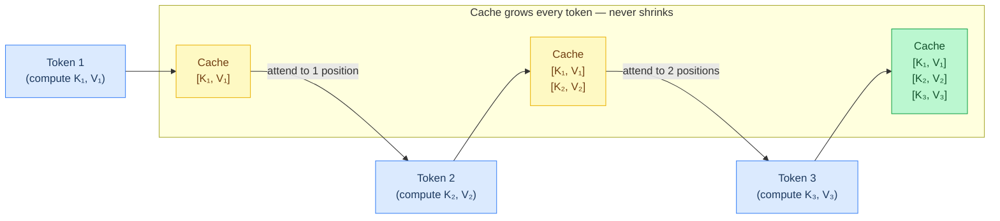
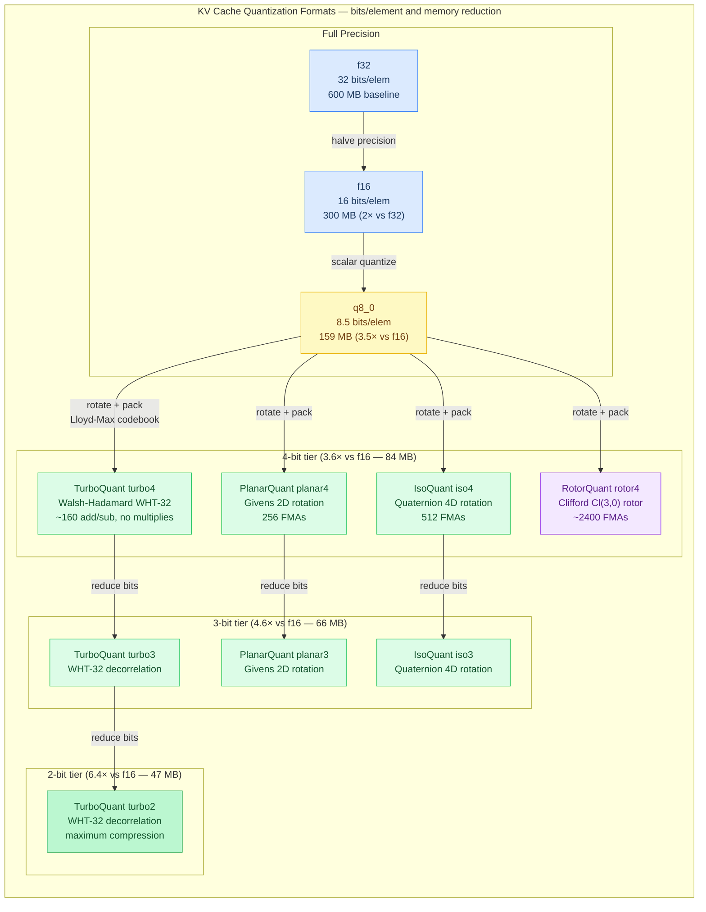
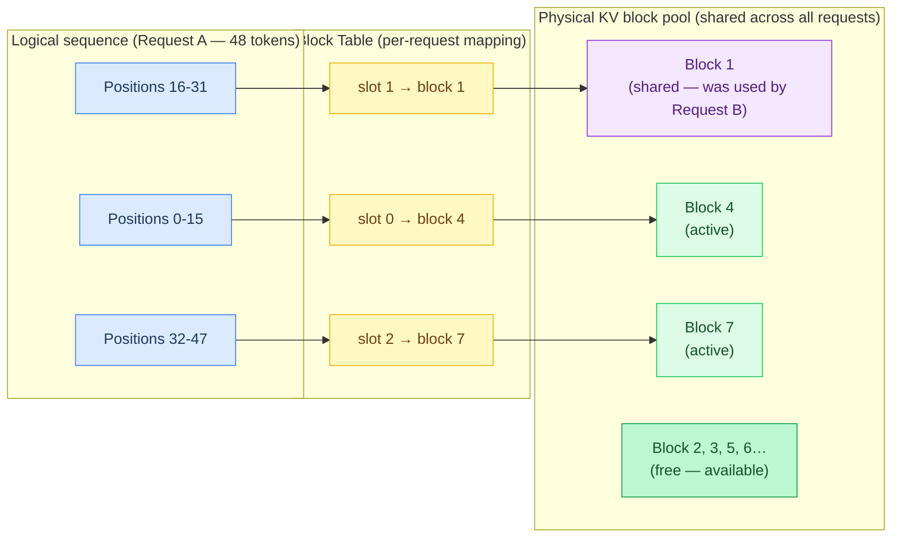
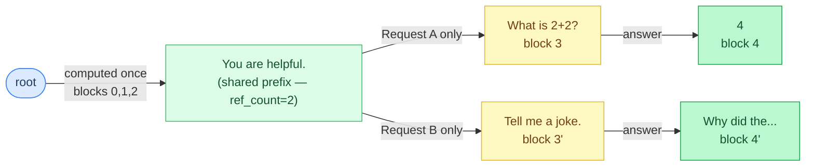
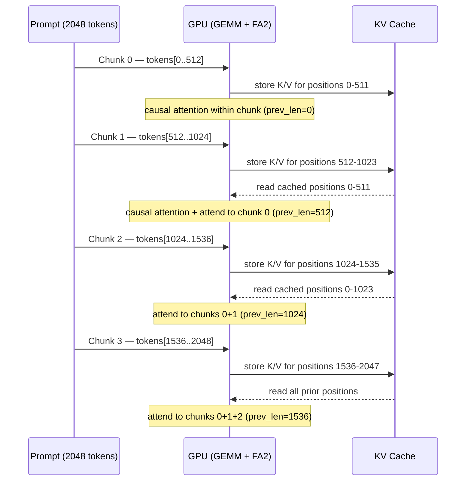
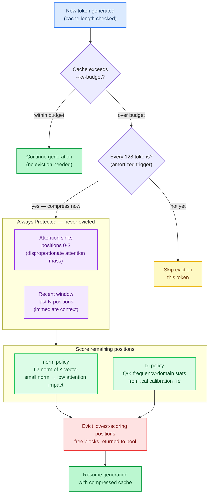
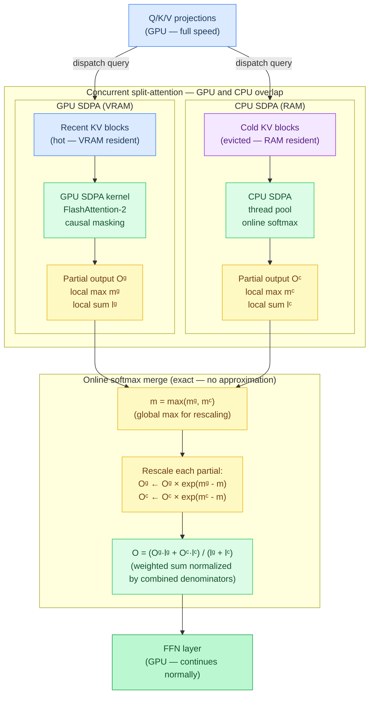

# Chapter 5: Memory and Caching

**Prerequisites:** [Chapter 2: The Transformer](02-the-transformer.md)

**Time:** ~20 min

> After this chapter you can explain the KV cache, PagedAttention, RadixAttention, KV quantization, and cache eviction.

During **autoregressive generation** (generating text one token at a time, where each new token depends on all previous tokens), each new token needs to attend to all previous tokens. Recomputing K and V for every previous position would waste enormous compute. The **KV cache** stores them.

## The KV Cache

Each generated token extends the cache — every subsequent token attends to all previously stored K/V pairs.

### Code Flow

```text
append K/V → attend over cache
```



The cache grows one slot per token, one slot per layer, per KV head:

```
Token 1: compute K₁, V₁, store in cache
Token 2: compute K₂, V₂, store in cache, attend to [K₁,K₂], [V₁,V₂]
Token 3: compute K₃, V₃, store in cache, attend to [K₁,K₂,K₃], [V₁,V₂,V₃]
```

The cache grows linearly with sequence length. Each new token adds one K vector and one V vector per layer per KV head:

```
Per-token KV cost = n_layers × n_kv_heads × head_dim × 2 (K+V) × bytes_per_element

Example: Qwen3.5 9B at f16 precision
  = 32 layers × 4 KV heads × 256 dim × 2 × 2 bytes = 128 KB per token

How this scales:
  128 tokens:   16 MB    (fits in GPU cache)
  2K tokens:   256 MB    (fits in VRAM easily)
  32K tokens:    4 GB    (starts competing with model weights for VRAM)
  128K tokens:  16 GB    (larger than the model weights themselves)
```

This is why long-context inference is memory-bound: generating token 100,001 requires the GPU to scan 100,000 cached K vectors per head per layer during attention. The KV cache often exceeds the model weights in memory at long contexts.

Quantizing the KV cache (e.g., to f16 or fp8) halves or quarters this cost with minimal quality loss.

### KV Cache Quantization

The KV cache can be quantized to reduce memory usage:

```
Format     Bits/elem  Memory for 30L × 5KV × 128d × 4096 tokens  Rotation
f32        32         600 MB                                      —
f16        16         300 MB                                      —
q8_0       8.5        159 MB                                      —
turbo4     4.5         84 MB  (3.6x vs f16)                       WHT-32
planar4    4.5         84 MB  (3.6x vs f16)                       Givens 2D
iso4       4.5         84 MB  (3.6x vs f16)                       Quaternion 4D
turbo3     3.5         66 MB  (4.6x vs f16)                       WHT-32
planar3    3.5         66 MB  (4.6x vs f16)                       Givens 2D
iso3       3.5         66 MB  (4.6x vs f16)                       Quaternion 4D
turbo2     2.5         47 MB  (6.4x vs f16)                       WHT-32
```



Four rotation-based quantizers are available, differing only in the decorrelation transform:
- **TurboQuant** (`tq2/3/4`): Walsh-Hadamard butterfly network — ~160 add/sub ops (32-element blocks, no multiplies)
- **PlanarQuant** (`pq2/3/4`): Givens 2D rotation — 256 FMAs (2.5x fewer)
- **IsoQuant** (`iq2/3/4`): Quaternion 4D rotation — 512 FMAs
- **RotorQuant** (`rq2/3/4`): Clifford Cl(3,0) rotor — ~2,400 FMAs

All share the same storage format (f16 norm + Lloyd-Max packed indices) and codebook. See [Chapter 4: Quantization](04-quantization.md#geometric-kv-cache-quantization) for mathematical details.

**Asymmetric K/V:** As demonstrated in [KIVI (Liu et al., 2024)](https://arxiv.org/abs/2402.02750), keys and values have different sensitivity — value compression is nearly free while key compression drives quality loss. Agave supports independent types via `--kv-type-k` and `--kv-type-v`:

```bash
# q8_0 keys (high quality) + turbo4 values (3.6x compressed) = best of both worlds
./agave model.gguf --kv-type-k q8_0 --kv-type-v turbo4 "prompt"
```

**The `turbo` preset:** A single flag that activates the recommended asymmetric configuration plus two additional optimizations:

```bash
./agave model.gguf --kv-type turbo "prompt"
# Sets: K=q8_0, V=turbo4, boundary V protection (first/last 2 layers at f16)
```

The preset also enables **boundary V protection** — the first and last 2 transformer layers keep V at f16 regardless of the configured V type. These boundary layers have outsized influence on output quality (early layers establish representations, final layers shape the distribution). Middle layers use turbo4 V, where compression is nearly free.

**Sparse V dequantization** further accelerates quantized V reads. After softmax, positions with weight below 1e-6 are skipped entirely: no V dequantization, no multiply-accumulate. At long context most softmax mass concentrates on a small number of positions, so skipping the rest improves decode speed with zero measured perplexity impact (`src/ops/attention.zig`). See [Chapter 4: Quantization](04-quantization.md#turboquant--the-turbo-preset) for implementation details.

## PagedAttention

PagedAttention maps a sequence's logical positions to non-contiguous physical memory blocks, the same way an OS uses virtual memory pages.



**The problem with contiguous allocation:** Without paging, you must pre-allocate the maximum context length for each sequence. If max_ctx=4096 and a request only generates 50 tokens, you've wasted 99% of that allocation. Worse, with 10 concurrent requests you need 10 × 4096 × 128 KB/token = 5 GB reserved — even if total actual usage is 50 MB. You can't reclaim the unused space because each sequence's cache must be contiguous in memory.

[PagedAttention (Kwon et al., 2023)](https://arxiv.org/abs/2309.06180) solves this the same way an OS handles virtual memory — by breaking the cache into fixed-size **blocks** (default 16 positions) allocated on demand:

```
physical_block = block_table[position / block_size]
offset = position % block_size
K[position] = blocks[physical_block].keys[offset * kv_dim ...]
```

Benefits:

- **No internal fragmentation** (wasted space within allocated regions) — blocks allocated on demand
- **Memory sharing** — **reference counting** (tracking how many sequences use each block) enables **copy-on-write** (sharing read-only data, duplicating only when modified) between requests
- **Continuous batching** — sequences can grow/shrink independently

Each `CacheBlock` tracks: `keys`, `values`, `used` count, `ref_count` (for sharing), `access_count` (for eviction).

**Paged SDPA:** The CPU SDPA kernel supports block-table-indexed attention via `PagedKvView`, enabling non-contiguous KV access with 16-token blocks. This means memory scales with actual sequence length rather than maximum context window. The kernel iterates over the block table to gather K/V data from arbitrary physical blocks, computing attention scores and accumulating weighted values without requiring the KV cache to be laid out contiguously in memory.

## RadixAttention

RadixAttention builds a **radix tree** (also called a **prefix trie** — a tree data structure where shared prefixes are stored only once) over token sequences to automatically detect and share common prefixes. If two requests share the same system prompt, the KV cache for that prefix is computed once and reused.



```text
Request A: "You are helpful. What is 2+2?"     → compute KV for "You are helpful." once
Request B: "You are helpful. Tell me a joke."   → reuse KV, only compute " Tell me a joke."
```

**RadixAttention Tree Visualization:**

```
                           root
                             │
                      "You are helpful."
                     [blocks 0,1,2] (shared)
                             │
                    ┌────────┴────────┐
                    │                 │
              " What is"        " Tell me a"
              [block 3]          [block 3']
                    │                 │
                 " 2+2?"            " joke."
                [block 4]          [block 4']
                    │                 │
              Answer: "4"       Answer: "Why..."
              [block 5]          [block 5']

Request A path: root → "You are helpful." → " What is" → " 2+2?" → "4"
Request B path: root → "You are helpful." → " Tell me a" → " joke." → "Why..."
                         └─────┬─────┘
                        shared prefix (blocks 0,1,2)
                        computed once, reused by both requests

Eviction (planned): Shared blocks (ref_count > 1) will be weighted 100× against eviction to preserve reuse — tracking infrastructure is in place but policy dispatch is not yet deployed.
Benefit: 3 shared blocks = 48 positions × 2 requests = 96 positions saved
```

Key operations (all at the scheduler layer, never in the token generation hot path):

- **Insert**: Cache a completed sequence's block IDs
- **Lookup**: Find the longest cached prefix for a new prompt
- **Eviction**: **LRU** (Least Recently Used — remove the oldest unused data first) based on access **timestamps** (recorded times when each block was last used); shared prefixes (ref_count > 1) will get 100× **eviction cost** (penalty score that makes them harder to remove) to preserve reuse — tracking infrastructure (`ref_count`, `last_access`) is in place but eviction policy dispatch is not yet deployed

RadixAttention is the preferred strategy for production serving.

## Chunked Prefill and Bulk KV Population

During **batched prefill**, all prompt tokens are processed through each layer together using GEMM instead of GEMV. The KV cache is populated in bulk — each layer's `sdpaPrefill` kernel appends all N key/value vectors at once.

**Chunked prefill** limits memory usage by splitting long prompts into fixed-size chunks (default 512 tokens). Each chunk is one batched pass through all layers.



```text
prefill([2048 tokens], chunk_size=512):
  chunk 0: tokens[0..512]    → GEMM + causal FA2 (prev_len=0)
  chunk 1: tokens[512..1024] → GEMM + causal FA2 (prev_len=512)
  chunk 2: tokens[1024..1536]→ GEMM + causal FA2 (prev_len=1024)
  chunk 3: tokens[1536..2048]→ GEMM + causal FA2 (prev_len=1536)
```

Each chunk's attention is **causal within the chunk AND attends to all previous chunks' KV data** in the cache. The `prev_len` parameter tells the attention kernel how many cached positions precede this chunk.

Prefill buffers are allocated once at model init, sized to `chunk_size × dim`. They are separate from the single-token decode buffers to avoid any regression on the decode path.

## Automatic Context Sizing

`--ctx-size auto` probes available system memory and picks the largest safe context window:

```bash
./agave model.gguf --ctx-size auto "long prompt..."
# info: ctx-size: auto → 16384 (48000 MB available, 128 B/token KV)
```

The formula: `max_ctx = (available_memory - 2 × model_size) × 0.8 / per_token_kv_bytes`. The 2× model-size reservation is a safety margin for weight overhead. Per-token KV bytes depend on `n_layers × n_kv_heads × head_dim × 2 (K+V) × kv_type_bits / 8`. For a 28-layer model with 4 KV heads, 128-dim heads, and f16 KV cache: `28 × 4 × 128 × 2 × 2 = 56 KB per token`. With 40 GB available and a 15 GB model, auto computes `(40G - 2×15G) × 0.8 / 56K ≈ 143K tokens` — clamped to the model's max context.

Use `--ctx-size auto` to avoid OOM at startup without manually calculating how much context your hardware can handle.

## KV Cache Eviction

When context grows beyond a fixed budget, **KV cache eviction** compresses the cache by removing low-value entries instead of failing or truncating the prompt. This allows generation to continue past the `--ctx-size` limit.

### Eviction Policies

**Norm-based** (`--kv-eviction norm`): Scores each cached position by the L2 norm of its K vector. Positions with small K norms contribute less to attention (they produce smaller dot products with queries) and are evicted first. No calibration needed — works with any model out of the box.

```bash
./agave model.gguf --kv-eviction norm --kv-budget 2048 "long prompt..."
```

**Trigonometric frequency-domain** (`--kv-eviction tri`): Uses per-head Q/K frequency statistics from [TriAttention (Mao et al., 2025)](https://arxiv.org/abs/2604.04921) to score positions in the frequency domain. Requires a `.cal` calibration file generated by `agave calibrate`:

```bash
# Step 1: Generate calibration data (one-time)
./agave calibrate model.gguf

# Step 2: Use tri eviction (reads model.cal automatically)
./agave model.gguf --kv-eviction tri --kv-budget 2048 "long prompt..."
```

### Shared Behavior

Both policies share the same eviction framework:

- **Attention sink preservation**: The first 4 positions are never evicted. These "sink" positions accumulate disproportionate attention mass in causal models and removing them degrades output quality severely.
- **Recent window**: The most recent positions are always retained regardless of their score, ensuring the model has full access to the immediate context.
- **Periodic compression**: Eviction runs every 128 tokens once the cache exceeds `--kv-budget`. This amortizes the scoring cost rather than evicting on every token.



### Stacking with TurboQuant

TurboQuant and KV eviction are complementary — one compresses *bits per entry*, the other reduces the *number of entries*:

```
f16 baseline:         16 bits × N entries
TurboQuant turbo4:   4.5 bits × N entries    (3.6× reduction)
Eviction alone:       16 bits × N/10 entries  (10× reduction)
Combined:            4.5 bits × N/10 entries  (~36× reduction)
```

## Async Split-Attention (APEX)

When a model's KV cache grows too large to fit entirely in VRAM, older entries can be demoted to CPU RAM. But attention still needs to read them. Rather than stalling the GPU to fetch cold data from RAM, Agave uses **split-attention** — running GPU and CPU SDPA concurrently and merging results — inspired by [APEX](https://arxiv.org/abs/2506.03296).

```
Token generation with split KV cache:

1. Linear ops (Q/K/V projections) run on GPU — full batch, full speed
2. At attention time, scan block tiers:
   ├─ GPU blocks (recent tokens, VRAM)  → GPU SDPA kernel
   └─ CPU blocks (cold prefix, RAM)     → CPU SDPA on thread pool
3. Both run concurrently (async overlap)
4. Merge partial outputs via online softmax correction
5. Continue to FFN on GPU
```



**Online softmax merge:** Each split computes local softmax independently. The merge uses [FlashAttention-2 (Dao, 2023)](https://arxiv.org/abs/2307.08691)'s online correction: track per-head `max` and `sum`, then rescale and combine. This is exact — no approximation.

**When it activates:** Automatically when `--kv-tiers vram+ram` is set and KV blocks get demoted to RAM under memory pressure. No extra flag needed — if all blocks are GPU-resident, the fast path runs with zero overhead.

**UMA optimization:** On Apple Silicon and NVIDIA GB10 (unified memory), both GPU and CPU read the same physical memory. No data transfer — just concurrent compute on the same cache.

---

### Per-Head KV Quantization

Standard KV quantization uses one scale per 16–32 elements (per-block). **Per-head** quantization uses one dynamic scale per KV head, tracked as the running absmax across all positions:

```
PerHeadKvScales { scales: [n_kv_heads]f32 }
  kvStorePerHead(dst, src, n, head_idx, scales)  → FP8 + update scale
  kvDotPerHead(q, kv, n, head_idx, scales)       → scaled dot product
```

This matches vLLM's per-head FP8 KV format: coarser granularity than per-block (less metadata) but compatible with FlashAttention-style GPU kernels that apply one scale per attention computation. Use via `--kv-type fp8`.

### Cross-Instance KV Cache Sharing

Multiple agave instances serving the same model can share prefix KV caches (LMCache-style):

```bash
# Instance A: compute system-prompt KV and export
curl http://A:49453/v1/kv_cache?n_tokens=512 --output prefix.bin

# Instance B: import prefix (sets kv_seq_len = N; clears prefix-cache token IDs)
curl http://B:49453/v1/kv_cache?n_tokens=512 --data-binary @prefix.bin -X POST
```

**GET `/v1/kv_cache?n_tokens=N`** → exports KV[0..N] as unversioned f32 binary (layer₀_K | layer₀_V | layer₁_K | ...).  
**POST `/v1/kv_cache?n_tokens=N`** (body = binary) → imports and sets `kv_seq_len = N`.

The blob has no prompt token IDs, so a following OpenAI-style request still re-prefills unless the server already has matching prefix-cache IDs from a local generation. Useful today for orchestrators that manage prefill themselves, or chat continuation via `kv_valid`. See [API.md](../API.md) and the Design Decisions table in [ARCHITECTURE.md](../ARCHITECTURE.md).

Useful for shared system prompts: compute the prefix KV once on one instance, distribute to a fleet.

> **Note:** Cross-node KV cache transfer requires `--api-key` (or `AGAVE_API_KEY`) for authentication when binding to non-loopback addresses.

## Gotchas

**Cached K bakes in absolute position (inverse RoPE)**: RoPE rotates K by an angle derived from its *absolute* position before it's written to the cache ([Chapter 2](02-the-transformer.md#rope-rotary-position-encoding)). A cached K vector isn't position-neutral: reusing it at a different position requires either recomputing it from scratch or applying an inverse rotation followed by re-rotation to the new angle, neither of which Agave's paged cache does. This is why RadixAttention's prefix sharing only works because shared prefixes start at position 0 in every request that shares them: the cached K vectors' baked-in rotation is already correct for whoever reuses that block.

**Paged block-index math assumes a fixed block size**: `PagedKvView` (`src/kvcache/manager.zig`) converts a logical position to a block index and in-block offset via `position >> block_shift` / `position & block_mask` when `block_size` is a power of two, falling back to plain division/modulo otherwise. Both paths must agree on the same `block_size` for the life of a cache; resizing `block_size` after blocks have been allocated (rather than just adding more blocks of the existing size) would silently misalign every position lookup that follows.

**In the code:** [src/kvcache/manager.zig](../../src/kvcache/manager.zig) (KvCache, PagedKvCache, RadixTree, KV eviction), [src/kvcache/block_allocator.zig](../../src/kvcache/block_allocator.zig) (block allocation), [src/kvcache/tiered.zig](../../src/kvcache/tiered.zig) (VRAM + RAM + SSD tiers), [src/ops/kv_quant.zig](../../src/ops/kv_quant.zig) (KV cache quantization — f16, q8_0, fp8, nvfp4, TurboQuant, PerHeadKvScales), [src/backend/cpu.zig](../../src/backend/cpu.zig) (CPU prefill attention), [src/backend/kernels/metal/sdpa.metal](../../src/backend/kernels/metal/sdpa.metal) (GPU prefill FA2, 64K seq limit)

```text
block = blockTable[position / block_size]              # src/kvcache/manager.zig
append K, V to blocks[block] at (position % block_size)
...
scores = Q @ Kcache^T * scale                            # gather across block table
attn   = softmax(scores) @ Vcache
```

**Next:** [Chapter 6: State Space Models →](06-state-space-models.md) | **Back:** [Chapter 4: Quantization ←](04-quantization.md) | **Product docs:** [Architecture](../ARCHITECTURE.md)

---

## Glossary

**attention sinks** — The first few token positions that accumulate disproportionate attention mass and should never be evicted.

**block (KV cache)** — A fixed-size unit of KV cache storage (default 16 positions) allocated on demand.

**block table** — A per-request mapping from logical sequence positions to physical memory blocks.

**chunked prefill** — Splitting long prompts into fixed-size chunks (e.g., 512 tokens) to bound memory usage during prefill.

**continuous batching** — Processing multiple requests simultaneously where each can grow/shrink independently.

**cross-instance KV sharing** — Exporting and importing KV cache data between server instances to avoid redundant prefill computation.

**KV cache** — Storage for previously computed Key and Value vectors so they don't need to be recomputed for each new token.

**KV cache eviction** — Removing low-value entries from the KV cache when context exceeds the budget, allowing generation to continue.

**norm-based eviction** — Scoring cached positions by L2 norm of their K vector; low-norm positions are evicted first.

**OOM (Out Of Memory)** — An error when the system cannot allocate enough memory for the requested operation.

**PagedAttention** — A memory management technique mapping logical sequence positions to non-contiguous physical memory blocks, like OS virtual memory.

**per-head KV quantization** — Using one dynamic scale per KV head (tracked as running absmax) rather than per-block scales.

**RadixAttention** — A caching strategy using a radix tree (prefix trie) to detect and share common prompt prefixes across requests.

**radix tree / prefix trie** — A tree data structure where shared prefixes are stored once and branched at divergence points.

**split-attention** — Running GPU and CPU SDPA concurrently on different KV cache tiers, merging results via online softmax correction.

**tiered KV cache** — Storing KV cache blocks across multiple memory tiers (VRAM, RAM, SSD) based on access recency.
