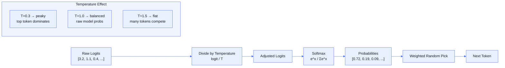

# Chapter 7: Sampling

After the forward pass produces **logits** (raw unnormalized scores, one per vocabulary token), the model must **select** the next token. The simplest method is **greedy decoding** (pick the highest score), but this produces repetitive, **deterministic** (always the same output for the same input) output. Sampling parameters add controlled randomness for more natural text.

## Temperature

Controls randomness by scaling logits before sampling:


adjusted_logits[i] = logits[i] / temperature
probabilities = softmax(adjusted_logits)
next_token = sample(probabilities)
```

| Value | Effect | Use case |
|-------|--------|----------|
| `0` | **Greedy** — always pick highest (argmax) | Factual Q&A, code, math |
| `0.1-0.5` | Low randomness | Reliable but slightly varied |
| `0.7-0.9` | Balanced | General conversation, writing |
| `1.0` | Raw model probabilities | Default behavior |
| `1.5-2.0` | High randomness | Creative writing, brainstorming |

Dividing by a small temperature makes the softmax "peakier" (top token dominates). Dividing by a large temperature makes it "flatter" (more candidates get a chance). At temperature=0, Agave uses argmax — deterministic, same input always produces same output.

## Top-K

Restricts sampling to only the K highest-scoring tokens:

```
--top-k 40    Only consider the top 40 tokens
--top-k 0     Disabled (consider all tokens) — default
```

Sort tokens by score, keep the top K, **renormalize** probabilities (rescale so they sum to 1.0 again), sample. Prevents picking extremely unlikely tokens at high temperatures.

## Top-P (Nucleus Sampling)

Introduced in [The Curious Case of Neural Text Degeneration (Holtzman et al., 2019)](https://arxiv.org/abs/1904.09751), nucleus sampling restricts sampling to the smallest set of tokens whose **cumulative probability** (running sum of probabilities in sorted order) exceeds P:

```
--top-p 0.9    Keep tokens until cumulative probability reaches 90%
--top-p 1.0    Disabled — default
```

More adaptive than top-k: when the model is confident (top token = 95%), top-p=0.9 keeps 1-2 candidates. When uncertain (many similar scores), it keeps dozens.

**Top-K vs Top-P**: Top-K always keeps exactly K tokens. Top-P adapts based on confidence. They can be combined.

```mermaid
%%{init: {'theme': 'base', 'themeVariables': {
  'primaryColor': '#e8f0fe',
  'primaryTextColor': '#1a1a2e',
  'primaryBorderColor': '#4a6cf7',
  'lineColor': '#4a6cf7',
  'secondaryColor': '#f0f4ff',
  'tertiaryColor': '#f8f9ff',
  'edgeLabelBackground': '#ffffff',
  'clusterBkg': '#f0f4ff',
  'clusterBorder': '#4a6cf7',
  'titleColor': '#1a1a2e',
  'nodeTextColor': '#1a1a2e',
  'fontFamily': 'ui-monospace, SFMono-Regular, monospace'
}}}%%
flowchart TD
    Start["Sorted Token Probabilities\n[0.40, 0.25, 0.15, 0.10, 0.06, 0.04]"] --> TopK["Top-K Filter\nkeep only top K tokens"]
    Start --> TopP["Top-P Filter\ncumulate until sum >= P"]

    TopK --> K_out["Fixed K candidates\ne.g. top-3: [0.40, 0.25, 0.15]"]
    TopP --> P_out["Variable candidates\ne.g. P=0.9: [0.40, 0.25, 0.15, 0.10]\n(cumsum = 0.90)"]

    K_out --> Renorm_K["Renormalize to 1.0"]
    P_out --> Renorm_P["Renormalize to 1.0"]

    Renorm_K --> Combined["Both applied? Intersection wins\n(whichever is more restrictive)"]
    Renorm_P --> Combined

    Combined --> Sample["Sample from remaining tokens"]

    subgraph Confidence["Model confidence drives top-p size"]
        Certain["Confident model\ntop-p=0.9 → 1-2 tokens"]
        Uncertain["Uncertain model\ntop-p=0.9 → 20+ tokens"]
    end


## Repeat Penalty

Discourages repeating previously generated tokens:

```
if token was previously generated:
    logits[token] /= repeat_penalty    (if logit > 0)
    logits[token] *= repeat_penalty    (if logit < 0)
```

Prevents the common "the the the the..." failure mode. Default 1.0 (disabled).

## Min-P

Adaptive threshold that keeps tokens whose probability is at least min_p × the top token's probability:

```
max_prob = max(softmax(logits))
threshold = min_p * max_prob
keep tokens where prob >= threshold
```

```
--min-p 0.05    Keep tokens with prob >= 5% of best token's prob
--min-p 0       Disabled — default
```

More intuitive than top-p: directly controls the "quality floor" relative to the best candidate. When the model is very confident, fewer tokens pass the filter; when uncertain, more pass — similar to top-p but without needing to think about cumulative probabilities.

## Frequency and Presence Penalties

OpenAI-style penalties applied to logits before sampling:

```
logits[token] -= frequency_penalty * count(token in output)
logits[token] -= presence_penalty * (1 if token appeared, 0 otherwise)
```

| Parameter | Range | Effect |
|-----------|-------|--------|
| `frequency_penalty` | `[-2, 2]` | Per-occurrence penalty — penalizes repeated tokens proportionally |
| `presence_penalty` | `[-2, 2]` | One-time penalty — discourages any reuse of generated tokens |

Positive values reduce repetition. Negative values encourage it (useful for rhyming, alliteration). Available in HTTP API; CLI uses `--repeat-penalty` (multiplicative style) instead.

## XTC (eXclude Top Choices)

XTC randomly excludes high-probability tokens to increase diversity. With probability `xtc_probability`, all tokens above `xtc_threshold` probability (except one) are zeroed out, forcing the model to pick a less obvious continuation.

```json
{"xtc_probability": 0.5, "xtc_threshold": 0.1, "temperature": 0.8}
```

Combats **mode collapse** where the model repeatedly generates the same high-probability sequences. Most useful for creative writing and brainstorming. Unlike temperature which scales all probabilities, XTC specifically removes the top choices while keeping the rest of the distribution intact.

## DRY (Don't Repeat Yourself)

DRY penalizes tokens that would continue a repeated n-gram sequence. If the model has generated "the cat sat on" earlier and is about to generate it again, DRY applies increasing penalty proportional to the match length.

```json
{"dry_multiplier": 1.5, "dry_allowed_length": 3}
```

`dry_multiplier` scales the penalty (0 = disabled). `dry_allowed_length` sets the minimum n-gram length to trigger (default 2 — penalize repeated bigrams and longer). More effective than `repeat_penalty` because it detects repeated **sequences**, not just individual tokens. A token might be fine to repeat (e.g., "the") unless it's part of a repeated phrase.

## Mirostat

Mirostat maintains consistent **perplexity** (unpredictability) during generation by dynamically adjusting the sampling threshold. Instead of fixed temperature, it targets a specific entropy level (tau) and adapts via learning rate (eta):

```json
{"mirostat": 2, "mirostat_tau": 5.0, "mirostat_eta": 0.1, "temperature": 0.8}
```

| Parameter | Default | Effect |
|-----------|---------|--------|
| `mirostat` | 0 | Mode: 0=disabled, 2=Mirostat 2.0 |
| `mirostat_tau` | 5.0 | Target entropy — lower = more focused, higher = more creative |
| `mirostat_eta` | 0.1 | Learning rate — how fast to adapt |

When Mirostat is active, top-k and top-p are bypassed — Mirostat controls its own truncation. It works by tracking a running "surprise" estimate and adjusting which tokens are eligible for sampling. Produces more consistently readable output than fixed temperature across varying prompt types.

## Logit Bias

Direct per-token adjustments to logits via the API. Specify token IDs and additive bias values:

```json
{"logit_bias": {"123": 5.0, "456": -100.0}}
```

Positive values increase the token's chance of being selected; large negative values effectively ban it. Applied before any other sampling — useful for steering output without changing the model. Max 16 entries per request.

## Grammar-Constrained Decoding

Forces output to match a formal grammar (GBNF format):

```bash
# Only "yes" or "no"
agave model.gguf --grammar-string 'root ::= "yes" | "no"' "Is the sky blue?"

# JSON object with specific fields
agave model.gguf --json-schema '{"type":"object","properties":{"name":{"type":"string"}}}' "User info"

# Any valid JSON
agave model.gguf --json-output "Generate a user profile"
```

The grammar state machine masks logits before sampling — tokens that would violate the grammar get set to -infinity. This guarantees syntactically valid output regardless of sampling parameters.

**Jump decoding**: When the grammar allows exactly one valid next token (e.g., a colon after a JSON key, a closing brace at the end), the forward pass is skipped entirely and that token is emitted directly. This eliminates unnecessary GPU compute for deterministic structural tokens, significantly speeding up JSON schema output where many tokens are fixed by the schema.

Supported: GBNF strings, GBNF files (`--grammar`), JSON schemas (`--json-schema`), JSON mode (`--json-output`). Full repetition (`*`/`+`/`?`) and grouped expressions.

## Combining Parameters

Use this decision tree to pick parameters for your use case, then the pipeline diagram below shows the order they apply at runtime.

```mermaid
%%{init: {'theme': 'base', 'themeVariables': {
  'primaryColor': '#e8f0fe',
  'primaryTextColor': '#1a1a2e',
  'primaryBorderColor': '#4a6cf7',
  'lineColor': '#4a6cf7',
  'secondaryColor': '#f0f4ff',
  'tertiaryColor': '#f8f9ff',
  'edgeLabelBackground': '#ffffff',
  'clusterBkg': '#f0f4ff',
  'clusterBorder': '#4a6cf7',
  'titleColor': '#1a1a2e',
  'nodeTextColor': '#1a1a2e',
  'fontFamily': 'ui-monospace, SFMono-Regular, monospace'
}}}%%
flowchart TD
    Start["What are you generating?"] --> Q1{"Need exact,\nreproducible output?"}
    Q1 -->|Yes| Greedy["temperature=0\ngreedy argmax"]
    Q1 -->|No| Q2{"Structured output\nrequired?"}
    Q2 -->|Yes - JSON/grammar| Grammar["--json-schema / --grammar\ngrammar mask handles the rest"]
    Q2 -->|No| Q3{"What matters most?"}
    Q3 -->|Avoid repetition in long text| LongForm["repeat_penalty=1.1\nDRY multiplier=1.5\ntemperature=0.8"]
    Q3 -->|Creative + diverse| Creative["temperature=1.2\nmin_p=0.05\nor XTC for variety"]
    Q3 -->|Consistent readability| Mirostat["mirostat=2\ntau=5.0\n(ignores top-k/p)"]
    Q3 -->|General conversation| Balanced["temperature=0.7\ntop-p=0.9"]

    subgraph Defaults["Safe starting point"]
        Balanced
    end


Applied in order:

```mermaid
%%{init: {'theme': 'base', 'themeVariables': {
  'primaryColor': '#e8f0fe',
  'primaryTextColor': '#1a1a2e',
  'primaryBorderColor': '#4a6cf7',
  'lineColor': '#4a6cf7',
  'secondaryColor': '#f0f4ff',
  'tertiaryColor': '#f8f9ff',
  'edgeLabelBackground': '#ffffff',
  'clusterBkg': '#f0f4ff',
  'clusterBorder': '#4a6cf7',
  'titleColor': '#1a1a2e',
  'nodeTextColor': '#1a1a2e',
  'fontFamily': 'ui-monospace, SFMono-Regular, monospace'
}}}%%
flowchart TD
    Logits["Raw Logits\none score per vocab token"] --> Bias["Logit Bias\nper-token additive adjustments"]
    Bias --> Penalties["Repetition Penalties\nrepeat / frequency / presence / DRY"]
    Penalties --> Grammar["Grammar Mask\nset invalid tokens to -infinity"]
    Grammar --> Temp["Temperature Scaling\nlogits /= temperature"]
    Temp --> XTC["XTC Exclusion\nrandomly drop top tokens"]
    XTC --> MinP["Min-P Filter\ndrop tokens below min_p × max_prob"]
    MinP --> TopK["Top-K Filter\nkeep only K highest"]
    TopK --> Softmax["Softmax\nconvert logits to probabilities"]
    Softmax --> TopP["Top-P Filter\nnucleus cutoff + renormalize"]
    TopP --> Mirostat{"Mirostat\nactive?"}
    Mirostat -->|Yes - replaces top-k/p| MiroTrunc["Mirostat Truncation\nentropy-targeted cutoff"]
    Mirostat -->|No| FinalSample["Weighted Random Sample"]
    MiroTrunc --> FinalSample
    FinalSample --> NextToken["Next Token ID"]


```
logits (raw scores, one per vocab token)
  │
  ├─ logit bias (per-token additive adjust)   [API steering]
  ├─ repeat/frequency/presence penalties      [per-token logit modification]
  ├─ DRY penalty (repeated n-gram sequences)  [sequence-aware penalty]
  ├─ grammar mask (set invalid tokens to -∞)  [hard constraint]
  ├─ temperature scaling (logits /= temp)     [control sharpness]
  ├─ XTC exclusion (drop top tokens randomly) [diversity injection]
  ├─ min-p filter (drop < min_p × max)        [adaptive threshold]
  ├─ top-k filter (keep only top K tokens)    [hard cutoff]
  │
  ├─ softmax → probabilities                  [logits → probabilities]
  │
  ├─ top-p filter (keep smallest set ≥ P)     [nucleus cutoff, renormalize]
  │
  ├─ Mirostat (if active, replaces top-k/p)   [entropy-targeted truncation]
  │
  └─ sample from distribution                 [weighted random pick]
       → next token ID
```

```bash
# Deterministic
agave model.gguf -t 0 "What is the capital of France?"

# Balanced
agave model.gguf -t 0.7 --top-p 0.9 "Tell me a story"

# Creative with min-p quality floor
agave model.gguf -t 1.2 --min-p 0.05 "Write a poem"

# Anti-repetition for long-form
agave model.gguf -t 0.8 --repeat-penalty 1.1 -n 1000 "Write an essay"

# Structured output
agave model.gguf --json-schema '{"type":"object","properties":{"answer":{"type":"string"}}}' "Capital of France?"
```

---

**In the code:** [src/ops/math.zig](../../src/ops/math.zig) (sampleToken, applyPenalties, applyMinP, applyRepeatPenalty, applyXtc, applyDry, sampleMirostat, applyLogitBias), [src/grammar.zig](../../src/grammar.zig) (GBNF parser, state machine, JSON schema converter)

**Math reference:** [Argmax](appendix-math.md#argmax), [Temperature Scaling](appendix-math.md#temperature-scaling), [Top-K](appendix-math.md#top-k-selection), [Top-P](appendix-math.md#top-p-nucleus-sampling)

**Next:** [Chapter 8: Backends →](08-backends.md) | **Back:** [Chapter 6: State Space Models ←](06-state-space-models.md) | **Product docs:** [Architecture](../ARCHITECTURE.md), [HTTP API](../API.md)
