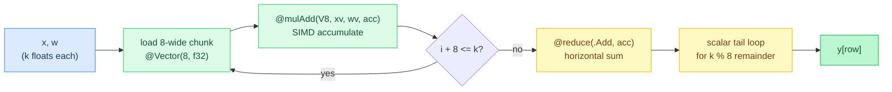
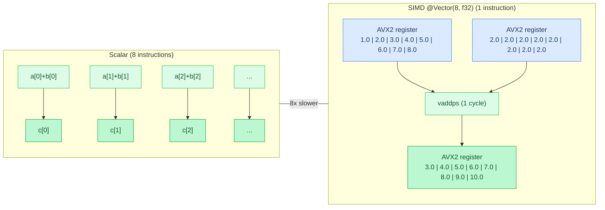
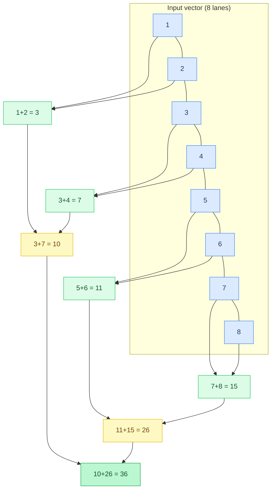
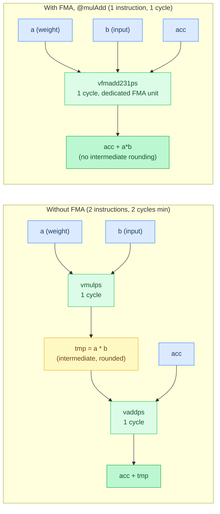
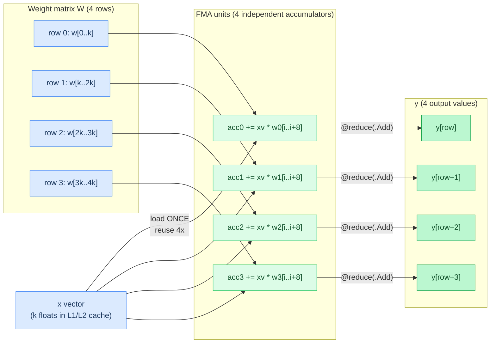
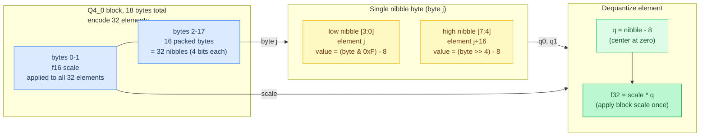
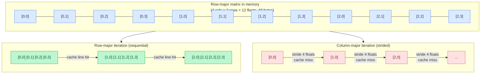
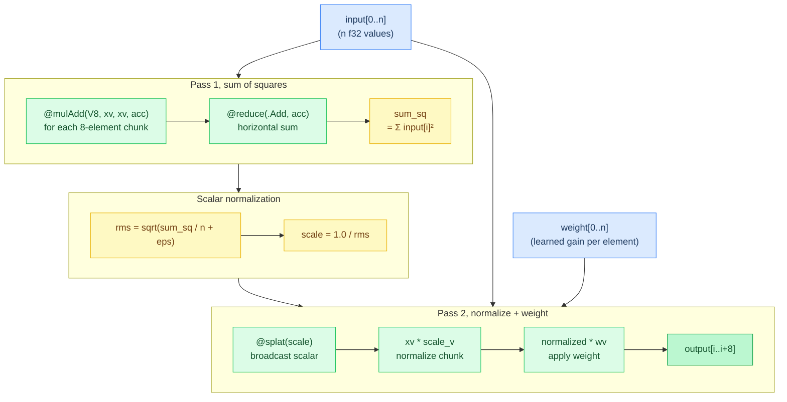
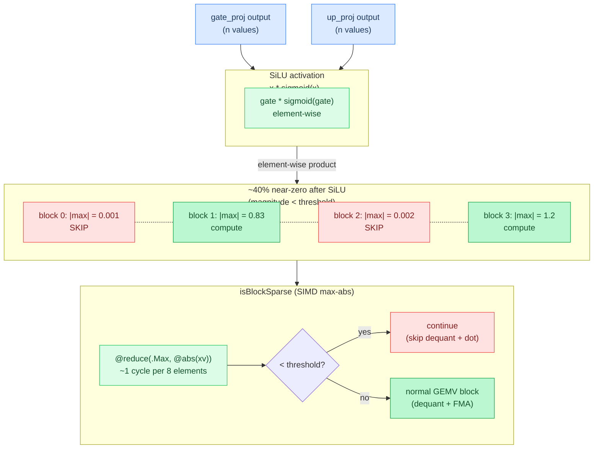

# Chapter 9: CPU SIMD Optimization

**Prerequisites:** [Chapter 8: Backends](08-backends.md) (SIMD vs SIMT distinction, CPU as one of the dispatch targets)

**Time:** ~19 min

> After this chapter you can explain `@Vector` SIMD, multi-row GEMV batching, and quantized kernel structure.

When a GPU isn't available, the CPU backend needs to be fast. Modern CPUs have **SIMD** (Single Instruction Multiple Data) units that can process 4-8 values in parallel with a single instruction. Zig provides portable SIMD via `@Vector`, the same code generates **NEON** on ARM (Apple Silicon, Raspberry Pi) and **AVX2/AVX-512** on x86_64 (Intel, AMD).

## Code Flow



One GEMV row: load 8 floats from `x` and `w`, fuse-multiply-add into a SIMD accumulator, repeat until fewer than 8 elements remain, then reduce the accumulator to a scalar and finish the leftover elements one at a time. The rest of this chapter builds up to that loop and beyond it.

## The @Vector Type

A single SIMD instruction operates on an entire register of values at once, turning N sequential operations into 1 parallel operation.



A vector is a fixed-size array that maps to hardware SIMD registers:

```text
V8 = Vector(8 x f32)   # 256 bits: AVX2 register, or 2 NEON registers

a = {1, 2, 3, 4, 5, 6, 7, 8}
b = {2, 2, 2, 2, 2, 2, 2, 2}
c = a + b              # compiles to 1 instruction: vadd / vaddps
c = {3, 4, 5, 6, 7, 8, 9, 10}
```

**Implementation:** [`src/backend/kernels/cpu/gemv_f32.zig`](../../src/backend/kernels/cpu/gemv_f32.zig) (`V8`)

**Why 8 elements?** AVX2 (Intel/AMD) has 256-bit registers = 8 f32s. NEON (ARM) has 128-bit registers = 4 f32s, so the compiler uses 2 registers. This is the sweet spot for portable code.

### Loading from Memory

Vectors load from slices using array syntax:

```text
i = 0
while i + 8 <= n:
    xv = load8(x[i..i+8])   # xv = {x[i], x[i+1], ..., x[i+7]}
    i += 8
```

**Implementation:** [`src/backend/kernels/cpu/gemv_f32.zig`](../../src/backend/kernels/cpu/gemv_f32.zig) (`gemvF32`)

**Memory alignment matters:** SIMD loads are fastest when the address is aligned to 32 bytes (AVX2) or 16 bytes (NEON). Agave relies on the allocator providing sufficient alignment, `std.heap.page_allocator` guarantees this for large allocations.

## Core SIMD Operations

### @splat: Broadcast a Scalar

```text
v = splat(2.5)   # v = {2.5, 2.5, 2.5, 2.5, 2.5, 2.5, 2.5, 2.5}, all 8 lanes
```

Used to initialize accumulators to zero:

```text
v8zero = splat(0.0)
acc = v8zero
```

**Implementation:** [`src/backend/kernels/cpu/gemv_f32.zig`](../../src/backend/kernels/cpu/gemv_f32.zig) (`v8zero`)

### @reduce: Horizontal Sum

```text
v = {1, 2, 3, 4, 5, 6, 7, 8}
sum = reduce(Add, v)   # sum = 36.0 (1+2+3+4+5+6+7+8)
```

**Implementation:** [`src/backend/kernels/cpu/gemv_f32.zig`](../../src/backend/kernels/cpu/gemv_f32.zig) (`gemvF32`, uses `@reduce(.Add, ...)`)

Compiles to a **reduction tree** (pair-wise adds that preserve precision better than sequential accumulation):



```
{1,2,3,4,5,6,7,8}
→ {1+2, 3+4, 5+6, 7+8} = {3, 7, 11, 15}
→ {3+7, 11+15}          = {10, 26}
→ 10+26                 = 36
```

On NEON: `vaddvq_f32` (horizontal add). On AVX2: `vhaddps` + scalar extract.

### @mulAdd: Fused Multiply-Add (FMA)

FMA collapses a multiply and an add into one instruction, firing through a dedicated hardware unit. The CPU dispatches it alongside other work in the same cycle.



**The single most important SIMD operation for inference.**

```text
acc = mulAdd(a, b, acc)   # acc += a * b, but 1 instruction instead of 2
```

**Implementation:** [`src/backend/kernels/cpu/gemv_f32.zig`](../../src/backend/kernels/cpu/gemv_f32.zig) (`gemvF32`, uses `@mulAdd`)

Maps to hardware FMA:
- **NEON**: `vfma` or `vmlaq_f32` (1 cycle latency, 2× throughput)
- **AVX2**: `vfmadd231ps` (1 instruction vs separate `vmulps` + `vaddps`)

**Why FMA matters:**
- **Fewer instructions**: 1 instead of 2 → 2× fewer instruction fetches
- **Better precision**: `a*b+c` computed as one operation → no intermediate rounding
- **Higher throughput**: FMA units are separate from regular ALUs on modern CPUs

Example from f32 GEMV (dot product):

```text
acc = v8zero
i = 0
while i + 8 <= k:
    xv = load8(x[i..i+8])
    wv = load8(w[row*k + i .. row*k + i + 8])
    acc = mulAdd(xv, wv, acc)   # acc += xv * wv
    i += 8
dot = reduce(Add, acc)
```

**Implementation:** [`src/backend/kernels/cpu/gemv_f32.zig`](../../src/backend/kernels/cpu/gemv_f32.zig) (`gemvF32`)

**Performance:** On Apple M4, this achieves **~70% of peak memory bandwidth**, the bottleneck is loading `x` and `w`, not arithmetic.

## Multi-Row GEMV Batching

The problem: loading `x` from memory is expensive. Each row of the matrix needs the same `x` vector. **Reuse it across multiple rows before evicting from cache.**

### 4-Row Batching Pattern

Loading the input vector `x` is expensive. With 4-row batching, `x` is loaded once and reused across 4 rows of the weight matrix before being evicted from cache.



```text
gemvF32(x, w, y, n, k):
    row = 0
    while row + 4 <= n:                      # 4-row batch
        acc0, acc1, acc2, acc3 = v8zero x 4
        r0, r1, r2, r3 = row*k, row*k+k, row*k+2k, row*k+3k

        i = 0
        while i + 8 <= k:
            xv = load8(x[i..i+8])             # load x ONCE
            acc0 = mulAdd(xv, load8(w[r0+i..r0+i+8]), acc0)   # reuse xv
            acc1 = mulAdd(xv, load8(w[r1+i..r1+i+8]), acc1)   # for all 4 rows
            acc2 = mulAdd(xv, load8(w[r2+i..r2+i+8]), acc2)
            acc3 = mulAdd(xv, load8(w[r3+i..r3+i+8]), acc3)
            i += 8

        t0, t1, t2, t3 = 0.0 x 4               # scalar tail (k % 8 remainder)
        while i < k:
            t0 = mulAdd(x[i], w[r0+i], t0)
            t1 = mulAdd(x[i], w[r1+i], t1)
            t2 = mulAdd(x[i], w[r2+i], t2)
            t3 = mulAdd(x[i], w[r3+i], t3)
            i += 1

        y[row..row+4] = reduce(Add, acc0) + t0, reduce(Add, acc1) + t1,
                         reduce(Add, acc2) + t2, reduce(Add, acc3) + t3
        row += 4

    while row < n:                            # remainder rows (n % 4)
        acc, tail = v8zero, 0.0
        i = 0
        while i + 8 <= k:
            acc = mulAdd(load8(x[i..i+8]), load8(w[row*k+i..row*k+i+8]), acc)
            i += 8
        while i < k:
            tail = mulAdd(x[i], w[row*k+i], tail)
            i += 1
        y[row] = reduce(Add, acc) + tail
        row += 1
```

**Implementation:** [`src/backend/kernels/cpu/gemv_f32.zig`](../../src/backend/kernels/cpu/gemv_f32.zig) (`gemvF32`)

**Key insights:**

1. **`xv` loaded once, used 4 times**, amortizes memory latency
2. **4 independent accumulators**, allows CPU to **pipeline** FMAs (execute multiple in parallel)
3. **Tail loop**, handles `k` not divisible by 8 (common with quantized blocks)
4. **Remainder loop**, handles `n` not divisible by 4

**Performance gain:** 2-3× faster than 1-row-at-a-time on bandwidth-bound workloads (most GEMV cases).

**Why not 8 rows?** Register pressure. 8 accumulators + 8 row-weight vectors + the xv broadcast = ~17 SIMD registers on AVX2, which only has 16 YMM registers, forcing spills to the stack. 4 rows is the sweet spot.

**NR=2 for K-quant formats:** Q4_K, Q5_K, and Q6_K use **NR=2**; Q4_0, Q8_0, BF16, and F16 use **NR=4** (same as the f32 kernel). The heavier per-block dequantization in K-quant formats is what reduces the optimal row count to 2. The same NR multi-row pattern is applied across GPU backends as well (Metal, CUDA, ROCm) with NR values tuned per format and hardware.

### Performance (from BENCHMARKS.md)

Measured 2026-03-24 on Apple M4 Pro (14-core CPU), full methodology in [BENCHMARKS.md](../BENCHMARKS.md).

| Claim | Source |
|-------|--------|
| Qwen3.5 9B Q8_0 CPU decode: 11.3 tok/s | BENCHMARKS Decode Throughput, M4 Pro |
| Gemma 3 12B Q8_0 CPU decode: 6.3 tok/s | BENCHMARKS Decode Throughput, M4 Pro |
| CPU numbers use all 14 threads (Agave) vs 10 threads (llama.cpp default) | BENCHMARKS Notes |

## Handling Quantized Data

Quantized GEMV must **dequantize inside the loop** to avoid materializing the full f32 matrix.

### Q4_0 Block Memory Layout

Each Q4_0 block encodes 32 elements into 18 bytes: a 2-byte f16 scale followed by 16 bytes of packed nibbles (two 4-bit values per byte).



### Example: Q4_0 GEMV (4-bit with f16 scale)

Q4_0 layout: 32 elements per block = 16 bytes (nibbles) + 2 bytes (f16 scale) = 18 bytes/block.

```text
gemvQ4_0(x, w, y, n, k):
    block_size = 32
    nb = ceil(k / block_size)                 # blocks per row

    for row in 0..n:
        sum = 0.0
        row_offset = row * nb * 18            # 18 bytes per Q4_0 block

        for ib in 0..nb:
            block_offset = row_offset + ib * 18
            scale = f16_to_f32(w[block_offset..block_offset+2])   # 2-byte f16 scale
            quant_data = w[block_offset+2 ..]
            x_offset = ib * block_size

            block_sum = 0.0
            for j in 0..16:                   # 16 bytes = 32 nibbles (2 per byte)
                byte = quant_data[j]
                q0 = (byte & 0xF) - 8          # low nibble -> element j
                q1 = (byte >> 4) - 8           # high nibble -> element j + 16
                block_sum += q0 * x[x_offset + j]
                block_sum += q1 * x[x_offset + j + 16]

            sum += scale * block_sum          # scale applied once per block
        y[row] = sum
```

**Implementation:** [`src/backend/kernels/cpu/gemv_q4_0.zig`](../../src/backend/kernels/cpu/gemv_q4_0.zig) (`gemvQ4_0`)

**Optimization notes:**

- **Scalar loop** shown for clarity, the real kernel uses V8 SIMD for the 32-element block
- **Scale applied once per block**, not per element (32x fewer multiplies)
- **Nibble extraction** via bit shifts, no lookup tables needed
- **Signed offset** (`-8`) centers the quantized range at zero

## Common Patterns

### Zeroing an Accumulator

```text
v8zero = splat(0.0)
acc = v8zero
```

**Implementation:** [`src/backend/kernels/cpu/gemv_f32.zig`](../../src/backend/kernels/cpu/gemv_f32.zig) (`v8zero`)

### Element-wise Operations

```text
c      = a * b               # c[i] = a[i] * b[i]
sum    = a + b                # element-wise add
scaled = a * splat(2.0)       # multiply by scalar (broadcast)
```

**Implementation:** [`src/backend/kernels/cpu/elementwise.zig`](../../src/backend/kernels/cpu/elementwise.zig) (`add`, `mul`)

### Conditional Operations (Masking)

```text
mask   = a > splat(0.0)                # boolean vector
result = select(mask, a, v8zero)       # result[i] = mask[i] ? a[i] : 0.0
```

Used in ReLU-family activations (max(0, x)):

```text
applyReluSquared(x):
    zero = splat(0.0)
    i = 0
    while i + 8 <= len(x):
        v = load8(x[i..i+8])
        r = max(v, zero)               # element-wise max
        x[i..i+8] = r * r              # squared for ReLU^2
        i += 8
    while i < len(x):
        v = max(x[i], 0.0)
        x[i] = v * v
        i += 1
```

**Implementation:** [`src/ops/math.zig`](../../src/ops/math.zig) (`applyReluSquared`, uses `@max`; production activation is ReLU^2, plain ReLU shown here for masking clarity)

### Transcendental Functions

Zig provides SIMD-vectorized math builtins:

```text
exp_v  = exp(v)     # element-wise e^x
sqrt_v = sqrt(v)    # element-wise sqrt(x)
log_v  = log(v)     # element-wise ln(x)
```

Used in Softplus activation (`log(1 + e^x)`):

```text
softplus(x) = log(1.0 + exp(x))     # scalar

softplusVec(x, n):                  # vectorized
    v8one = splat(1.0)
    i = 0
    while i + 8 <= n:
        xv = load8(x[i..i+8])
        x[i..i+8] = log(v8one + exp(xv))
        i += 8
    while i < n:
        x[i] = softplus(x[i])
        i += 1
```

**Implementation:** [`src/ops/math.zig`](../../src/ops/math.zig) (`softplus`)

**Note:** On CUDA/Metal, avoid `@exp` in GPU kernels, it compiles to a slow `libcall`. Use native GPU intrinsics instead (e.g., MSL `exp()`, CUDA `__expf()`).

## Performance Considerations

### Cache Locality

Process data in the order it's laid out in memory. Row-major matrices should iterate rows then columns. Sequential access keeps data in L1/L2 cache; column-major access on a row-major matrix jumps by `n_cols` bytes between loads, thrashing cache lines.



```text
# GOOD: sequential memory access
for row in 0..n_rows:
    for col in 0..n_cols:
        process(matrix[row * n_cols + col])

# BAD: strided access (cache misses)
for col in 0..n_cols:
    for row in 0..n_rows:
        process(matrix[row * n_cols + col])
```

**Implementation:** [`src/backend/kernels/cpu/gemv_f32.zig`](../../src/backend/kernels/cpu/gemv_f32.zig) (`gemvF32` iterates row-major)

### Alignment

Aligned loads are faster (1 cycle vs 2-3 cycles for unaligned on some CPUs):

```text
data = allocator.alloc(f32, n)             # typically 16-byte aligned
data = allocator.alignedAlloc(f32, 32, n)  # force 32-byte alignment
```

**Implementation:** [`src/backend/metal.zig`](../../src/backend/metal.zig) (page-aligned KV cache allocation for zero-copy GPU access)

### Prefetching

For large sequential scans, hint the CPU to prefetch: `@prefetch(ptr, .{ .rw = .read, .locality = 3, .cache = .data })`.

Agave doesn't use explicit prefetching, the CPU's hardware prefetcher does well enough for sequential GEMV access.

### Avoid Branching in Inner Loops

Branches inside SIMD loops can **serialize** (force sequential execution, losing SIMD parallelism). Use `@select` or `@max`/`@min` instead:

```text
# BAD: branch per element (serializes)
for i in 0..n:
    y[i] = x[i] if x[i] > 0 else 0

# GOOD: SIMD-friendly (no branches)
v8zero = splat(0.0)
i = 0
while i + 8 <= n:
    xv = load8(x[i..i+8])
    y[i..i+8] = max(xv, v8zero)
    i += 8
```

**Implementation:** [`src/ops/math.zig`](../../src/ops/math.zig) (`applyReluSquared`, branch-free `@max`)

## Real-World Example: RMSNorm

RMSNorm is a two-pass reduction: compute RMS, then normalize.



(simplified for clarity -- the real implementation in norm.zig uses 4-accumulator unrolling with a stride-32 inner loop to hide FMA latency)

```text
rmsNorm(input, weight, output, n, eps):
    # Pass 1: mean of squares
    acc = splat(0.0)
    i = 0
    while i + 8 <= n:
        xv = load8(input[i..i+8])
        acc = mulAdd(xv, xv, acc)      # acc += xv * xv
        i += 8
    sum_sq = reduce(Add, acc)
    while i < n:
        sum_sq = mulAdd(input[i], input[i], sum_sq)
        i += 1

    rms = sqrt(sum_sq / n + eps)
    scale = 1.0 / rms

    # Pass 2: normalize and apply weight
    scale_v = splat(scale)
    i = 0
    while i + 8 <= n:
        xv = load8(input[i..i+8])
        wv = load8(weight[i..i+8])
        output[i..i+8] = xv * scale_v * wv
        i += 8
    while i < n:
        output[i] = input[i] * scale * weight[i]
        i += 1
```

**Implementation:** [`src/backend/kernels/cpu/norm.zig`](../../src/backend/kernels/cpu/norm.zig) (`rmsNorm`)

**Optimizations:**

- **FMA for squares**, `@mulAdd(V8, xv, xv, acc)` is 1 instruction
- **Horizontal sum**, `@reduce(.Add, acc)` for final sum
- **Broadcast scale**, `@splat(scale)` once, reuse for all elements
- **Fused normalize+weight**, both in one loop (cache-friendly)

**Alternative:** GPU backends can fuse both passes into a single kernel using **threadgroup reductions** (parallel sum across threads, not sequential).

## Activation Sparsity (Sparse GEMV)

After SiLU activation in FFN layers, ~40% of output values are near-zero (magnitude < 0.005). The down-projection GEMV multiplies these near-zero values by weight blocks, wasting ~40% of compute. Sparse GEMV skips these blocks entirely:



```text
for b in 0..nb:                                        # before each weight block
    if isBlockSparse(x, b * block_size, block_size):
        continue                                        # skip dequant + dot entirely
    # ... normal dequant + MAC ...
```

**Implementation:** [`src/backend/kernels/cpu/gemv.zig`](../../src/backend/kernels/cpu/gemv.zig) (`isBlockSparse`, `sparse_threshold`)

`isBlockSparse` uses SIMD max-abs reduction (~1 cycle per 8 elements) to check if all block inputs are below threshold. If so, the entire block (dequant + dot product) is skipped.

**Expected effect:** Skipping near-zero activation blocks cuts CPU GEMV work on SiLU models (roughly ~40% sparse). Exact Qwen3.5 CPU decode deltas are not recorded in `docs/BENCHMARKS.md`; Metal decode figures that mention sparse GEMV live there instead. Output stays identical: the threshold only controls whether to compute, not what values to use.

This is inspired by [PowerInfer](https://github.com/Tiiny-AI/PowerInfer) and [TurboSparse](https://arxiv.org/abs/2406.05955), which exploit activation sparsity for large speedups on ReLU models (90%+ sparsity). SiLU models have lower sparsity but still benefit.

**Why CPU only?** GPU kernels are bandwidth-bound (waiting for memory, not compute). Adding branch checks to GPU shaders causes thread divergence which hurts performance. CPU GEMV is compute-bound (sequential dot products), so skipping blocks is pure win.

## Gotchas

- **The tail loop isn't optional cleanup.** When `k` (or `n`) isn't a multiple of the vector width, skipping the scalar tail loop after the `@Vector(8, f32)` main loop doesn't crash, it just silently drops the last few elements from the dot product. This is easy to miss on test inputs sized as round numbers (256, 4096) and only shows up once someone runs a GEMV against an odd hidden dimension or a quantized block boundary that doesn't divide evenly by 8.
- **`@reduce(.Add)`'s pairwise tree changes rounding, not just speed.** Reducing a SIMD accumulator with `@reduce` sums pairs in a tree order (see the reduction-tree diagram above), which accumulates floating-point rounding error differently than a naive sequential `for` loop summing the same values one at a time. A golden test that compares a new SIMD kernel against a scalar reference bit-for-bit will fail on rounding alone even when the SIMD kernel is correct; compare with a tolerance instead.

- **Thread pool grain matters more than kernel speed (DS4 case study).** With `parallel_grain=16`, a 32768-row GEMV creates 2048 tasks. For SSD-streamed MoE inference doing hundreds of GEMVs per forward pass, this generates hundreds of thousands of task dispatches per token. On the M4 Pro (14 threads), increasing `parallel_grain` from 16 to 128 gave 6–10% improvement across all workloads, without touching any kernel code. The sweet spot depends on thread count: too low = dispatch overhead dominates, too high = threads sit idle. Sweep `{16, 64, 128, 256, 512}` for your core count. See `parallel_grain` in `cpu.zig`.

---

**In the code:** [src/backend/kernels/cpu/gemv.zig](../../src/backend/kernels/cpu/gemv.zig) (`isBlockSparse`, `sparse_threshold`), [src/backend/kernels/cpu/gemv_f32.zig](../../src/backend/kernels/cpu/gemv_f32.zig), [src/backend/kernels/cpu/gemv_bf16.zig](../../src/backend/kernels/cpu/gemv_bf16.zig), [src/backend/kernels/cpu/norm.zig](../../src/backend/kernels/cpu/norm.zig), [src/ops/mlx.zig](../../src/ops/mlx.zig) (MLX GEMV with factored dequant)

**Next:** [Chapter 10: Memory Safety →](10-memory-safety.md) | **Back:** [Chapter 8: Backends ←](08-backends.md) | **Product docs:** [Architecture](../ARCHITECTURE.md) · [Models](../MODELS.md)

---

## Glossary

**@mulAdd (FMA)**, Fused Multiply-Add; a single instruction computing a×b+c with no intermediate rounding, mapped to hardware FMA units.

**@reduce**, Zig builtin that collapses a SIMD vector to a scalar via a specified operation (e.g., `.Add` for horizontal sum).

**@splat**, Zig builtin that broadcasts a scalar value to all lanes of a SIMD vector.

**@Vector**, Zig's portable SIMD type mapping to hardware vector registers; e.g., `@Vector(8, f32)` is 8 packed f32 values.

**activation sparsity**, The phenomenon where ~40% of activation values are near-zero after SiLU, allowing those GEMV blocks to be skipped.

**AVX2 (Advanced Vector Extensions 2)**, Intel/AMD 256-bit SIMD instruction set providing 8-wide f32 operations.

**cache locality**, Accessing memory sequentially to maximize CPU cache hits and minimize cache misses.

**isBlockSparse**, A SIMD max-abs check that determines whether all input values in a block are below a threshold, enabling the block to be skipped.

**multi-row GEMV batching**, Processing multiple output rows simultaneously (NR=2 or NR=4) to amortize the cost of loading the input vector.

**NEON**, ARM's SIMD instruction set providing 128-bit vector operations on aarch64 processors.

**NR (Number of Rows)**, The number of output rows computed per batch in a multi-row GEMV kernel (e.g., NR=4 for Q8_0 on CPU).

**register pressure**, The constraint from having finite hardware SIMD registers; exceeding capacity causes spills to slower stack memory.

**tail loop**, A scalar cleanup loop handling remaining elements when data length is not a multiple of the SIMD vector width.
