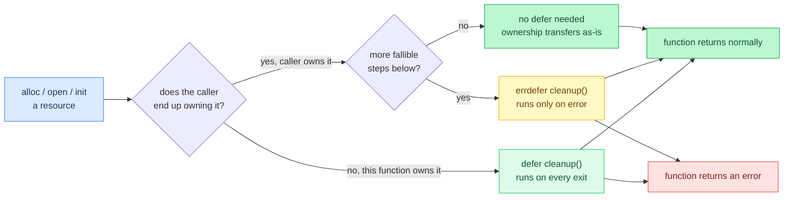
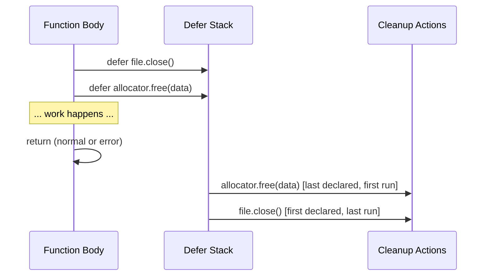
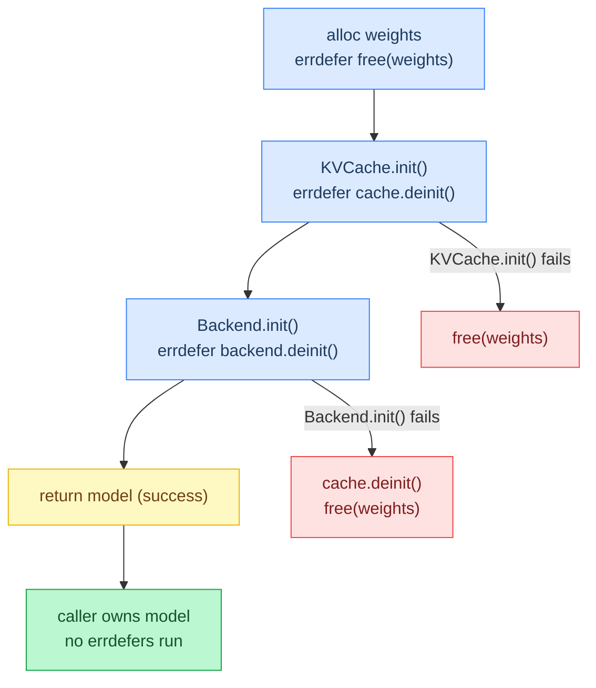
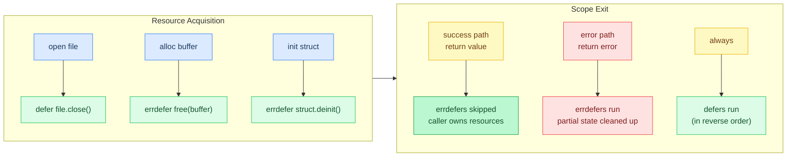
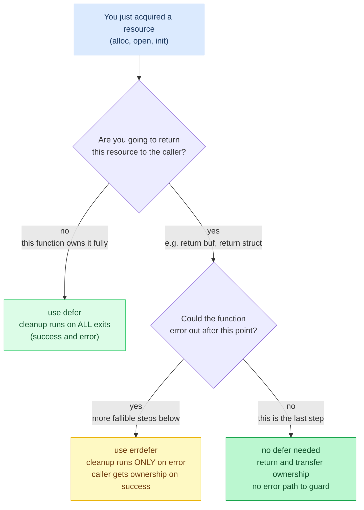
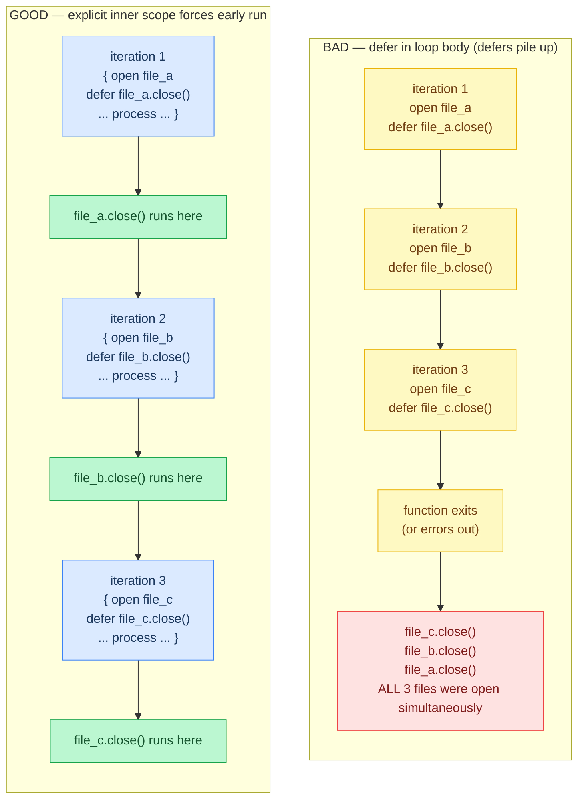
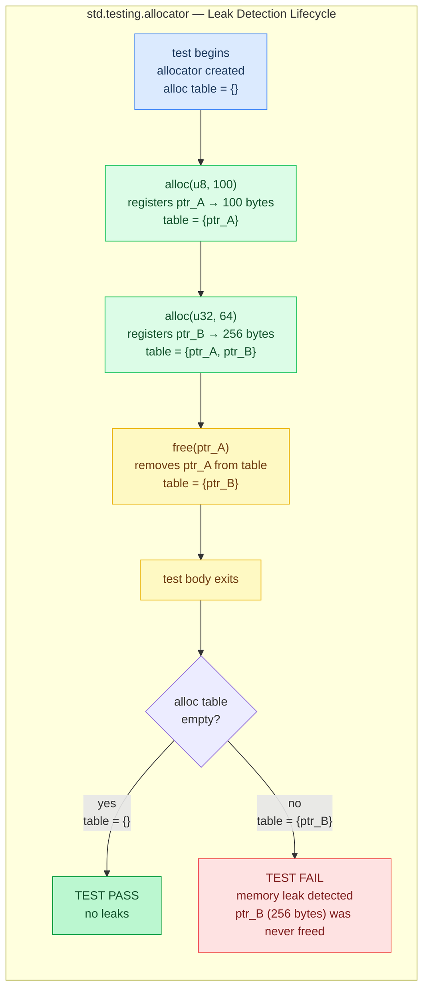
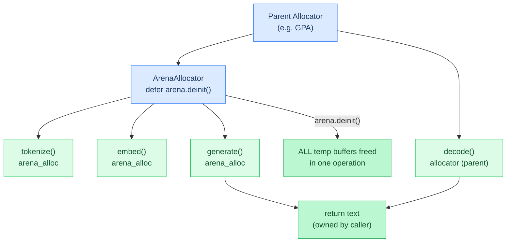

# Chapter 10: Memory Safety

**Prerequisites:** [Chapter 0: Getting Started](00-getting-started.md) (helpful for codebase context, not required)

**Time:** ~11 min

Zig's approach to memory management: **explicit allocation, guaranteed cleanup**. No garbage collector, no hidden allocations, no surprises. When you call `allocator.alloc()`, you must call `allocator.free()` — and Zig provides tools to make this **automatic and bulletproof**.

## Code Flow



`defer` and `errdefer` differ only in when they run: `defer` fires on every scope exit, `errdefer` fires only when the scope exits through an error. The rest of this chapter applies that one distinction to real allocation and initialization code.

## defer: Guaranteed Cleanup

`defer` executes a statement when the current scope exits — **always**, whether by normal return, error return, or early return:

```zig
pub fn processFile(allocator: Allocator, path: []const u8) !void {
    const file = try std.fs.cwd().openFile(path, .{});
    defer file.close();  // Runs when this function exits, no matter how

    const data = try file.readToEndAlloc(allocator, 1024 * 1024);
    defer allocator.free(data);  // Runs before file.close() (declared last, runs first)

    // ... process data ...

    if (someCondition) {
        return error.Invalid;  // Both defers still run!
    }

    // Normal return — both defers run
}
```

**Execution order:** Defers run in **reverse order** of declaration (stack unwinding — last declared, first executed):



```zig
defer std.debug.print("Third\n", .{});
defer std.debug.print("Second\n", .{});
defer std.debug.print("First\n", .{});
// Prints: First, Second, Third
```

**Why reverse order?** Resources should be released in the opposite order they were acquired (last acquired, first released — like closing nested function calls).

## errdefer: Cleanup Only on Error

`errdefer` runs **only if the function returns an error** after the `errdefer` was declared. It's for cleaning up partial initialization:

```zig
pub fn initModel(allocator: Allocator, config: Config) !Model {
    var model: Model = undefined;

    model.weights = try allocator.alloc(f32, config.n_params);
    errdefer allocator.free(model.weights);  // Only if we error out later

    model.cache = try KVCache.init(allocator, config.max_seq_len);
    errdefer model.cache.deinit();  // Only if we error out after this point

    model.backend = try Backend.init(allocator);
    errdefer model.backend.deinit();

    return model;  // Success: no errdefers run, caller owns model
}
```

**What happens on error?**



- If `KVCache.init()` fails → only `model.weights` is freed
- If `Backend.init()` fails → `model.cache.deinit()` AND `allocator.free(model.weights)` run
- If all succeed → nothing runs, model is returned to caller

**What happens on success?**

- No `errdefer` runs
- Caller is responsible for cleanup (usually via `model.deinit()`)

## The Pattern: defer + errdefer

**Rule:** Use `defer` immediately after acquiring a resource that must **always** be cleaned up. Use `errdefer` for partial initialization where cleanup depends on success.



**Quick decision guide** — which keyword to reach for:



### Example 1: Simple Allocation

```zig
pub fn processTokens(allocator: Allocator, tokens: []const u32) ![]f32 {
    const embeddings = try allocator.alloc(f32, tokens.len * 768);
    defer allocator.free(embeddings);  // Always cleanup

    for (tokens, 0..) |token, i| {
        // ... compute embedding ...
        if (token >= vocab_size) return error.InvalidToken;  // defer still runs!
    }

    return embeddings;  // Wait, this is wrong! defer frees it before we return!
}
```

**Bug:** `defer` runs before the return, so we're returning a pointer to freed memory!

**Fix:** Only use `defer` when you **don't** return the resource:

```zig
pub fn processTokens(allocator: Allocator, tokens: []const u32) ![]f32 {
    const embeddings = try allocator.alloc(f32, tokens.len * 768);
    errdefer allocator.free(embeddings);  // Only cleanup on error

    for (tokens, 0..) |token, i| {
        if (token >= vocab_size) return error.InvalidToken;  // errdefer runs
    }

    return embeddings;  // Success: errdefer doesn't run, caller owns embeddings
}
```

### Example 2: Struct with Multiple Resources

**Pattern:** Each struct with allocated resources provides a `deinit()` method:

```zig
pub const KVCache = struct {
    keys: []u8,
    values: []u8,
    block_table: []u32,
    allocator: Allocator,

    pub fn init(allocator: Allocator, max_seq_len: usize, kv_dim: usize) !KVCache {
        const keys = try allocator.alloc(u8, max_seq_len * kv_dim);
        errdefer allocator.free(keys);

        const values = try allocator.alloc(u8, max_seq_len * kv_dim);
        errdefer allocator.free(values);

        const block_table = try allocator.alloc(u32, max_seq_len);
        errdefer allocator.free(block_table);

        return KVCache{
            .keys = keys,
            .values = values,
            .block_table = block_table,
            .allocator = allocator,
        };
    }

    pub fn deinit(self: *KVCache) void {
        self.allocator.free(self.block_table);
        self.allocator.free(self.values);
        self.allocator.free(self.keys);
    }
};
```

**Usage:**

```zig
var cache = try KVCache.init(allocator, 4096, 640);
defer cache.deinit();  // Always cleanup

// ... use cache ...
```

**Why this works:**

- If `init()` fails partway through → `errdefer` cleans up what was allocated
- If `init()` succeeds → caller uses `defer cache.deinit()` to clean up later
- No memory leaks on any code path

### Example 3: Nested Initialization

Simplified illustrative example showing how Agave-style multi-component initialization chains defer and errdefer:

```zig
pub fn initAndRun(allocator: Allocator, args: Args) !void {
    // Format (loads model weights from disk)
    var fmt = try Format.init(allocator, args.model_path);
    defer fmt.deinit();

    // Backend (GPU/CPU compute)
    var be = try Backend.init(allocator, args.backend_type);
    defer be.deinit();

    // Tokenizer (text ↔ token IDs)
    var tok = try Tokenizer.init(allocator, fmt);
    defer tok.deinit();

    // Model (weights + forward pass)
    var model = try Model.init(allocator, fmt, be);
    defer model.deinit();

    // If ANY init fails, all prior defers run automatically
    // If all succeed, all defers run at function exit

    try runGeneration(allocator, &model, &tok, args);
}
```

**Clean and safe:** No manual error handling, no forgotten cleanup, no leaks.

## Common Pitfalls

### Pitfall 1: defer in a Loop



```zig
// BAD: defer accumulates, all run at function exit
for (files) |path| {
    const file = try std.fs.cwd().openFile(path, .{});
    defer file.close();  // Wrong! All files stay open until function exits

    // ... process file ...
}
```

**Fix:** Use an explicit scope or call cleanup directly:

```zig
// GOOD: Explicit scope
for (files) |path| {
    {  // New scope
        const file = try std.fs.cwd().openFile(path, .{});
        defer file.close();  // Runs at end of this block

        // ... process file ...
    }  // file.close() runs here
}

// Or: Manual cleanup when defer isn't appropriate
for (files) |path| {
    const file = try std.fs.cwd().openFile(path, .{});
    defer file.close();  // Runs at end of loop iteration? NO!

    // Actually, this is still wrong. Manual is better:
    errdefer file.close();
    // ... process ...
    file.close();  // Explicit
}
```

**Better pattern:** Extract to a helper function:

```zig
fn processFile(path: []const u8) !void {
    const file = try std.fs.cwd().openFile(path, .{});
    defer file.close();  // Runs at end of this function
    // ... process ...
}

for (files) |path| {
    try processFile(path);  // Clean and correct
}
```

### Pitfall 2: Conditional defer

```zig
// BAD: defer is unconditional, can't be inside an if
if (use_cache) {
    const cache = try allocator.alloc(u8, size);
    defer allocator.free(cache);  // Runs when function exits, not at end of if!
}
// cache is out of scope, but defer still tries to free it → use-after-free
```

**Fix:** Don't do this. Use `errdefer` with explicit cleanup, or refactor:

```zig
// Option 1: Always allocate, conditionally use
const cache = if (use_cache) try allocator.alloc(u8, size) else &[_]u8{};
defer if (use_cache) allocator.free(cache);

// Option 2: Refactor into separate function
if (use_cache) {
    try withCache(allocator, size);
}

fn withCache(allocator: Allocator, size: usize) !void {
    const cache = try allocator.alloc(u8, size);
    defer allocator.free(cache);
    // ... use cache ...
}
```

### Pitfall 3: Forgetting errdefer in Multi-Step Init

```zig
// BAD: Leaks if second allocation fails
pub fn init(allocator: Allocator) !MyStruct {
    const buf1 = try allocator.alloc(u8, 1024);
    const buf2 = try allocator.alloc(u8, 2048);  // If this fails, buf1 leaks!

    return MyStruct{ .buf1 = buf1, .buf2 = buf2 };
}
```

**Fix:** Use `errdefer` after each allocation:

```zig
// GOOD: No leaks on any error path
pub fn init(allocator: Allocator) !MyStruct {
    const buf1 = try allocator.alloc(u8, 1024);
    errdefer allocator.free(buf1);

    const buf2 = try allocator.alloc(u8, 2048);
    errdefer allocator.free(buf2);

    return MyStruct{ .buf1 = buf1, .buf2 = buf2 };
}
```

## Testing for Leaks



Zig's test allocator **automatically detects leaks**:

```zig
test "no leaks" {
    const allocator = std.testing.allocator;  // Tracks all allocs/frees

    {
        var cache = try KVCache.init(allocator, 1024, 128);
        defer cache.deinit();

        // ... test logic ...
    }

    // If any allocation wasn't freed, test fails with "memory leak detected"
}
```

**Example failure:**

```zig
test "leak example" {
    const allocator = std.testing.allocator;

    const buf = try allocator.alloc(u8, 100);
    // Oops, forgot defer allocator.free(buf);
}

// Output:
// Test [leak example] leaked memory.
// All test allocations must be freed before test completion.
```

This is **your safety net** — write tests, use `std.testing.allocator`, catch leaks before production.

## Advanced Pattern: Arena Allocator

For temporary allocations that all get freed together, use `std.heap.ArenaAllocator`:



```zig
pub fn generateText(allocator: Allocator, prompt: []const u8) ![]u8 {
    var arena = std.heap.ArenaAllocator.init(allocator);
    defer arena.deinit();  // Frees ALL arena allocations in one go

    const arena_alloc = arena.allocator();

    // All these allocations are freed by arena.deinit()
    const tokens = try tokenize(arena_alloc, prompt);
    const embeddings = try embed(arena_alloc, tokens);
    const output_tokens = try generate(arena_alloc, embeddings);

    // Final result: allocate from parent allocator, not arena
    const text = try decode(allocator, output_tokens);

    return text;  // arena.deinit() runs, cleans up temps
}
```

**When to use:**

- HTTP request handlers (all request-scoped allocations freed together)
- Compiler passes (free all AST nodes after pass completes)
- **Not** for long-lived allocations (model weights, KV cache)

Agave uses arena allocators in `src/pull.zig` for temporary allocations during model downloads and repository listing.

## Memory Safety Checklist

Before merging code, verify:

- [ ] Every `allocator.alloc()` has a matching `defer allocator.free()` or `errdefer allocator.free()`
- [ ] Every `init()` has a matching `defer obj.deinit()` or `errdefer obj.deinit()`
- [ ] Multi-step initialization uses `errdefer` to clean up partial state
- [ ] Resources returned to caller use `errdefer`, not `defer`
- [ ] No `defer` inside loops (unless in an explicit scope)
- [ ] All tests use `std.testing.allocator` (leak detection enabled)

**Tool:** Run tests with leak checking:

```bash
zig build test
# All tests automatically use std.testing.allocator
# Leaks → test failure
```

## Gotchas

**A per-iteration `errdefer` only guards that one iteration, not the ones that already succeeded.** In a loop that allocates one resource per item, `errdefer allocator.free(item[i])` declared inside the loop body cleans up `item[i]` if the current iteration fails, but it already ran out of scope for every earlier iteration that completed without error. `allocKvCache()` in [src/kvcache/manager.zig](../../src/kvcache/manager.zig) shows the fix: alongside the per-iteration `errdefer allocator.free(keys[i])`, it tracks a running `init_count` and installs one more `errdefer` *before* the loop starts that walks `0..init_count`, freeing every layer that already succeeded. Drop that outer errdefer and a failure on layer 5 of 24 leaks layers 0 through 4.

---

**In the code:** Every file with allocations ([src/main.zig](../../src/main.zig), [src/models/](../../src/models/), [src/backend/](../../src/backend/), [src/kvcache/](../../src/kvcache/))

**Related:** [Zig Language Reference — defer](https://ziglang.org/documentation/master/#defer), [Zig Language Reference — errdefer](https://ziglang.org/documentation/master/#errdefer)

**Next:** [Chapter 11: Metal Backend Internals →](11-metal-backend-internals.md) | **Back:** [Chapter 9: CPU SIMD Optimization ←](09-cpu-simd-optimization.md) | **Product docs:** [Architecture](../ARCHITECTURE.md)

---

## Glossary

**arena allocator** — A bulk allocator that frees all allocations at once via `deinit()`, useful for short-lived temporary data.

**defer** — Zig keyword scheduling a statement to execute when the current scope exits, regardless of normal or error exit.

**deinit() pattern** — Convention where structs with owned resources provide a `deinit()` method that releases all internal allocations.

**errdefer** — Zig keyword scheduling cleanup only if the scope exits via an error return.

**explicit allocation** — Zig's memory model where every allocation must be paired with a manual free; no garbage collector.

**std.testing.allocator** — Zig's test allocator that tracks all allocations and automatically detects memory leaks when a test completes.
