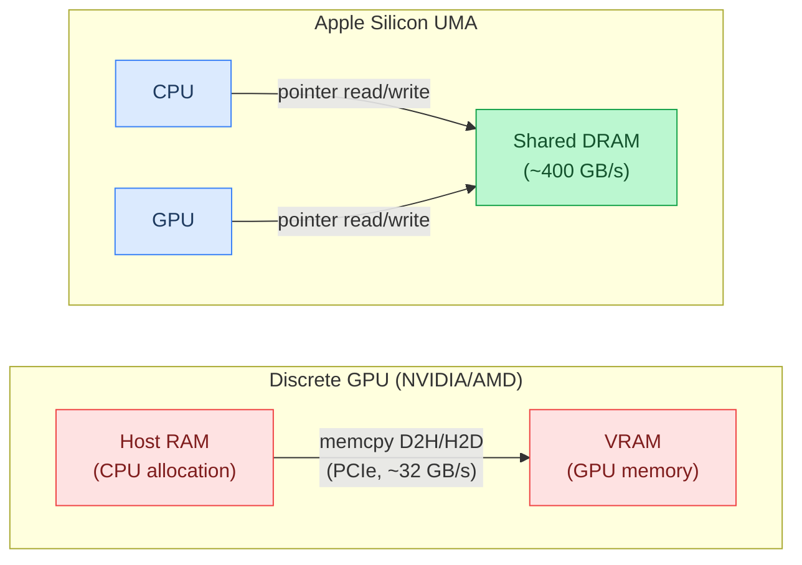
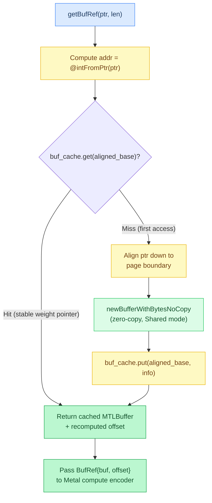
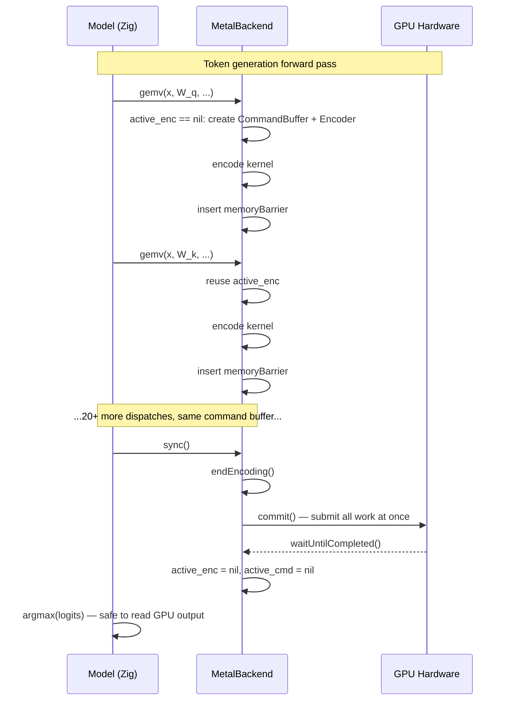
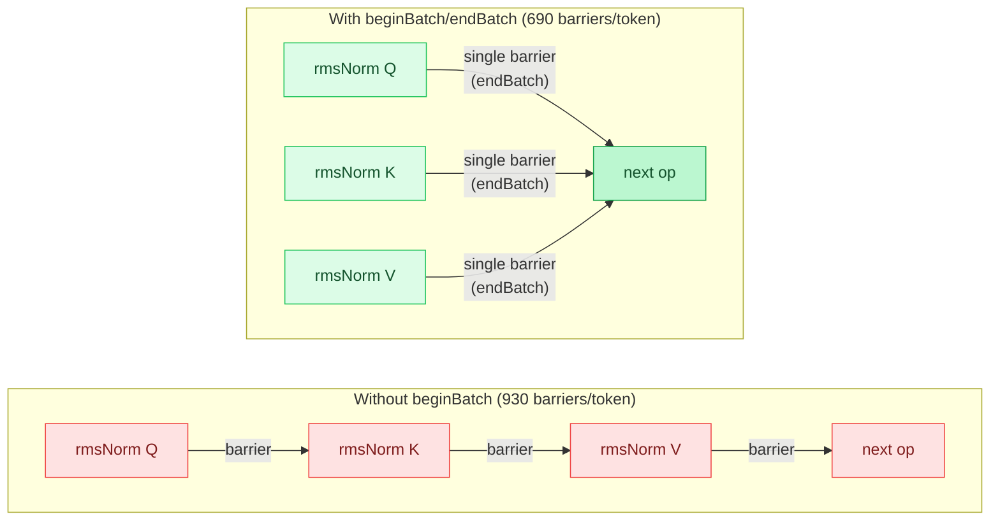
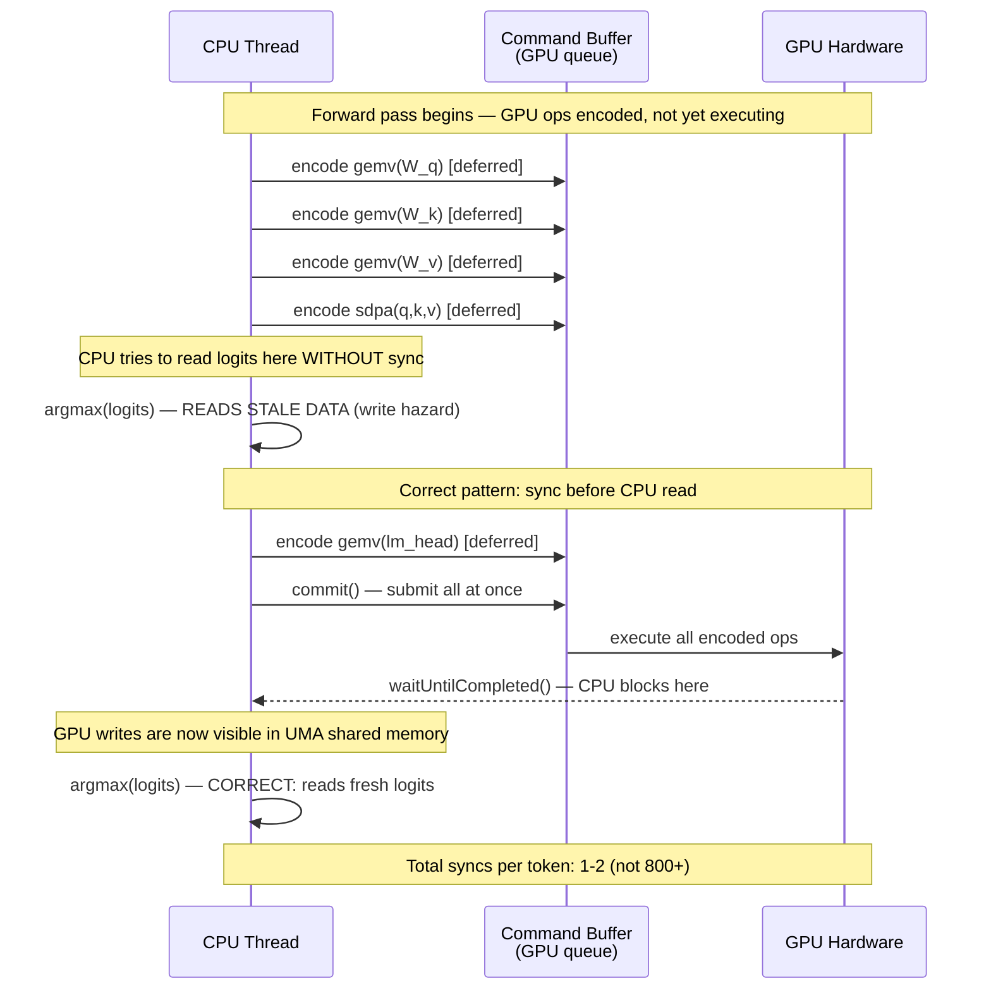
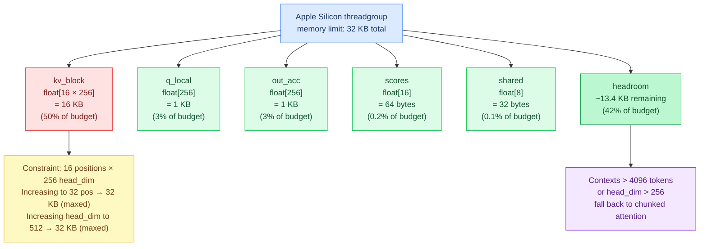
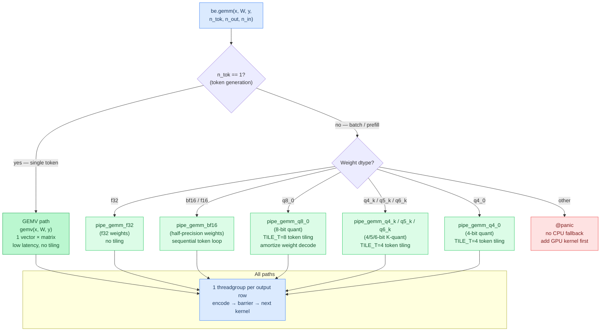
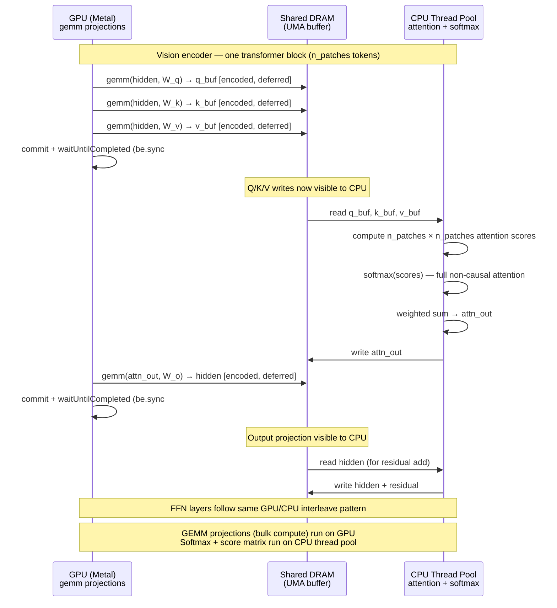
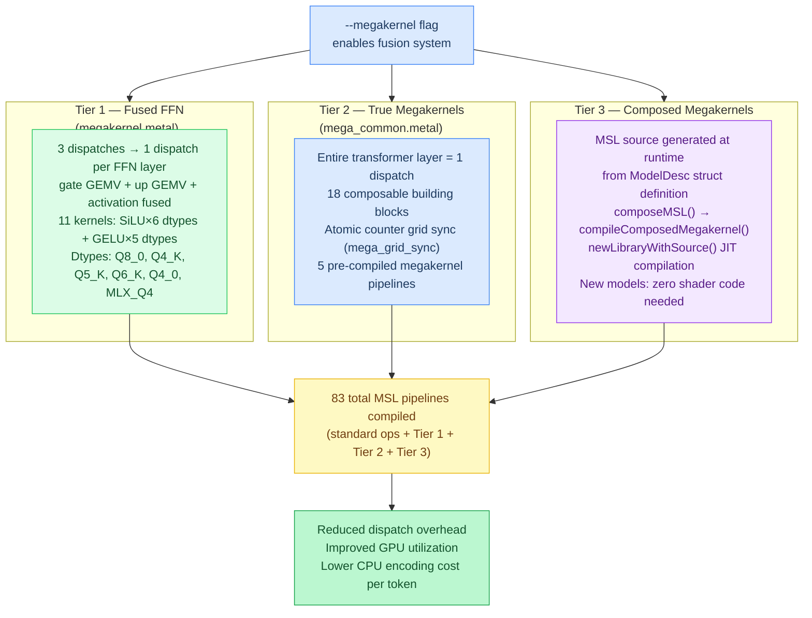

# Chapter 11: Metal Backend Internals

**Prerequisites:** [Chapter 8: Backends](08-backends.md) (UMA, dispatcher pattern)

**Time:** ~19 min

The Metal backend is Agave's primary GPU path on Apple Silicon. It's designed around **zero-copy UMA** (Unified Memory Architecture — CPU and GPU share the same physical RAM), **deferred dispatch** (batching operations without blocking), and **cache-aware resource management** (reusing GPU buffer wrappers to avoid ObjC allocation overhead).

## Unified Memory Architecture (UMA)

On Apple Silicon (M1, M2, M3, M4), the CPU and GPU share the **same physical DRAM** — there's no separate VRAM. This is different from discrete GPUs (NVIDIA, AMD) where data must be copied between host RAM and GPU memory.



**Implications:**

- **Zero-copy buffer wrapping:** CPU allocations can be used directly by the GPU via `MTLBuffer.newBufferWithBytesNoCopy()`
- **No D2H transfers:** When the GPU writes data, the CPU sees it immediately (after `sync()` flushes the command buffer)
- **Shared bandwidth:** CPU and GPU compete for the same memory bus (~400 GB/s on M4 Pro)

**Metal buffer creation:**

```objc
// Wrap existing CPU allocation (zero copy)
id<MTLBuffer> buffer = [device newBufferWithBytesNoCopy:ptr
                                                  length:len
                                                 options:MTLResourceStorageModeShared
                                             deallocator:nil];
```

**Storage modes:**

- `MTLResourceStorageModeShared` — CPU and GPU both access the same memory (UMA)
- `MTLResourceStorageModePrivate` — GPU-only (used for scratch buffers)
- `MTLResourceStorageModeManaged` — Discrete GPU mode (not used on Apple Silicon)

Agave wraps all model weights (mmap'd from GGUF/SafeTensors) and activation buffers as **shared** Metal buffers.

## Buffer Caching

Creating a `MTLBuffer` wrapper involves ObjC allocation and reference counting. Doing this **every dispatch** (800+ times per token) adds 10-15% overhead.

**Solution:** Cache `MTLBuffer` objects by their host pointer address.



### Cache Structure

```zig
const BufferInfo = struct {
    metal_buf: objc.id,  // MTLBuffer
    len: usize,
};

// Map: host pointer → Metal buffer wrapper
buf_cache: std.AutoHashMap(usize, BufferInfo)
```

### Lookup Pattern

```zig
fn getBufRef(self: *MetalBackend, ptr: [*]const u8, len: usize) BufRef {
    const addr = @intFromPtr(ptr);
    const aligned_base = addr & ~(page_size - 1);
    const offset = addr - aligned_base;

    // Check cache using aligned base address as key
    if (self.buf_cache.get(aligned_base)) |cached| {
        return BufRef{ .buf = cached.metal_buf, .offset = offset };
    }

    // Not cached: wrap from the aligned base (zero-copy)
    const aligned_ptr = @as([*]const u8, @ptrFromInt(aligned_base));
    const aligned_len = (offset + len + page_size - 1) & ~(@as(usize, page_size - 1));
    const buf = objc.msgSend(
        ?objc.id,
        self.device,
        objc.sel("newBufferWithBytesNoCopy:length:options:deallocator:"),
        .{ aligned_ptr, aligned_len, MTLResourceStorageModeShared, @as(?objc.id, null) },
    ) orelse @panic("Metal buffer creation failed");

    // Cache at aligned base for future use
    self.buf_cache.put(aligned_base, .{ .metal_buf = buf, .len = aligned_len }) catch {};

    return BufRef{ .buf = buf, .offset = offset };
}
```

**When to cache:**

- ✅ **Stable pointers:** mmap'd model weights, model activation buffers (allocated once at init)
- ❌ **Temporary allocations:** Scratch buffers that get freed and reallocated

### Page Alignment Requirement

`newBufferWithBytesNoCopy` requires the pointer to be **page-aligned** (multiple of 16384 bytes (16 KB) on Apple Silicon (aarch64 macOS)). If you pass a mid-page pointer, buffer creation fails.

**Workaround:** Wrap the **entire page range** and use an offset:

```zig
const page_size = std.heap.page_size_min; // 16384 on Apple Silicon
const page_mask = ~(page_size - 1);

const page_base = @intFromPtr(ptr) & page_mask;  // Round down to page boundary
const offset = @intFromPtr(ptr) - page_base;     // Offset within page

const aligned_ptr = @as([*]const u8, @ptrFromInt(page_base));
const aligned_len = (offset + len + page_size - 1) & ~(page_size - 1);

const buf = device.newBufferWithBytesNoCopy(aligned_ptr, aligned_len, ...);

return BufRef{ .buf = buf, .offset = offset };
```

**Example:**

- Pointer: `0x100008800` (not page-aligned, within a 16384-byte page)
- Page base: `0x100004000` (aligned to 16384)
- Offset: `0x4800` (18432 bytes into the page)
- Metal sees: buffer starting at `0x100004000`, length = rounded up to next 16 KB boundary
- Kernel access: `buffer[offset + idx]` to skip the leading bytes

**Cost:** Negligible — Metal doesn't copy the page, just references it with an offset.

## Command Buffer Batching

Metal kernels are dispatched via **command buffers** — sequences of GPU operations that execute together. Creating a new command buffer for every kernel would serialize execution and waste CPU time.

**Pattern:** Maintain a **persistent command buffer** and **compute encoder** across multiple dispatches.



### Active Command Buffer State

```zig
pub const MetalBackend = struct {
    queue: objc.id,               // MTLCommandQueue
    active_cmd: ?objc.id = null,  // MTLCommandBuffer
    active_enc: ?objc.id = null,  // MTLComputeCommandEncoder
    // ...
};
```

### Encode Pattern

```zig
fn encode(self: *MetalBackend, pipeline: objc.id, buffers: []BufRef, grid: Grid) void {
    // Create command buffer + encoder on first dispatch
    if (self.active_enc == null) {
        self.active_cmd = objc.msgSend(?objc.id, self.queue, objc.sel("commandBuffer"), .{})
            orelse @panic("Metal command buffer creation failed");

        self.active_enc = objc.msgSend(?objc.id, self.active_cmd.?, objc.sel("computeCommandEncoder"), .{})
            orelse @panic("Metal compute encoder creation failed");
    }

    const enc = self.active_enc.?;

    // Set pipeline state
    objc.msgSend(void, enc, objc.sel("setComputePipelineState:"), .{pipeline});

    // Set buffers
    for (buffers, 0..) |buf_ref, i| {
        objc.msgSend(void, enc, objc.sel("setBuffer:offset:atIndex:"), .{
            buf_ref.buf,
            buf_ref.offset,
            @as(c_ulong, i),
        });
    }

    // Dispatch threadgroups
    objc.msgSend(void, enc, objc.sel("dispatchThreadgroups:threadsPerThreadgroup:"), .{
        grid.threadgroups,
        grid.threads_per_group,
    });

    // Insert memory barrier (unless in batch mode)
    if (!self.batch_mode) {
        objc.msgSend(void, enc, objc.sel("memoryBarrierWithScope:"), .{
            MTLBarrierScopeBuffers,
        });
    }
}
```

**Key points:**

- **Lazy creation:** Command buffer + encoder created on first `encode()` call
- **Persistent encoder:** Stays open across multiple kernel dispatches
- **Memory barriers:** Inserted between dispatches to ensure writes are visible to subsequent reads

### Flush (Commit and Wait)

```zig
fn flush(self: *MetalBackend) void {
    if (self.active_enc) |enc| {
        // End encoding
        objc.msgSend(void, enc, objc.sel("endEncoding"), .{});

        // Commit command buffer (submits to GPU)
        objc.msgSend(void, self.active_cmd.?, objc.sel("commit"), .{});

        // Wait for completion
        objc.msgSend(void, self.active_cmd.?, objc.sel("waitUntilCompleted"), .{});

        // Clear state
        self.active_enc = null;
        self.active_cmd = null;
    }
}
```

**When to flush:**

- **Before CPU reads GPU data:** `be.sync()` calls `flush()` before argmax, embedding lookup, etc.
- **Not after every dispatch:** Batching is the whole point

**Example:** Forward pass for one token (20+ dispatches) uses **1 command buffer**, flushed once at the end before argmax.

## Batch Mode: Suppressing Intermediate Barriers

Metal's memory barrier (`memoryBarrierWithScope`) ensures write visibility but **serializes execution** — the GPU must finish all prior work before starting the next kernel.

**Problem:** Independent operations (e.g., normalizing Q and K in parallel) don't need a barrier between them.

**Solution:** `beginBatch()` / `endBatch()` to suppress barriers and insert one at the end.



### API

```zig
pub fn beginBatch(self: *MetalBackend) void {
    self.batch_mode = true;
}

pub fn endBatch(self: *MetalBackend) void {
    self.batch_mode = false;
    if (self.active_enc) |enc| {
        objc.msgSend(void, enc, objc.sel("memoryBarrierWithScope:"), .{
            MTLBarrierScopeBuffers,
        });
    }
}
```

### Usage Example

```zig
// Normalize Q and K in parallel (independent operations)
be.beginBatch();
  be.rmsNormMulti(q_buf, norm_w, nh_q, hd, eps);  // No barrier after
  be.rmsNormMulti(k_buf, norm_w, nh_kv, hd, eps); // No barrier after
be.endBatch();  // Single barrier here

// vs sequential (default):
be.rmsNormMulti(q_buf, norm_w, nh_q, hd, eps);  // Barrier after
be.rmsNormMulti(k_buf, norm_w, nh_kv, hd, eps); // Barrier after
```

**Impact:**

- **Qwen3.5:** Reduced barriers from 930 → 690 per token
- **Throughput change:** 0% (Apple Silicon GPUs overlap work even with barriers — they're essentially free)

**Why track it anyway?**

- **Diagnostics:** Profiling counters show barrier count (`--profile` flag)
- **Future platforms:** On some GPUs (Intel, older AMD), barriers are expensive
- **Documentation:** Makes the independence explicit in the code

## Deferred Dispatch Contract

**Key principle:** GPU operations are **deferred** — they're encoded into the command buffer but don't execute immediately.

**Implications:**

1. **No sync after every dispatch:** Models call `be.sync()` only when CPU needs GPU data
2. **Host pointers must stay valid:** Buffers referenced in the command buffer must not be freed until the buffer commits
3. **Stale reads without sync:** CPU reads of GPU-written data see old values until `sync()` flushes

### Example: Argmax After Logits

```zig
// Compute logits on GPU (deferred)
be.gemv(x, lm_head, logits, vocab_size, n_embd);

// WRONG: Read logits on CPU immediately (stale data!)
const token = argmax(logits);  // Reads old logits, not the new ones!

// CORRECT: Sync first to flush GPU writes
be.sync();  // Commit command buffer, wait for completion
const token = argmax(logits);  // Now reads the correct logits
```

### Sync Points in Forward Pass

For a typical model forward pass:

1. **Embedding lookup:** `be.sync()` before CPU reads embedding table (GPU may have written it)
2. **... (all layers run on GPU, no sync)**
3. **Final argmax:** `be.sync()` before CPU reads logits

**Total syncs per token:** 1-2 (depending on whether embedding is GPU-resident).

**Optimization:** Qwen3.5 eliminated 16 syncs/token by moving Q/gate split from CPU (memcpy) to GPU (kernel) → 15% throughput gain.

### Deferred Dispatch Timeline



## Threadgroup Memory Limits

Metal has a **per-threadgroup memory limit** of 32 KB on Apple Silicon. If your kernel allocates more, pipeline creation **fails silently** (returns `nil` without logging an error).

### Debugging Pipeline Creation

```zig
fn makePipeline(self: *MetalBackend, name: [*:0]const u8) !objc.id {
    const fn_name = objc.msgSend(?objc.id, NSString, objc.sel("stringWithUTF8String:"), .{
        name,
    }) orelse return error.StringFailed;

    const function = objc.msgSend(?objc.id, self.library, objc.sel("newFunctionWithName:"), .{fn_name})
        orelse {
            std.log.err("Metal kernel not found: {s}", .{name});
            return error.KernelNotFound;
        };

    var err: ?objc.id = null;
    const pipeline = objc.msgSend(?objc.id, self.device, objc.sel("newComputePipelineStateWithFunction:error:"), .{
        function,
        @as(*?objc.id, &err),
    }) orelse {
        if (err) |e| {
            const desc = objc.msgSend(?objc.id, e, objc.sel("localizedDescription"), .{});
            if (desc) |d| {
                const utf8 = objc.msgSend([*:0]const u8, d, objc.sel("UTF8String"), .{});
                std.log.err("Metal pipeline creation error: {s}", .{utf8});
            }
        }
        return error.PipelineFailed;
    };

    return pipeline;
}
```

**Key:** Check the error object and log `localizedDescription` to see the actual Metal error (often "threadgroup memory exceeded").

### SDPA Threadgroup Memory Budget

Example from `src/backend/kernels/metal/sdpa.metal`:

```metal
kernel void sdpa(
    // ...
) {
    threadgroup float q_local[256];              // 1 KB (sdpa_max_head_dim)
    threadgroup float kv_block[16 * 256];        // 16 KB (sdpa_block_size × sdpa_max_head_dim)
    threadgroup float scores[16];                // 64 bytes (sdpa_block_size)
    threadgroup float out_acc[256];              // 1 KB (sdpa_max_head_dim)
    threadgroup float shared[8];                 // 32 bytes (SIMD group reduction scratch)

    // Total: 1024 + 16384 + 64 + 1024 + 32 = 18.5 KB (fits under 32 KB)
}
```

**Constraints:**

- `kv_block` size determines `max_seq_len` and `max_head_dim`
- 16 positions × 256 head_dim = 16 KB (half the budget)
- Increasing to 32 positions → 32 KB (no room for other vars)
- Increasing `max_head_dim` to 512 → 32 KB (also maxed out)

**Trade-off:** Agave caps SDPA at 4096 seq_len, 256 head_dim to fit in 32 KB. Larger contexts fall back to chunked attention.

### Threadgroup Memory Budget Breakdown



## Profiling Counters

The Metal backend tracks dispatch/barrier/sync counts when `profile_counters` is enabled (via `--profile` flag).

```zig
pub const MetalBackend = struct {
    dispatch_count: u32 = 0,
    barrier_count: u32 = 0,
    sync_count: u32 = 0,
    profile_counters: bool = false,
    // ...
};

fn encode(...) void {
    // ... dispatch kernel ...
    if (self.profile_counters) self.dispatch_count += 1;
}

fn flush(...) void {
    // ... commit and wait ...
}

fn sync(...) void {
    self.flush();
    if (self.profile_counters) self.sync_count += 1;
}
```

**Usage:**

```bash
./zig-out/bin/agave model.gguf --profile "Test prompt"
# Output per token:
# Metal: 994 dispatches, 690 barriers, 18 syncs
```

**Optimization insights:**

- High sync count → CPU/GPU ping-pong (move work to GPU or batch better)
- High barrier count → opportunity for batch mode (if operations are independent)
- Dispatch count × kernel overhead → lower bound on latency

**Example:** Qwen3.5 reduced sync count from 18 → 1 per token by moving Q/gate split to GPU → 15% faster.

## BF16 GEMM Kernel

The Metal backend includes a `gemm_bf16` kernel (in `gemm.metal`) for batched matrix multiplications with bf16 or f16 weights. It is used in two contexts:

1. **Vision encoder:** The vision encoder's linear projections (Q, K, V, FFN) use batched GEMM since they process all patches simultaneously (e.g., 256 patches for a 768x768 image). The `gemm()` function dispatches to `gemm_bf16` when weights are bf16 or f16.

2. **Batched prefill:** During chunked prefill, multiple prompt tokens are processed together. Each chunk's linear projections use GEMM instead of per-token GEMV.

```zig
// src/backend/metal.zig — GEMM dtype dispatch
pub fn gemm(self: *MetalBackend, x: [*]const f32, w: TensorData, y: [*]f32,
            n_tok: usize, n_out: usize, n_in: usize) void {
    if (n_tok <= 1) {
        self.gemv(x, w, y, n_out, n_in);  // Single token → GEMV
        return;
    }
    const pipeline: objc.id = switch (w.dtype) {
        .f32 => self.pipe_gemm_f32,
        .bf16, .f16 => self.pipe_gemm_bf16,
        .q8_0 => self.pipe_gemm_q8_0,
        .q4_0 => self.pipe_gemm_q4_0,
        .q4_k => self.pipe_gemm_q4_k,
        .q5_k => self.pipe_gemm_q5_k,
        .q6_k => self.pipe_gemm_q6_k,
        else => @panic("Metal GEMM: unsupported dtype — add GPU kernel"),
    };
    // ... encode dispatch with one threadgroup per output row
}
```

Each threadgroup handles one output row. The bf16 variant processes tokens sequentially without token tiling; token tiling is used in the quantized GEMM kernels (Q8_0 uses `TILE_T=8`, Q4_K uses `TILE_T=4`) to amortize weight loads across multiple input vectors.

### GEMM vs GEMV Dispatch Decision Tree



## Vision Encoder GPU Acceleration

When a vision encoder (mmproj) is loaded, its transformer blocks run on the GPU via the standard `gemm()` dispatch. The vision encoder calls `be.gemm()` for all linear projections (Q/K/V/O, FFN up/gate/down, output projection), which dispatches to the appropriate Metal kernel based on weight dtype — f32, bf16, q8_0, q4_0, q4_k, q5_k, or q6_k.

The key synchronization pattern: `be.sync()` is required between GPU GEMM operations and CPU operations (like softmax or activation functions that run on the CPU thread pool). Without it, the CPU reads stale data from shared UMA memory.



This interleaving is necessary because the vision encoder uses full (non-causal) attention with `n_patches x n_patches` score matrices, which currently runs on the CPU. The GEMM projections — the bulk of the compute — run on the GPU.

## Best Practices

### Resource Management

1. **Cache stable buffers:** mmap'd weights, activation buffers
2. **Don't cache temps:** Scratch allocations with varying lifetimes
3. **Pre-allocate at init:** Command queue, pipelines, scratch buffers

### Dispatch Efficiency

1. **Batch independent ops:** Use `beginBatch()` / `endBatch()` to suppress intermediate barriers
2. **Minimize syncs:** Only sync when CPU needs GPU data
3. **Fuse kernels:** Combine sequential ops (e.g., `addRmsNorm`) to reduce dispatches
4. **Megakernel pipelines:** The `--megakernel` flag enables a three-tier fusion system. **Tier 1** (fused FFN) combines gate GEMV + up GEMV + activation into a single dispatch (3->1 per FFN layer) via 11 kernels in `megakernel.metal` (SiLU x {Q8_0, Q4_K, Q5_K, Q6_K, Q4_0, MLX_Q4} + GELU x {Q8_0, Q4_K, Q5_K, Q6_K, Q4_0}). **Tier 2** (true megakernels) executes entire transformer layers in a single dispatch using 18 composable building blocks in `mega_common.metal` with atomic counter grid sync (`mega_grid_sync`). **Tier 3** (composed megakernels) auto-generates model-specific MSL at runtime via `mega_compose.zig`: the `composeMSL()` function produces MSL source from a `ModelDesc` struct, then `compileComposedMegakernel()` compiles it via `newLibraryWithSource`. This enables megakernel support for new models without writing any shader code -- just a `ModelDesc` definition. The Metal backend compiles **83 MSL pipelines** total (standard ops + fused FFN + 5 true megakernels + 1 runtime-composed). See [Chapter 13](13-batched-dispatch-and-fusion.md) for details.



### Debugging

1. **Log pipeline errors:** Check `localizedDescription` on creation failure
2. **Profile counters:** Enable `--profile` to see dispatch/barrier/sync counts
3. **Validate threadgroup memory:** Sum all `threadgroup` vars, ensure < 32 KB

### UMA-Specific

1. **Wrap, don't copy:** Use `newBufferWithBytesNoCopy` for CPU allocations
2. **Shared storage mode:** Always use `MTLResourceStorageModeShared` on Apple Silicon
3. **Page alignment:** Handle mid-page pointers with base+offset pattern

## Performance (from BENCHMARKS.md)

Measured 2026-03-24 on Apple M4 Pro (14-core CPU, 20-core GPU), full methodology in [BENCHMARKS.md](../BENCHMARKS.md).

| Claim | Source |
|-------|--------|
| Agave is 1.2-1.7x faster than llama.cpp on Metal for decode on supported quant formats | BENCHMARKS Decode Throughput, Notes |
| Qwen3.5 9B Q8_0 Metal decode: 41.7 tok/s vs llama.cpp Metal 25.0 tok/s (1.67x) | BENCHMARKS Decode Throughput, M4 Pro |
| Gemma 3 12B Q8_0 Metal decode: 22.3 tok/s vs llama.cpp Metal 18.7 tok/s (1.19x) | BENCHMARKS Decode Throughput, M4 Pro |
| Qwen3.5 0.8B Q8_0 Metal decode: 125 tok/s (sparse GEMV + Accelerate.framework, updated 2026-05-26) | BENCHMARKS Decode Throughput, M4 Pro |

## Gotchas

**Threadgroup memory failures are silent.** Metal's `newComputePipelineStateWithFunction:error:` returns `nil` when a kernel's `threadgroup` variables exceed the 32 KB per-threadgroup limit on Apple Silicon, but nothing about that call raises an exception or prints a message on its own. `makePipeline()` (shown above) only surfaces the real cause because it explicitly reads the returned `NSError` and logs `localizedDescription` before returning `error.PipelineFailed`. Skip that check, or catch the error generically without inspecting it, and pipeline creation looks like it "just failed" with no clue that a `threadgroup` array was the reason. The SDPA kernel lives right at this edge: `q_local + kv_block + out_acc + scores + shared` must stay under 32 KB, and `kv_block` (16 KB for `sdpa_block_size x sdpa_max_head_dim`) is both the largest contributor and the first one to blow the budget if `max_seq_len` or `head_dim` grow.

---

**In the code:** [src/backend/metal.zig](../../src/backend/metal.zig) (full implementation), [src/backend/kernels/metal/*.metal](../../src/backend/kernels/metal/) (MSL kernels), [src/backend/objc.zig](../../src/backend/objc.zig) (Objective-C bindings)

**Related:** [Metal Shading Language Specification](https://developer.apple.com/metal/Metal-Shading-Language-Specification.pdf), [Metal Programming Guide (archived)](https://developer.apple.com/library/archive/documentation/Miscellaneous/Conceptual/MetalProgrammingGuide/), [Metal Documentation](https://developer.apple.com/documentation/metal)

**Next:** [Chapter 12: CPU Parallelism →](12-cpu-parallelism.md) | **Back:** [Chapter 10: Memory Safety ←](10-memory-safety.md) | **Product docs:** [Architecture](../ARCHITECTURE.md)

---

## Glossary

**batch mode** — A Metal backend mode (`beginBatch`/`endBatch`) that suppresses intermediate memory barriers between independent operations.

**BufRef** — A struct containing a Metal buffer object and a byte offset, referencing sub-regions within a page-aligned buffer.

**buffer caching** — Storing MTLBuffer wrappers keyed by host pointer to avoid repeated ObjC allocation overhead.

**command buffer batching** — Maintaining a persistent command buffer and encoder across dispatches, committing all work at once.

**memory barrier** — A GPU synchronization primitive ensuring write visibility between kernel dispatches.

**ModelDesc** — A struct describing model architecture used by `mega_compose.zig` to auto-generate megakernel MSL.

**page alignment** — The requirement that `newBufferWithBytesNoCopy` pointers be aligned to 16 KB page boundaries on Apple Silicon.

**profiling counters** — Runtime counters (dispatch_count, barrier_count, sync_count) tracked when `--profile` is enabled.

**threadgroup memory** — Fast on-chip shared memory accessible by all threads in a threadgroup; limited to 32 KB on Apple Silicon.

**token tiling** — GEMM optimization where multiple input tokens share a single weight load (e.g., TILE_T=8 for Q8_0).

**zero-copy buffer wrapping** — Creating a Metal GPU buffer that references existing CPU memory without copying data, via `newBufferWithBytesNoCopy`.
