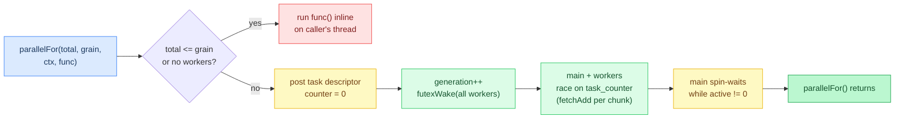
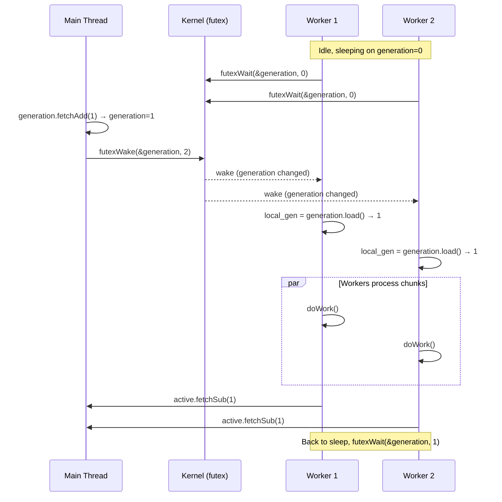
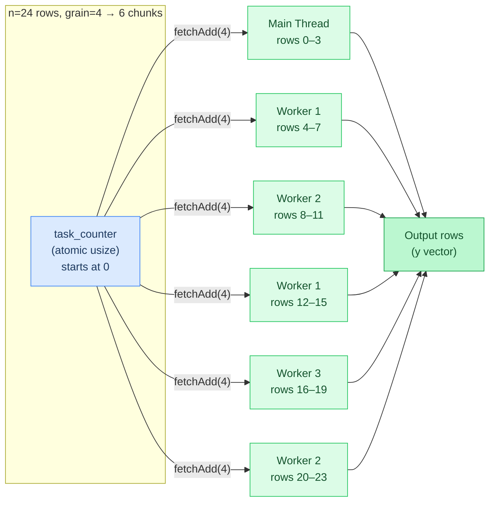
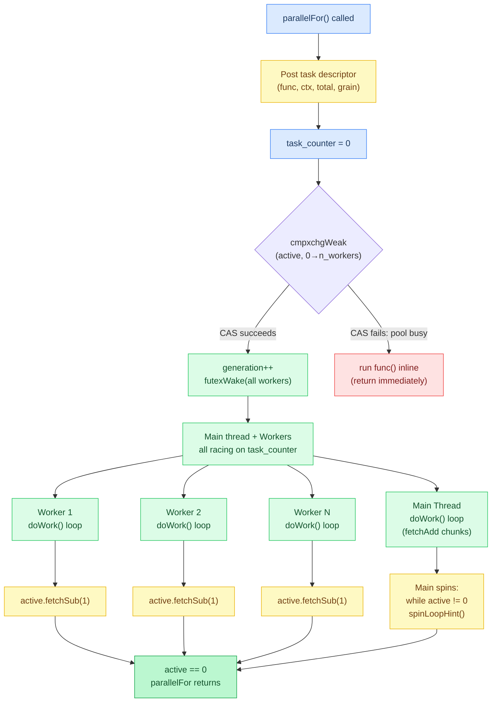
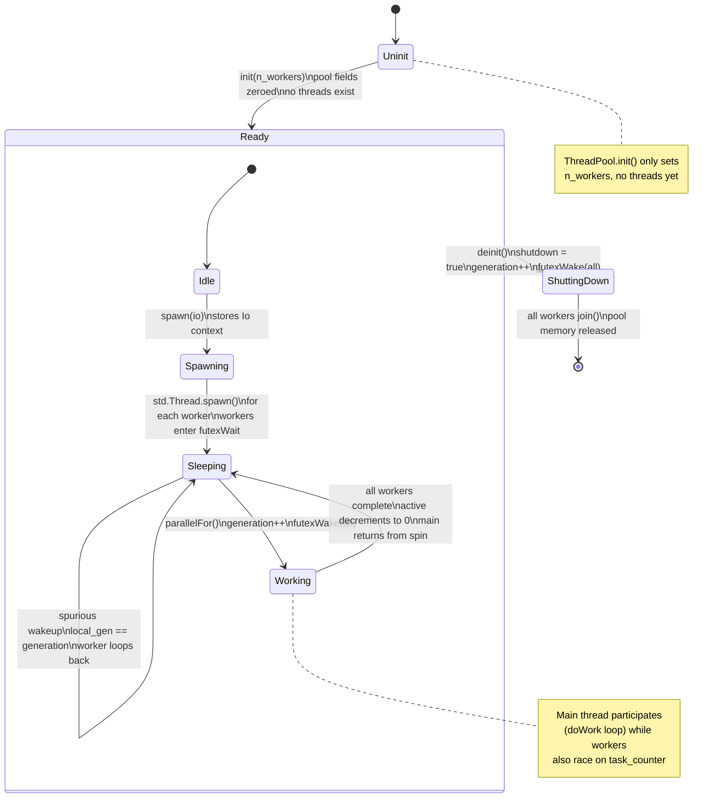
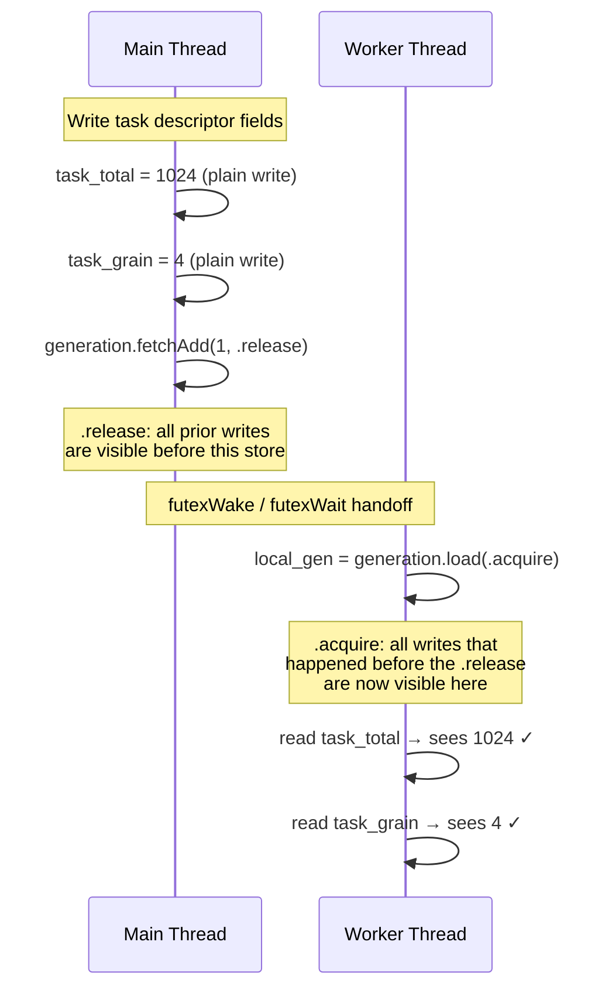
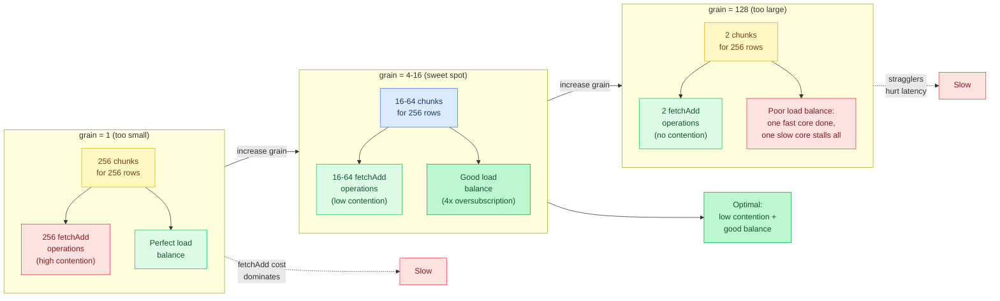
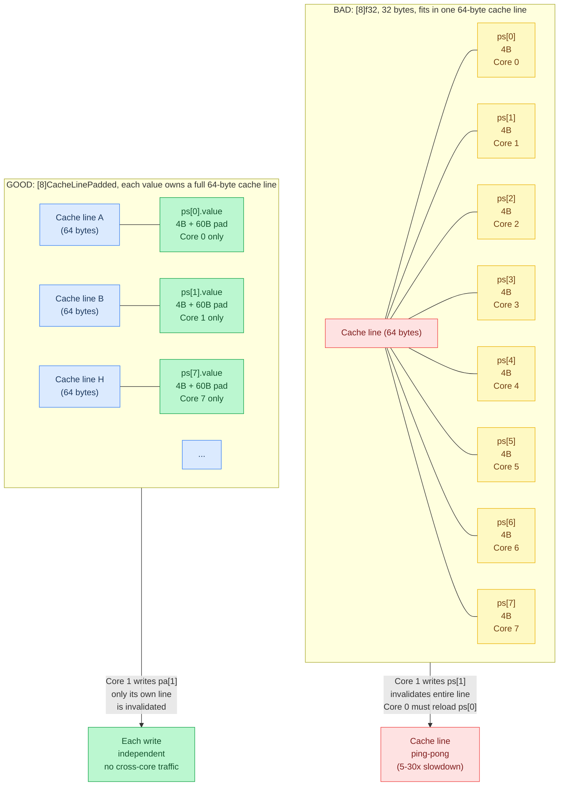

# Chapter 12: CPU Parallelism

**Prerequisites:** [Chapter 9: CPU SIMD Optimization](09-cpu-simd-optimization.md) (the single-threaded GEMV loop this chapter parallelizes)

**Time:** ~15 min

> After this chapter you can explain the futex-based thread pool, `parallelFor`, and why the main thread participates in work.

Modern CPUs have 4-64 cores. A single-threaded GEMV can only saturate one core's memory bandwidth (~10-20 GB/s). The total system bandwidth is much higher (~100-400 GB/s). **Threading unlocks the full bandwidth.**

Agave uses a lightweight **futex-based thread pool** that wakes workers on demand, distributes work via an atomic counter, and has the main thread participate instead of just waiting.

## Code Flow



One `parallelFor` call: post the work descriptor, bump the generation counter to wake sleeping workers, then the main thread joins the same atomic-counter race instead of idling. No thread is ever spawned per call; workers are created once at pool startup and sleep between calls. The rest of this chapter builds up to and past that loop.

## Why Not Just Spawn Threads?

```text
BAD: spawn a thread per operation
for row in 0..n_rows:
    thread = Thread.spawn(gemvRow, row)
    thread.join()
```

**Implementation:** the pool-based alternative that avoids this cost lives in [src/thread_pool.zig](../../src/thread_pool.zig); there is no per-call spawn anywhere in that file.

**Problems:**

1. **Thread creation overhead:** 10-50 µs per spawn (GEMV row takes 1-5 µs)
2. **No work sharing:** Fixed assignment, poor load balancing
3. **Main thread idle:** Wastes a core

**Better:** Maintain a **persistent pool** of worker threads that sleep when idle and wake on demand.

## Futex-Based Sleep/Wake

A **futex** (fast userspace mutex) is a kernel primitive that lets threads sleep/wake efficiently:

- **`futexWait(addr, expected)`**: Sleep until `*addr != expected`
- **`futexWake(addr, n)`**: Wake up to `n` threads waiting on `addr`

**Cost:** ~1-2 µs to wake a sleeping thread (vs 50+ µs to spawn a new thread).



In Zig 0.16, futex operations go through the `Io` context (threaded from `main(Init)` via `init.io`). The thread pool stores `io` at spawn time and uses `io.futexWaitUncancelable()` / `io.futexWake()` instead of the old `std.Thread.Futex` API.

### Generation Counter Pattern

```text
ThreadPool fields:
  generation: atomic u32 = 0
  io: Io                       # stored at spawn() time

Post work (main thread):
  generation.fetchAdd(1, release)       # bump generation
  io.futexWake(&generation, n_workers)  # wake all workers

Worker loop:
  local_gen = 0
  loop:
    io.futexWaitUncancelable(&generation, local_gen)
    new_gen = generation.load(acquire)
    if new_gen == local_gen: continue   # spurious wakeup
    local_gen = new_gen
    ... do work ...
```

**Implementation:** [src/thread_pool.zig](../../src/thread_pool.zig) (`ThreadPool.generation`, `workerLoop`).

**Key insight:** Workers sleep on the `generation` variable. When new work arrives, the main thread bumps `generation` and wakes all workers. Workers see the new value and start processing.

**Why `local_gen` starts at 0?** Late-starting workers (thread creation is async) will see a non-zero `generation` immediately and proceed without missing the wake.

## Work Distribution: Atomic Counter

Instead of pre-assigning rows to threads, use an **atomic counter** that threads increment to grab the next chunk. Each thread races to claim the next available chunk by atomically advancing the counter, no coordinator needed.



```text
ThreadPool fields:
  task_counter: atomic usize = 0
  task_total: usize = n_rows
  task_grain: usize = 4          # rows per chunk

doWork(pool):
  loop:
    start = task_counter.fetchAdd(task_grain, monotonic)
    if start >= task_total: break         # no more work
    end = min(start + task_grain, task_total)
    for row in start..end:
      gemvRow(row)
```

**Implementation:** [src/thread_pool.zig](../../src/thread_pool.zig) (`doWork`).

**Benefits:**

- **Dynamic load balancing:** Fast threads grab more chunks
- **No synchronization barrier:** Threads grab work independently
- **Cache-friendly:** Consecutive rows processed together (grain size)

**Grain size:** Too small = contention on `task_counter`. Too large = poor load balancing. Sweet spot: 4-16 rows for GEMV.

## Main Thread Participation

The main thread should **not** just wait, it should do work too. Instead of sitting idle while workers run, it joins the counter race and takes chunks like any other thread, then spin-waits for the stragglers.



```text
parallelFor(pool, total, grain, ctx, func):
  task_counter.store(0, release)
  if active.cmpxchgWeak(0, n_workers, acq_rel, monotonic) is Some(still_active):
    log.err("concurrent parallelFor detected, running inline")
    func(ctx, 0, total)
    return

  generation.fetchAdd(1, release)
  io.futexWake(&generation, n_workers)

  pool.doWork()                          # main thread participates

  while active.load(acquire) != 0:
    spinLoopHint()                       # hint CPU to save power during spin
```

**Implementation:** [src/thread_pool.zig](../../src/thread_pool.zig) (`parallelFor`).

**Why participate?** If you have 8 cores and spawn 7 worker threads, the main thread sitting idle wastes 1/8 of your compute power.

**Why spin-wait?** GEMV chunks are microsecond-scale. Futex wait/wake would add 1-2 µs overhead per operation, comparable to the work itself. Spinning is simpler and faster for short waits.

## Thread Pool Lifecycle



## Full Thread Pool Implementation

The full struct ties every piece above together: task descriptor fields, the generation counter, the active-worker count, and the shutdown flag.

```text
ThreadPool struct (fields):
  workers: [max_workers]Worker
  n_workers: usize
  io: Io                                    # stored at spawn() for futex ops

  task_func, task_ctx, task_total, task_grain
  task_counter: atomic usize                # hottest field, cache-line padded
                                             # so generation/active don't share
                                             # its line and cause cross-core
                                             # invalidation

  generation: atomic u32
  active: atomic u32
  shutdown: atomic bool

init(n): n_workers = min(n, max_workers)

spawn(io):
  self.io = io
  for i in 0..n_workers:
    workers[i] = Thread.spawn(workerLoop, self)
    # on spawn failure: shrink n_workers to i, stop

deinit():
  shutdown.store(true, release)
  generation.fetchAdd(1, release)
  io.futexWake(&generation, n_workers)
  for each worker: thread.join()

parallelFor(total, grain, ctx, func):
  if total == 0: return
  effective_grain = max(grain, min_grain)
  if n_workers == 0 or total <= effective_grain:
    func(ctx, 0, total)                     # too small, run inline
    return
  task_counter.store(0, release)
  if active.cmpxchgWeak(0, n_workers, acq_rel, monotonic) is Some(still_active):
    log.err("concurrent parallelFor detected, running inline")
    func(ctx, 0, total)
    return
  task_func, task_ctx = func, ctx
  task_total, task_grain = total, effective_grain
  generation.fetchAdd(1, release)
  io.futexWake(&generation, n_workers)
  doWork()                                  # main thread participates
  while active.load(acquire) != 0: spinLoopHint()

doWork():
  loop:
    start = task_counter.fetchAdd(task_grain, monotonic)
    if start >= task_total: break
    end = min(start + task_grain, task_total)
    task_func(task_ctx, start, end)

workerLoop(pool):
  local_gen = 0
  loop:
    io.futexWaitUncancelable(&generation, local_gen)
    if shutdown.load(acquire): return
    new_gen = generation.load(acquire)
    if new_gen == local_gen: continue        # spurious wakeup
    local_gen = new_gen
    pool.doWork()
    active.fetchSub(1, release)
```

**Implementation:** [src/thread_pool.zig](../../src/thread_pool.zig) (full `ThreadPool` struct: `init`, `spawn`, `deinit`, `parallelFor`, `doWork`, `workerLoop`).

## Usage Example: Parallel GEMV

```text
GemvCtx: { x, w, y (pointers), k }

gemvRows(ctx, start, end):
  for row in start..end:
    acc = 0.0
    roff = row * ctx.k
    for j in 0..ctx.k:
      acc += ctx.w[roff + j] * ctx.x[j]
    ctx.y[row] = acc

gemvParallel(pool, x, w, y, n, k):
  ctx = GemvCtx{x, w, y, k}
  pool.parallelFor(n, grain=4, &ctx, gemvRows)
```

**Implementation:** [src/backend/cpu.zig](../../src/backend/cpu.zig) (parallel GEMV dispatch through `ThreadPool.parallelFor`).

**Performance:** On an 8-core CPU, this achieves ~6-7× speedup (not 8× due to memory bandwidth saturation and atomic contention).

## Memory Ordering

Atomic operations have different **memory ordering** guarantees. The key question is: when one thread writes data and another reads it, how do you ensure the reader sees the writer's writes?



### .monotonic

No synchronization, just atomicity. Use for counters: `task_counter.fetchAdd(grain, .monotonic)`.

**Why monotonic?** The counter value doesn't synchronize memory, it's just work assignment. Workers don't need to see other threads' writes.

### .acquire / .release

**Release** (store): All prior writes become visible before this store.
**Acquire** (load): All subsequent reads see writes that happened before the release.

Use for **handoff** between threads:

```text
Main thread (release):
  task_total = total
  task_grain = grain
  generation.fetchAdd(1, release)      # all prior writes now visible

Worker thread (acquire):
  local_gen = generation.load(acquire) # sees all writes before the release
  # now safe to read task_total, task_grain
```

**Implementation:** [src/thread_pool.zig](../../src/thread_pool.zig) (`parallelFor` release side, `workerLoop` acquire side).

### .seq_cst (Sequential Consistency)

Strongest guarantee, all threads see the same order of operations. **Slowest**, use only when necessary.

Agave doesn't use `.seq_cst`, acquire/release is sufficient for thread pool handoff.

## Tuning Parameters

### Number of Workers

`n_workers = Thread.getCpuCount() - 1`, leaving one core for the main thread.

**Implementation:** [src/backend/backend.zig](../../src/backend/backend.zig) (`BackendState.init`).

**Why n-1?** Main thread participates, so total threads = `n_workers + 1`.

### Grain Size

`min_grain = 4` rows per chunk (module-level constant in [src/thread_pool.zig](../../src/thread_pool.zig)).

**Heuristic:** `grain = max(min_grain, n_rows / (n_threads * 4))`

- Too small → atomic contention
- Too large → poor load balancing
- 4× oversubscription → good load balance



### Inline Threshold

```text
if total <= effective_grain:
    func(ctx, 0, total)   # run inline, skip threading overhead
    return
```

**Implementation:** [src/thread_pool.zig](../../src/thread_pool.zig) (`parallelFor` early-return branch).

**Why?** For tiny work (< 4 rows), threading overhead dominates. Faster to run inline.

## Gotchas

### Pitfall 1: Shared Mutable State

```text
BAD: race condition
sum: f32 = 0
pool.parallelFor(n, grain, &sum, func)

func(ctx, start, end):
  for i in start..end:
    sum.* += data[i]     # WRONG: multiple threads writing the same memory
```

**Fix:** Use thread-local accumulators, then reduce:

```text
GOOD: thread-local accumulators
SumCtx: { data, partial_sums, grain }

func(ctx, start, end):
  thread_id = start / ctx.grain
  local_sum = 0.0
  for i in start..end:
    local_sum += ctx.data[i]
  ctx.partial_sums[thread_id] = local_sum

# Then reduce on main thread
total = 0.0
for ps in partial_sums: total += ps
```

### Pitfall 2: False Sharing

BAD: `partial_sums: [8]f32` puts all 8 values (32 bytes) in half a single cache line.

**Problem:** Cache lines are 64 bytes. Multiple threads writing to the same cache line **ping-pong** it between cores → slowdown.

**Fix:** Pad to cache line size. `CacheLinePadded = struct { value: f32 align(64) }`, then `partial_sums: [8]CacheLinePadded`, so each value owns a full 64-byte line.



Agave avoids this by using per-chunk reduction in the worker function, no shared array.

### Pitfall 3: Forgetting to Call spawn()

BAD: `pool = ThreadPool.init(7)` only sets `n_workers`; calling `pool.parallelFor(...)` next runs inline on the main thread because no workers exist yet.

**Fix:** Call `spawn(io)` after the pool is at its final memory location: `pool = ThreadPool.init(7)`, then `pool.spawn(io)` to actually create the worker threads (`io` comes from `main(Init)`), then `defer pool.deinit()`.

**Why separate?** Workers capture `pool` by pointer. If you spawn before the pool is at its final location (e.g., it's a stack local that gets moved), the pointer becomes invalid. The `io` parameter is the Zig 0.16 `Io` context needed for futex operations.

## Performance Characteristics

**Scaling shape** (illustrative on Apple M4 Pro, 14 cores / 13 workers + main; not a `BENCHMARKS.md` table):

| Operation | Single-threaded | Parallel (13 workers + main) | Typical speedup band |
| --------- | --------------- | ---------------------------- | -------------------- |
| F32 GEMV (large square) | baseline | much lower latency | ~5–7× |
| Q4_0 GEMV (large square) | baseline | much lower latency | ~5–7× |
| RMSNorm (hidden dim) | baseline | lower latency | ~4–6× |

**Why not 14× speedup?** Memory bandwidth saturation. With a full core count, bandwidth is exhausted well before linear scaling; marginal gains from threads beyond the saturation point are small, so actual speedup plateaus in the mid single-digit range.

**Overhead:**

- Thread creation: ~20 µs per worker (one-time)
- Wake latency: ~1-2 µs (per parallelFor call)
- Atomic contention: negligible with grain=4

**When not to parallelize:**

- `n_rows < 4` → inline faster
- Already on GPU → CPU threading irrelevant
- Overhead dominates (e.g., softmax with n=128)

The same atomic-counter work-distribution idea scales past one machine in [Chapter 22: Distributed Inference](22-distributed-inference.md): tensor parallelism shards a layer's weights across GPUs the way `parallelFor` shards rows across CPU cores, with a network `allReduceAdd` standing in for the local reduction this chapter's workers do in-process.

---

**In the code:** [src/thread_pool.zig](../../src/thread_pool.zig) (full implementation), [src/backend/cpu.zig](../../src/backend/cpu.zig) (uses pool for GEMV, GEMM, SDPA)

**Related:** [std.Thread](https://ziglang.org/documentation/master/std/#std.Thread), [std.atomic](https://ziglang.org/documentation/master/std/#std.atomic), [Futex](https://man7.org/linux/man-pages/man2/futex.2.html)

**Next:** [Chapter 13: Batched Dispatch and Fusion →](13-batched-dispatch-and-fusion.md) | **Back:** [Chapter 11: Metal Backend Internals ←](11-metal-backend-internals.md) | **Product docs:** [Architecture](../ARCHITECTURE.md)

---

## Glossary

**cache line**, The smallest unit of data transfer between CPU cache levels; typically 64 bytes.

**cache-line padding**, Inserting unused bytes so frequently-written variables by different threads occupy separate cache lines, avoiding false sharing.

**CAS (Compare-And-Swap)**, An atomic operation that updates a value only if it currently matches an expected value; foundational for lock-free data structures.

**cmpxchgWeak**, A CAS variant that may spuriously fail; faster on ARM, best used in retry loops.

**false sharing**, Performance degradation when different threads write to variables sharing the same cache line, causing cross-core invalidation.

**fetchAdd**, An atomic operation that reads, adds, and returns the original value in one indivisible step.

**futex (fast userspace mutex)**, A kernel primitive for efficient thread sleep/wake without busy-waiting.

**generation counter**, An atomic variable workers sleep on; incrementing it signals new work.

**grain size**, The number of work units assigned per atomic fetch-add; controls contention vs. load balance trade-off.

**main thread participation**, The pattern where the main thread does useful work alongside pool workers instead of idly waiting.

**spin-wait**, Busy-looping on a condition instead of sleeping; appropriate for microsecond-scale waits.

**spinLoopHint**, A CPU hint (`pause` on x86, `yield` on ARM) reducing power during spin-wait loops.

**thread pool**, A set of persistent worker threads that sleep when idle and wake on demand, avoiding per-operation thread creation overhead.
