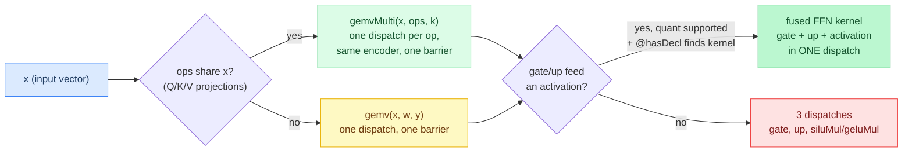
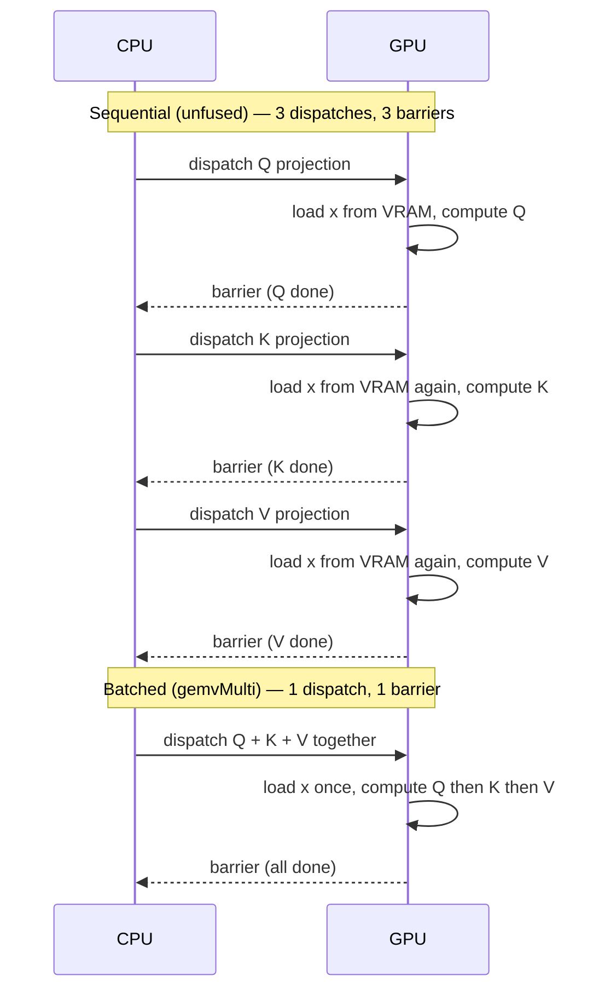
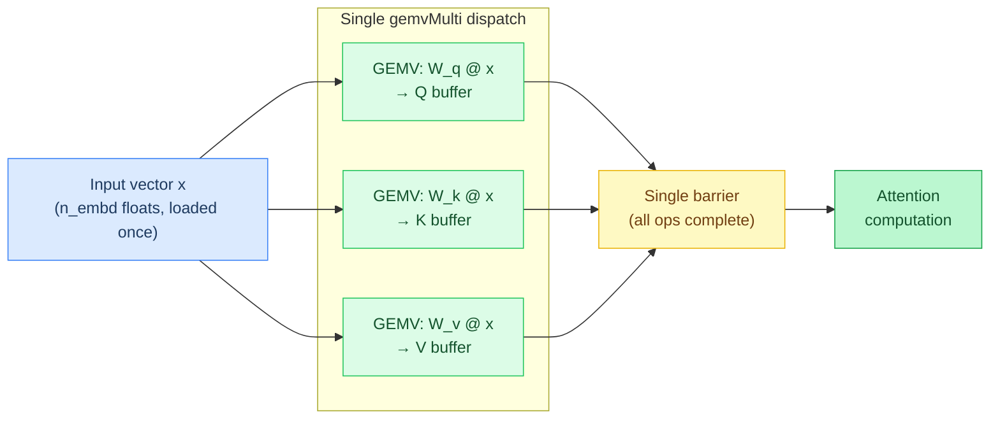
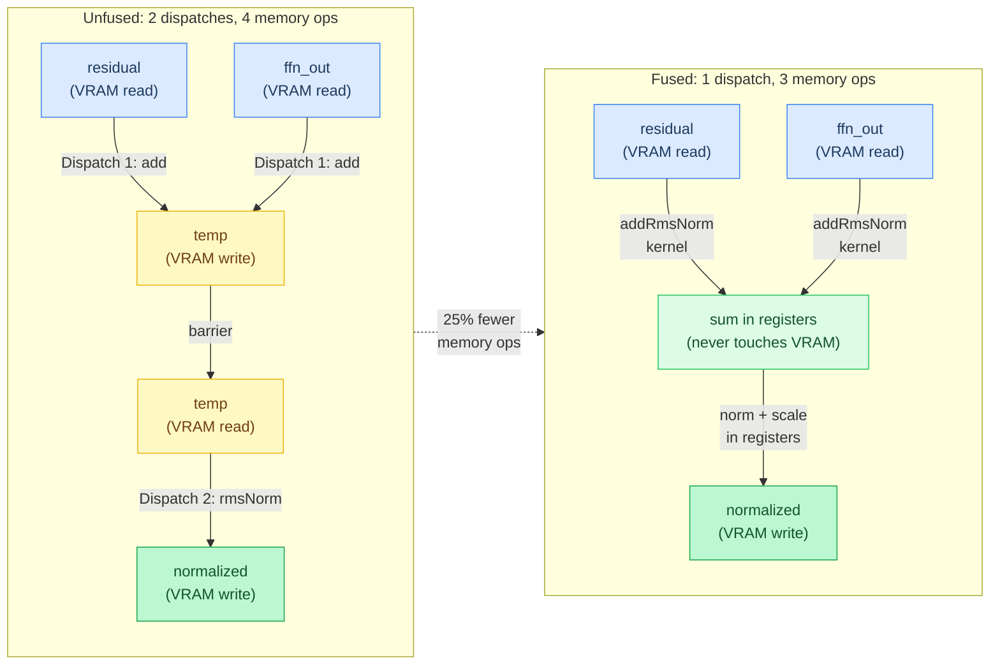
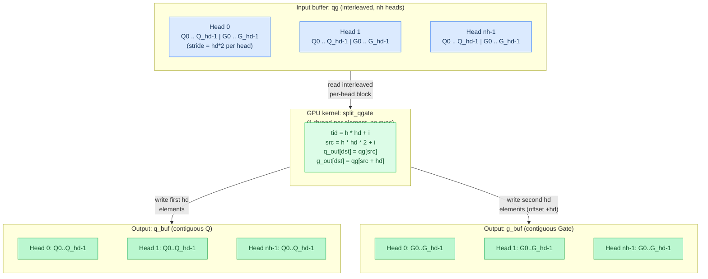
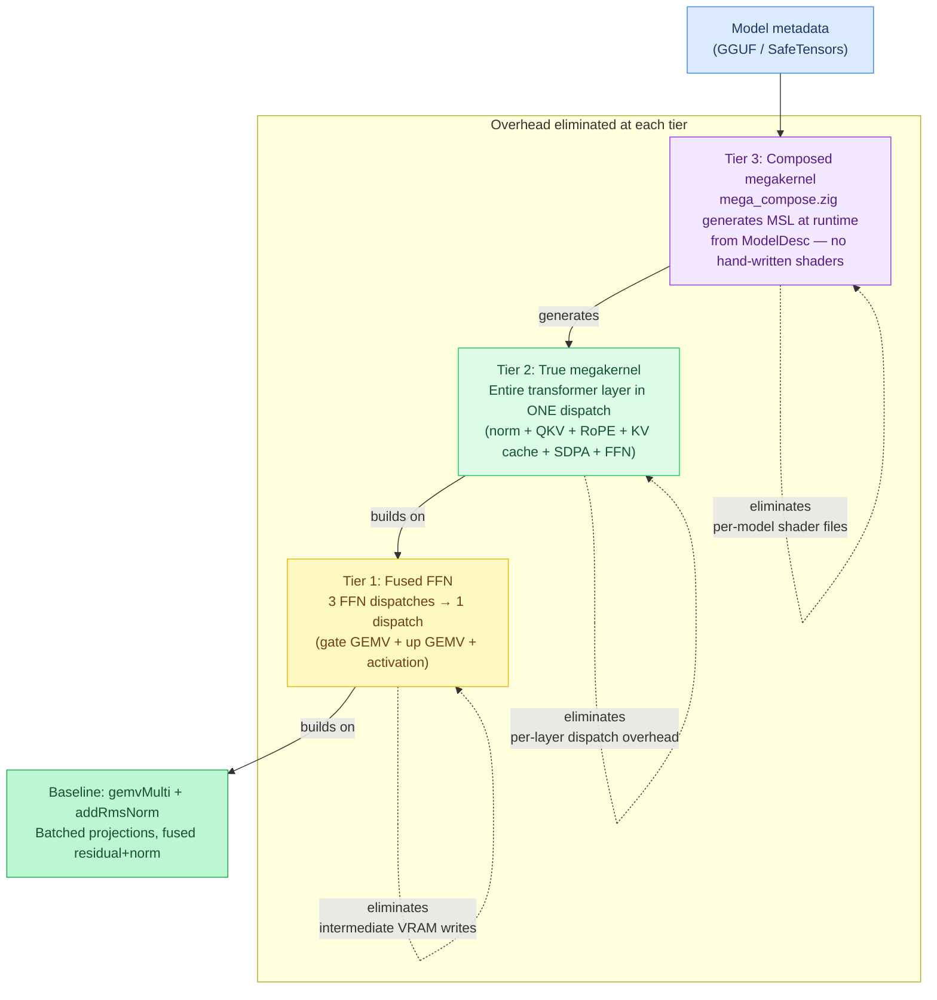
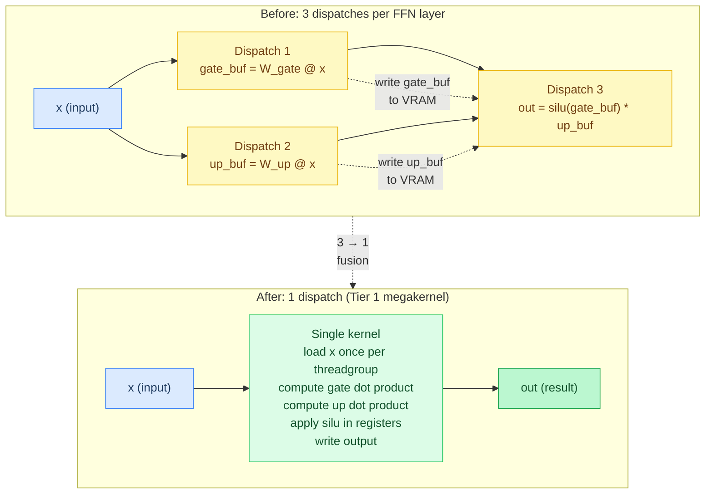
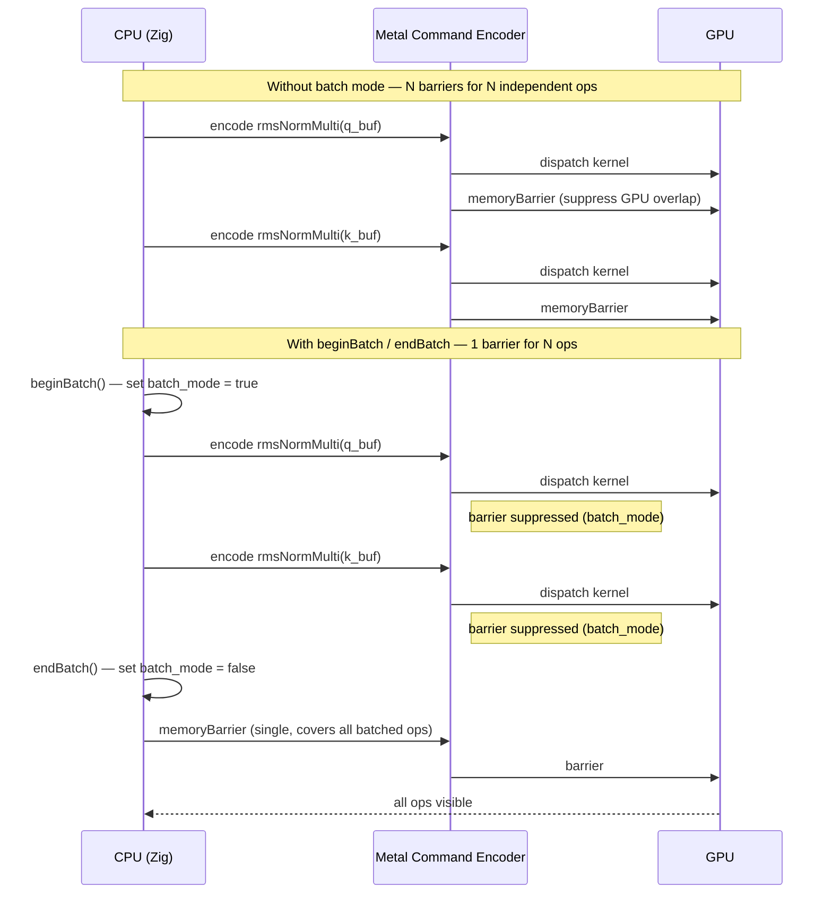
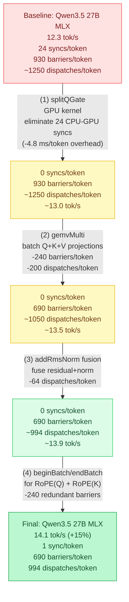

# Chapter 13: Batched Dispatch and Fusion

**Prerequisites:** [Chapter 8: Backends](08-backends.md), [Chapter 11: Metal Backend Internals](11-metal-backend-internals.md) (both helpful, not required)

**Time:** ~22 min

Every GPU kernel dispatch has overhead: setting up the pipeline state, binding buffers, launching threadgroups, and inserting memory barriers. When operations share the same input vector or can be combined into a single pass, **batching** and **fusion** eliminate redundant dispatches.

## Code Flow



`gemvMulti` collapses N dispatches sharing one input into N sub-dispatches under a single barrier; the fused FFN kernel goes further and collapses gate GEMV + up GEMV + activation into one dispatch with no intermediate VRAM writes. The rest of this chapter builds up to both paths and the megakernel tiers beyond them.

## The Dispatch Overhead Problem

Each GPU kernel dispatch burns ~5-10 µs on CPU-side setup before any compute happens. When three projections each need their own dispatch, the overhead stacks up — and the same input vector gets loaded from memory three times.



A typical attention layer does:

```zig
be.gemv(x, w_q, q, n_q, k);    // Q projection: 1 dispatch + 1 barrier
be.gemv(x, w_k, k_buf, n_k, k); // K projection: 1 dispatch + 1 barrier
be.gemv(x, w_v, v, n_v, k);    // V projection: 1 dispatch + 1 barrier
// Total: 3 dispatches, 3 barriers
```

**Sequential Dispatch Visualization:**

```
Timeline (unfused):

CPU:   [dispatch Q] [wait] [dispatch K] [wait] [dispatch V] [wait]
                       ▲                   ▲                   ▲
                    barrier             barrier             barrier
GPU:        [Q GEMV]   │   [K GEMV]       │   [V GEMV]       │
                       │                  │                  │
            load x ────┘   load x ────────┘   load x ────────┘
            (3× redundant memory loads — x loaded from VRAM 3 times)

Timeline (batched via gemvMulti):

CPU:   [dispatch Q,K,V together]           [wait once]
                                              ▲
                                           barrier
GPU:        [Q GEMV] [K GEMV] [V GEMV]      │
             ▲        ▲        ▲             │
             └────────┴────────┘─────────────┘
            x loaded from VRAM by each sub-kernel; overhead reduced by batching barriers

Overhead saved: 2 dispatches, 2 barriers
```

**Problem:** All three GEMVs use the same `x` input vector. The GPU loads `x` from memory **three times** (once per dispatch), even though it could load it once and reuse it.

**Overhead per dispatch** (measured on Apple M4 Metal):
- Pipeline state setup: ~5-10 µs
- Memory barrier: ~0 µs (Apple Silicon overlaps work)
- Total per dispatch: ~5-10 µs

For a 27B model with ~210 GEMVs per token, that's **1-2 ms of pure overhead** per token.

## Batched GEMV: gemvMulti

**Idea:** Dispatch all GEMVs that share the same input vector in a **single kernel launch**. Each GEMV still loads x from VRAM, but the N-1 intermediate CPU barriers are eliminated — reducing CPU-side overhead and command buffer size.



### GemvOp Structure

```zig
pub const GemvOp = struct {
    w: TensorData,      // Weight matrix (quantized)
    y: [*]f32,          // Output buffer
    n: usize,           // Number of output rows
    // Optional MLX companions (for MLX quantized weights)
    mlx_scales: ?[*]const u8 = null,
    mlx_biases: ?[*]const u8 = null,
    mlx_bits: u32 = 0,
};
```

### Backend Interface

```zig
pub inline fn gemvMulti(self: Backend, x: [*]const f32, ops: []const GemvOp, k: usize) void {
    switch (self) {
        inline else => |be| be.gemvMulti(x, ops, k),
    }
}
```

### Usage Example

```zig
// Attention Q/K/V projection (all share input x)
const ops = [_]GemvOp{
    .{ .w = w_q, .y = q_buf, .n = n_q * nh },
    .{ .w = w_k, .y = k_buf, .n = n_kv * nh },
    .{ .w = w_v, .y = v_buf, .n = n_kv * nh },
};
be.gemvMulti(x, &ops, n_embd);  // 1 dispatch instead of 3
```

### Metal Implementation

```zig
pub fn gemvMulti(self: *MetalBackend, x: [*]const f32, ops: []const GemvOp, k: usize) void {
    for (ops) |op| {
        // Determine pipeline based on dtype and MLX companions
        const pipeline = if (op.mlx_scales != null) blk: {
            if (op.mlx_bits == 4) break :blk self.pipe_gemv_mlx_q4;
            if (op.mlx_bits == 6) break :blk self.pipe_gemv_mlx_q6;
            if (op.mlx_bits == 8) break :blk self.pipe_gemv_mlx_q8;
            @panic("Unsupported MLX bit width");
        } else switch (op.w.dtype) {
            .f32 => self.pipe_gemv_f32,
            .bf16 => self.pipe_gemv_bf16,
            .q4_0 => self.pipe_gemv_q4_0,
            .q8_0 => self.pipe_gemv_q8_0,
            // ... other dtypes
        };

        // Encode this GEMV (reuses active encoder)
        self.encode(pipeline, &[_]BufRef{
            self.getBufRef(@ptrCast(x), k * @sizeOf(f32)),
            self.getBufRef(@ptrCast(op.w.data), weightBytes(op.w.dtype, op.n, k)),
            self.getBufRef(@ptrCast(op.y), op.n * @sizeOf(f32)),
            // ... MLX companions if present
        }, grid);
    }
    // Single barrier at the end (outside the loop)
}
```

**Key insight:** All dispatches use the same command encoder. The GPU can overlap them, and only **one barrier** is inserted after all ops complete.

### CPU Implementation

```zig
pub fn gemvMulti(self: *CpuBackend, x: [*]const f32, ops: []const GemvOp, k: usize) void {
    // Parallel dispatch when all ops share dtype and n >= 32
    if (self.pool) |pool| { /* parallelFor across total_n rows */ }
    // Fallback: sequential
    for (ops) |op| { self.gemv(x, op.w, op.y, op.n, k); }
}
```

CPU parallelizes rows across the thread pool when ops share a dtype, falling back to sequential otherwise.

### Performance Impact

**Qwen3.5 27B MLX** (Apple M4 Pro):
- Before gemvMulti: 930 barriers/token
- After gemvMulti: 690 barriers/token
- Throughput change: 0% (barriers are free on Apple Silicon)

**But:** On discrete GPUs (NVIDIA, AMD), barriers flush PCIe, so this would be a 20-30% win.

## Fused Operations

**Fusion** combines sequential operations into a single kernel to eliminate intermediate memory writes.

### Why Fusion Matters

```zig
// Unfused: 2 dispatches, 2 memory round-trips
be.add(residual, ffn_out, temp, n_embd);       // Write temp to VRAM
be.rmsNorm(temp, norm_w, normalized, n_embd);  // Read temp from VRAM

// Memory traffic: residual (read) + ffn_out (read) + temp (write+read) + normalized (write)
//               = 4 memory ops
```

```zig
// Fused: 1 dispatch, 1 memory round-trip
be.addRmsNorm(residual, ffn_out, norm_w, normalized, n_embd);

// Memory traffic: residual (read) + ffn_out (read) + normalized (write)
//               = 3 memory ops (25% reduction)
```

**Savings:** Eliminate `temp` write and read → 2× memory bandwidth saved for the intermediate result.

**GPU implementation:** `temp` computed in registers, never written to VRAM.



### Common Fused Operations in Agave

#### addRmsNorm: Residual + Normalization

```zig
pub inline fn addRmsNorm(
    self: Backend,
    a: [*]f32,              // Residual (modified in-place)
    b: [*]const f32,        // Input to add
    weight: [*]const f32,   // Norm weight
    output: [*]f32,         // Normalized output
    n: usize,
    eps: f32,
) void
```

**Metal kernel:**

```metal
kernel void add_rms_norm_fused(
    device float* a [[buffer(0)]],
    const device float* b [[buffer(1)]],
    const device float* weight [[buffer(2)]],
    device float* output [[buffer(3)]],
    constant uint& n [[buffer(4)]],
    constant float& eps [[buffer(5)]],
    uint tid [[thread_position_in_grid]]
) {
    // Phase 1: Add (in-place)
    if (tid < n) {
        a[tid] += b[tid];
    }
    threadgroup_barrier(mem_flags::mem_device);  // Ensure all adds complete

    // Phase 2: RMSNorm (reads from a, writes to output)
    // ... (same as standalone rmsNorm)
}
```

**Usage:** After every FFN sub-block:

```zig
// Before: residual += ffn(x); x = rmsNorm(residual)
be.add(residual, ffn_out, residual, n_embd);
be.rmsNorm(residual, norm_w, x_normed, n_embd, eps);

// After: fused
be.addRmsNorm(residual, ffn_out, norm_w, x_normed, n_embd, eps);
```

**Impact:** Qwen3.5 saved **64 dispatches/token** (32 layers × 2 residual+norm per layer).

#### siluMul: SwiGLU Activation

```zig
pub inline fn siluMul(
    self: Backend,
    a: [*]const f32,  // Gate input
    b: [*]const f32,  // Up input
    out: [*]f32,      // Output
    n: usize,
) void
```

**Formula:** `out[i] = silu(a[i]) * b[i]` where `silu(x) = x * sigmoid(x)`

**Metal kernel:**

```metal
kernel void silu_mul(
    const device float* a [[buffer(0)]],
    const device float* b [[buffer(1)]],
    device float* out [[buffer(2)]],
    uint tid [[thread_position_in_grid]]
) {
    const float x = a[tid];
    const float silu_x = x / (1.0 + exp(-x));  // SiLU in-register
    out[tid] = silu_x * b[tid];                 // Multiply without storing silu_x
}
```

**Unfused equivalent:**

```zig
be.silu(gate, temp, n);  // Write temp
be.mul(temp, up, out, n); // Read temp, write out
```

**Fused:** No `temp` buffer needed → saves 1 allocation + 2 memory transfers.

**Usage:** SwiGLU FFN:

```zig
// gate_out = silu(gate_proj(x))
// up_out = up_proj(x)
// ffn_out = gate_out * up_out

be.gemv(x, w_gate, gate_buf, ff_dim, n_embd);
be.gemv(x, w_up, up_buf, ff_dim, n_embd);
be.siluMul(gate_buf, up_buf, ffn_out, ff_dim);  // Fused
```

#### splitQGate: Q+Gate Deinterleaving (GPU Kernel)

**Problem:** DeltaNet (Qwen3.5) stores Q and gate block-interleaved per head:

```
[Q0..Q_{hd-1}, G0..G_{hd-1}] × nh heads
```

Needs to split into:
```
Q: [Q0..Q_{hd-1}] × nh heads
G: [G0..G_{hd-1}] × nh heads
```



**Naive CPU implementation:**

```zig
// CPU: requires be.sync() round-trip (GPU → CPU → GPU)
be.sync();  // Flush GPU writes to qg_buf
for (0..nh) |h| {
    const src = h * hd * 2;
    const dst = h * hd;
    @memcpy(q_out[dst..][0..hd], qg[src..][0..hd]);
    @memcpy(g_out[dst..][0..hd], qg[src+hd..][0..hd]);
}
// q_out and g_out now contain CPU-copied data
// Next GPU op must re-upload them → 2 more syncs!
```

**Cost:** 24 syncs/token (one per DeltaNet layer) × ~200 µs/sync = **4.8 ms/token overhead**.

**Fused GPU kernel:**

```metal
kernel void split_qgate(
    const device float* qg [[buffer(0)]],
    device float* q_out [[buffer(1)]],
    device float* g_out [[buffer(2)]],
    constant uint& hd [[buffer(3)]],
    constant uint& nh [[buffer(4)]],
    uint tid [[thread_position_in_grid]]
) {
    const uint h = tid / hd;           // Head index
    const uint i = tid % hd;           // Element within head
    const uint src = h * hd * 2 + i;   // Interleaved source
    const uint dst = h * hd + i;       // Contiguous dest

    q_out[dst] = qg[src];              // First half
    g_out[dst] = qg[src + hd];         // Second half
}
```

**Dispatch:**

```zig
be.splitQGate(qg_buf, q_buf, g_buf, hd, nh);  // 1 dispatch, no sync needed
```

**Impact:** Eliminated 24 syncs/token → Qwen3.5 throughput **12.3 → 14.1 tok/s** (+15%).

**Key insight:** Moving data manipulation from CPU to GPU eliminates sync points. Even a trivial operation (memcpy) is worth a GPU kernel if it avoids a round-trip.

#### addScaled: MoE Expert Accumulation

```zig
pub inline fn addScaled(
    self: Backend,
    src: [*]const f32,  // Expert output
    dst: [*]f32,        // Accumulator (modified in-place)
    scale: f32,         // Expert weight
    n: usize,
) void
```

**Formula:** `dst[i] += src[i] * scale`

**Usage:** Mixture of Experts:

```zig
// Zero accumulator
@memset(moe_out, 0.0);

// Dispatch experts
for (active_experts) |expert_id, i| {
    be.gemv(x, expert_weights[expert_id], expert_out, ff_dim, n_embd);
    const weight = expert_weights[i];
    be.addScaled(expert_out, moe_out, weight, ff_dim);  // Accumulate
}

// No sync needed — moe_out stays on GPU throughout
```

**Alternative (unfused):**

```zig
for (active_experts) |expert_id, i| {
    be.gemv(x, expert_weights[expert_id], expert_out, ff_dim, n_embd);
    be.sync();  // BAD: Force GPU → CPU
    const weight = expert_weights[i];
    for (0..ff_dim) |j| {
        moe_out[j] += expert_out[j] * weight;  // CPU accumulation
    }
}
```

**Cost:** `n_experts` syncs per MoE layer → 8 experts × 20 MoE layers = **160 syncs/token**.

**Fused:** Zero syncs. All accumulation happens on GPU.

## Megakernel System (Three-Tier Architecture)

The megakernel system eliminates GPU dispatch overhead at three levels of granularity. All tiers are enabled via the `--megakernel` CLI flag. Each tier subsumes the one below it: Tier 3 auto-generates a Tier 2 megakernel at runtime from model metadata, so no hand-written shader code is needed for new models.



### Tier 1: Fused FFN

Combine **gate GEMV + up GEMV + activation** into a single kernel dispatch. Instead of 3 separate dispatches per FFN layer (gate, up, silu/gelu), a single kernel computes all three. The input `x` is loaded once per threadgroup; intermediate gate and up values never touch VRAM.



**Standard FFN:**
```
Dispatch 1: gate_buf = W_gate @ x     (GEMV)
Dispatch 2: up_buf = W_up @ x         (GEMV)
Dispatch 3: out = silu(gate_buf) * up_buf  (siluMul)
```

**Fused:**
```
Dispatch 1: out = silu(W_gate @ x) * (W_up @ x)  (single kernel)
```

Each threadgroup computes one output element. It loads the same `x` vector once and computes both gate and up dot products in parallel, then applies the activation in registers.

**Activation variants:**

- **SiLU** (Qwen 3.5, GLM-4): `out[i] = silu(gate[i]) * up[i]`
- **GELU** (Gemma 3/4): `out[i] = gelu(gate[i]) * up[i]`

**Quantization coverage:**

11 Metal MSL kernels in `megakernel.metal`:
- SiLU: Q8_0, Q4_K, Q5_K, Q6_K, Q4_0, MLX_Q4
- GELU: Q8_0, Q4_K, Q5_K, Q6_K, Q4_0

4 CUDA kernels: `fused_ffn_{q8_0,q4_k,q5_k,q6_k}.zig` (SiLU, compiled to PTX).

**Performance:**

For small models (0.8-2B), dispatch overhead is a significant fraction of per-token time. Fusing 3->1 saves ~48 dispatches per token (24 layers x 2 saved):

- Qwen 3.5 0.8B Q8_0: 380 -> 332 dispatches/token, +4-7% decode
- Gemma 4 E2B Q4_K_M: +93% short decode, -23% prefill

For larger models (4B+), the per-dispatch compute time dominates, so the relative gain is smaller.

### Performance (from BENCHMARKS.md)

Measured 2026-03-24 on Apple M4 Pro, full methodology in [BENCHMARKS.md](../BENCHMARKS.md). These are Tier 1 fused-FFN deltas measured with `--megakernel`, standard dispatch vs. fused, same model and quant:

| Claim | Source |
|-------|--------|
| Qwen3.5 0.8B Q8_0, short decode: 111.7 -> 116.3 tok/s (+4%) | BENCHMARKS Megakernel System, Tier 1 |
| Qwen3.5 0.8B Q8_0, profiled decode: 23.8 -> 25.5 tok/s (+7%) | BENCHMARKS Megakernel System, Tier 1 |
| Largest gains come from mixed-quant models (Q4_K_M) where fused kernels cover every layer type | BENCHMARKS Megakernel System, Tier 1 |

**Supported models:** Qwen 3.5, Gemma 3, Gemma 4 (dense+MoE), GLM-4 on Metal. Qwen 3.5 on CUDA (Q8_0, Q4_K, Q5_K, Q6_K) and ROCm (Q8_0).

**Weight offset computation:** The megakernel needs to access both gate and up weight matrices in a single dispatch. `src/backend/megakernel.zig` computes per-layer byte offsets so the kernel can locate both weight tensors without separate buffer bindings.

### Tier 2: True Megakernels

True megakernels go further: execute an **entire transformer layer** (norm, Q/K/V projection, RoPE, KV cache append, SDPA, output projection, FFN) in a single GPU dispatch. This eliminates **all** per-layer dispatches and barriers.

**Composable building blocks** (`mega_common.metal`, 732 lines, 18 primitives):

```
Primitive categories:
  Sync:        mega_grid_sync (atomic counter barrier)
  Norm:        mega_rms_norm, mega_add_rms_norm
  GEMV:        mega_gemv_q8, mega_gemv_q4k, mega_gemv_q4_0, mega_gemv_q5k, mega_gemv_q6k
  Activation:  mega_silu_mul, mega_gelu_mul, mega_relu_squared, mega_silu_mul_clamp
  Transform:   mega_rope, mega_add
  Sync:        mega_sync_reset (reset atomic counter between stages)
  KV Cache:    mega_kv_append_f32, mega_kv_append_tq (TurboQuant encoding)
  Attention:   mega_sdpa_inline (TQ+ dequant, sparse V, online softmax, GQA)
```

**How grid sync works:** True megakernels dispatch all threadgroups at once. Between phases (e.g., after norm, before GEMV), all threadgroups must synchronize. Metal has no built-in grid-level barrier, so `mega_grid_sync` implements one using an atomic counter with `memory_order_relaxed`. Each threadgroup increments the counter and spins until all threadgroups have arrived.

**Execution flow (simplified Qwen Q8 example):**

```
Single GPU dispatch:
  1. mega_rms_norm(x, w_norm)          // All TGs cooperate on norm
  2. mega_grid_sync()                   // Barrier
  3. mega_gemv_q8(x, w_qkv, qkv_buf)  // Q/K/V projection
  4. mega_grid_sync()
  5. mega_rope(q, k, pos, theta)       // RoPE on Q and K
  6. mega_kv_append_tq(k, v, cache)    // Append to KV with TurboQuant
  7. mega_grid_sync()
  8. mega_sdpa_inline(q, cache, out)   // SDPA with TQ+ dequant + sparse V
  9. mega_grid_sync()
  10. mega_gemv_q8(attn_out, w_o, proj) // Output projection
  11. mega_add(residual, proj)           // Residual connection
  12. mega_add_rms_norm(...)             // FFN pre-norm
  13. mega_grid_sync()
  14. mega_gemv_q8(x, w_gate, gate)     // FFN gate
  15. mega_gemv_q8(x, w_up, up)         // FFN up
  16. mega_silu_mul(gate, up, ffn_out)   // Activation
  17. mega_grid_sync()
  18. mega_gemv_q8(ffn_out, w_down, out) // FFN down
  19. mega_add(residual, out)            // Final residual
```

**Implementations:**

| Megakernel | Metal | CUDA | ROCm |
|------------|:-----:|:----:|:----:|
| Qwen 3.5 Q8_0 | Yes | Yes | Yes |
| Qwen 3.5 Q4_K | Yes | -- | -- |
| Gemma 3/4 Q4_K | Yes | Yes | -- |
| Gemma 3/4 Q8_0 | Yes | Yes | -- |
| Nemotron-H Q8_0 | Yes | -- | -- |

**TurboQuant+ in megakernels:** The `mega_kv_append_tq` and `mega_sdpa_inline` building blocks integrate TurboQuant+ directly. KV values are quantized inline during append, and SDPA dequantizes them on-the-fly with sparse V optimization (positions with softmax weight below 1e-6 skip V dequantization).

**Total megakernel code:** ~4,334 lines across 12 files (hand-written) plus ~1,036 lines in `mega_compose.zig` (auto-generator).

### Tier 3: Composed Megakernels (Auto-Generated)

Tier 3 eliminates the need to hand-write per-model megakernel files. The `src/backend/mega_compose.zig` module generates model-specific MSL source at runtime from a `ModelDesc` struct populated from model metadata.

**Pipeline:**

```
Model Metadata (GGUF) → ModelDesc → composeMSL() → MSL source → Metal runtime compile
```

**How it works:**

1. At model init, populate a `ModelDesc` from GGUF/SafeTensors metadata (dimensions, quant, activation, layer types)
2. Call `mega_compose.composeMSL(&buf, desc)` to generate MSL source into a stack buffer
3. The generated MSL references the 18 building blocks from `mega_common.metal` (concatenated before it)
4. Metal backend compiles via `compileComposedMegakernel()` using `newLibraryWithSource`
5. Dispatch via `dispatchMegakernelAuto()` -- single GPU dispatch for all layers

**What the composer handles automatically:**

- Quant dispatch: Q8_0, Q4_K, Q5_K, Q6_K, Q4_0 -- selects the correct `mega_gemv_*` function
- Activation: SiLU, GELU, ReLU-squared -- selects the correct activation call
- Layer types: attention layers get SDPA, DeltaNet/MoE/FFN-only layers skip it
- Residual pattern: fused (Qwen `addRmsNorm`) or separate (Gemma `add` + `norm`)
- Post-attention norm: optional fused `addRmsNorm`
- Inline SDPA with KV cache append, online softmax, sparse V, GQA
- TurboQuant+ via `mega_kv_append_tq` and `mega_sdpa_inline` building blocks

**Adding a new model** only requires defining a `ModelDesc`:

```zig
const desc = ModelDesc{
    .name = "new_model",
    .n_layers = 32,
    .n_embd = 4096,
    .n_ff = 11008,
    .n_head = 32,
    .n_kv = 8,
    .head_dim = 128,
    .rope_dim = 128,
    .rope_theta = 10000.0,
    .rms_eps = 1e-6,
    .max_seq_len = 4096,
    .activation = .silu,
    .quant = .q4_k,
    .layer_types = ModelDesc.uniform(32, .attention),
};
var buf: [32768]u8 = undefined;
const msl = mega_compose.composeMSL(&buf, desc);
try metal_be.compileComposedMegakernel(msl);
```

No MSL or shader code needed -- the composer generates everything from the descriptor.

### CLI

```bash
agave model.gguf --megakernel "prompt"     # Use megakernel (Tier 1, 2, or 3)
agave model.gguf "prompt"                  # Standard (default)
```

## When to Fuse vs When to Keep Separate

### Fuse when:

✅ **Sequential dependency:** Output of A is input to B
✅ **Intermediate is temporary:** No other consumer needs it
✅ **Memory-bound:** Eliminating the intermediate write/read is the bottleneck
✅ **Small overhead:** Fusion logic is simple (not a massive kernel)

**Examples:** addRmsNorm (residual + norm), siluMul (activation + multiply)

### Don't fuse when:

❌ **Intermediate is reused:** Other ops need the intermediate result
❌ **Complex control flow:** Fusion makes the kernel hard to understand/debug
❌ **Compute-bound:** The bottleneck is arithmetic, not memory
❌ **Different thread counts:** A needs 256 threads/block, B needs 1024

**Example:** Don't fuse GEMV + RoPE — RoPE only operates on a subset of GEMV output, and they have different grid sizes.

## Batched Independent Operations

When operations are **independent** (no data dependency), batch them to suppress intermediate barriers.

### beginBatch / endBatch Pattern

```zig
// Normalize Q and K (independent — can run in parallel)
be.beginBatch();
  be.rmsNormMulti(q_buf, norm_w, nh_q, hd, eps);   // No barrier after
  be.rmsNormMulti(k_buf, norm_w, nh_kv, hd, eps);  // No barrier after
be.endBatch();  // Single barrier here
```

**Metal implementation:**

```zig
pub fn beginBatch(self: *MetalBackend) void {
    self.batch_mode = true;
}

pub fn endBatch(self: *MetalBackend) void {
    self.batch_mode = false;
    if (self.active_enc) |enc| {
        objc.msgSend(void, enc, objc.sel("memoryBarrierWithScope:"), .{
            MTLBarrierScopeBuffers,
        });
    }
}

fn encode(...) void {
    // ... dispatch kernel ...

    // Suppress barrier in batch mode
    if (!self.batch_mode) {
        objc.msgSend(void, enc, objc.sel("memoryBarrierWithScope:"), .{...});
    }
}
```



**When to use:**

- Multiple normalizations on different buffers
- RoPE on Q and K (both modify their input, but independently)
- Parallel GEMV (using gemvMulti is better, but batching is an alternative)

**Impact:** Qwen3.5 used batching for RoPE(Q) + RoPE(K) → saved ~64 barriers/token.

## Real-World Example: Qwen3.5 Optimization Journey

**Initial (naive):**
- 24 DeltaNet layers × 1 sync per Q/gate split = **24 syncs/token**
- No gemvMulti → 3 dispatches for Q/K/V projection = **~600 extra dispatches**
- No addRmsNorm → 64 extra dispatches for residual+norm
- **Throughput:** 12.3 tok/s

**Optimizations applied:**

1. **splitQGate GPU kernel** → eliminated 24 syncs
2. **gemvMulti for Q/K/V** → reduced dispatches by ~200
3. **addRmsNorm fusion** → reduced dispatches by 64
4. **Batch mode for independent norms/RoPE** → reduced barriers by 240



**Final:**
- 1 sync/token (only for final argmax)
- 690 barriers/token (down from 930)
- 994 dispatches/token
- **Throughput:** 14.1 tok/s (+15%)

**Key insight:** Even though barriers are free on Apple Silicon, reducing dispatches and syncs improves throughput by reducing CPU-side overhead and GPU command buffer size.

## Best Practices

### API Design

1. **Batched variants for common patterns:** gemvMulti, rmsNormMulti, ropeBatched
2. **Fused ops for common sequences:** addRmsNorm, siluMul
3. **CPU fallback must match semantics:** Batched CPU = sequential execution of same ops

### Implementation

1. **Profile before optimizing:** Use `--profile` to see dispatch/barrier/sync counts
2. **Benchmark impact:** Some "optimizations" don't help (e.g., barriers on Apple Silicon)
3. **Keep unfused fallback:** For debugging, keep the sequential version

### Supported Models

| Model | Backend | Quant Types | Enable |
|-------|---------|-------------|--------|
| Qwen 3.5 | Metal, CUDA, ROCm | Q8_0, Q4_K, Q5_K, Q6_K, Q4_0 | `--megakernel` |
| Gemma 4 | Metal, CUDA | Q8_0, Q4_K, Q5_K, Q6_K, Q4_0 | `--megakernel` |
| Gemma 3 | Metal, CUDA | Q8_0, Q4_K, Q5_K, Q6_K, Q4_0 | `--megakernel` |
| GLM-4 | Metal | Q8_0, Q4_K, Q5_K, Q6_K, Q4_0 | `--megakernel` |

### Debugging

1. **Validate output:** Fused kernel must match unfused output exactly
2. **Test edge cases:** Single element, non-multiple-of-8 sizes
3. **Check all backends:** Fusion bug on Metal but not CPU? Check threadgroup barriers.

## Gotchas

**Fused FFN methods don't exist on every backend, and calling one that isn't there is a compile error, not a runtime one.** `metal.zig` defines `fusedFfnGateUpSiluQ8` and its siblings, but the CPU, CUDA, and ROCm backend structs don't all define the same set, and on Linux the Metal backend itself compiles down to a stub with none of them. Because `Backend` dispatches through `inline else => |be|`, the compiler generates a concrete call for every backend variant at every call site, so a naked `be.fusedFfnGateUpSiluQ8(...)` inside that switch fails to build the moment `zig build` reaches a backend that lacks the method, not just at runtime on that backend. `mlpLayer()` in [src/models/qwen35.zig](../../src/models/qwen35.zig) (and the equivalent in `gemma3.zig`/`gemma4.zig`) guards every fused call with `if (comptime @hasDecl(@TypeOf(be.*), "fusedFfnGateUpSiluQ8")) { ... }`, so the fused branch only gets compiled in for backends that actually implement it. Drop the `comptime @hasDecl` check and the build breaks on the first non-Metal backend, even though the bug only "looks like" a Metal problem.

---

**In the code:** [src/backend/backend.zig](../../src/backend/backend.zig) (gemvMulti, siluMul, addRmsNorm interfaces), [src/backend/metal.zig](../../src/backend/metal.zig) (Metal implementations, `compileComposedMegakernel`, `dispatchMegakernelAuto`), [src/backend/megakernel.zig](../../src/backend/megakernel.zig) (weight offset computation), [src/backend/mega_compose.zig](../../src/backend/mega_compose.zig) (Tier 3 composable generator: `ModelDesc`, `composeMSL`), [src/backend/kernels/metal/megakernel.metal](../../src/backend/kernels/metal/megakernel.metal) (Tier 1 fused FFN), [src/backend/kernels/metal/mega_common.metal](../../src/backend/kernels/metal/mega_common.metal) (Tier 2/3 building blocks), [src/backend/kernels/metal/mega_qwen35_q8.metal](../../src/backend/kernels/metal/mega_qwen35_q8.metal) (example true megakernel), [src/models/qwen35.zig](../../src/models/qwen35.zig) (usage examples)

**Related:** [Chapter 11: Metal Backend Internals](11-metal-backend-internals.md#batch-mode-suppressing-intermediate-barriers)

**Next:** [Chapter 14: Format Conventions →](14-format-conventions.md) | **Back:** [Chapter 12: CPU Parallelism ←](12-cpu-parallelism.md) | **Product docs:** [Architecture](../ARCHITECTURE.md)

---

## Glossary

**addRmsNorm** — A fused operation performing residual addition and RMS normalization in a single kernel dispatch.

**addScaled** — A fused operation computing `dst += src * scale` on GPU, used for MoE expert accumulation.

**dispatch overhead** — The CPU-side cost (~5–10 µs) of setting up pipeline state, binding buffers, and launching a GPU kernel.

**fusion** — Combining sequential GPU operations into a single kernel so intermediate results stay in registers.

**gemvMulti** — A batched GEMV interface dispatching multiple matrix-vector multiplies sharing the same input vector in a single command.

**GemvOp** — A struct describing one GEMV operation within a gemvMulti batch: weight data, output buffer, and row count.

**mega_grid_sync** — An atomic-counter-based grid-level barrier synchronizing all threadgroups within a megakernel dispatch.

**siluMul** — A fused operation computing `silu(a) * b` in one kernel, eliminating the intermediate activation buffer.

**splitQGate** — A GPU kernel deinterleaving Q and gate values from an interleaved buffer into separate contiguous buffers.

**Tier 1 (Fused FFN)** — Megakernel level combining gate + up + activation into a single dispatch (3→1 per FFN).

**Tier 2 (True Megakernel)** — Megakernel level executing an entire transformer layer in one dispatch using composable building blocks.

**Tier 3 (Composed Megakernel)** — Auto-generated model-specific MSL from a ModelDesc struct; no hand-written shader code needed.
