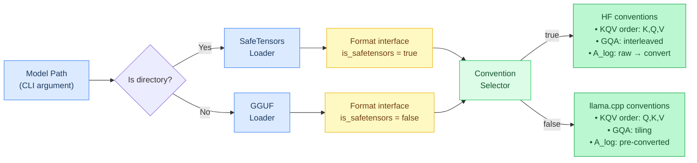
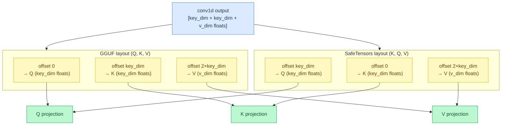
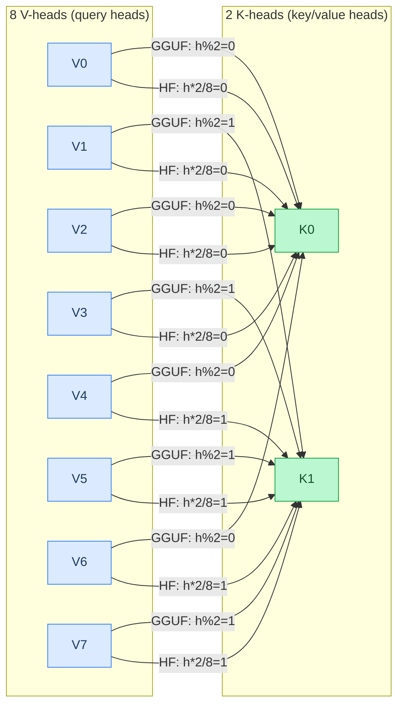
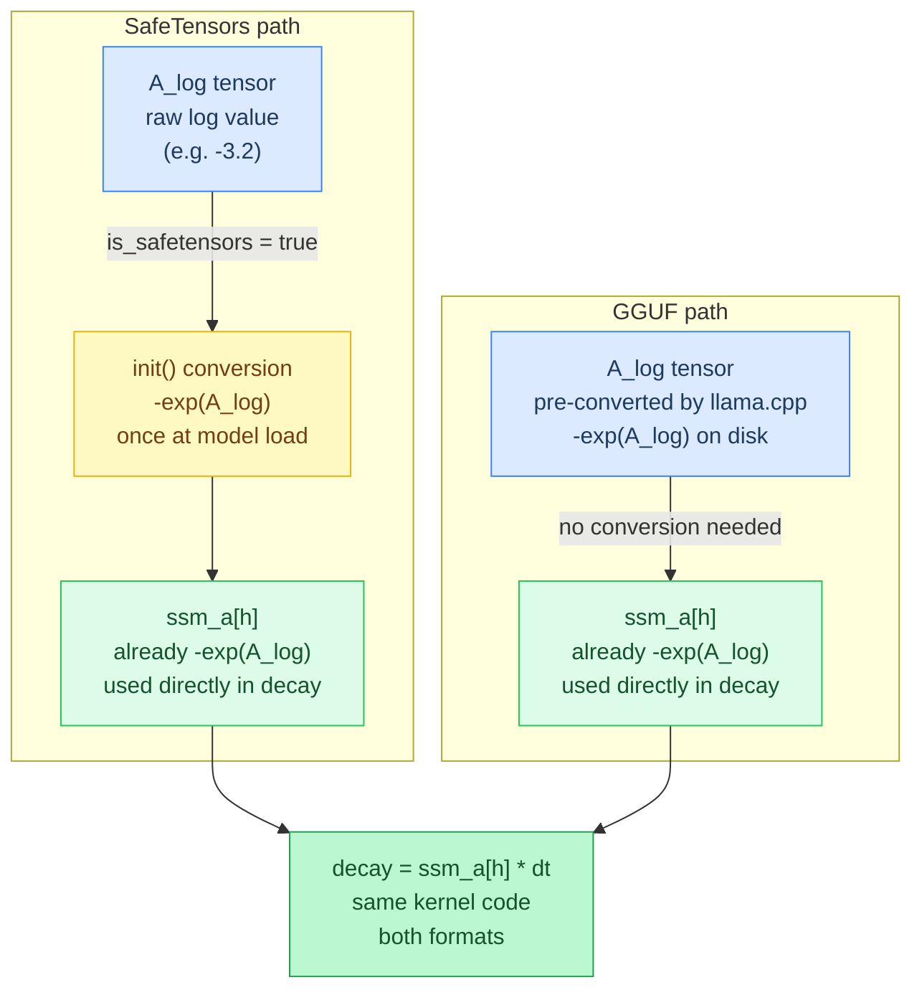
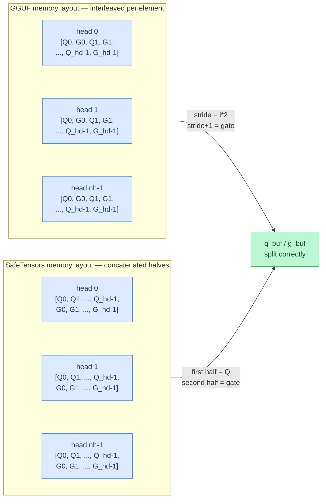
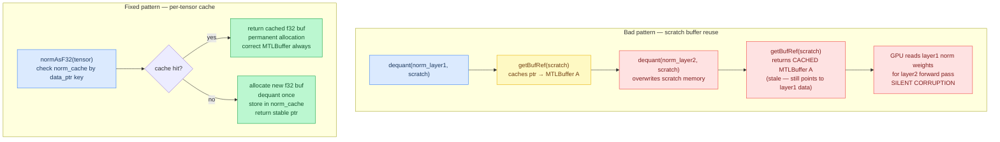
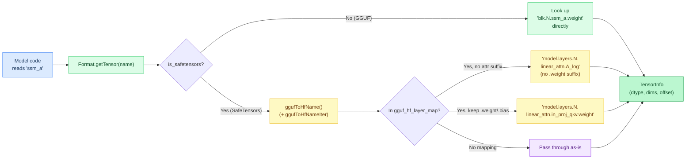
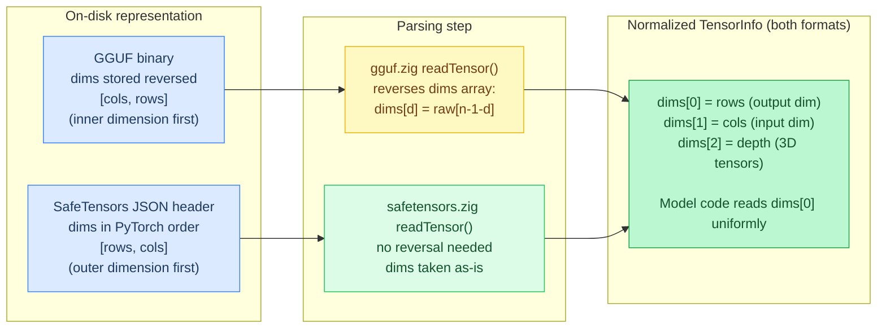
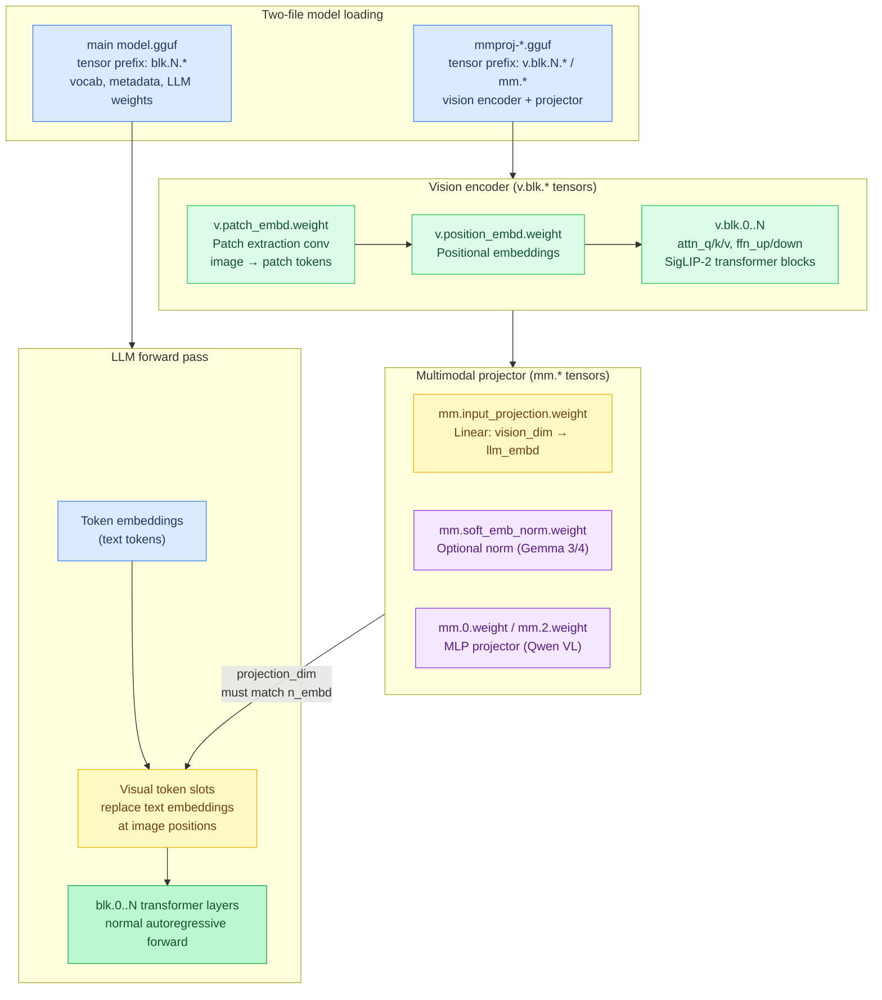

# Chapter 14: Format Conventions

**Prerequisites:** [Chapter 4: Quantization](04-quantization.md) (MLX affine format details reused here)

**Time:** ~20 min

> After this chapter you can explain GGUF vs SafeTensors differences, tensor naming, dimension order, and why mismatches cause silent failures.

The same model can be stored in different file formats — **GGUF** (a single-file binary format designed by the llama.cpp project, optimized for mmap and quantized inference) and **SafeTensors** (a multi-file format from HuggingFace, the standard for PyTorch model distribution). They store identical weights but use **different conventions** for tensor layout, metadata keys, and even mathematical transformations.

**Critical insight:** Using GGUF conventions on SafeTensors data (or vice versa) produces **silent correctness failures** — the model runs but outputs garbage. Agave found **6 separate bugs** when adding SafeTensors support for Qwen3.5.

## Why Formats Have Different Conventions

**GGUF** is designed by llama.cpp maintainers who optimize for:
- Mmap-friendly layout (weights in file order)
- Quantization-first design
- C++ naming conventions

**SafeTensors** follows HuggingFace/PyTorch conventions:
- Python/PyTorch tensor names
- Original research paper layouts
- JSON metadata (not binary-packed)

When llama.cpp converts a HuggingFace model to GGUF, it **transforms** the data to match llama.cpp's internal conventions. Agave must **detect the format** and apply the correct convention.

## Format Detection

Agave inspects the model path at startup: a directory signals SafeTensors (multiple `.safetensors` shards + `config.json`), while a single file signals GGUF. The result is a unified `Format` interface that carries the `is_safetensors` flag so all downstream code can branch on conventions without re-inspecting the path.



```text
Format (vtable-based polymorphism):
  ptr: pointer to concrete loader (SafeTensorsDir or GGUFFile)
  vtable: pointer to VTable
  is_safetensors: bool = false   # true = SafeTensors/HF conventions, false = GGUF/llama.cpp conventions

  VTable:
    get_tensor(ptr, name) -> TensorInfo?
    get_meta_str / get_meta_u32 / get_meta_f32 / get_meta_u32_array(ptr, key) -> value?
    get_vocab(ptr) -> string list?
    get_merges(ptr) -> string list?

  getTensor(self, name):
    return self.vtable.get_tensor(self.ptr, name)

Format detection by path type (directory -> SafeTensors, single file -> GGUF):
  if is_dir:
      st_dir = SafeTensorsDir.open(model_path)
      fmt = st_dir.format()      # is_safetensors = true
  else:
      gguf_file = GGUFFile.open(model_path)
      fmt = gguf_file.format()   # is_safetensors = false
```

**Implementation:** [`src/format/format.zig`](../../src/format/format.zig) (`Format`, `Format.VTable`, `Format.getTensor`)

**Flag:** `is_safetensors` field added to Format interface to decouple format detection from convention selection.

## Convention Differences

### 1. DeltaNet Conv Output Split Order

**Operation:** After causal conv1d, output is split into Q, K, V tensors. The two formats pack these slices in opposite orders inside the same flat buffer, so reading with the wrong offset silently assigns the wrong data to each projection.



**GGUF (llama.cpp):** split order Q, K, V (matches llama.cpp `ggml_repeat` semantics)

```text
q_start = 0
k_start = key_dim
v_start = key_dim + key_dim

q_buf[0..key_dim] = conv_out[q_start..][0..key_dim]
k_buf[0..key_dim] = conv_out[k_start..][0..key_dim]
v_buf[0..v_dim]   = conv_out[v_start..][0..v_dim]
```

**SafeTensors (HuggingFace):** split order K, Q, V (matches original DeltaNet paper)

```text
k_start = 0
q_start = key_dim
v_start = key_dim + key_dim

k_buf[0..key_dim] = conv_out[k_start..][0..key_dim]
q_buf[0..key_dim] = conv_out[q_start..][0..key_dim]
v_buf[0..v_dim]   = conv_out[v_start..][0..v_dim]
```

**Implementation:** [`src/backend/kernels/cpu/deltanet.zig`](../../src/backend/kernels/cpu/deltanet.zig) (conv1d output split)

**Controlled by:** `kqv_order` flag in `DeltaNetParams`. The field exists to support per-format branching, but in practice it is hardcoded to `false` for both GGUF and HF SafeTensors:

```text
DeltaNetParams:
  ...
  kqv_order: bool = false
  # true  -> conv_out split order is K,Q,V (HuggingFace/SafeTensors)
  # false -> conv_out split order is Q,K,V (GGUF/llama.cpp convention), the default

Model code (qwen35.zig):
  p = DeltaNetParams{ ..., kqv_order = false }  # Q,K,V order for both GGUF and HF SafeTensors
```

**Implementation:** [`src/backend/kernels/cpu/deltanet.zig`](../../src/backend/kernels/cpu/deltanet.zig) (`DeltaNetParams`), [`src/models/qwen35.zig`](../../src/models/qwen35.zig) (`kqv_order` construction)

### 2. DeltaNet GQA Head Mapping

**Problem:** GQA maps Q heads to KV heads. Two different semantics exist. With 8 V-heads and 2 K-heads, the two formats produce completely different attention patterns even though both are "valid" GQA implementations.



**GGUF pattern:** `0,1,0,1,0,1,0,1` (tiling — alternates every head)

**SafeTensors pattern:** `0,0,0,0,1,1,1,1` (interleaved groups — contiguous blocks)

**GGUF (llama.cpp TILING):** V-head maps to K-head via modulo wrapping

```text
kh = h % num_k_heads
```

**Example:** 8 V-heads, 2 K-heads
- V-head 0 → K-head 0 (0 % 2)
- V-head 1 → K-head 1 (1 % 2)
- V-head 2 → K-head 0 (2 % 2)
- V-head 3 → K-head 1 (3 % 2)
- Pattern: `0,1,0,1,0,1,0,1` (tiled)

**SafeTensors (INTERLEAVED GROUPING):** V-heads grouped by K-head

```text
kh = h * num_k_heads / num_v_heads
```

**Example:** 8 V-heads, 2 K-heads
- V-heads 0-3 → K-head 0 (0×2/8 = 0)
- V-heads 4-7 → K-head 1 (4×2/8 = 1)
- Pattern: `0,0,0,0,1,1,1,1` (interleaved groups)

**Controlled by:** Same `kqv_order` flag (GQA mapping convention follows split order convention). Since `kqv_order` is `false` for both formats in Qwen3.5, the tiling path is always used.

```text
kh = if p.kqv_order:
         h * p.num_k_heads / p.num_v_heads   # interleaved groups
     else:
         h % p.num_k_heads                   # tiling (used by both formats)
```

**Implementation:** [`src/backend/kernels/cpu/deltanet.zig`](../../src/backend/kernels/cpu/deltanet.zig) (GQA head mapping)

### 3. SSM A_log Pre-Conversion

**Operation:** DeltaNet state decay uses `exp(A_log * dt)`.

**GGUF:** `A_log` is stored as `-exp(A_log)`, pre-converted by llama.cpp

```text
decay = ssm_a[h] * dt   # ssm_a already contains -exp(A_log)
```

**SafeTensors:** `A_log` is stored raw, must convert at init

```text
for a in ssm_a:
    a = -exp(a)          # convert once at model load

# then use the same code as GGUF
decay = ssm_a[h] * dt
```

**Detection** (`init()`):

```text
if self.fmt.is_safetensors:
    for layer in 0..n_layers:
        ssm_a = self.getLayerTensor(layer, "ssm_a")
        for a in ssm_a:
            a = -exp(a)
```

**Implementation:** [`src/models/qwen35.zig`](../../src/models/qwen35.zig) (`init`, A_log conversion)

**Why the difference?** llama.cpp pre-computes this to avoid calling `exp()` on every token. PyTorch stores the raw value for flexibility.



### 4. Q/Gate Split Layout

**Operation:** DeltaNet projects Q and gate together, then splits them.

**GGUF (interleaved per head):**
```
[Q0, G0, Q1, G1, Q2, G2, ..., Q_{hd-1}, G_{hd-1}] × nh heads
```

**SafeTensors (concatenated per head):**
```
[Q0..Q_{hd-1}, G0..G_{hd-1}] × nh heads
```

**Split code:**

```text
if self.fmt.is_safetensors:
    # Concatenated: first half = Q, second half = gate
    for h in 0..nh:
        src = h * hd * 2
        q_src = src
        g_src = src + hd
        q_buf[h*hd..][0..hd] = qg[q_src..][0..hd]
        g_buf[h*hd..][0..hd] = qg[g_src..][0..hd]
else:
    # Interleaved: alternating Q and gate
    for h in 0..nh:
        for i in 0..hd:
            src = h * hd * 2 + i * 2
            q_buf[h*hd + i] = qg[src]
            g_buf[h*hd + i] = qg[src + 1]
```

**Implementation:** [`src/models/qwen35.zig`](../../src/models/qwen35.zig) (Q/gate split)

**Impact:** Wrong layout → Q gets half of gate's values, gate gets half of Q's → attention completely broken.



### 5. Gate Detection via Tensor Dimensions

**Problem:** Detect whether Q projection embeds a gate by checking tensor shape. For Qwen3.5, gated Q has output dim `n_head * head_dim * 2`.

**Pitfall:** Calling `numElements()` on MLX SafeTensors returns U32 word count, not logical element count, so an element-count gate check silently mis-detects.

**Fix:** Always read `dims[0]` (output rows), for both GGUF and SafeTensors. Agave does this in `Qwen35Model` init (`src/models/qwen35.zig`):

```text
q_out_dim = qw.dims[0]
expected_gate = n_head * head_dim * 2
has_gate = (q_out_dim == expected_gate)
# unless attn_output_gate and q_out_dim == n_head * head_dim
# (Nex-N2-Pro: gate is a separate tensor, not embedded in Q)
```

### 6. Norm Weight Caching (Affects Both Formats)

**Problem:** Metal `getBufRef()` caches buffer wrappers by host pointer. If you modify host memory after caching, GPU reads stale data.

**Bad pattern:**

```text
dequantToF32(bf16_norm, scratch, n_embd)     # write to scratch
buf = be.getBufRef(scratch)                  # caches scratch pointer -> MTLBuffer
# ... use for this layer ...

# next layer: reuse scratch
dequantToF32(bf16_norm_layer2, scratch, n_embd)  # modify scratch
buf2 = be.getBufRef(scratch)   # returns CACHED buffer (stale!)
# GPU reads layer 1's norm weights, not layer 2's
```

**Fix:** Use **per-tensor cache** instead of reusable scratch. Fixed-size array cache, no HashMap allocation, linear scan over ~200 entries:

```text
norm_cache: [max_norm_entries]NormCacheEntry
norm_cache_len: usize = 0

normAsF32(self, t, n):
    if t.dtype == f32: return t.data_ptr

    # linear scan: at most ~200 entries, first-token only on miss
    key = address_of(t.data_ptr)
    for entry in self.norm_cache[0..self.norm_cache_len]:
        if entry.key == key: return entry.data

    # cache miss: allocate, convert, store permanently
    if self.norm_cache_len >= max_norm_entries:
        dequantToF32(self.dequant_buf, t.data_ptr, t.dtype, n)
        return self.dequant_buf

    buf = allocate f32[n]  # falls back to dequant_buf on allocation failure
    dequantToF32(buf, t.data_ptr, t.dtype, n)
    self.norm_cache[self.norm_cache_len] = { key: key, data: buf }
    self.norm_cache_len += 1
    return buf
```

**Implementation:** [`src/models/qwen35.zig`](../../src/models/qwen35.zig) (`normAsF32`, `norm_cache`)

**Key insight:** Each norm weight gets its own permanent f32 buffer. Metal caches the pointer → always correct data.



## Metadata Key Mapping

**GGUF and HuggingFace use different metadata key names.**

### SSM Dimension Mappings

```text
gguf_hf_meta_map = [
    ("full_attention_interval", "full_attention_interval"),
    ("ssm.conv_kernel",         "linear_conv_kernel_dim"),
    ("ssm.state_size",          "linear_key_head_dim"),
    ("ssm.group_count",         "linear_num_key_heads"),
    ("ssm.time_step_rank",      "linear_num_value_heads"),
    ("partial_rotary_factor",   "partial_rotary_factor"),
]
```

**Implementation:** [`src/format/safetensors.zig`](../../src/format/safetensors.zig) (`gguf_hf_meta_map`)

**Usage:**

The map is used by `SafeTensorsDir` when looking up a GGUF-style metadata key against a `config.json`. `lookupMetaAllTranslations()` iterates `gguf_hf_meta_map`, finds the HF key for a given GGUF suffix, and returns the first matching value from the parsed JSON:

```text
lookupMetaAllTranslations(config_meta, key):
    # primary translation: strip arch prefix, look up GGUF suffix in map -> HF key
    if hf_key = ggufKeyToHf(key):
        if v = config_meta.get(hf_key): return v
    # alias pass: some GGUF suffixes map to multiple valid HF keys
    ...
    return null
```

**Implementation:** [`src/format/safetensors.zig`](../../src/format/safetensors.zig) (`lookupMetaAllTranslations`, `SafeTensorsDir`)

For GGUF files, the direction is reversed: `gguf.zig`'s `fmtGetMetaU32` translates an HF key to a GGUF suffix via `hfKeyToGgufSuffix()`, then looks up the arch-prefixed GGUF key in the binary metadata.

**Example:** Qwen3.5 reads `ssm.conv_kernel` (GGUF) or `linear_conv_kernel_dim` (HF) transparently.

## Tensor Name Mapping

**HuggingFace uses different tensor names than llama.cpp.** Model code always uses GGUF-style short names (e.g., `attn_qkv`, `ssm_a`). When loading SafeTensors, a translation step converts those names to the full HuggingFace path before the tensor lookup, so model logic stays format-agnostic.



### DeltaNet Tensor Names

Mapping lives in `gguf_hf_layer_map` (`src/format/safetensors.zig`): a plain array scanned linearly by `ggufToHfName` / `ggufToHfNameIter`, not a `StaticStringMap`. HF paths already include the `linear_attn.` prefix:

```text
attn_qkv   → linear_attn.in_proj_qkv
attn_gate  → linear_attn.in_proj_z
ssm_alpha  → linear_attn.in_proj_a
ssm_beta   → linear_attn.in_proj_b
ssm_out    → linear_attn.out_proj
ssm_a      → linear_attn.A_log
ssm_conv1d → linear_attn.conv1d
ssm_norm   → linear_attn.norm
```

`ssm_dt.bias` is not a map entry. `ggufToHfName` hardcodes it to `linear_attn.dt_bias`.

### Attribute-less Tensor Names

**GGUF:** Most tensors have a `.weight` / `.bias` suffix
```
blk.0.attn_qkv.weight
blk.0.ssm_a            ← no attribute suffix (A_log)
```

**SafeTensors:** Some tensors have no trailing `.weight`
```
model.layers.0.linear_attn.in_proj_qkv.weight  ← has .weight
model.layers.0.linear_attn.A_log                ← NO .weight
```

**Translation:** private `ggufToHfName(name, buf, prefix)` writes a fully-qualified, layer-indexed HF path into `buf` (for example `model.layers.0.linear_attn.A_log` or `model.layers.0.linear_attn.dt_bias`). It never returns a bare component name.

## Dimension Order Normalization

**GGUF stores dims reversed** (inner dimension first), while **SafeTensors stores dims in PyTorch order** (outer dimension first).

Agave normalizes GGUF dimensions during parsing so `dims[0]` always means output rows, regardless of format:

```text
# dims reversed at parse time
raw_dims = [0, 0, 0, 0]
for d in 0..n_dims:
    raw_dims[d] = readU64(off)
    off += 8

dims = [0, 0, 0, 0]
for d in 0..n_dims:
    dims[d] = raw_dims[n_dims - 1 - d]
```

**Implementation:** [`src/format/gguf.zig`](../../src/format/gguf.zig) (tensor dims reversal at parse time)

This means all model code can use `dims[0]` uniformly:

```text
out_dim = tensor.dims[0]   # always the outer dimension, in model code for all formats
```



## Testing Across Formats

**Strategy:** Load the same model in both formats, compare outputs token-by-token.

```text
test "qwen35 GGUF vs SafeTensors equivalence":
    gguf_model = loadModel("model.gguf")
    st_model = loadModel("model_safetensors/")

    tokens = tokenize("Hello, world!")

    for token in tokens:
        gguf_logits = gguf_model.forward(token)
        st_logits = st_model.forward(token)

        # logits should be identical within FP precision
        for g, s in zip(gguf_logits, st_logits):
            assert approxEqual(g, s, tolerance = 1e-4)
```

**Implementation:** equivalence tests in [`src/models/qwen35.zig`](../../src/models/qwen35.zig)

**Catches:**
- Wrong split order → different Q/K/V → different attention scores
- Wrong GQA mapping → different KV lookup → different outputs
- Missing A_log conversion → different decay → state diverges

## Common Pitfalls

### Pitfall 1: Assuming Single Convention

```text
# BAD: hardcoded GGUF convention
kh = h % num_k_heads   # wrong for SafeTensors!
```

**Fix:** Detect format, apply correct convention.

### Pitfall 2: Format Detection via Quantization

```text
# BAD: conflates format (GGUF vs SafeTensors) with quantization (MLX vs GGUF-Q)
is_mlx = (tensor.dtype == mlx_q)
if is_mlx:
    # apply SafeTensors conventions  <- WRONG! BF16 SafeTensors exists
```

**Fix:** Use `is_safetensors` flag, not dtype.

### Pitfall 3: Cached Buffer Corruption

```text
# BAD: reuse scratch buffer for different norms
dequant(norm1, scratch)
gpu_buffer = getBufRef(scratch)   # caches scratch -> GPU buffer mapping
dequant(norm2, scratch)           # overwrites scratch
# GPU buffer still points to old norm1 data!
```

**Fix:** Per-tensor cache or disable caching for scratch buffers.

### Pitfall 4: Forgetting Metadata Mapping

```text
# BAD: only check GGUF key
d_conv = fmt.getMetaU32("ssm.conv_kernel") orelse error MissingMeta
# fails on SafeTensors (uses "linear_conv_kernel_dim")
```

**Fix:** Use bidirectional mapping (`gguf_hf_meta_map`).

## GGUF 3D Expert Tensors

GGUF 3D expert tensors store dimensions as `[n_experts, rows, cols]`. Per-expert byte stride = `weightBytes(dtype, dims[1] * dims[2])`. A previous bug computed `dims[0] * dims[1]` which mixed expert count into the stride.

## SafeTensors `rope_parameters` Nesting

SafeTensors `config.json` files may store rope configuration doubly nested in `text_config.rope_parameters.rope_theta`. When reading `rope_theta` from SafeTensors metadata, check the nested `rope_parameters` object inside `text_config` before falling back to the top-level key.

## mmproj GGUF — Vision Encoder Weights

Multimodal models store vision encoder weights in a **separate GGUF file** (the "mmproj" file), distinct from the main language model GGUF. This keeps the text model self-contained — vision is an optional add-on.



### Tensor Naming

Vision encoder tensors use a different prefix scheme than the main model:

```
v.blk.0.attn_q.weight      — Vision transformer block 0, Q projection
v.blk.0.attn_k.weight      — K projection
v.blk.0.ffn_up.weight      — FFN up projection
v.patch_embd.weight         — Patch embedding convolution
v.position_embd.weight      — Positional embedding
mm.input_projection.weight  — Final projection into LLM embedding space
mm.soft_emb_norm.weight     — Soft embedding norm (Gemma 3)
mm.0.weight, mm.2.weight    — MLP projector layers (Qwen VL)
```

The `v.` prefix denotes vision encoder layers, while `mm.` denotes the multimodal projection head that maps vision features into the language model's embedding dimension.

### Auto-Detection

Agave auto-detects mmproj files by scanning the model directory for files matching `mmproj*.gguf`:

```text
if mmproj_path == null and (cli.image != null or cli.serve):
    # scan model directory for mmproj*.gguf
    for entry in dir:
        if entry.name.startsWith("mmproj") and entry.name.endsWith(".gguf"):
            mmproj_path = entry.name
```

**Implementation:** [`src/main.zig`](../../src/main.zig) (mmproj auto-detection)

You can also specify the path explicitly with `--mmproj path/to/mmproj.gguf`.

### Key Metadata

The mmproj GGUF carries its own architecture metadata under the `clip.vision` namespace:

| Metadata Key | Description | Example |
|---|---|---|
| `clip.vision.image_size` | Input image resolution (pixels) | 768 (Gemma 4), 896 (Gemma 3) |
| `clip.vision.patch_size` | Patch extraction stride (pixels) | 16 |
| `clip.vision.projection_dim` | Output embedding dimension (must match LLM) | 2816 |
| `clip.vision.embedding_length` | Internal ViT hidden dimension | 1152 |
| `clip.vision.block_count` | Number of ViT transformer blocks | 27 |
| `clip.vision.attention.head_count` | Number of attention heads | 16 |

The `projection_dim` is the critical interface parameter — it must match the language model's `n_embd` so that visual embeddings can replace token embeddings in the forward pass. The vision encoder auto-detects its architecture variant (Gemma 4 SigLIP-2, Gemma 3 SigLIP, Qwen VL) from the available tensors in the mmproj file.

## Summary: Format Checklist

When adding support for a new model architecture:

- [ ] Detect format via `is_safetensors` flag
- [ ] Check if tensor split order differs (Q/K/V, Q/gate, etc.)
- [ ] Check if GQA head mapping differs
- [ ] Check if any tensors need init-time conversion (A_log, etc.)
- [ ] Check if tensor names differ (use mapping)
- [ ] Check if metadata keys differ (use mapping)
- [ ] Check if dimension order needs normalization
- [ ] Use per-tensor norm cache (not reusable scratch)
- [ ] Write equivalence test (GGUF vs SafeTensors)

**Golden rule:** Same model, different format → **identical outputs**. Any divergence is a bug.

LoRA adapter merging in [Chapter 21: LoRA Adapters](21-lora.md) leans on this same tensor-name translation: an adapter's `.lora_a`/`.lora_b` pair has to resolve to the identical base-model tensor this chapter's mapping produces, first by bare name and then with `.weight` appended, before the merge can add the right delta into the right weight.

## Gotchas

**The SafeTensors `U32` dtype string means "packed MLX-quantized data," not "32-bit unsigned integers."** `parseDType()` in [src/format/safetensors.zig](../../src/format/safetensors.zig) maps the on-disk string `"U32"` directly to `DType.mlx_q`, and the tensor's recorded `dims` describe the **packed word shape** (rows x groups-per-row), not the logical unpacked element count. `numElements()` (the product of `dims`) is correct for GGUF, where dims already describe the unpacked tensor, but for an MLX-quantized SafeTensors tensor it returns the packed word count, smaller than the true element count by the packing factor, and nothing about the call raises an error. Section 5 above is the concrete failure this causes: detecting a gated Q projection by comparing `numElements()` against an expected element count silently misdetects every MLX-quantized SafeTensors model, because the comparison checks a word count against an element-count threshold and gets a plausible-looking but wrong answer. The fix is to key detection off `dims[0]` (the output row dimension, accurate whether or not the tensor is packed) instead of `numElements()` whenever the tensor is MLX-quantized.

---

**In the code:** [src/format/gguf.zig](../../src/format/gguf.zig) (GGUF loader with HF mapping), [src/format/safetensors.zig](../../src/format/safetensors.zig) (SafeTensors loader), [src/models/qwen35.zig](../../src/models/qwen35.zig) (format-aware model), [src/backend/kernels/cpu/deltanet.zig](../../src/backend/kernels/cpu/deltanet.zig) (convention-aware kernels)

**Related:** [Chapter 4: Quantization](04-quantization.md#mlx-affine-quantization) (MLX format details)

**Next:** [Chapter 15: Chat Templates →](15-chat-templates.md) | **Back:** [Chapter 13: Batched Dispatch and Fusion ←](13-batched-dispatch-and-fusion.md) | **Product docs:** [Models](../MODELS.md)

---

## Glossary

**A_log pre-conversion** — The convention where GGUF stores SSM decay as pre-computed `-exp(A_log)` while SafeTensors stores raw `A_log` requiring init-time conversion.

**dimension order normalization** — Reversing GGUF's inner-first dimension order so `dims[0]` always means the output (row) dimension, matching PyTorch convention.

**Format VTable** — A struct of function pointers implementing format polymorphism (`getTensor`, `getMetaU32`, etc.).

**GGUF (GPT-Generated Unified Format)** — A single-file binary model format with mmap-friendly layout, quantization metadata embedded in weight blocks.

**is_safetensors flag** — A boolean on the Format interface decoupling format detection from convention selection.

**metadata key mapping** — A bidirectional table translating between GGUF metadata keys and HuggingFace config.json keys.

**mmproj** — A separate GGUF file containing vision encoder and multimodal projector weights, loaded alongside the main language model.

**norm weight caching** — Using a per-tensor fixed-size cache for dequantized norm weights, avoiding stale GPU buffer reads.

**Q/Gate split layout** — The memory layout difference for interleaved Q and gate values: element-interleaved per head (GGUF) vs. concatenated halves (SafeTensors).

**SafeTensors** — A multi-file model format from HuggingFace storing tensors with JSON metadata headers.

**silent correctness failure** — A bug where the model runs without errors but produces garbage output due to mismatched format conventions.

**tensor name mapping** — Translation between GGUF short names (e.g., `attn_qkv`) and HuggingFace full paths (e.g., `linear_attn.in_proj_qkv.weight`).
