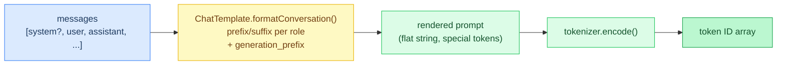
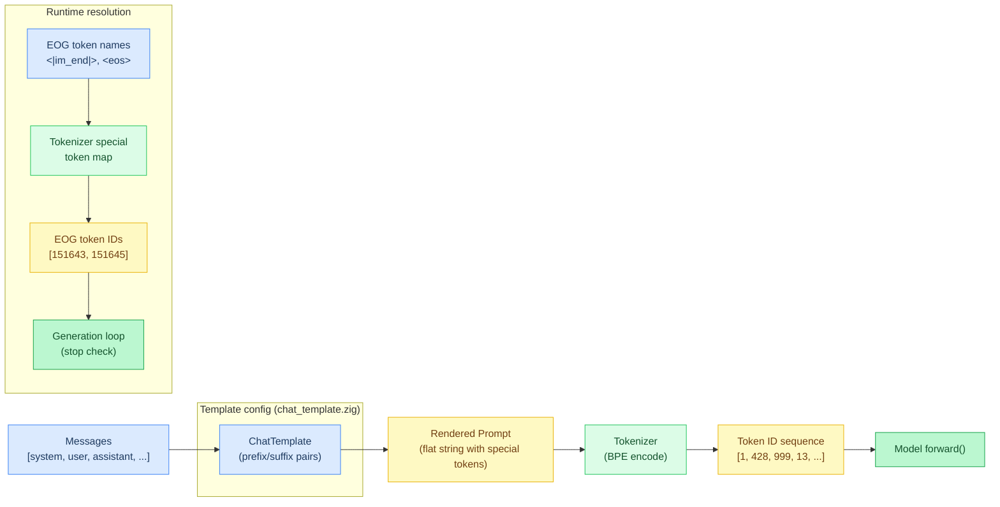
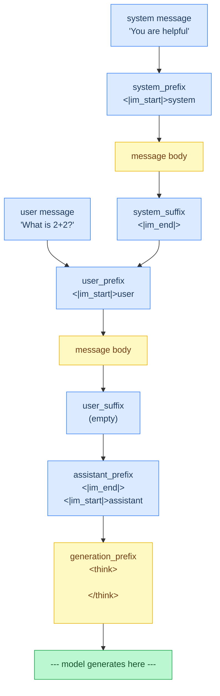
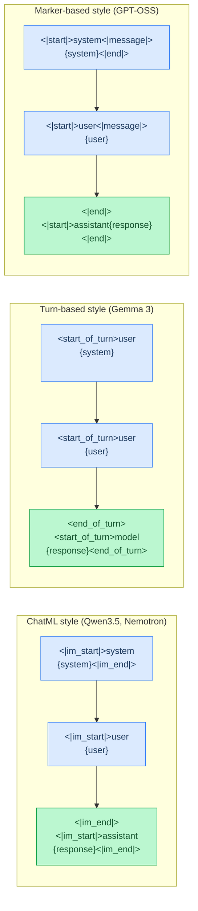
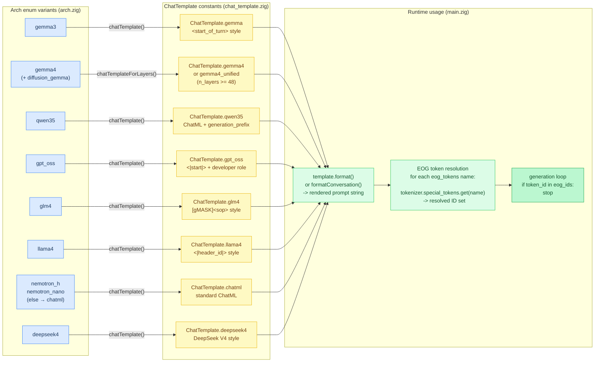
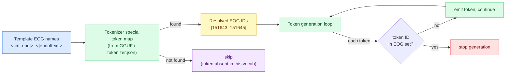
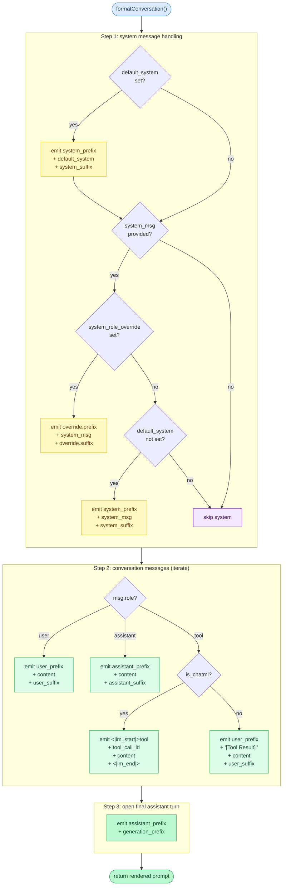
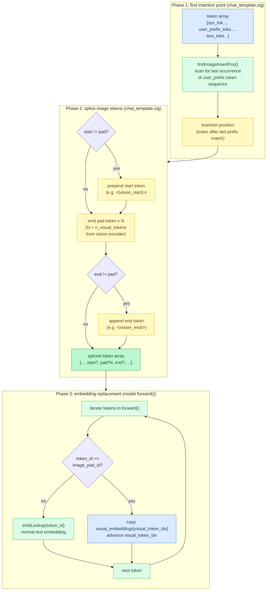

# Chapter 15: Chat Templates

**Prerequisites:** [Chapter 1: Tokens and Text](01-tokens-and-text.md) (tokenizer.encode(), special tokens)

**Time:** ~18 min

> After this chapter you can explain data-driven chat templates, EOG tokens, and how the server reuses template logic.

A chat model expects prompts in a specific format with special tokens marking roles (user, assistant, system). Hardcoding these in model code creates **tight coupling** and makes the codebase fragile. **Chat templates** are data-driven: role markers and end-of-generation tokens are **configuration**, not code.

## Code Flow



One call to `formatConversation()` turns a role-tagged messages array into the exact flat string the tokenizer expects, special tokens and all. The rest of this chapter is about what that one function does per architecture.

## The Problem: Hardcoded Prompt Formatting



**Bad pattern** (don't do this):

```text
# hardcoded in qwen35.zig
formatPrompt(user_msg):
    return "<|im_start|>user\n" + user_msg + "<|im_end|>\n<|im_start|>assistant\n"

# hardcoded end-of-generation check
isEOG(token_id):
    return token_id == 151643 or token_id == 151645   # <|im_end|>, <|endoftext|>
```

**Problems:**

1. **Non-portable:** Different models use different markers (GPT-OSS uses `<|start|>`, Gemma uses `<start_of_turn>`)
2. **Duplicate logic:** Every model file has its own prompt builder
3. **Brittle:** EOG token IDs change between model versions
4. **Unmaintainable:** Adding multi-turn chat requires editing every model

## The Solution: Data-Driven Templates

**Template structure:**

```text
ChatTemplate:
  system_prefix: string
  system_suffix: string
  user_prefix: string
  user_suffix: string
  assistant_prefix: string
  assistant_suffix: string
  eog_tokens: string list        # token names, not IDs
  default_system: string? = null
  system_role_override: { prefix: string, suffix: string }? = null
  generation_prefix: string = ""
```

**Implementation:** [`src/chat_template.zig`](../../src/chat_template.zig) (`ChatTemplate`)

**Example template** (ChatML, used by Qwen3.5):

```text
qwen35 = ChatTemplate{
  system_prefix = "<|im_start|>system\n"
  system_suffix = "<|im_end|>\n"
  user_prefix = "<|im_start|>user\n"
  user_suffix = ""
  assistant_prefix = "<|im_end|>\n<|im_start|>assistant\n"
  assistant_suffix = "<|im_end|>\n"
  eog_tokens = ["<|im_end|>", "<|endoftext|>"]
  generation_prefix = "<think>\n\n</think>\n\n"   # suppress reasoning
}
```

**Note:** `user_suffix` is empty because `assistant_prefix` already includes `<|im_end|>\n` — the end-of-user marker is baked into the transition.

## Template Usage

Each role (system, user, assistant) is wrapped in a pair of prefix and suffix strings. The diagram below shows how a single-turn ChatML prompt assembles from template fields into the flat string the model receives.



### Single-Turn Prompt

```text
template = ChatTemplate.qwen35
prompt = template.format(
    system_msg = "You are a helpful assistant.",
    user_msg = "What is 2+2?",
)

# result:
# <|im_start|>system
# You are a helpful assistant.<|im_end|>
# <|im_start|>user
# What is 2+2?<|im_end|>
# <|im_start|>assistant
# <think>
#
# </think>
```

**Implementation:** [`src/chat_template.zig`](../../src/chat_template.zig) (`ChatTemplate.format`)

**Note:** `generation_prefix` is only appended **after the final assistant prefix** when generating a response, not for past assistant messages in conversation history.

### Multi-Turn Conversation

```text
messages = [
    { role: user,      content: "Hello!" },
    { role: assistant, content: "Hi there!" },
    { role: user,      content: "How are you?" },
]

prompt = template.formatConversation(system_msg = null, messages)

# result:
# <|im_start|>user
# Hello!<|im_end|>
# <|im_start|>assistant
# Hi there!<|im_end|>
# <|im_start|>user
# How are you?<|im_end|>
# <|im_start|>assistant
# <think>
#
# </think>
```

**Implementation:** [`src/chat_template.zig`](../../src/chat_template.zig) (`ChatTemplate.formatConversation`)

## Architecture-Specific Templates

**Each model architecture has its own template** (defined in `src/chat_template.zig`). The three major styles differ in which special tokens they use to delimit turns.



### Gemma 3

```text
gemma = ChatTemplate{
  system_prefix = "<start_of_turn>user\n"   # no dedicated system role
  system_suffix = "\n\n"
  user_prefix = "<start_of_turn>user\n"
  user_suffix = ""
  assistant_prefix = "<end_of_turn>\n<start_of_turn>model\n"
  assistant_suffix = "<end_of_turn>\n"
  eog_tokens = ["<end_of_turn>", "<eos>"]
}
```

**Implementation:** [`src/chat_template.zig`](../../src/chat_template.zig) (`ChatTemplate.gemma`)

**Note:** Gemma doesn't have a separate system role — system messages use the user prefix. The `assistant_prefix` includes `<end_of_turn>\n` to close the prior turn before opening the model turn.

### Gemma 4

```text
gemma4 = ChatTemplate{
  system_prefix = "<|turn>system\n"
  system_suffix = "<turn|>\n"
  user_prefix = "<|turn>user\n"
  user_suffix = "<turn|>\n"
  assistant_prefix = "<|turn>model\n"
  assistant_suffix = "<turn|>\n"
  eog_tokens = ["<turn|>", "<eos>", "<channel|>", "<|endoftext|>", "<|end|>"]
  generation_prefix = "<|channel>0\n<channel|>"
}
```

**Implementation:** [`src/chat_template.zig`](../../src/chat_template.zig) (`ChatTemplate.gemma4`)

**Note:** Gemma 4 uses a channel system. `generation_prefix` selects channel 0 (direct answer) and closes it immediately, preventing reasoning tokens.

### GPT-OSS

```text
gpt_oss = ChatTemplate{
  system_prefix = "<|start|>system<|message|>"
  system_suffix = "<|end|>"
  user_prefix = "<|start|>user<|message|>"
  user_suffix = ""
  assistant_prefix = "<|end|><|start|>assistant"
  assistant_suffix = "<|end|>"
  eog_tokens = ["<|end|>", "<|endoftext|>"]
  default_system = "You are a helpful assistant.\n"
                  + "Reasoning: medium\n"
                  + "# Valid channels: analysis, commentary, final. "
                  + "Channel must be included for every message."
  system_role_override = {
    prefix = "<|start|>developer<|message|># Instructions\n"
    suffix = "<|end|>"
  }
}
```

**Implementation:** [`src/chat_template.zig`](../../src/chat_template.zig) (`ChatTemplate.gpt_oss`)

**Note:** GPT-OSS uses `<|start|>`/`<|end|>` markers (not Llama-style headers). It has both a `default_system` message and a `system_role_override` — user-provided system messages are formatted as "developer" instructions.

### GLM-4

```text
glm4 = ChatTemplate{
  system_prefix = "[gMASK]<sop>"
  system_suffix = ""
  user_prefix = "<|user|>"
  user_suffix = ""
  assistant_prefix = "<|assistant|>\n"
  assistant_suffix = ""
  eog_tokens = ["<|endoftext|>", "<|user|>", "<|observation|>"]
  default_system = ""
  generation_prefix = ""
  system_role_override = {
    prefix = "<|system|>\n"
    suffix = ""
  }
}
```

**Implementation:** [`src/chat_template.zig`](../../src/chat_template.zig) (`ChatTemplate.glm4`)

**Note:** GLM-4 uses `[gMASK]<sop>` as the initial BOS marker. The `system_role_override` maps user-provided system messages to the `<|system|>` role. Reasoning is disabled by default — GLM-4 has no generation prefix.

### Nemotron-H / Nemotron-Nano (ChatML)

Both use the default ChatML template, via the `else` fallback in `arch.zig`:

```text
chatml = ChatTemplate{
  system_prefix = "<|im_start|>system\n"
  system_suffix = "<|im_end|>\n"
  user_prefix = "<|im_start|>user\n"
  user_suffix = ""
  assistant_prefix = "<|im_end|>\n<|im_start|>assistant\n"
  assistant_suffix = "<|im_end|>\n"
  eog_tokens = ["<|im_end|>", "<|endoftext|>"]
}
```

**Implementation:** [`src/chat_template.zig`](../../src/chat_template.zig) (`ChatTemplate.chatml`)

## Template Selection

The `Arch` enum is the dispatch point for chat templates. Most architectures map to one base `ChatTemplate` via `chatTemplate()`. Gemma 4 is the exception: `chatTemplateForLayers(n_layers)` returns `ChatTemplate.gemma4_unified` when `n_layers >= 48` (thinking-channel prefix), otherwise plain `gemma4`. DiffusionGemma shares the base `gemma4` template. The chosen template then flows through formatting into EOG resolution and the generation loop.



**Architecture determines template:**

```text
chatTemplate(self: Arch) -> ChatTemplate:
    switch self:
        gemma3               -> ChatTemplate.gemma
        gemma4, diffusion_gemma -> ChatTemplate.gemma4
        gpt_oss               -> ChatTemplate.gpt_oss
        qwen35                -> ChatTemplate.qwen35
        glm4                  -> ChatTemplate.glm4
        deepseek4             -> ChatTemplate.deepseek4
        llama4                -> ChatTemplate.llama4
        else                  -> ChatTemplate.chatml   # Nemotron-H, Nemotron-Nano

chatTemplateForLayers(self: Arch, n_layers) -> ChatTemplate:
    if self == gemma4 and n_layers >= 48:
        return ChatTemplate.gemma4_unified   # thinking-channel prefix
    return self.chatTemplate()
```

**Implementation:** [`src/arch.zig`](../../src/arch.zig) (`Arch.chatTemplate`, `Arch.chatTemplateForLayers`)

**Main loop uses the layer-aware selector when layer count is known:**

```text
arch = Arch.detect(fmt) orelse error UnknownArch
template = arch.chatTemplateForLayers(n_layers)

prompt = if args.system_msg:
             template.format(args.system_msg, args.user_msg)
         else:
             template.format(null, args.user_msg)
```

**Implementation:** [`src/main.zig`](../../src/main.zig) (`chatTemplateForLayers` call sites)

**No model-specific code needed** — the architecture enum handles it.

## End-of-Generation Token Detection

**Templates define EOG tokens by name**, not by ID. The tokenizer resolves them at runtime.



### Template Definition

```text
eog_tokens = ["<|im_end|>", "<|endoftext|>"]
```

### Tokenizer Lookup

At startup, the engine looks up each EOG token name in the tokenizer's special token
map (loaded from GGUF metadata or `tokenizer.json`):

```text
tmpl = arch.chatTemplate()
for eog_name in tmpl.eog_tokens:
    if id = tok.special_tokens.get(eog_name):
        if not isEogToken(id, eog) and eog.len < eog.ids.len:
            eog.ids[eog.len] = id
            eog.len += 1
```

**Implementation:** [`src/main.zig`](../../src/main.zig) (EOG token resolution)

During generation, each produced token is checked against the resolved EOG IDs to
detect when the model signals end-of-generation.

**Why token names?** Token IDs vary between tokenizers (e.g., same model with different vocab files). Token names are stable.

## Special Features

### Default System Message

Some models inject a **fixed system message** before the user's system prompt.

**Example:** GPT-OSS includes a default system prompt with reasoning instructions:

```text
gpt_oss = ChatTemplate{
  system_prefix = "<|start|>system<|message|>"
  system_suffix = "<|end|>"
  ...
  default_system = "You are a helpful assistant.\nReasoning: medium\n# Valid channels: ..."
}
```

**Behavior:** When no user-provided system message is given, `default_system` is used automatically. When the user does provide a system message AND `system_role_override` exists, the user's message is formatted using the override (as a "developer" instruction in GPT-OSS's case), while `default_system` remains.

### System Role Override

Some models route user-provided system messages through a different role.

**Example:** GPT-OSS maps user system messages to a "developer" role:

```text
system_role_override = {
  prefix = "<|start|>developer<|message|># Instructions\n"
  suffix = "<|end|>"
}
```

**Example:** GLM-4 maps user system messages to `<|system|>`:

```text
system_role_override = {
  prefix = "<|system|>\n"
  suffix = ""
}
```

**When to use:** The template has a default system prompt (`default_system`) but still wants to accept user-provided system text through a different role prefix.

### Generation Prefix

**Qwen3.5 reasoning suppression:** Empty `<think>` block disables reasoning (greedy decoding makes open-ended reasoning unstable).

```text
qwen35 = ChatTemplate{
  ...
  generation_prefix = "<think>\n\n</think>\n\n"
}
```

**Applied only to the final assistant turn:**

```
// Past assistant message (in conversation history)
<|im_end|>
<|im_start|>assistant
Previous response<|im_end|>

// New assistant response (generation)
<|im_end|>
<|im_start|>assistant
<think>

</think>

<-- generation starts here
```

**Why?** Past assistant messages are complete — they don't need reasoning suppression. Only the **new generation** needs the empty think block.

## Implementation Details

### Format Function

```text
format(self: ChatTemplate, system_msg: string?, user_msg: string) -> string:
    return self.formatConversation(system_msg, [{ role: user, content: user_msg }])
```

**Implementation:** [`src/chat_template.zig`](../../src/chat_template.zig) (`ChatTemplate.format`)

### formatConversation() Control Flow

The function has three branching paths for system messages and a special branch for tool-role messages:



### Multi-Turn Format Function

```text
formatConversation(self: ChatTemplate, system_msg: string?, messages: Message[]) -> string:
    result = ""

    # 1. fixed default system message
    if ds = self.default_system:
        result += self.system_prefix + ds + self.system_suffix

    # 2. user-provided system message (if no default or role override exists)
    if sys = system_msg:
        if role = self.system_role_override:
            result += role.prefix + sys + role.suffix
        else if self.default_system == null:
            result += self.system_prefix + sys + self.system_suffix

    # 3. conversation messages
    for msg in messages:
        switch msg.role:
            user:
                result += self.user_prefix + msg.content + self.user_suffix
            assistant:
                result += self.assistant_prefix + msg.content + self.assistant_suffix
            tool:
                if is_chatml:
                    result += "<|im_start|>tool\n"
                    if tcid = msg.tool_call_id:
                        result += tcid + "\n"
                    result += msg.content + "<|im_end|>\n"
                else:
                    result += self.user_prefix + "[Tool Result] " + msg.content + self.user_suffix

    # 4. final assistant prefix for generation
    result += self.assistant_prefix + self.generation_prefix

    return result
```

**Implementation:** [`src/chat_template.zig`](../../src/chat_template.zig) (`ChatTemplate.formatConversation`)

## Benefits of Data-Driven Templates

### Maintainability

- **Single source of truth:** All prompt formatting logic in `chat_template.zig`
- **Easy to add models:** Define a template, map it in `arch.zig`, done
- **No model code changes:** Adding multi-turn support doesn't touch model files

### Testability

```text
test "chatml format basic":
    result = ChatTemplate.chatml.format(system_msg = null, user_msg = "Hi")
    assert result == "<|im_start|>user\nHi<|im_end|>\n<|im_start|>assistant\n"
```

### Flexibility

- Different tokenizers -> resolve EOG token IDs at runtime
- Different model versions -> template stays the same
- Custom models -> user can define their own template

## Common Patterns

### ChatML-Style (Im Tags)

Used by: Nemotron-H, Nemotron-Nano (Qwen3.5 uses a variant with `generation_prefix`)

```text
system_prefix = "<|im_start|>system\n"
system_suffix = "<|im_end|>\n"
user_prefix = "<|im_start|>user\n"
user_suffix = ""
assistant_prefix = "<|im_end|>\n<|im_start|>assistant\n"
assistant_suffix = "<|im_end|>\n"
```

### Turn-Based (Gemma 3)

```text
system_prefix = "<start_of_turn>user\n"
system_suffix = "\n\n"
user_prefix = "<start_of_turn>user\n"
user_suffix = ""
assistant_prefix = "<end_of_turn>\n<start_of_turn>model\n"
assistant_suffix = "<end_of_turn>\n"
```

### Marker-Based (GPT-OSS)

```text
system_prefix = "<|start|>system<|message|>"
system_suffix = "<|end|>"
user_prefix = "<|start|>user<|message|>"
user_suffix = ""
assistant_prefix = "<|end|><|start|>assistant"
assistant_suffix = "<|end|>"
```

## Image Token Injection (Multimodal)

When an image is attached to a prompt, the tokenized text needs image placeholder tokens spliced in at the right position. The chat template system handles this through two functions: `findImageInsertPos()` and `injectImageTokens()`.

The pipeline spans three functions across two files: `findImageInsertPos()` and `injectImageTokens()` in `chat_template.zig`, and the embedding replacement in the model's `forward()`.



### Finding the Insertion Point

`findImageInsertPos()` scans the token array for the **last occurrence** of the user-turn prefix token sequence (e.g., the tokens for `<start_of_turn>user\n`), then returns the position immediately after that match. Using the last occurrence avoids false positives when individual prefix tokens (like `\n`) appear earlier in the prompt (e.g., in the system section):

```text
findImageInsertPos(tokens: u32[], prefix_seq: u32[]) -> usize:
    if prefix_seq.len == 0: return 0
    last_match = 0
    if tokens.len >= prefix_seq.len:
        for i in 0..(tokens.len - prefix_seq.len + 1):
            if tokens[i..][0..prefix_seq.len] == prefix_seq:
                last_match = i + prefix_seq.len
    return last_match
```

**Implementation:** [`src/chat_template.zig`](../../src/chat_template.zig) (`findImageInsertPos`)

### Injecting the Image Sequence

`injectImageTokens()` splices a sequence of `[start, pad, pad, ..., pad, end]` tokens at the insertion point. The pad tokens are repeated `n_visual_tokens` times (determined by the vision encoder's output patch count). During `forward()`, whenever the model encounters a pad token ID, it replaces the normal embedding lookup with the corresponding visual embedding from the vision encoder output.

### Architecture-Specific Image Tokens

Different model architectures use different special tokens for image placeholders:

| Architecture | Start Token | End Token | Pad Token | Notes |
|---|---|---|---|---|
| Gemma 4 | `<\|image\|>` (258880) | `<\|image\|>` (258880) | `<\|image\|>` (258880) | Single token for all three roles |
| Gemma 3 | `` (219) | `` (219) | `` (219) | Single token for all three roles |
| Qwen 3.5 | `<\|vision_start\|>` (248053) | `<\|vision_end\|>` (248054) | `<\|image_pad\|>` (248056) | Three distinct tokens |

When start equals pad (Gemma 4), `injectImageTokens()` omits the start wrapper to avoid the model consuming the start token as a visual embedding — it just injects `pad × N` (no separate start or end):

```text
# architecture-aware wrapping
has_distinct_start = (image_tokens.start != image_tokens.pad)
has_distinct_end = (image_tokens.end != image_tokens.pad)
prefix_len = 1 if has_distinct_start else 0
suffix_len = 1 if has_distinct_end else 0
```

**Implementation:** [`src/chat_template.zig`](../../src/chat_template.zig) (`injectImageTokens`)

### Embedding Replacement During Forward

The image tokens are not just markers — they trigger embedding replacement in the model's forward pass. When `forward()` encounters a pad token ID, it copies the next visual embedding vector from the vision encoder output instead of performing the normal embedding table lookup:

```text
# forward() embedding replacement
if vis_embd = self.image_embeddings:
    if token_id == self.image_pad_token_id:
        idx = self.visual_token_idx
        offset = idx * self.n_embd
        self.hidden = vis_embd[offset..][0..self.n_embd]
        self.visual_token_idx = idx + 1
        is_image_token = true

if not is_image_token:
    self.embLookup(token_id)   # normal text embedding
```

**Implementation:** [`src/models/gemma4.zig`](../../src/models/gemma4.zig) (`forward`, image embedding replacement)

The visual embeddings are set before generation via `model.setImageEmbeddings()`, which stores the vision encoder's output buffer and the pad token ID. The `visual_token_idx` counter advances through the visual embeddings one token at a time, ensuring each pad token gets the correct patch embedding.

## Tool Calling

Tool/function calling is supported via the HTTP API. When tools are present in a request, tool definitions are injected into the system prompt. The model outputs tool calls wrapped in `<tool_call>` tags, which the server parses into structured `tool_calls` responses.

Tool results are sent back as messages with `role: "tool"` and a `tool_call_id` field. The `Message` struct includes:

```text
Message:
  role: Role
  content: string
  tool_call_id: string? = null
```

**Implementation:** [`src/chat_template.zig`](../../src/chat_template.zig) (`Message`)

For ChatML models (Qwen3.5, Nemotron), tool results are formatted as:
```
<|im_start|>tool
call_123_0
{"temp": 18, "condition": "cloudy"}<|im_end|>
```

See [API.md — Tool Calling](../API.md#tool-calling) for request/response format and usage examples.

## Gotchas

- **`user_suffix` being empty isn't a bug to "fix."** The `qwen35` template leaves `user_suffix` empty because the end-of-user marker is already folded into `assistant_prefix` (`<|im_end|>\n<|im_start|>assistant\n`, see the qwen35 example above). Adding a closing tag to `user_suffix` when porting a new ChatML-style model duplicates it in every rendered prompt instead of erroring, since `formatConversation()` just concatenates strings with no validation.
- **`generation_prefix` belongs only on the final assistant turn, not on every assistant message.** `formatConversation()` appends it exactly once, after the last `assistant_prefix` at the end of the function (see formatConversation() Control Flow above), not inside the per-message loop. Wiring it into the loop instead would re-inject Qwen3.5's empty `<think>` block into completed conversation history the model was never trained to see mid-conversation.

[Chapter 23: Server / HTTP API](23-server-http-api.md) hands `formatConversation()` a messages array parsed from an incoming HTTP request instead of a CLI argument; the server never reimplements templating, it calls the exact same per-architecture function this chapter describes.

## Future Extensions

**Potential additions** (not yet implemented):

- **Jinja2 template support:** Parse HuggingFace's `.jinja` templates directly
- **Multi-modal:** Audio/video markers (image tokens already supported via SigLIP-2)
- **Custom templates via CLI:** `--template path/to/template.json`

---

**In the code:** [src/chat_template.zig](../../src/chat_template.zig) (template definitions and format functions), [src/arch.zig](../../src/arch.zig) (architecture -> template mapping), [src/main.zig](../../src/main.zig) (EOG token resolution)

**Related:** [Tokenization](01-tokens-and-text.md) (how tokens are encoded/decoded)

**Next:** [Chapter 16: Recipe System →](16-recipe-system.md) | **Back:** [Chapter 14: Format Conventions ←](14-format-conventions.md) | **Product docs:** [Models](../MODELS.md)

---

## Glossary

**chat template** — A data-driven configuration mapping conversation roles to special-token-delimited prefix/suffix strings, replacing hardcoded prompt formatting.

**ChatML** — A chat formatting convention using `<|im_start|>` / `<|im_end|>` markers, adopted by Qwen, Nemotron, and other models.

**default_system** — A fixed system message baked into the template, used when the user supplies none.

**EOG token (end-of-generation)** — A special token whose presence in output signals that generation should stop.

**findImageInsertPos()** — A function that scans a token array for the last user-prefix token sequence and returns the position after it.

**formatConversation()** — The main template function rendering a multi-turn conversation into a flat prompt string.

**generation_prefix** — A string appended after the final assistant prefix before generation begins; used to control model reasoning behavior.

**image token injection** — Splicing visual placeholder tokens into a tokenized prompt so the model can replace them with vision-encoder embeddings.

**injectImageTokens()** — A function that splices image placeholder tokens (start + N×pad + end) at a computed insertion point.

**pad token (image)** — A placeholder token repeated once per visual patch, whose embedding is replaced at runtime by vision-encoder output.

**role marker** — A special token or string identifying who is speaking in a multi-turn conversation (system, user, assistant, tool).

**system_role_override** — A template field re-routing system messages through a different role prefix (e.g., "developer" in GPT-OSS).

**tight coupling** — Embedding format details directly in model code, making changes fragile and non-portable.
