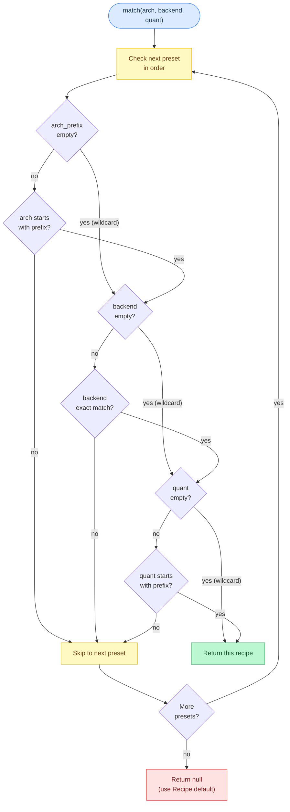
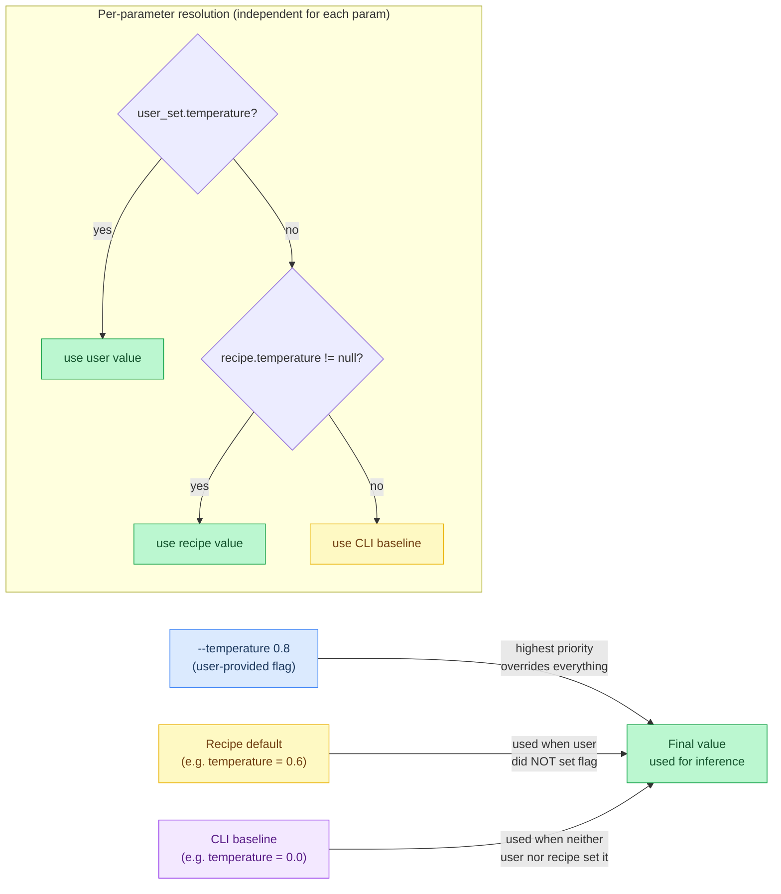
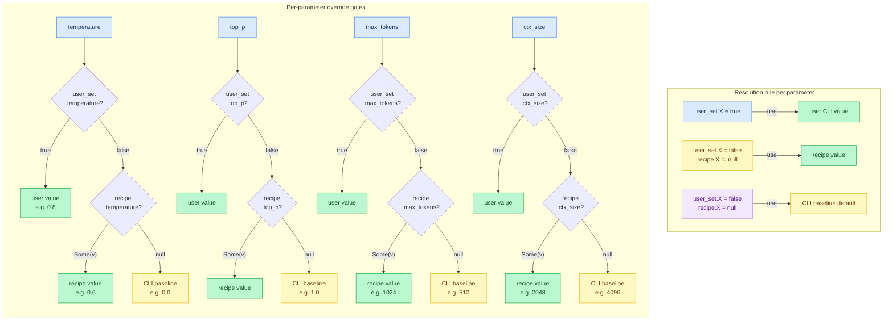
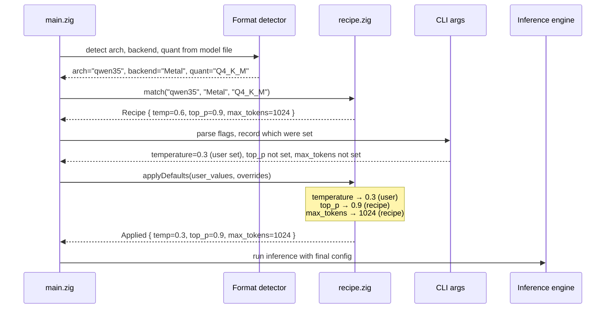
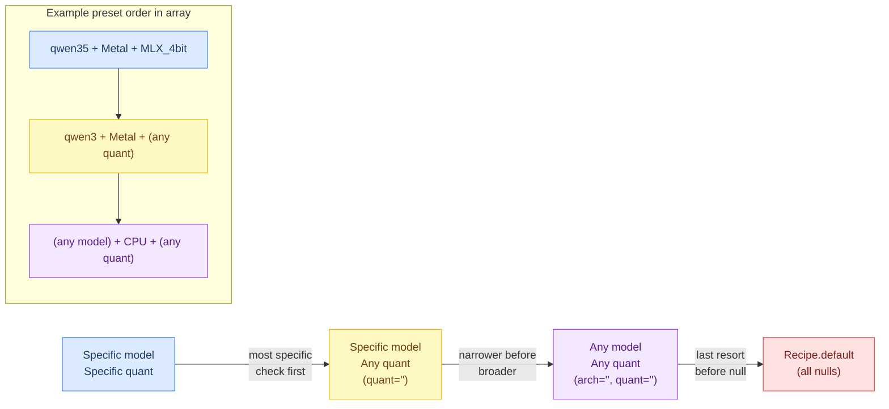

# Chapter 16: Recipe System

**Prerequisites:** [Chapter 7: Sampling](07-sampling.md), [Chapter 15: Chat Templates](15-chat-templates.md) (both helpful, not required)

**Time:** ~15 min

Every model + hardware combination has **different optimal settings**. A small Qwen3.5 4-bit model on Apple Silicon might run best with creative sampling (temp=0.7), while a large MoE on CPU needs conservative defaults (ctx_size=2048) to avoid OOM. Hardcoding these in model code creates **configuration sprawl**.

The **recipe system** provides **proven defaults** for specific scenarios while **preserving user control** — CLI flags always override recipe values.

## The Problem: Configuration Sprawl

**Bad pattern** (scattered magic numbers):

```zig
// In qwen35.zig
const default_temperature = 0.6;
const default_ctx = 4096;

// In gemma3.zig
const default_temperature = 0.7;
const default_ctx = 8192;

// In main.zig
const cli_temp = args.temperature orelse model.default_temperature;
```

**Problems:**

1. **Duplication:** Every model has its own defaults
2. **No hardware awareness:** CPU and Metal get the same defaults (wrong)
3. **Unmaintainable:** Changing defaults requires editing multiple files
4. **User override is unclear:** Does `--temperature 0.5` override model default or recipe default?

## The Solution: Data-Driven Recipes

A **recipe** is a named set of optional parameter defaults matched by **architecture + backend + quantization**.

### Recipe Structure

```zig
pub const Recipe = struct {
    name: []const u8 = "default",
    temperature: ?f32 = null,
    top_p: ?f32 = null,
    top_k: ?u32 = null,
    repeat_penalty: ?f32 = null,
    max_tokens: ?u32 = null,
    ctx_size: ?u32 = null,
};
```

**Key insight:** All fields are `?T` (optional). `null` means "use the CLI default / model default".

### Recipe and Applied Data Model

The `Recipe` struct holds optional fields; the resolved `Applied` struct holds concrete values after merging CLI flags, recipe defaults, and CLI baselines.

```mermaid
graph TD
    classDef setup     fill:#dbeafe,stroke:#3b82f6,color:#1e3a5f
    classDef sync      fill:#dcfce7,stroke:#22c55e,color:#14532d
    classDef migration fill:#fef9c3,stroke:#eab308,color:#713f12
    classDef success   fill:#bbf7d0,stroke:#16a34a,color:#14532d
    classDef danger    fill:#fee2e2,stroke:#ef4444,color:#7f1d1d
    classDef optional  fill:#f3e8ff,stroke:#9333ea,color:#581c87

    subgraph RecipeStruct["Recipe struct (all fields optional)"]
        direction TB
        R1["name: []const u8\n= 'default'"]:::setup
        R2["temperature: ?f32\n= null"]:::setup
        R3["top_p: ?f32\n= null"]:::setup
        R4["top_k: ?u32\n= null"]:::setup
        R5["repeat_penalty: ?f32\n= null"]:::setup
        R6["max_tokens: ?u32\n= null"]:::setup
        R7["ctx_size: ?u32\n= null"]:::setup
    end

    subgraph AppliedStruct["Applied struct (all fields concrete after resolution)"]
        direction TB
        A1["temperature: f32"]:::success
        A2["top_p: f32"]:::success
        A3["top_k: u32"]:::success
        A4["repeat_penalty: f32"]:::success
        A5["max_tokens: u32"]:::success
        A6["ctx_size: u32"]:::success
    end

    subgraph Overrides["Overrides struct (tracks what the user set via CLI)"]
        direction TB
        O1["temperature: bool = false"]:::migration
        O2["top_p: bool = false"]:::migration
        O3["top_k: bool = false"]:::migration
        O4["repeat_penalty: bool = false"]:::migration
        O5["max_tokens: bool = false"]:::migration
        O6["ctx_size: bool = false"]:::migration
    end

    RecipeStruct -->|"applyDefaults(cli_values, overrides)"| AppliedStruct
    Overrides -->|"gates each field independently"| AppliedStruct
```



### Preset Recipes

```zig
const presets = [_]Preset{
    // Small models on Metal — responsive chat defaults
    .{
        .arch_prefix = "qwen3",
        .backend = "Metal",
        .quant = "Q4",
        .recipe = .{
            .name = "Qwen3.5 Q4 Metal",
            .temperature = 0.6,
            .top_p = 0.9,
            .repeat_penalty = 1.1,
            .max_tokens = 1024,
            // ctx_size = null (use model default)
        },
    },
    .{
        .arch_prefix = "gemma",
        .backend = "Metal",
        .quant = "Q4",
        .recipe = .{
            .name = "Gemma Q4 Metal",
            .temperature = 0.7,
            .top_p = 0.95,
            .repeat_penalty = 1.05,
            .max_tokens = 1024,
        },
    },
    // Large MoE on Metal — conservative to avoid OOM
    .{
        .arch_prefix = "gpt",
        .backend = "Metal",
        .quant = "",  // Any quantization
        .recipe = .{
            .name = "GPT-OSS Metal",
            .temperature = 0.5,
            .top_p = 0.9,
            .max_tokens = 512,
            .ctx_size = 2048,  // Limit context to prevent OOM
        },
    },
    // GLM-4 — needs repeat penalty to avoid greedy loops
    .{
        .arch_prefix = "glm4",
        .backend = "",
        .quant = "",
        .recipe = .{
            .name = "GLM-4 generic",
            .temperature = 0.7,
            .repeat_penalty = 1.1,
            .max_tokens = 1024,
        },
    },
    // CPU-only — smaller batches, lower context
    .{
        .arch_prefix = "",  // Any model
        .backend = "CPU",
        .quant = "",
        .recipe = .{
            .name = "CPU generic",
            .max_tokens = 256,
            .ctx_size = 2048,
            // temperature/top_p = null (use CLI defaults)
        },
    },
};
```

### Matching Logic

Each preset is tested in order against three criteria. Empty strings act as wildcards, so a preset can match any arch, any backend, or any quant independently.



```zig
pub fn match(arch: []const u8, backend: []const u8, quant: []const u8) ?Recipe {
    for (presets) |p| {
        if (p.matches(arch, backend, quant)) return p.recipe;
    }
    return null;  // No match → use Recipe.default (all nulls)
}

fn matches(self: Preset, arch: []const u8, be: []const u8, q: []const u8) bool {
    // Empty string = wildcard (matches anything)
    if (self.arch_prefix.len > 0 and !std.mem.startsWith(u8, arch, self.arch_prefix)) return false;
    if (self.backend.len > 0 and !std.mem.eql(u8, be, self.backend)) return false;
    if (self.quant.len > 0 and !std.mem.startsWith(u8, q, self.quant)) return false;
    return true;
}
```

**Matching rules:**

- Empty string = wildcard (matches any value)
- `arch_prefix` matches via prefix (`"qwen3"` matches `"qwen35"`)
- `quant` matches via prefix (`"Q4"` matches `"Q4_K_M"`, `"Q4_0"`, etc.)
- `backend` requires exact match (`"Metal"` ≠ `"metal"`)

**Priority:** First match wins. Order presets from **most specific to most general**.

## User Override Semantics

**Golden rule:** User CLI flags **always** override recipe defaults. Each parameter resolves independently through a three-level priority chain.



### Override Tracking

```zig
pub const Overrides = struct {
    temperature: bool = false,
    top_p: bool = false,
    top_k: bool = false,
    repeat_penalty: bool = false,
    max_tokens: bool = false,
    ctx_size: bool = false,
};
```

**Set in main.zig:**

```zig
var overrides = Recipe.Overrides{};

// Parse CLI args
if (args.temperature) |t| {
    overrides.temperature = true;
    temperature = t;
}
if (args.top_p) |p| {
    overrides.top_p = true;
    top_p = p;
}
// ... etc
```

### Override Flag Mapping

Each `Overrides` boolean gates the three-way resolution for its parameter independently.



### Applying Defaults

```zig
pub fn applyDefaults(
    self: Recipe,
    temperature: f32,      // Current value (CLI default or user-provided)
    top_p: f32,
    top_k: u32,
    repeat_penalty: f32,
    max_tokens: u32,
    ctx_size: u32,
    user_set: Overrides,   // Which values the user explicitly set
) Applied {
    return .{
        // If user set temperature → use user value
        // Else if recipe has temperature → use recipe value
        // Else → use CLI default
        .temperature = if (user_set.temperature)
            temperature
        else
            self.temperature orelse temperature,

        .top_p = if (user_set.top_p) top_p else self.top_p orelse top_p,
        .top_k = if (user_set.top_k) top_k else self.top_k orelse top_k,
        .repeat_penalty = if (user_set.repeat_penalty) repeat_penalty else self.repeat_penalty orelse repeat_penalty,
        .max_tokens = if (user_set.max_tokens) max_tokens else self.max_tokens orelse max_tokens,
        .ctx_size = if (user_set.ctx_size) ctx_size else self.ctx_size orelse ctx_size,
    };
}
```

**Precedence (highest to lowest):**

1. **User CLI flag** (e.g., `--temperature 0.8`)
2. **Recipe default** (e.g., `temperature = 0.6`)
3. **CLI default** (e.g., `temperature = 0.0` for greedy)

## Usage Flow

### In main.zig

Five sequential steps connect the model file to the final inference config. Steps 1-2 happen before CLI parsing; step 4 merges recipe values only where the user left gaps.



```zig
// 1. Detect architecture, backend, quantization
const arch = try Arch.detect(fmt);
const backend_name = if (args.backend) |b| b else detectDefaultBackend();
const quant = detectQuantization(fmt);

// 2. Match recipe
const recipe = Recipe.match(arch.displayName(), backend_name, quant) orelse Recipe.default;

std.log.info("Using recipe: {s}", .{recipe.name});

// 3. Parse CLI args, track overrides
var overrides = Recipe.Overrides{};
var temperature: f32 = 0.0;  // CLI default
var top_p: f32 = 1.0;
// ... etc

if (args.temperature) |t| {
    overrides.temperature = true;
    temperature = t;
}
if (args.top_p) |p| {
    overrides.top_p = true;
    top_p = p;
}
// ... etc

// 4. Apply recipe defaults (respecting user overrides)
const cfg = recipe.applyDefaults(
    temperature, top_p, top_k, repeat_penalty, max_tokens, ctx_size,
    overrides
);

// 5. Use cfg values
std.log.info("Temperature: {d}, Top-P: {d}, Max tokens: {d}",
    .{cfg.temperature, cfg.top_p, cfg.max_tokens});
```

### Example: Qwen3.5 Q4 on Metal

**Scenario 1: User provides no flags**

```bash
./agave qwen35-4bit.gguf "Hello!"
# Matches: "Qwen3.5 Q4 Metal" recipe
# Temperature: 0.6 (from recipe)
# Top-P: 0.9 (from recipe)
# Max tokens: 1024 (from recipe)
```

**Scenario 2: User overrides temperature**

```bash
./agave qwen35-4bit.gguf --temperature 0.3 "Hello!"
# Matches: "Qwen3.5 Q4 Metal" recipe
# Temperature: 0.3 (USER OVERRIDE)
# Top-P: 0.9 (from recipe)
# Max tokens: 1024 (from recipe)
```

**Scenario 3: User overrides all values**

```bash
./agave qwen35-4bit.gguf -t 0.8 --top-p 0.95 -n 2048 "Hello!"
# Matches: "Qwen3.5 Q4 Metal" recipe (but all values overridden)
# Temperature: 0.8 (USER OVERRIDE)
# Top-P: 0.95 (USER OVERRIDE)
# Max tokens: 2048 (USER OVERRIDE)
# Recipe had no effect (user took full control)
```

## Recipe Design Guidelines

### When to Add a Recipe

✅ **Add a recipe when:**

- You've tested a model + hardware combo and found optimal settings
- The defaults differ significantly from global CLI defaults
- Users frequently ask "what settings should I use?"

❌ **Don't add a recipe for:**

- Untested configurations
- Settings that match CLI defaults anyway
- Personal preferences (recipes should be broadly applicable)

### Naming Conventions

- **Specific recipes:** `"Qwen3.5 Q4 Metal"`, `"Gemma 27B BF16 CUDA"`
- **Generic fallbacks:** `"CPU generic"`, `"Metal default"`

### Matching Specificity

**Order from most specific to most general:**

The preset array is a priority list. More constrained entries go first so they win before broader wildcards consume the match.



```zig
const presets = [_]Preset{
    // 1. Exact match: specific model + backend + quant
    .{ .arch_prefix = "qwen35", .backend = "Metal", .quant = "MLX_4bit", .recipe = ... },

    // 2. Model + backend (any quant)
    .{ .arch_prefix = "qwen3", .backend = "Metal", .quant = "", .recipe = ... },

    // 3. Backend-only (any model, any quant)
    .{ .arch_prefix = "", .backend = "CPU", .quant = "", .recipe = ... },

    // Recipe.default is the final fallback (all nulls)
};
```

**Why order matters:** First match wins. Specific recipes must come before generic ones.

### Optional vs Required Defaults

**Optional fields** (leave as `null`):

- Parameters the user commonly customizes (temperature, top_p)
- Values that vary widely by use case

**Provide defaults** (set explicitly):

- Memory-related settings (ctx_size for large models)
- Quality-of-life defaults (max_tokens, repeat_penalty)
- Known optimal values (temperature for specific models)

**Example:**

```zig
.recipe = .{
    .name = "GPT-OSS Metal",
    .temperature = 0.5,        // Set (model-specific optimal)
    .top_p = null,             // Omit (user should choose based on use case)
    .max_tokens = 512,         // Set (reasonable limit)
    .ctx_size = 2048,          // Set (prevents OOM on 64GB machines)
}
```

## Real-World Recipes

### CPU Generic (Conservative)

```zig
.{
    .arch_prefix = "",  // Any model
    .backend = "CPU",
    .quant = "",        // Any quantization
    .recipe = .{
        .name = "CPU generic",
        .max_tokens = 256,      // Faster generation
        .ctx_size = 2048,       // Lower memory
    },
}
```

**Rationale:** CPU is slower. Limit max_tokens for faster response. Lower ctx_size to fit in L3 cache.

### GPT-OSS (MoE, Conservative)

```zig
.{
    .arch_prefix = "gpt",
    .backend = "Metal",
    .quant = "",
    .recipe = .{
        .name = "GPT-OSS Metal",
        .temperature = 0.5,    // Lower temp for reasoning model
        .top_p = 0.9,
        .ctx_size = 2048,      // MoE uses more memory, limit context
        .max_tokens = 512,     // Prevent excessive generation
    },
}
```

**Rationale:** MoE models use more VRAM (8-16 experts). Limit context to prevent OOM. Lower temperature for reasoning tasks.

## Advanced Features

### Computed Defaults (Future)

**Potential:** Recipes could compute defaults based on available memory:

```zig
pub fn computeCtxSize(avail_mem: usize, model_size: usize) u32 {
    const kv_per_token = 256;  // Bytes per token (approx)
    const safe_mem = avail_mem * 0.7;  // Leave 30% free
    return @min(16384, (safe_mem - model_size) / kv_per_token);
}
```

**Not implemented** — recipes are currently static.

### User-Defined Recipes (Future)

**Potential:** Load recipes from JSON file:

```bash
./agave model.gguf --recipe my-recipe.json "prompt"
```

**Not implemented** — recipes are currently compile-time defined.

### Recipe Override CLI Flag (Future)

**Potential:** Disable recipe matching:

```bash
./agave model.gguf --no-recipe "prompt"
# Use pure CLI defaults, ignore all recipes
```

**Not implemented** — currently no way to disable matching.

## Testing Recipes

```zig
test "recipe match exact" {
    const r = Recipe.match("qwen35", "Metal", "Q4_K") orelse Recipe.default;
    try std.testing.expectEqualStrings("Qwen3.5 Q4 Metal", r.name);
    try std.testing.expectApproxEqAbs(@as(f32, 0.6), r.temperature.?, 0.001);
}

test "recipe match glm4 gets GLM-4 recipe" {
    const r = Recipe.match("glm4", "CPU", "Q4_0") orelse Recipe.default;
    try std.testing.expectEqualStrings("GLM-4 generic", r.name);
    try std.testing.expectApproxEqAbs(@as(f32, 1.1), r.repeat_penalty.?, 0.001);
}

test "recipe match falls through to CPU generic" {
    const r = Recipe.match("unknown_cpu_arch", "CPU", "Q4_0") orelse Recipe.default;
    try std.testing.expectEqualStrings("CPU generic", r.name);
}

test "recipe no match returns null" {
    const r = Recipe.match("unknown_arch", "Vulkan", "F32");
    try std.testing.expect(r == null);
}

test "user override priority" {
    const recipe = Recipe{
        .temperature = 0.6,
        .top_p = 0.9,
        .max_tokens = 1024,
    };

    // User sets temperature only
    var overrides = Recipe.Overrides{};
    overrides.temperature = true;

    const cfg = recipe.applyDefaults(
        0.3,  // User's temperature
        0.8,  // CLI default top_p
        50,   // CLI default top_k
        1.0,  // CLI default repeat_penalty
        512,  // CLI default max_tokens
        4096, // CLI default ctx_size
        overrides
    );

    try std.testing.expectEqual(@as(f32, 0.3), cfg.temperature);  // User value
    try std.testing.expectEqual(@as(f32, 0.9), cfg.top_p);        // Recipe value
    try std.testing.expectEqual(@as(u32, 1024), cfg.max_tokens);  // Recipe value
}
```

## Best Practices

### Recipe Philosophy

1. **Recipes are suggestions, not mandates** — users always have final control
2. **Proven defaults only** — add recipes after testing, not speculation
3. **Document rationale** — explain why these values were chosen

### Adding a New Recipe

1. **Test the configuration** on target hardware
2. **Benchmark throughput** and quality
3. **Document use case** (chat, code, creative writing, etc.)
4. **Add to presets array** in correct specificity order
5. **Update tests** to verify matching

### Maintenance

- **Remove obsolete recipes** when model/hardware changes
- **Update when defaults change** (e.g., better quantization methods)
- **Keep it minimal** — don't add a recipe for every combination

## Gotchas

- **Forgetting the `Overrides` bit silently breaks user control.** Writing a user's CLI value into the working variable is not enough on its own: `applyDefaults()` decides whether to keep it by checking the matching `Overrides` boolean, not by comparing values. If a new CLI flag is added without also setting `overrides.<field> = true` when the user passes it, the recipe's value wins even though the user explicitly asked for something else, and there's no error or warning to signal it happened.
- **A fully wildcard preset must go last, not first.** `match()` is first-match-wins (see Matching Specificity above). A preset with `arch_prefix = ""`, `backend = ""`, and `quant = ""` matches every call. Placed early in the `presets` array, it silently shadows every more specific preset below it, so none of the tuned, model-specific recipes ever get applied.
- **`Recipe.default` (all-null) is not the same as an empty `Overrides{}`.** A `null` recipe field means "the recipe has no opinion, fall through to the CLI baseline." A `false` override bit means "the user didn't set this flag." Both end up deferring to the next tier in the three-level chain, but they're independent booleans checked at different points in `applyDefaults()`: conflating them when adding new fields is an easy way to introduce a resolution bug that only shows up for one specific parameter.

---

**In the code:** [src/recipe.zig](../../src/recipe.zig) (recipe system implementation), [src/main.zig](../../src/main.zig) (recipe matching and application)

**Related:** [Chapter 7: Sampling](07-sampling.md) (parameter meanings), [Chapter 15: Chat Templates](15-chat-templates.md) (another data-driven config system)

**Next:** [Chapter 17: Speculative Decoding & DDTree →](17-speculative-decoding.md) | **Back:** [Chapter 15: Chat Templates ←](15-chat-templates.md) | **Product docs:** [Models](../MODELS.md)

---

## Glossary

**Applied** — The fully-resolved struct with concrete (non-optional) parameter values after merging CLI flags, recipe defaults, and baseline defaults.

**arch_prefix** — The leading substring of a model's architecture name used for prefix matching (e.g., `"qwen3"` matches `"qwen35"`).

**configuration sprawl** — The problem of scattered, duplicated magic numbers across model files for settings like temperature and context size.

**ctx_size (context size)** — The maximum number of tokens a model can process in a single sequence.

**first-match-wins** — The matching rule returning the first preset whose criteria are satisfied, making array order determine priority.

**Overrides** — A struct of boolean flags tracking which parameters the user explicitly set via CLI, preventing recipe defaults from overriding user intent.

**Preset** — A struct pairing a match pattern (arch_prefix, backend, quant) with a Recipe, stored in a priority-ordered array.

**recipe** — A named set of optional inference-parameter defaults matched by model architecture, backend, and quantization type.

**three-level priority chain** — The resolution order: (1) user CLI flag, (2) recipe default, (3) CLI baseline default.

**wildcard match** — An empty-string field in a preset matching any value for that criterion.
