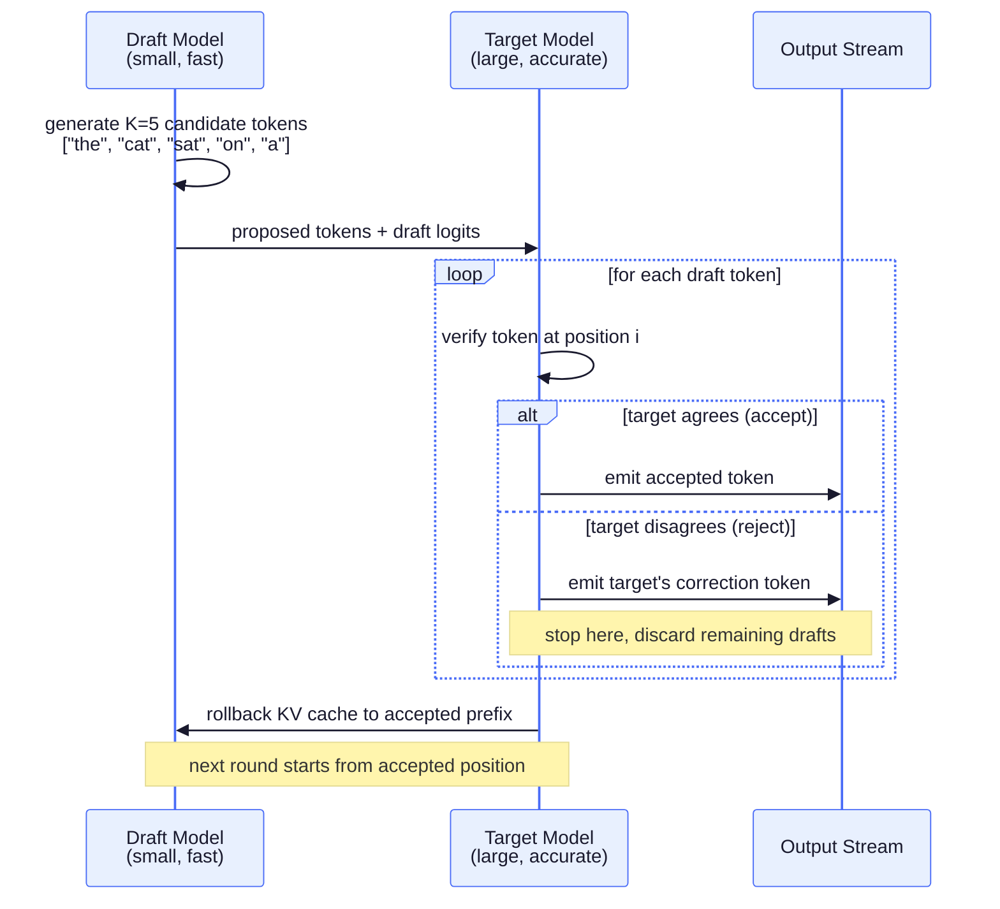
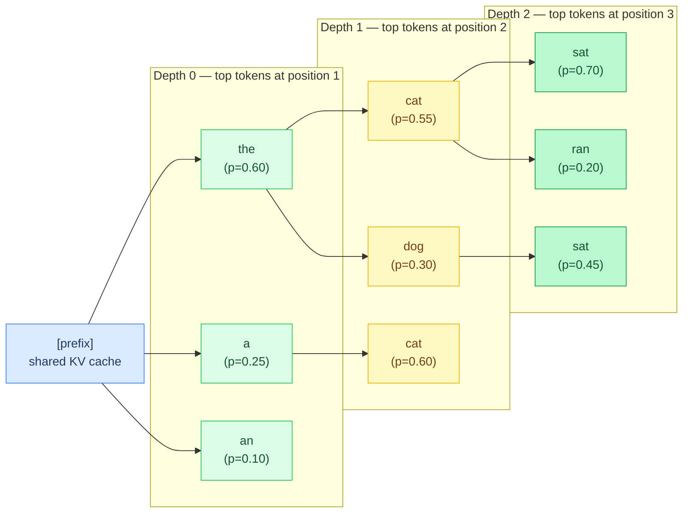
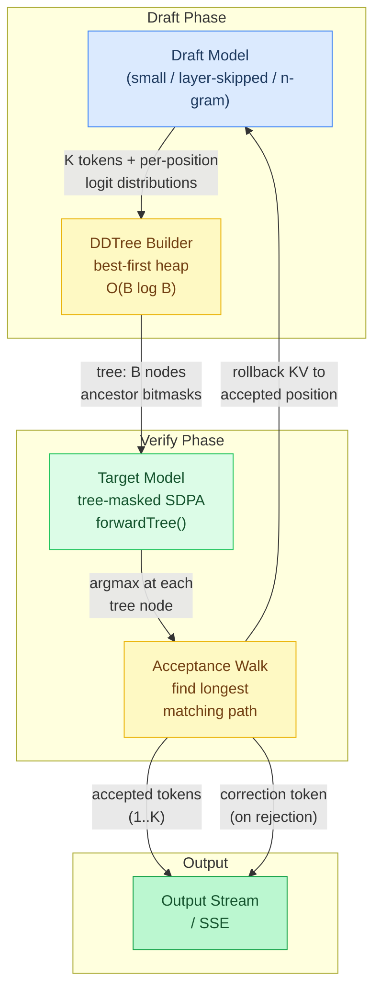
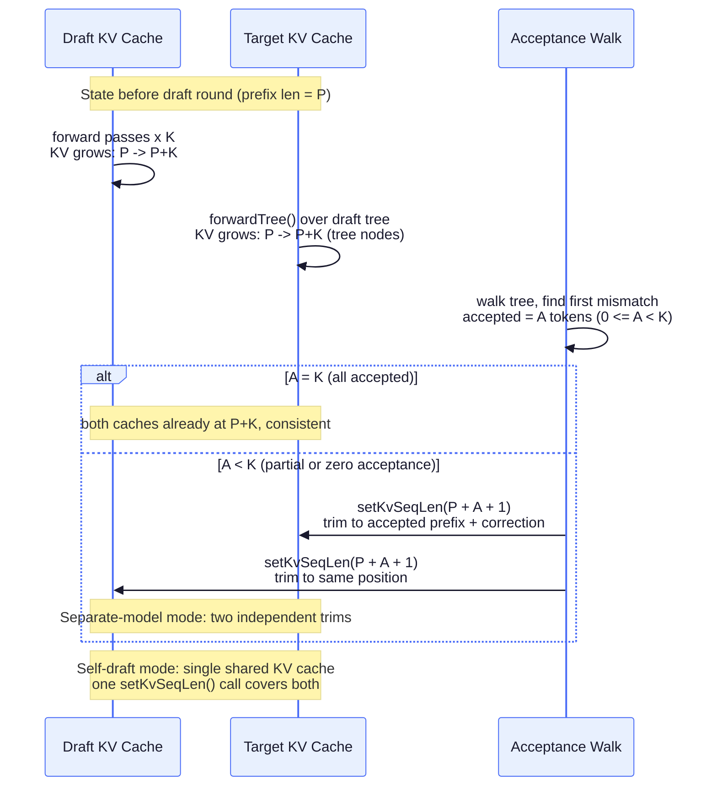
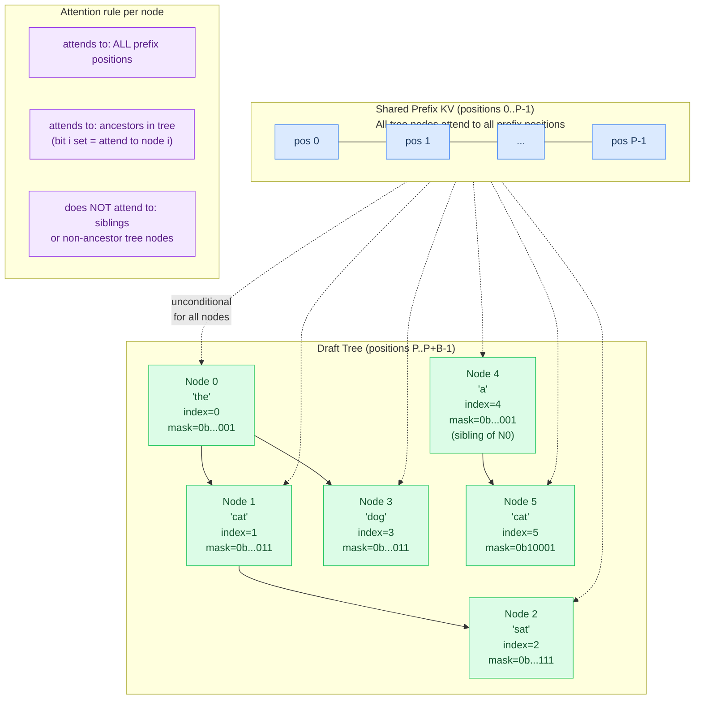
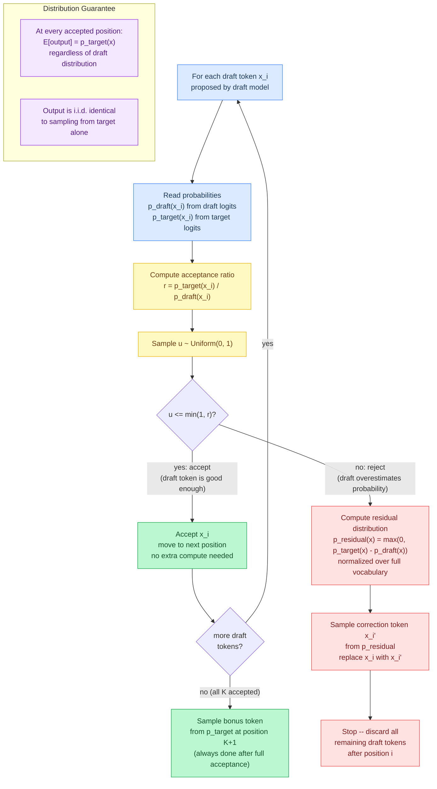
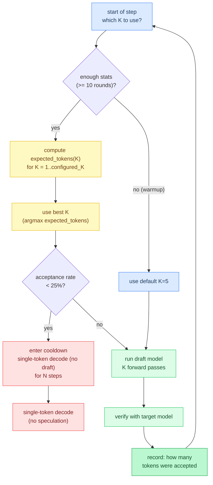
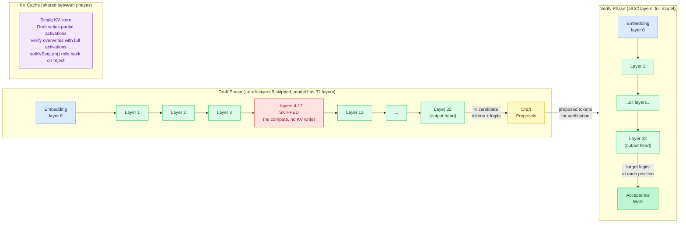
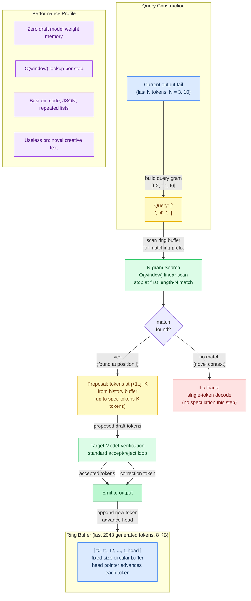

# Chapter 17: Speculative Decoding & DDTree

Standard autoregressive decoding generates one token per forward pass. For large models, each pass takes tens of milliseconds — the token generation rate is bottlenecked by model size, not memory bandwidth. Speculative decoding breaks this bottleneck by using a cheap draft model to propose multiple candidate tokens, then verifying them against the full target model.

## The Core Idea

1. **Draft**: A small, fast model generates K candidate tokens autoregressively
2. **Verify**: The target model checks whether it agrees with each draft token
3. **Accept**: Matching tokens are accepted for free (no extra target compute)
4. **Correct**: At the first disagreement, the target's prediction replaces the draft's



With a good draft model (70-80% acceptance rate), speculative decoding generates 2-3x more tokens per second with **no quality loss** -- for greedy decoding (temperature=0), the output is byte-identical to the target model alone; for sampling (temperature>0), the output distribution is mathematically preserved via rejection sampling.

## Modes in Agave

### Separate Draft Model (`--draft-model`)

Load a small model alongside the target. Best speedup when the draft model is from the same family (e.g., Qwen3-1.5B drafting for Qwen3-8B):

```bash
agave Qwen3-8B.gguf --draft-model Qwen3-1.5B.gguf "What is quantum computing?"
```

The draft model shares the same GPU/CPU backend and thread pool. Memory overhead is the draft model's weight size plus a small KV cache.

### DDTree Mode (`--spec-mode ddtree`)

DDTree (Ringel & Romano, 2026) improves on standard speculative decoding by constructing a **tree** of candidate continuations instead of a single path. The tree is built using a best-first heap algorithm that selects the most probable prefixes from the draft model's per-position distributions.

```bash
agave model.gguf --draft-model draft.gguf --spec-mode ddtree --spec-tokens 5 --tree-budget 64 "prompt"
```



**How it works:**

1. Draft model runs K forward passes, saving the full logit distribution at each step
2. Top-B tokens are extracted at each depth via partial selection
3. A max-heap explores candidate continuations in order of cumulative log-probability
4. Each pop adds a node to the tree; siblings (same depth, next rank) and children (next depth, rank 0) are pushed
5. The resulting tree is compiled into flat arrays with ancestor bitmasks for tree attention
6. Verification walks the tree: at each depth, if the target model's argmax matches any child, that branch is accepted

The tree structure means the verifier can find longer accepted sequences by exploring alternative branches, yielding higher acceptance lengths than single-path speculation.

**Key parameters:**
- `--spec-tokens K` -- draft depth (default: 5). More depth = deeper tree but more draft compute
- `--tree-budget B` -- maximum tree nodes (default: 64). Higher budget = wider tree but more verification compute

### Self-Speculative Mode (`--spec-mode self`)

Uses the target model itself as its own draft by skipping layers during the draft phase. No extra model needed -- trades quality for speed in the draft:

```bash
agave model.gguf --spec-mode self "prompt"
agave model.gguf --spec-mode self --draft-layers 9 "prompt"  # skip 9 layers
```

The `--draft-layers` flag controls how many layers to skip (default: 50% of model layers, skipping the middle). Fewer skipped layers = higher acceptance rate but less speedup per draft token.

### N-gram Mode (`--spec-mode ngram`)

Uses output history as its own draft -- no draft model, no extra forward passes for drafting. Searches the last 2048 generated tokens for n-gram matches (n=3..10) of the most recent tokens. When a match is found, the tokens that followed that match in history are proposed as draft tokens.

```bash
agave model.gguf --spec-mode ngram "Write a Python function to sort a list"
agave model.gguf --spec-mode ngram --spec-tokens 8 "Generate a JSON schema"
```

**How it works:** If the model has generated "```python\ndef sort_list" earlier and the current output ends with "```python\ndef", the n-gram matcher finds the earlier occurrence and proposes "sort_list" as draft tokens. The target model verifies these -- accepted tokens skip forward passes.

**Best for**: code generation (repeated patterns, imports, boilerplate), structured output (JSON, XML), templates, lists with repeated structure. **Not useful for**: creative writing, conversation, reasoning (low repetition).

**Worked example** -- generating a list:

```
Generated so far: "1. Apple\n2. Banana\n3. Cherry\n4. "
Last 3 tokens: ["\n", "4", ". "]

N-gram search finds "\n" + "2" + ". " earlier in history
-> proposes continuation: ["B", "anana", "\n", "3"]

Target model verifies:
  - "D" (reject -- target wants "Date" not "Banana")
  - 0 tokens accepted, correction token = "D"

Next attempt after "Date\n5. ":
  N-gram finds "\n" + "5" + ". " -- no earlier match with "5"
  Falls back to single-token decode
```

Zero memory overhead (no draft model weights). The ring buffer uses 8 KB.

## Architecture

```
src/spec/
├── spec_decode.zig   — orchestrator: draft, verify, generation loop
├── ddtree.zig        — DDTree: heap, tree build, compile, acceptance walk
├── pflash.zig        — PFlash: block scoring, adaptive selection, compressed prefill
└── ngram.zig         — N-gram: history ring buffer, n-gram matching, proposal

src/backend/kernels/cpu/
└── sdpa_tree.zig     — tree-masked SDPA kernel (ancestor bitmask attention)
```

### Data Flow



### KV Cache Management

- **Separate models**: Each has independent KV cache. Draft model rolled back to accepted prefix on rejection.
- **Self-draft**: Same KV cache for both phases. Target rollback before re-verification overwrites draft entries (safe because same model produces identical KV).
- **Rollback**: `Model.setKvSeqLen(pos)` -- paged blocks stay allocated, overwritten on next forward.

### KV Cache Rollback on Rejection



### DDTree Heap Algorithm

The tree construction is O(B log B) where B is the node budget:

```
Initialize: push (depth=0, rank=0) with log_prob = log q0[best_token]

While tree_size < B:
    Pop node with highest cumulative log-probability
    Add to tree

    Push sibling: (same depth, rank + 1)
        cum_log_prob = parent_cum + log q[depth][rank+1]

    Push child: (depth + 1, rank 0)
        cum_log_prob = current_cum + log q[depth+1][best_token]
```

This produces the optimal prefix-closed tree under the draft model's factorized distribution.

### Tree Attention and Ancestor Bitmask

Each tree node attends to:
- All prefix KV entries (shared, unconditional)
- Only its ancestor nodes within the tree (bitmask-controlled)

The ancestor bitmask is a `[8]u64` per node (512 bits), supporting trees up to 512 nodes. The CPU kernel (`sdpa_tree.zig`) iterates over attended positions; GPU kernels can mask in the inner loop.



## Correctness Guarantee

For greedy decoding (temperature=0), speculative decoding produces **byte-identical output** to non-speculative decoding. The verification step ensures every accepted token matches what the target model would have generated. This is verified in agave's test suite.

For sampling (temperature > 0), rejection sampling (Leviathan et al. 2023) preserves the target model's output distribution. Each draft token is accepted with probability min(1, p_target/p_draft); on rejection, a correction is sampled from the residual distribution max(0, p_target - p_draft).

### Rejection Sampling Correctness



## Adaptive K (Profile-Guided)

Agave tracks per-K acceptance statistics during generation. The `optimalK()` function in `spec_decode.zig` computes the expected tokens per step for each K value and selects the one with the highest throughput:



```
expected_tokens(K) = sum(i=1..K) i x P(accept exactly i)
optimal_K = argmax over K of expected_tokens(K) / cost(K)
```

Enable with:
```bash
agave model.gguf --draft-model draft.gguf --adaptive-k "prompt"
```

Early in generation (first 10 verification rounds), the system uses the default K. As statistics accumulate, it adjusts K per-step by picking the K with the highest expected-value estimate.

### Cooldown

When the acceptance rate over the last `adaptive_window` (8) drafted tokens drops below 25%, speculative decoding is bypassed for the next 8 steps. The generation loop calls `target.forward()` directly for single-token decode with no draft model involved. This avoids wasting compute on bad draft proposals during challenging output segments (reasoning, novel vocabulary, code switches).

The cooldown counter decrements each step and re-enables speculation when it expires.

## Self-Speculative Layer Skipping

Self-speculative decoding uses the target model itself as a draft by executing only a subset of transformer layers during the draft phase. The middle layers are skipped, keeping the embedding and final output layers.



## N-gram Ring Buffer Matching



## Performance Tuning

| Parameter | Effect | Recommendation |
|-----------|--------|----------------|
| `--spec-tokens` | Draft depth K | 3-8 for most models |
| `--tree-budget` | Tree width B | 32-128 (diminishing returns beyond 256) |
| `--draft-layers` | Layers skipped (self-spec) | 25-50% of total layers |
| `--adaptive-k` | Auto-tune K at runtime | Enable for long generations |
| Draft model size | Acceptance rate vs speed | 1/4 to 1/8 of target size |

### Batch Tree Verification

Models with `forwardTree()` support (currently Gemma3) can verify the entire draft tree in a **single** target forward pass using tree-masked SDPA (`sdpaTree`). This reduces verification from O(K) sequential forwards to O(1), making speculative decoding significantly faster.

The `sdpaTree` kernel has native implementations on all 6 backends: CPU, Metal, CUDA, Vulkan, ROCm, and WebGPU. GPU kernels use FlashAttention-2 with ancestor bitmask masking -- one threadgroup per (node, head) pair.

Models without `forwardTree()` (Qwen3.5, Nemotron, etc.) fall back to sequential verification, which still works but doesn't benefit from batching.

### Example Speedup

```
Without spec dec:  1 forward pass per token  -> 15 tok/s (Qwen 3.5 8B, Metal)
With DDTree:       ~3 tokens per verify pass -> ~35 tok/s (2.3x speedup)

Breakdown per step:
  Draft (5 tokens):      2 ms  (small model, fast)
  Tree build (64 nodes): 0.1 ms  (CPU, O(B log B))
  Verify (1 pass):       65 ms  (full model, tree attention)
  Accepted:             ~3 tokens average
  Effective:            3 tokens / 67 ms ~= 45 tok/s theoretical
  Overhead:             Draft prefill, KV rollback -> ~35 tok/s actual
```

**When to use speculative decoding:**
- Long generations (100+ tokens) -- amortizes dual-model overhead
- Large target models (8B+) -- more room for speedup
- Same-family draft/target -- higher acceptance rates

**When NOT to use:**
- Very short outputs (< 10 tokens)
- Small target models (< 3B) -- draft overhead dominates
- No suitable draft model available (self-spec with aggressive skip may hurt quality)

## Background: DFlash and Block Diffusion

DDTree builds on **DFlash** (Block Diffusion Flash), a speculative decoding method that uses a **block diffusion model** as the drafter. Unlike autoregressive drafters that generate tokens one at a time, a block diffusion drafter produces an entire block of L draft tokens in a single forward pass by iteratively denoising a block of mask tokens.

**DFlash** (baseline):
1. Run block diffusion drafter once -> L draft positions with per-position distributions
2. Sample a single sequence from those distributions
3. Verify the sequence against the target model
4. Accept matching prefix, reject at first mismatch

**DDTree** (improvement over DFlash):
1. Same drafter -> same L per-position distributions
2. Instead of sampling one sequence, build an **optimal tree** of candidate continuations
3. The tree explores multiple branches at each depth, prioritized by probability
4. Verify the entire tree -> accept the longest matching path (not just one sequence)

The key insight: DFlash wastes information by collapsing the draft distributions into a single path. DDTree exploits the full distribution at each position to construct a tree that maximizes expected acceptance length. The paper shows 35-62% speedup over DFlash.

**In agave's implementation**, we use autoregressive drafting (not block diffusion) since agave doesn't include a diffusion model. The DDTree tree construction algorithm works identically -- it takes per-position logit distributions (however produced) and builds the optimal tree. The draft distributions come from K sequential forward passes of the draft model rather than one block diffusion pass.

## MTP (Multi-Token Prediction)

MTP uses prediction heads trained jointly with the main model -- no separate draft model needed. Each head is a single transformer layer that takes the main model's hidden state + the current token embedding, and predicts the next token at ~5% the cost of a full forward pass. Acceptance rates are 70-85% (vs ~50% for separate draft models).

```bash
agave model-mtp.gguf --spec-mode mtp "prompt"
```

MTP requires GGUF files with nextn tensors (look for "-MTP" in the filename). See [Chapter 18: Multi-Token Prediction](18-multi-token-prediction.md) for full architectural details, including the +1 offset norm, concatenation projection, and which models support MTP.

## PFlash: Speculative Prefill for Long Contexts

All the modes above address decode speed -- the time between tokens during generation. Prefill is a separate bottleneck: for a 128K-token prompt, the target model must attend over every token pair before producing the first output token. PFlash (from Luce-Org/lucebox-hub) attacks this with speculative prefill.

### What PFlash Does

Instead of running the full target model over the entire prompt, PFlash uses a cheap scorer to identify which KV blocks matter and prefills only those blocks through the target model.

```mermaid
flowchart LR
    classDef setup     fill:#dbeafe,stroke:#3b82f6,color:#1e3a5f
    classDef sync      fill:#dcfce7,stroke:#22c55e,color:#14532d
    classDef migration fill:#fef9c3,stroke:#eab308,color:#713f12
    classDef success   fill:#bbf7d0,stroke:#16a34a,color:#14532d
    classDef danger    fill:#fee2e2,stroke:#ef4444,color:#7f1d1d
    classDef optional  fill:#f3e8ff,stroke:#9333ea,color:#581c87

    Prompt["Long Prompt\n128K tokens"]:::setup
    Scorer["Scorer Model\n(draft model or dedicated tiny model)\nblock-sparse O(n) pass"]:::sync
    Scores["Block Importance Scores\n[0.1, 0.9, 0.2, 0.8, 0.3, 0.7, ...]"]:::migration
    Threshold["Adaptive Threshold\nalpha x mean(scores)\n(default alpha=0.85)"]:::migration
    Drop["Dropped Blocks\n~85-95% of prompt\n(boilerplate, padding, off-topic)"]:::danger
    Keep["Kept Blocks\n~5-15% of prompt\n(high-relevance context)"]:::sync
    Target["Target Model\nprefill compressed prompt\n6-13K tokens instead of 128K"]:::sync
    KVCache["KV Cache\n(compressed representation)"]:::migration
    Decode["DDTree Speculative Decode\nnormal token generation loop"]:::sync
    Tokens["Output Tokens"]:::success

    Prompt --> Scorer
    Scorer --> Scores
    Scores --> Threshold
    Threshold --> Drop
    Threshold --> Keep
    Keep --> Target
    Target --> KVCache
    KVCache --> Decode
    Decode --> Tokens

    subgraph Compression["PFlash Compression (8-20x)"]
        Scorer
        Scores
        Threshold
        Drop
        Keep
    end
```



The key insight: most tokens in a long prompt are not consulted during generation. A technical document's repeated boilerplate, padding, or off-topic context contributes little to the final answer. The scorer identifies and discards these blocks before the expensive target model runs.

### Adaptive PFlash: The Alpha Threshold

The selection threshold is `alpha * mean(block_scores)`, not a fixed top-K count. This is what "Adaptive PFlash" refers to in the original paper.

Why adaptive matters:

- A dense technical reference might have 40% of blocks score above threshold
- A padded narrative prompt might have only 3% score above threshold
- Fixed top-K=10 over-selects for the dense case and under-selects for the sparse case

Lower alpha = more aggressive compression = faster prefill but higher risk of dropping important context. Start with the default (0.85) and lower it if you observe degraded output quality.

```bash
agave model.gguf --draft-model draft.gguf --spec-mode pflash "prompt"                       # alpha=0.85 (default)
agave model.gguf --draft-model draft.gguf --spec-mode pflash --pflash-alpha 0.7 "prompt"    # aggressive
agave model.gguf --draft-model draft.gguf --spec-mode pflash --pflash-alpha 0.95 "prompt"   # conservative
```

### PFlash + DDTree: Combining Prefill and Decode Speedup

PFlash and DDTree solve different bottlenecks and compose cleanly. PFlash fills the KV cache with the compressed prompt representation; DDTree then runs its normal speculative decode loop over that KV cache.

```bash
# PFlash prefill + DDTree decode (recommended for 32K+ prompts)
agave target.gguf --draft-model draft.gguf --spec-mode pflash "prompt"

# Separate scorer for maximum throughput (scorer can be smaller than draft model)
agave target.gguf --draft-model draft.gguf --pflash-scorer tiny-scorer.gguf --spec-mode pflash "prompt"

# Tune block granularity (smaller blocks = finer selection, more overhead)
agave target.gguf --draft-model draft.gguf --spec-mode pflash --pflash-block-size 32 "prompt"
```

The scorer defaults to the `--draft-model`. If you already have a draft model loaded for DDTree, PFlash reuses it at no extra memory cost. For maximum throughput, a dedicated `--pflash-scorer` model can be smaller than the draft model -- it only needs to rank block importance, not produce accurate next-token predictions.

### Performance Expectations

PFlash targets time-to-first-token (TTFT) for long prompts. Decode throughput is unchanged.

| Context length | Expected TTFT reduction |
|---------------|------------------------|
| 8K tokens | Minimal (overhead not worth it) |
| 32K tokens | ~3-5x |
| 128K tokens | ~8-12x |
| 512K tokens | ~20-40x |

Actual numbers depend on prompt compressibility (how many blocks score below threshold), scorer speed, and target model size. Prompts with high repetition or large amounts of boilerplate compress more aggressively.

**When to use PFlash:**
- Prompts longer than 32K tokens
- RAG pipelines with many retrieved chunks (most chunks are irrelevant)
- Long system prompts or document contexts
- Any use case where TTFT matters more than generation quality on the full context

**When not to use PFlash:**
- Short prompts (< 8K tokens) -- overhead exceeds benefit
- Tasks where every sentence in the prompt is load-bearing (legal analysis, code review with full repo)
- When `--pflash-alpha` is already high and output quality is still degraded

See [Tutorial 19: PFlash and Block Sparse Attention](19-pflash-and-block-sparse.md) for a full walkthrough including block sparse attention internals, alpha tuning, and scoring model selection.

## Server Mode

Speculative decoding works with `--serve`. All API endpoints (OpenAI, Anthropic, Responses) support it in both streaming and non-streaming modes.

```bash
agave model.gguf --draft-model draft.gguf --serve
agave model.gguf --draft-model draft.gguf --spec-mode ddtree --serve
agave model.gguf --spec-mode self --serve
agave model-mtp.gguf --spec-mode mtp --serve
```

```bash
curl http://localhost:49453/v1/chat/completions \
  -d '{"messages":[{"role":"user","content":"Hello"}],"stream":true}'
```

The server uses the same speculative decoding loop as CLI mode. Draft model prefill runs once per request, then the spec dec loop emits accepted tokens in batches via SSE streaming.

### References

- [DDTree: Accelerating Speculative Decoding with Block Diffusion Draft Trees (Ringel & Romano, 2026)](https://arxiv.org/abs/2604.12989)
- [Fast Inference from Transformers via Speculative Decoding (Leviathan et al., 2023)](https://arxiv.org/abs/2211.17192)
- [SpecInfer: Accelerating LLM Serving with Tree-based Speculative Inference (Miao et al., 2024)](https://arxiv.org/abs/2305.09781)

---

**In the code:** [src/spec/spec_decode.zig](../../src/spec/spec_decode.zig) (orchestrator, adaptive K, cooldown), [src/spec/ddtree.zig](../../src/spec/ddtree.zig) (DDTree construction), [src/spec/ngram.zig](../../src/spec/ngram.zig) (n-gram history matching), [src/spec/pflash.zig](../../src/spec/pflash.zig) (PFlash block scoring and compressed prefill), [src/ops/sparse_attn.zig](../../src/ops/sparse_attn.zig) (block sparse SDPA), [src/backend/kernels/cpu/sdpa_tree.zig](../../src/backend/kernels/cpu/sdpa_tree.zig) (tree-masked attention)

**Next:** [Chapter 19: PFlash and Block Sparse Attention ->](19-pflash-and-block-sparse.md) | **Back:** [Chapter 16: Recipe System <-](16-recipe-system.md) | **Product docs:** [Models](../MODELS.md)
