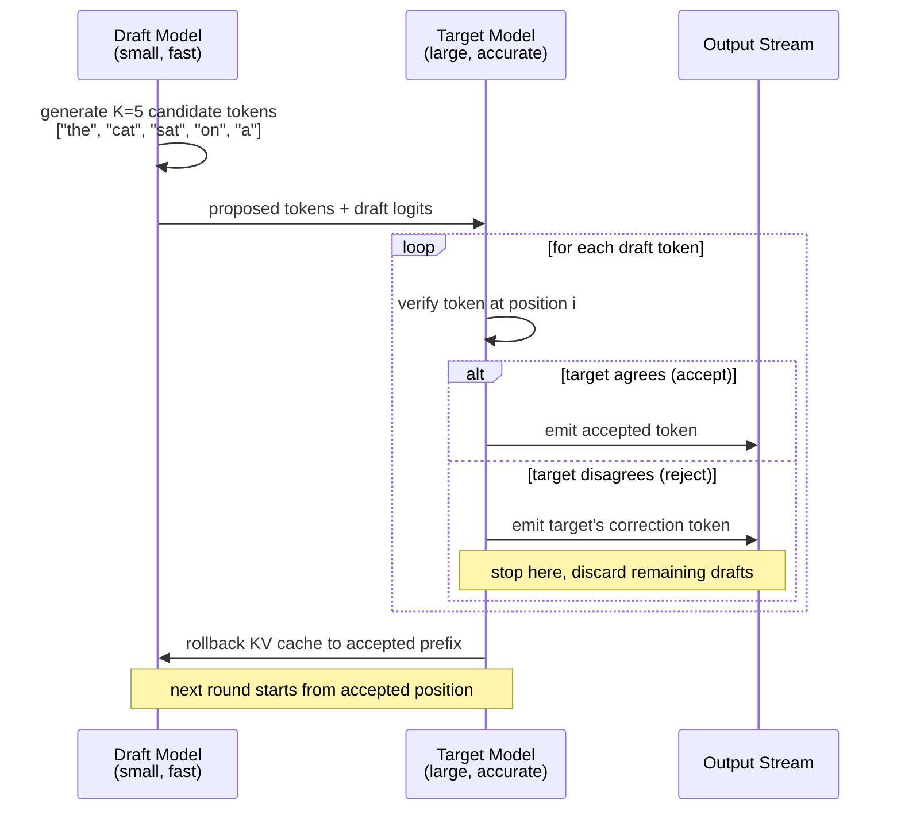
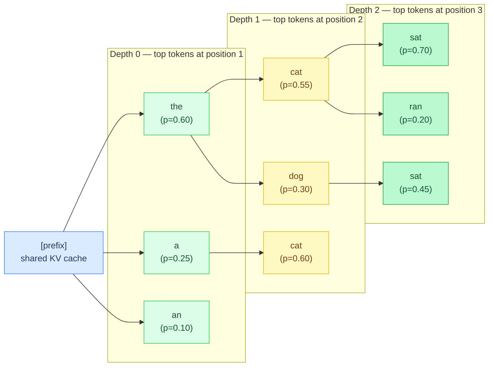
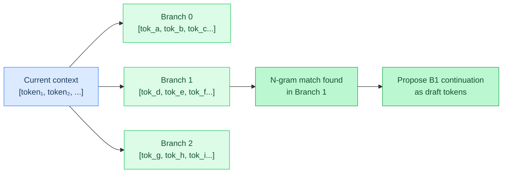
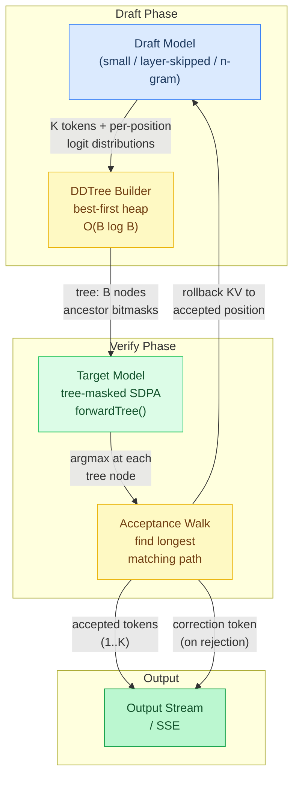
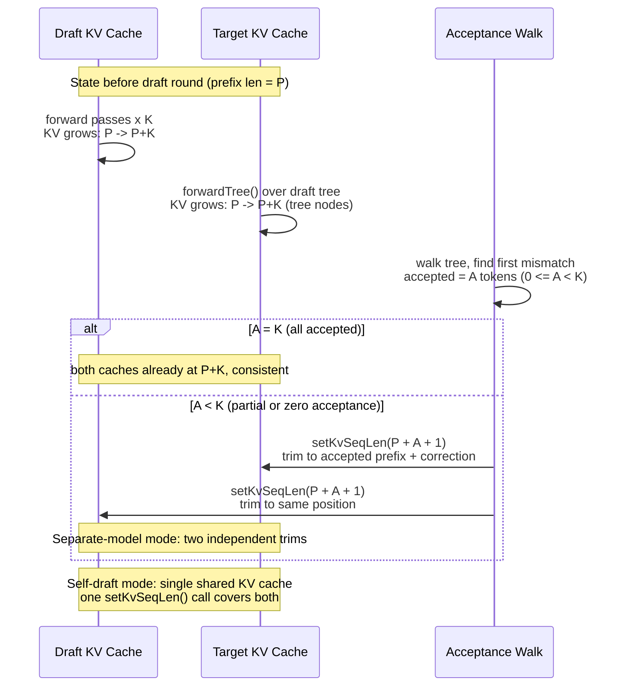
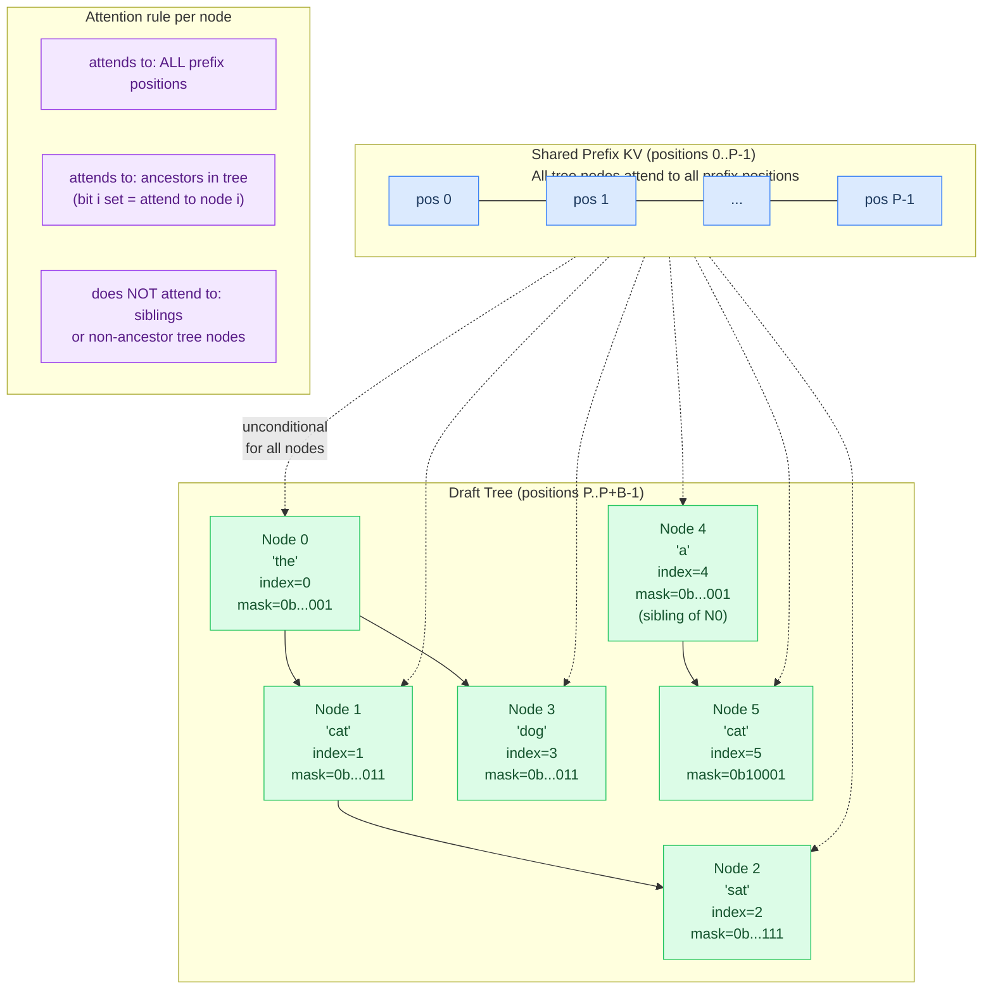
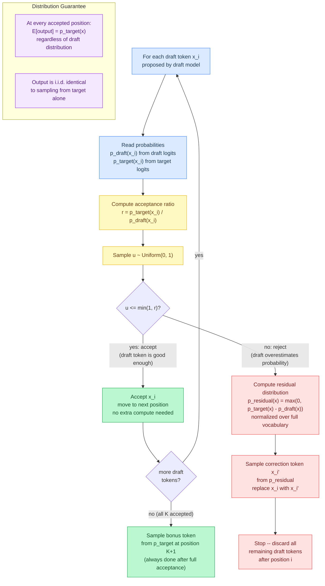
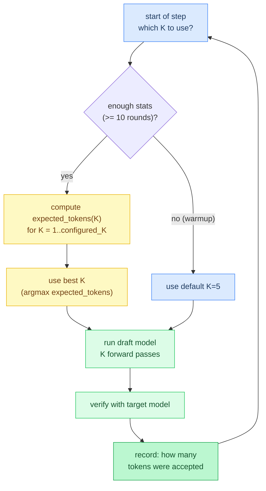
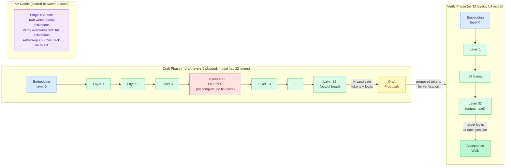
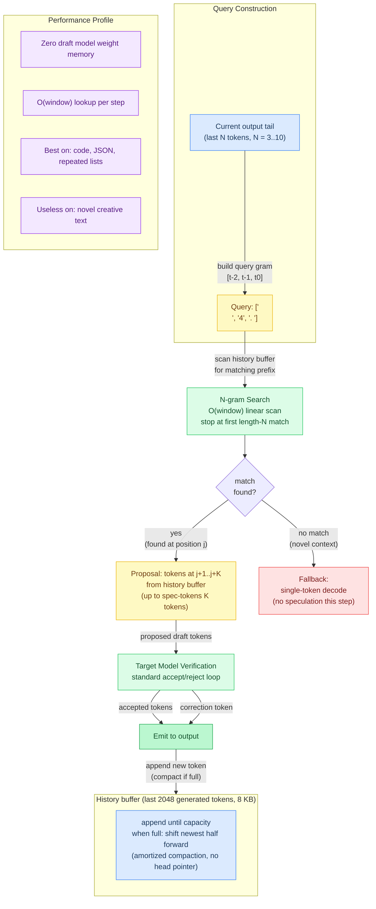

# Chapter 17: Speculative Decoding & DDTree

**Prerequisites:** [Chapter 5: Memory and Caching](05-memory-and-caching.md) (KV cache rollback on rejection), [Chapter 2: The Transformer](02-the-transformer.md) (target-model verification)

**Time:** ~29 min

> After this chapter you can explain draft/verify/accept, DDTree, self-speculative, EAGLE, MTP overview, and all 14 speculative decoding modes.

Standard autoregressive decoding generates one token per forward pass. For large models, each pass takes tens of milliseconds — the token generation rate is bottlenecked by model size, not memory bandwidth. Speculative decoding breaks this bottleneck by using a cheap draft model to propose multiple candidate tokens, then verifying them against the full target model.

## The Core Idea

1. **Draft**: A small, fast model generates K candidate tokens autoregressively
2. **Verify**: The target model checks whether it agrees with each draft token
3. **Accept**: Matching tokens are accepted for free (no extra target compute)
4. **Correct**: At the first disagreement, the target's prediction replaces the draft's



With a good draft model (70-80% acceptance rate), speculative decoding generates 2-3x more tokens per second with **no quality loss** -- for greedy decoding (temperature=0), the output is byte-identical to the target model alone; for sampling (temperature>0), the output distribution is mathematically preserved via rejection sampling.

## Modes in Agave

### Separate Draft Model (`--draft-model`)

Load a small model alongside the target. Best speedup when the draft model is from the same family (e.g., Qwen3-1.5B drafting for Qwen3-8B):

```bash
agave Qwen3-8B.gguf --draft-model Qwen3-1.5B.gguf "What is quantum computing?"
```

The draft model shares the same GPU/CPU backend and thread pool. Memory overhead is the draft model's weight size plus a small KV cache.

### DDTree Mode (`--spec-mode ddtree`)

DDTree (Ringel & Romano, 2026) improves on standard speculative decoding by constructing a **tree** of candidate continuations instead of a single path. The tree is built using a best-first heap algorithm that selects the most probable prefixes from the draft model's per-position distributions.

```bash
agave model.gguf --draft-model draft.gguf --spec-mode ddtree --spec-tokens 5 --tree-budget 64 "prompt"
```



**How it works:**

1. Draft model runs K forward passes, saving the full logit distribution at each step
2. Top-B tokens are extracted at each depth via partial selection
3. A max-heap explores candidate continuations in order of cumulative log-probability
4. Each pop adds a node to the tree; siblings (same depth, next rank) and children (next depth, rank 0) are pushed
5. The resulting tree is compiled into flat arrays with ancestor bitmasks for tree attention
6. Verification walks the tree: at each depth, if the target model's argmax matches any child, that branch is accepted

The tree structure means the verifier can find longer accepted sequences by exploring alternative branches, yielding higher acceptance lengths than single-path speculation.

**Key parameters:**
- `--spec-tokens K` -- draft depth (default: 5). More depth = deeper tree but more draft compute
- `--tree-budget B` -- maximum tree nodes (default: 64). Higher budget = wider tree but more verification compute

### Self-Speculative Mode (`--spec-mode self`)

Uses the target model itself as its own draft by skipping layers during the draft phase. No extra model needed -- trades quality for speed in the draft:

```bash
agave model.gguf --spec-mode self "prompt"
agave model.gguf --spec-mode self --draft-layers 9 "prompt"  # skip 9 layers
```

The `--draft-layers` flag controls how many layers to skip (default: 50% of model layers, skipping the middle). Fewer skipped layers = higher acceptance rate but less speedup per draft token.

### N-gram Mode (`--spec-mode ngram`)

Uses output history as its own draft -- no draft model, no extra forward passes for drafting. Searches the last 2048 generated tokens for n-gram matches (n=3..10) of the most recent tokens. When a match is found, the tokens that followed that match in history are proposed as draft tokens.

```bash
agave model.gguf --spec-mode ngram "Write a Python function to sort a list"
agave model.gguf --spec-mode ngram --spec-tokens 8 "Generate a JSON schema"
```

**How it works:** If the model has generated "```python\ndef sort_list" earlier and the current output ends with "```python\ndef", the n-gram matcher finds the earlier occurrence and proposes "sort_list" as draft tokens. The target model verifies these -- accepted tokens skip forward passes.

**Best for**: code generation (repeated patterns, imports, boilerplate), structured output (JSON, XML), templates, lists with repeated structure. **Not useful for**: creative writing, conversation, reasoning (low repetition).

**Worked example** -- generating a list:

```text
Generated so far: "1. Apple\n2. Banana\n3. Cherry\n4. "
Last 3 tokens: ["\n", "4", ". "]

N-gram search finds "\n" + "2" + ". " earlier in history
-> proposes continuation: ["B", "anana", "\n", "3"]

Target model verifies:
  - "D" (reject -- target wants "Date" not "Banana")
  - 0 tokens accepted, correction token = "D"

Next attempt after "Date\n5. ":
  N-gram finds "\n" + "5" + ". " -- no earlier match with "5"
  Falls back to single-token decode
```

Zero memory overhead (no draft model weights). The history buffer uses 8 KB.

In **server mode**, a `SharedNgramPool` (~32 KB / 8,192 token history, thread-safe spinlock) accumulates tokens from all concurrent requests. When a request's local history has no match, it searches the shared pool — giving "warm-start" drafting from other users' recent output.

### Suffix Decoding (`--spec-mode suffix`)

Like n-gram but uses a larger cross-request cache (10,000 tokens) with **exact suffix matching** and **dynamic speculation depth** -- longer matches trigger deeper speculation.

```bash
agave model.gguf --spec-mode suffix "Complete this function:"
```

When a k-token suffix of the current context matches earlier output, the subsequent tokens are proposed as drafts. Match length k scales the draft depth: minimum match → k=1 draft token; maximum match → k=max_k drafts.

**Best for**: chat with shared context, code completion with common library patterns, long structured outputs. Better than n-gram for diverse token patterns because it requires exact suffix match rather than fixed n-gram length.

### Lookahead Decoding (`--spec-mode lookahead`)

Jacobi-style parallel decoding -- no draft model, no history matching. Maintains W=5 "branches" of N=7 candidate tokens, each advanced by running target.forward() on the branch's last token. After advancing all branches, searches for any n-gram match between any branch and the current context.

```bash
agave model.gguf --spec-mode lookahead "Write code to parse JSON:"
```



**Advantage over n-gram**: generates *novel* tokens (not just replaying history), so it works even at the start of generation. **Disadvantage**: runs W extra target.forward() calls per decode step; only beneficial when acceptance rates are high.

### EAGLE (`--spec-mode eagle`)

EAGLE (Efficient Acceleration via Greedily-Embedded Token Entropy) conditions the draft model on the **target model's hidden state** rather than just the previous token. At each draft step:

1. `target.forward(tok)` runs normally → agave extracts `target.getHiddenState()`  
2. `draft.eagleForward(tok, target_hidden)` combines token embedding with hidden state
3. Chain: draft's own hidden state feeds subsequent draft steps (EAGLE-1 autoregressive)

```bash
agave target.gguf --draft-model eagle-draft.gguf --spec-mode eagle "prompt"
```

**Why it works**: the target's hidden state encodes the full context semantics -- the draft sees *what the target is thinking* rather than just the last token. This gives much higher acceptance rates than standard draft models at the same draft model size.

Community EAGLE models (e.g., `EAGLE-LLaMA3-Instruct-8B`) expose this via `eagleForward()`. Standard draft models fall back to `forward()` (same as `--spec-mode standard`).

### EAGLE-3 (`--spec-mode eagle3`)

EAGLE-3 is a refinement of EAGLE-1 that conditions on the **pre-output-norm** hidden state instead of the post-norm representation. Before the final `rmsNorm(hidden, output_norm)` is applied, the raw residual stream is saved and used for draft conditioning.

**Why it may help**: output normalization forces the hidden state to unit magnitude, discarding scale information. The pre-norm state carries residual magnitude differences that can signal token confidence or domain shifts — information that draft models may exploit for better prediction.

```bash
agave target.gguf --draft-model eagle-draft.gguf --spec-mode eagle3 "prompt"
```

Currently, pre-norm state is saved by Gemma 4 and DiffusionGemma (`hidden_pre_norm` field). Any model that exposes a `hidden_pre_norm` field gets EAGLE-3 support automatically via the generic vtable dispatch. For other models it falls back to the post-norm hidden (same as `--spec-mode eagle`). EAGLE-3 draft models trained specifically on pre-norm states would benefit most.

### MLP Speculator (`--spec-mode mlp`)

Single-step conditioning: all K draft steps use the **frozen** target hidden state from before drafting, not an autoregressive chain. Cheaper than EAGLE (no draft KV growth) but slightly lower acceptance.

```bash
agave target.gguf --draft-model mlp-speculator.gguf --spec-mode mlp "prompt"
```

|Mode|Draft conditioning|KV growth|Acceptance|
|-----|-----|-----|-----|
|`standard`|Previous token only|Yes|Low-Medium|
|`eagle`|Target hidden (chained)|Yes|High|
|`mlp`|Target hidden (frozen)|No|Medium-High|

### DSpark (`--spec-mode dspark`)

DSpark (Cheng et al., 2026, DeepSeek-AI) unifies high-throughput parallel generation with adaptive, load-aware verification. It addresses two problems with naive parallel drafting: **suffix decay** (later positions are less correlated, acceptance drops) and **verification waste** (blindly verifying all draft tokens hurts throughput under load).

```bash
agave target.gguf --draft-model draft.gguf --spec-mode dspark "prompt"
```

**Two complementary components:**

**1. Semi-autoregressive generation** — a parallel backbone produces all `γ` draft logits in one pass; a lightweight sequential head injects intra-block dependency. Two instantiations:

- **Markov head**: first-order transition bias `B(x_{k-1}, ·) = W1[x_{k-1}] W2` (low-rank `V×V`, rank 256). Given the sampled previous token, boosts coherent continuations and suppresses cross-mode collisions (e.g. "of course" vs "no problem" → avoids "of problem").
- **RNN head**: gated recurrent state accumulates full prefix history within a block, providing richer conditioning at slightly higher sequential cost.

**2. Confidence-scheduled verification** — a lightweight confidence head predicts per-position acceptance probability `c_k = σ(w^T [h_k; W1[x_{k-1}]])`. Cumulative survival `a_{r,j} = Π_{i≤j} c_i` estimates the probability the j-length prefix is fully accepted.

The **Hardware-Aware Prefix Scheduler** (Algorithm 1) maximises system throughput `Θ = τ × SPS(B)` where `SPS(B)` is the measured steps-per-second at batch size `B`. It globally sorts all `(request, position)` candidates by survival probability descending, greedily admits tokens while throughput improves, and stops immediately on the first drop (ensuring the non-anticipating property required for lossless verification).

**Performance** (DeepSeek paper results, DeepSeek-V4 serving):
- 60–85% faster per-user generation vs. MTP-1 baseline at matched throughput
- Outperforms Eagle3 (autoregressive) by 27–31% accepted length across math/code/chat
- Outperforms DFlash (parallel) by 16–18% accepted length

**Current agave implementation:**

`--spec-mode dspark` drafts tokens via the existing draft model (any mode), then applies `dsparkTrimDraft()` — a single-request confidence trim using long-run per-position acceptance history as a survival-probability proxy. Tokens whose estimated prefix survival drops below 0.15 are dropped before verification.

The `src/spec/dspark.zig` module provides the full Algorithm 1 scheduler (`scheduleVerification()`), Markov/RNN head inference, confidence head, and Sequential Temperature Scaling calibration — ready for trained DSpark checkpoints from the [DeepSpec repository](https://github.com/deepseek-ai/DeepSpec).

**Training** (requires DeepSpec):
Loss = `α_ce × L_ce + α_tv × L_tv + α_conf × L_conf` with position weights `exp(-(k-1)/γ)`. The TV loss (`‖p_draft − p_target‖₁`) directly maximises expected acceptance rate. The confidence loss trains `c_k` to predict the analytical acceptance rate `1 − ½‖p_d − p_t‖₁`.

### Medusa (`--spec-mode medusa`)

Multiple parallel prediction heads (MLP-based) trained on top of the base model. Each head predicts the token at position +1, +2, ..., +N simultaneously from the same hidden state. Uses the same `mtpForward(token, depth)` inference path as MTP.

```bash
agave model-medusa.gguf --spec-mode medusa "prompt"
```

Load Medusa GGUF directly -- the model file contains both the base transformer and the Medusa prediction heads. Internally, `--spec-mode medusa` is an alias for the MTP inference path.

### FR-Spec: Frequency-Ranked Vocabulary (`--spec-token-map`)

Restricts the draft model's LM head to only high-frequency tokens, reducing the effective vocabulary during drafting. Provide a pre-computed frequency map file (one token ID per line):

```bash
agave target.gguf --draft-model draft.gguf --spec-token-map freq.txt "prompt"
```

The map is a plain text file of token IDs (whitespace/comma separated):

```text
532 4096 1024 258 99 ...
```

**How it works**: after the draft model's forward pass, logits for tokens not in the map are set to -∞ before argmax/sampling. This restricts proposals to tokens the target model is also likely to pick (high-frequency tokens have high acceptance rates). Inspired by SGLang's FR-Spec (arxiv 2502.14856, ACL 2025).

Generate frequency maps from your target model's training corpus or use vocab-sorted top-K from the tokenizer.

## Architecture

```text
src/spec/
├── spec_decode.zig   — orchestrator: draft, verify, generation loop
│                       draftEagle, draftMlpSpeculator, draftLookahead,
│                       buildTokenMask (FR-Spec), dsparkTrimDraft
├── ddtree.zig        — DDTree: heap, tree build, compile, acceptance walk
├── pflash.zig        — PFlash: block scoring, adaptive selection, compressed prefill
├── dspark.zig        — DSpark: SpsProfile, ConfidenceBlock, scheduleVerification (Alg 1)
│                       MarkovHead, RnnHead, ConfidenceHead, calibrateSts (STS)
└── ngram.zig         — N-gram history + SharedNgramPool (server cross-request)
                        SuffixState (10k cache, dynamic k)
                        LookaheadState (Jacobi branches)

src/backend/kernels/cpu/
└── sdpa_tree.zig     — tree-masked SDPA kernel (ancestor bitmask attention)

src/models/model.zig
└── VTable: get_hidden_state, eagle_forward  — EAGLE hidden-state conditioning
```

Agave supports **14 speculative decoding modes**:

| Mode | Flag | Draft source | Draft model needed? |
|------|------|------|------|
| Auto | `--spec-mode auto` | DDTree with draft, N-gram without | Conditional |
| Standard | `--spec-mode standard` | Draft model, greedy | Yes |
| DDTree | `--spec-mode ddtree` | Draft model, tree | Yes |
| Self | `--spec-mode self` | Layer-skipped target | No |
| N-gram | `--spec-mode ngram` | History buffer (2048 tokens) | No |
| Suffix | `--spec-mode suffix` | Cross-request exact match | No |
| Lookahead | `--spec-mode lookahead` | Jacobi parallel branches | No |
| MTP | `--spec-mode mtp` | Built-in MTP heads | No (in model) |
| Medusa | `--spec-mode medusa` | Built-in MLP heads | No (in model) |
| EAGLE | `--spec-mode eagle` | Post-norm hidden-state conditioned | Yes |
| EAGLE-3 | `--spec-mode eagle3` | Pre-output-norm hidden-state | Yes |
| MLP Speculator | `--spec-mode mlp` | Frozen hidden-state | Yes |
| PFlash | `--spec-mode pflash` | Draft model + block scoring | Yes |
| DSpark | `--spec-mode dspark` | Draft model + confidence trim | Optional |

### Data Flow



### KV Cache Management

- **Separate models**: Each has independent KV cache. Draft model rolled back to accepted prefix on rejection.
- **Self-draft**: Same KV cache for both phases. Target rollback before re-verification overwrites draft entries (safe because same model produces identical KV).
- **Rollback**: `Model.setKvSeqLen(pos)` -- paged blocks stay allocated, overwritten on next forward.

### KV Cache Rollback on Rejection



### DDTree Heap Algorithm

The tree construction is O(B log B) where B is the node budget:

```text
Initialize: push (depth=0, rank=0) with log_prob = log q0[best_token]

While tree_size < B:
    Pop node with highest cumulative log-probability
    Add to tree

    Push sibling: (same depth, rank + 1)
        cum_log_prob = parent_cum + log q[depth][rank+1]

    Push child: (depth + 1, rank 0)
        cum_log_prob = current_cum + log q[depth+1][best_token]
```

**Implementation:** [`src/spec/ddtree.zig`](../../src/spec/ddtree.zig) (`DDTreeBuilder.buildTree`, min-heap `HeapEntry` push/pop, `presort`)

This produces the optimal prefix-closed tree under the draft model's factorized distribution.

### Tree Attention and Ancestor Bitmask

Each tree node attends to:
- All prefix KV entries (shared, unconditional)
- Only its ancestor nodes within the tree (bitmask-controlled)

The ancestor bitmask is a `[8]u64` per node (512 bits), supporting trees up to 512 nodes. The CPU kernel (`sdpa_tree.zig`) iterates over attended positions; GPU kernels can mask in the inner loop.



## Correctness Guarantee

For greedy decoding (temperature=0), speculative decoding produces **byte-identical output** to non-speculative decoding. The verification step ensures every accepted token matches what the target model would have generated. This is verified in agave's test suite.

For sampling (temperature > 0), rejection sampling (Leviathan et al. 2023) preserves the target model's output distribution. Each draft token is accepted with probability min(1, p_target/p_draft); on rejection, a correction is sampled from the residual distribution max(0, p_target - p_draft).

### Rejection Sampling Correctness



## Adaptive K (Profile-Guided)

Agave tracks per-K acceptance statistics during generation. The `optimalK()` function in `spec_decode.zig` computes the expected tokens per step for each K value and selects the one with the highest throughput:



```text
expected_tokens(K) = sum(i=1..K) i x P(accept exactly i)
optimal_K = argmax over K of expected_tokens(K) / cost(K)
```

**Implementation:** [`src/spec/spec_decode.zig`](../../src/spec/spec_decode.zig) (`SpecState.optimalK`)

Adaptive K is enabled automatically whenever speculative decoding with a draft model is active (`spec_state.adaptive_k_enabled = true` in `src/main.zig`). There is no separate CLI flag.

Early in generation (first 10 verification rounds), the system uses the default K. As statistics accumulate, it adjusts K per-step by picking the K with the highest expected-value estimate.

### Cooldown

**Note:** The cooldown mechanism (bypassing speculation when acceptance drops below a threshold) is planned but not yet implemented in the current codebase. The current adaptive logic uses `adaptive_k_min_rounds = 10` (warmup period) and `adaptive_k_min_samples = 3` (minimum per-K observations) to select the optimal draft length via `optimalK()`.

## Self-Speculative Layer Skipping

Self-speculative decoding uses the target model itself as a draft by executing only a subset of transformer layers during the draft phase. The middle layers are skipped, keeping the embedding and final output layers.



## N-gram History Buffer Matching



## Performance Tuning

| Parameter | Effect | Recommendation |
|-----------|--------|----------------|
| `--spec-tokens` | Draft depth K | 3-8 for most models |
| `--tree-budget` | Tree width B | 32-128 (diminishing returns beyond 256) |
| `--draft-layers` | Layers skipped (self-spec) | 25-50% of total layers |
| Adaptive K | Auto-tunes K at runtime (always on with draft model) | Longer generations benefit most |
| Draft model size | Acceptance rate vs speed | 1/4 to 1/8 of target size |

### Batch Tree Verification

Models with `forwardTree()` support (currently Gemma3) can verify the entire draft tree in a **single** target forward pass using tree-masked SDPA (`sdpaTree`). This reduces verification from O(K) sequential forwards to O(1), making speculative decoding significantly faster.

The `sdpaTree` kernel has native implementations on all 6 backends: CPU, Metal, CUDA, Vulkan, ROCm, and WebGPU. GPU kernels use FlashAttention-2 with ancestor bitmask masking -- one threadgroup per (node, head) pair.

Models without `forwardTree()` (Qwen3.5, Nemotron, etc.) fall back to sequential verification, which still works but doesn't benefit from batching.

### Example Speedup

```text
Without spec dec:  1 forward pass per token  -> 15 tok/s (Qwen 3.5 8B, Metal)
With DDTree:       ~3 tokens per verify pass -> ~35 tok/s (2.3x speedup)

Breakdown per step:
  Draft (5 tokens):      2 ms  (small model, fast)
  Tree build (64 nodes): 0.1 ms  (CPU, O(B log B))
  Verify (1 pass):       65 ms  (full model, tree attention)
  Accepted:             ~3 tokens average
  Effective:            3 tokens / 67 ms ~= 45 tok/s theoretical
  Overhead:             Draft prefill, KV rollback -> ~35 tok/s actual
```

**When to use speculative decoding:**
- Long generations (100+ tokens) -- amortizes dual-model overhead
- Large target models (8B+) -- more room for speedup
- Same-family draft/target -- higher acceptance rates

**When NOT to use:**
- Very short outputs (< 10 tokens)
- Small target models (< 3B) -- draft overhead dominates
- No suitable draft model available (self-spec with aggressive skip may hurt quality)

## Background: DFlash and Block Diffusion

DDTree builds on **DFlash** (Block Diffusion Flash), a speculative decoding method that uses a **block diffusion model** as the drafter. Unlike autoregressive drafters that generate tokens one at a time, a block diffusion drafter produces an entire block of L draft tokens in a single forward pass by iteratively denoising a block of mask tokens.

**DFlash** (baseline):
1. Run block diffusion drafter once -> L draft positions with per-position distributions
2. Sample a single sequence from those distributions
3. Verify the sequence against the target model
4. Accept matching prefix, reject at first mismatch

**DDTree** (improvement over DFlash):
1. Same drafter -> same L per-position distributions
2. Instead of sampling one sequence, build an **optimal tree** of candidate continuations
3. The tree explores multiple branches at each depth, prioritized by probability
4. Verify the entire tree -> accept the longest matching path (not just one sequence)

The key insight: DFlash wastes information by collapsing the draft distributions into a single path. DDTree exploits the full distribution at each position to construct a tree that maximizes expected acceptance length. The paper shows 35-62% speedup over DFlash.

**In agave's implementation**, we use autoregressive drafting (not block diffusion) since agave doesn't include a diffusion model. The DDTree tree construction algorithm works identically -- it takes per-position logit distributions (however produced) and builds the optimal tree. The draft distributions come from K sequential forward passes of the draft model rather than one block diffusion pass.

## MTP (Multi-Token Prediction)

MTP uses prediction heads trained jointly with the main model -- no separate draft model needed. Each head is a single transformer layer that takes the main model's hidden state + the current token embedding, and predicts the next token at ~5% the cost of a full forward pass. Acceptance rates are 70-85% (vs ~50% for separate draft models).

```bash
agave model-mtp.gguf --spec-mode mtp "prompt"
```

MTP requires GGUF files with nextn tensors (look for "-MTP" in the filename). See [Chapter 18: Multi-Token Prediction](18-multi-token-prediction.md) for full architectural details, including the +1 offset norm, concatenation projection, and which models support MTP.

## PFlash: Speculative Prefill for Long Contexts

Decode modes above speed up token-by-token generation. **Prefill** is a separate bottleneck: a 128K prompt forces the target model to attend over the full sequence before the first output token.

**PFlash** uses a cheap scorer to rank prompt KV blocks, keeps only high-importance blocks, and prefills the target over that compressed set. It composes with DDTree decode (`--spec-mode pflash`).

```bash
agave target.gguf --draft-model draft.gguf --spec-mode pflash "prompt"
agave target.gguf --draft-model draft.gguf --spec-mode pflash --pflash-alpha 0.7 "prompt"
```

Full algorithm (block sparse attention, alpha threshold, scorer models, expected TTFT gains): **[Chapter 19: PFlash and Block Sparse Attention](19-pflash-and-block-sparse.md)**.

**When to use PFlash:**
- Prompts longer than 32K tokens
- RAG pipelines with many retrieved chunks (most chunks are irrelevant)
- Long system prompts or document contexts
- Any use case where TTFT matters more than generation quality on the full context

**When not to use PFlash:**
- Short prompts (< 8K tokens) -- overhead exceeds benefit
- Tasks where every sentence in the prompt is load-bearing (legal analysis, code review with full repo)
- When `--pflash-alpha` is already high and output quality is still degraded

See [Tutorial 19: PFlash and Block Sparse Attention](19-pflash-and-block-sparse.md) for a full walkthrough including block sparse attention internals, alpha tuning, and scoring model selection.

## Server Mode

Speculative decoding works with `--serve`. All API endpoints (OpenAI, Anthropic, Responses) support it in both streaming and non-streaming modes.

```bash
agave model.gguf --draft-model draft.gguf --serve
agave model.gguf --draft-model draft.gguf --spec-mode ddtree --serve
agave model.gguf --spec-mode self --serve
agave model-mtp.gguf --spec-mode mtp --serve
agave model.gguf --spec-mode suffix --serve           # shared pool auto-enabled
agave model.gguf --spec-mode ngram --serve            # cross-request history
```

```bash
curl http://localhost:49453/v1/chat/completions \
  -d '{"messages":[{"role":"user","content":"Hello"}],"stream":true}'
```

The server uses the same speculative decoding loop as CLI mode. Draft model prefill runs once per request, then the spec dec loop emits accepted tokens in batches via SSE streaming.

### References

- [DDTree: Accelerating Speculative Decoding with Block Diffusion Draft Trees (Ringel & Romano, 2026)](https://arxiv.org/abs/2604.12989)
- [Fast Inference from Transformers via Speculative Decoding (Leviathan et al., 2023)](https://arxiv.org/abs/2211.17192)
- [SpecInfer: Accelerating LLM Serving with Tree-based Speculative Inference (Miao et al., 2024)](https://arxiv.org/abs/2305.09781)
- [EAGLE: Speculative Sampling Requires Rethinking Feature Uncertainty (Li et al., 2024)](https://arxiv.org/abs/2401.15077)
- [Lookahead Decoding: Break the Sequential Dependency of LLM Inference (Fu et al., 2024)](https://arxiv.org/abs/2402.02057)
- [FR-Spec: Frequency-Ranked Speculative Decoding (arxiv 2502.14856, ACL 2025)](https://arxiv.org/abs/2502.14856)
- [Medusa: Simple Framework for Accelerating LLM Generation (Cai et al., 2024)](https://arxiv.org/abs/2401.10774)

## Gotchas

- **KV rollback after reject must cover the draft cache too, not just the target's.** When acceptance is partial (`A < K`), the acceptance walk trims the target KV cache to `P + A + 1` with `setKvSeqLen()`. In separate-model mode, that call has to run against the draft's KV cache as well (see KV Cache Rollback on Rejection above): skipping it leaves the draft's cache sitting at `P + K` while the target's is back at `P + A + 1`. The next round's draft still produces tokens, and the target still verifies them, so nothing crashes; the draft is just silently attending to K/V entries for tokens that were never accepted, degrading acceptance rate for reasons that don't show up anywhere except a slow decline in average tokens-per-step.
- **Self-draft mode needs exactly one rollback call, not two.** Because self-speculative and self-draft modes share a single KV cache between the draft and verify phases, calling `setKvSeqLen()` twice (once per "logical" cache) truncates past the correct position on the second call. The shared-cache case is a single `setKvSeqLen(P + A + 1)`, full stop.
- **`A = K` (full acceptance) means no rollback call at all.** Both caches are already sitting at `P + K`, consistent with each other. Calling `setKvSeqLen()` anyway on the full-acceptance path is harmless only if the position argument is computed correctly (`P + K`, not `P + K + 1` from an off-by-one bonus-token miscount), an easy place to introduce a one-token corruption that only shows up after many rounds of always-accepted drafts.

- **Suffix mode uses `is_self_draft`, not `verifyBatched` (DS4 case study).** Without a separate `--draft-model`, `target.ptr == draft_model.ptr` is true, so suffix speculation routes through the `is_self_draft` branch. This branch accepts ALL draft tokens without verification and runs ONE `forward()` for the bonus token. The `verifyBatched` / `forwardTree` path is never reached. For DS4, this is correct: `forwardTree` (no Hyper Connections, shared experts only) gives 0% acceptance against the full model. Attempting to optimize `forwardTree` for suffix mode is wasted effort — always verify which code path is actually executing before optimizing it.

- **Expert budget during speculative fallback is the #1 lever for SSD-streamed MoE.** With suffix speculation, ~75% of rounds are zero-draft fallbacks (no history match for unique tokens). Each fallback runs a full `forward()` with all routed experts. Reducing the expert budget from 6→3 during fallback cuts SSD reads by 50% for those rounds. On DS4 (141GB MLX 4-bit on NVMe), this single change gave +66% decode throughput. The bonus forward (after successful suffix rounds) should keep a higher budget (4) since its output determines suffix match quality for subsequent rounds.

- **Filter special tokens from suffix history.** Chat template tokens (`<｜Assistant｜>`, `</think>`, etc.) in the suffix history cause the model to echo its own formatting. Filter tokens with ID ≥ 128000 (or whatever your model's special token range is) before pushing to suffix history. See `special_token_start` in `main.zig`.

---

**In the code:** [src/spec/spec_decode.zig](../../src/spec/spec_decode.zig) (orchestrator, adaptive K, EAGLE/MLP/Lookahead drafting, FR-Spec mask), [src/spec/ddtree.zig](../../src/spec/ddtree.zig) (DDTree construction), [src/spec/ngram.zig](../../src/spec/ngram.zig) (n-gram, SharedNgramPool, SuffixState, LookaheadState), [src/spec/pflash.zig](../../src/spec/pflash.zig) (PFlash block scoring and compressed prefill), [src/models/model.zig](../../src/models/model.zig) (get_hidden_state/eagle_forward vtable), [src/ops/sparse_attn.zig](../../src/ops/sparse_attn.zig) (block sparse SDPA), [src/backend/kernels/cpu/sdpa_tree.zig](../../src/backend/kernels/cpu/sdpa_tree.zig) (tree-masked attention)

**Next:** [Chapter 18: Multi-Token Prediction →](18-multi-token-prediction.md) | **Back:** [Chapter 16: Recipe System ←](16-recipe-system.md)

---

## Glossary

**acceptance rate** — The fraction of draft tokens the target model agrees with, determining the speedup factor.

**adaptive K** — Runtime auto-tuning of the draft depth K based on per-K acceptance statistics.

**ancestor bitmask** — A per-node bitmask (`[8]u64`, 512 bits) encoding which tree nodes are ancestors of a given node.

**bonus token** — An extra token sampled from the target distribution at position K+1 after all draft tokens are accepted.

**DDTree (Draft Distribution Tree)** — A tree-structured speculative method building an optimal candidate tree from draft distributions using a best-first heap.

**draft model** — A small, fast model that generates candidate tokens during speculation.

**EAGLE** — A speculative method where the draft model is conditioned on the target's hidden state rather than just the previous token.

**FR-Spec (Frequency-Ranked Speculative Decoding)** — Restricts the draft vocabulary to high-frequency tokens, improving acceptance rates.

**KV cache rollback** — Resetting the KV cache sequence length to the accepted prefix after a draft rejection.

**LM head (Language Model head)** — The final linear projection mapping hidden states to vocabulary-sized logits.

**MLP Speculator** — A single-step speculation mode using the frozen target hidden state for all draft steps (no autoregressive chain).

**MTP (Multi-Token Prediction)** — Lightweight draft heads trained jointly with the model to predict multiple future tokens.

**n-gram mode** — A draft-free speculation mode searching recent token history for n-gram matches to propose continuations.

**PFlash (speculative prefill)** — A technique scoring prompt blocks with a cheap model to identify which blocks matter, prefilling only those.

**RAG (Retrieval-Augmented Generation)** — A pipeline that retrieves relevant documents and includes them in the prompt for grounded generation.

**rejection sampling** — Preserving the target distribution during stochastic speculative decoding by accepting drafts with probability min(1, p_target/p_draft).

**self-speculative decoding** — Using the target model as its own draft by skipping a subset of transformer layers.

**SharedNgramPool** — A thread-safe pool (~32 KB) accumulating tokens from all concurrent server requests for cross-request n-gram speculation.

**speculative decoding** — An acceleration technique where a cheap draft model proposes multiple tokens that a larger target model verifies.

**suffix decoding** — Like n-gram but using exact suffix matching over a larger cross-request cache (10,000 tokens) with dynamic depth.

**target model** — The full, accurate model that verifies draft tokens and produces the final output.

**tree attention** — Modified SDPA where each tree node attends only to its ancestor nodes, not the full draft tree.

**TTFT (Time To First Token)** — The latency from receiving a request to emitting the first output token.
