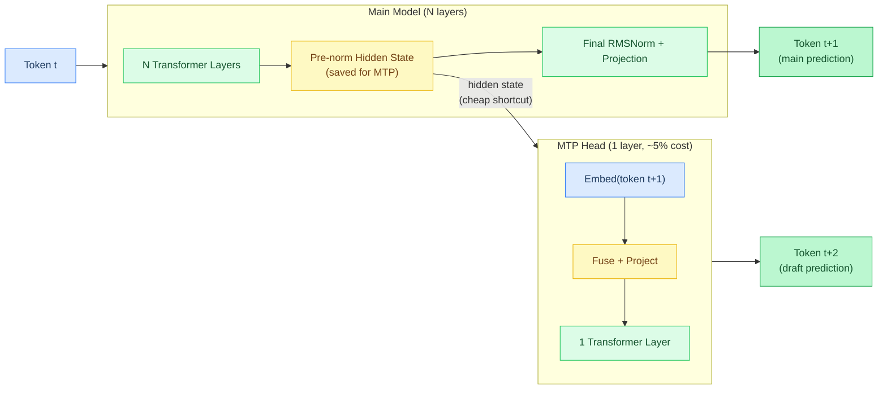
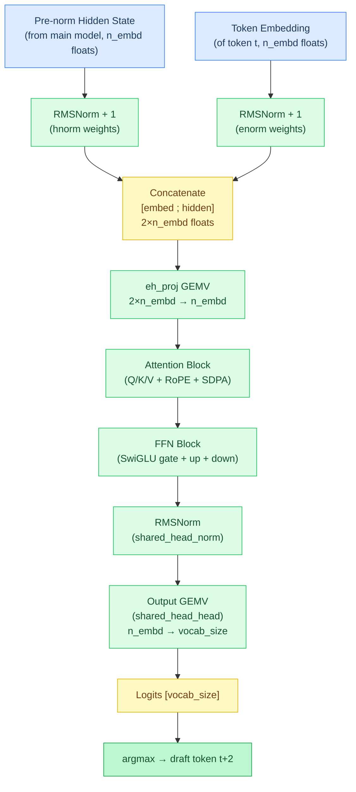
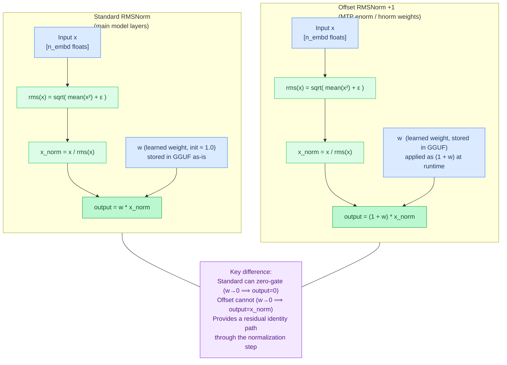
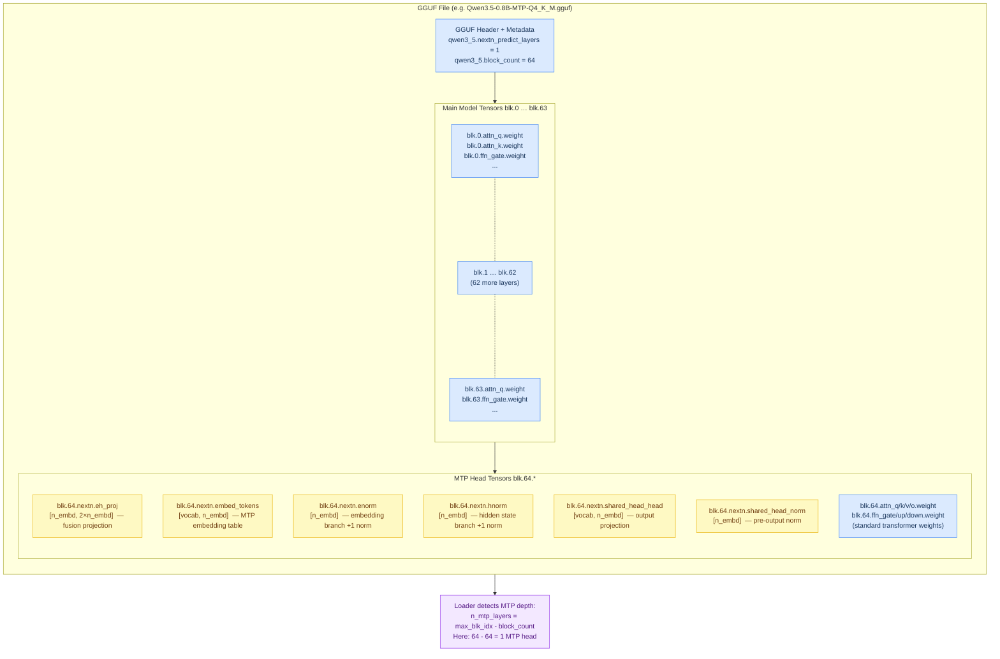
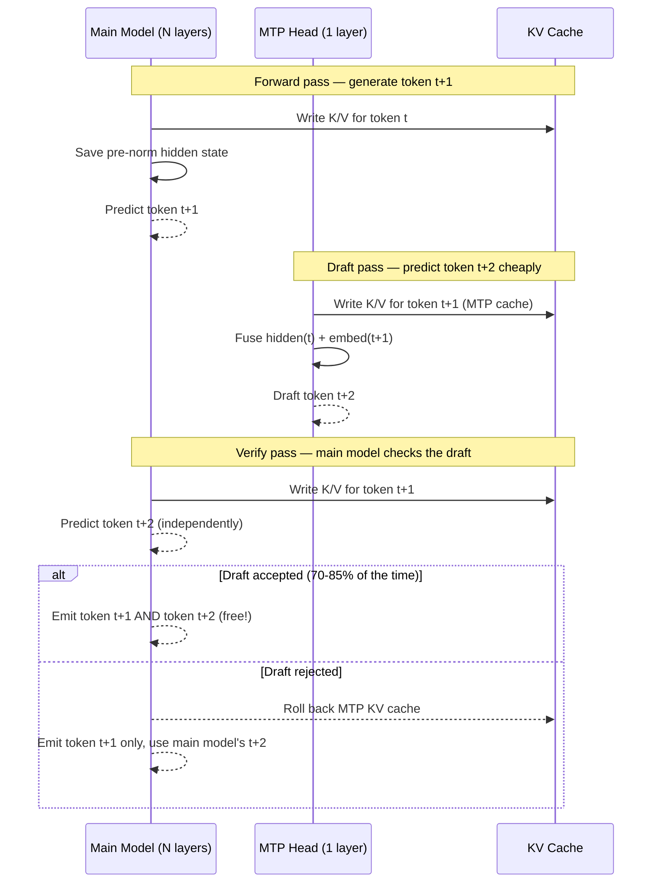
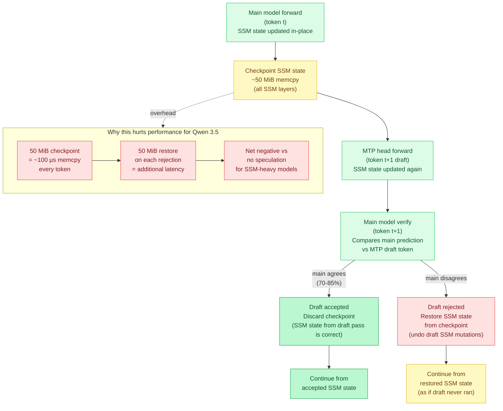
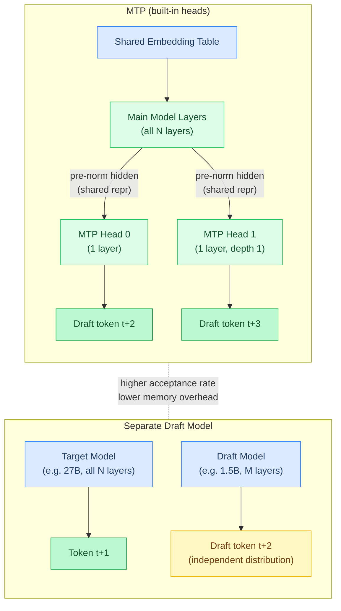

# Chapter 18: Multi-Token Prediction (MTP)

Standard LLM inference is **autoregressive** — each forward pass through the model produces exactly one token. The model processes all its layers (attention, feed-forward networks, normalization) to produce a probability distribution over the vocabulary, picks the best token, feeds it back in, and repeats. This is slow for large models because each token requires a full pass through billions of parameters.

**Multi-Token Prediction (MTP)** adds lightweight draft heads to the model that predict future tokens from the model's internal state. These heads are trained jointly with the main model — they live in the same checkpoint, share representations, and understand the model's output distribution natively. This makes them far more accurate than external draft models.

## How Standard Inference Works (Recap)

Before understanding MTP, let's trace what happens when a model generates one token:

### 1. Embedding Lookup

The input token ID (e.g., 42) indexes into an **embedding table** — a matrix of shape `[vocab_size, n_embd]`. This produces a dense vector of `n_embd` floats called the **hidden state**. This vector is the model's internal representation of the token.

### 2. Transformer Layers (The Layer Loop)

The hidden state passes through N **transformer layers** (e.g., 64 layers for a 0.8B model, or 32 layers for a 3B model). Each layer has two sub-blocks:

**Attention block** — lets the model look at previous tokens:
- **Q/K/V projections**: Three matrix multiplications (**GEMV** = General Matrix-Vector multiply) project the hidden state into **Query**, **Key**, and **Value** vectors. Q asks "what am I looking for?", K says "what do I contain?", V says "what information do I provide?"
- **Heads**: Q/K/V are split into multiple independent **attention heads** (e.g., 32 heads). Each head operates on a portion of the vector (`head_dim` elements). Multiple heads let the model attend to different aspects simultaneously (syntax, semantics, position, etc.)
- **RoPE** (Rotary Position Embedding): Rotates Q and K vectors by position-dependent angles so the model knows where each token is in the sequence. Without RoPE, the model couldn't distinguish "the cat sat on the mat" from "mat the on sat cat the"
- **SDPA** (Scaled Dot-Product Attention): `softmax(Q·K^T / √d) · V` — computes attention scores between the current token and all previous tokens in the **KV cache**, then produces a weighted sum of their values. The "scaled" part (`/ √d`) prevents the dot products from becoming too large
- **Gate** (Qwen3.5): Some models multiply the attention output by `sigmoid(gate)` — a learned signal that controls how much attention output flows through. Sigmoid squashes values to [0,1]
- **Output projection**: Another GEMV maps the attention output back to `n_embd` dimensions

**Feed-forward network (FFN)** — processes each token independently:
- **SwiGLU**: The standard FFN in modern LLMs. Two parallel GEMV projections (**gate** and **up**) expand the hidden state to a larger dimension (`n_ff`, typically 4× `n_embd`). The gate path applies **SiLU** activation (`x * sigmoid(x)`) and multiplies element-wise with the up path. A third GEMV (**down**) projects back to `n_embd`
- This is where the model "thinks" — attention gathers context, FFN transforms it

**Residual connections** — after each sub-block, the output is **added** to the input: `hidden = hidden + block_output`. This prevents the **vanishing gradient** problem and lets information flow unchanged through layers

**RMSNorm** (Root Mean Square Normalization) — applied before each sub-block. Normalizes the hidden state to unit variance: `output = weight * x / rms(x)` where `rms(x) = sqrt(mean(x²) + ε)`. Keeps values from exploding or collapsing across layers

### 3. Output Projection

After all layers, one final RMSNorm + GEMV maps the hidden state from `n_embd` dimensions to `vocab_size` dimensions, producing **logits** — one score per vocabulary token. The highest-scoring token is selected (**argmax** for greedy decoding, or sampling with temperature)

## What MTP Changes

MTP adds a shortcut. After the main model finishes its forward pass (all N layers), we save the **pre-norm hidden state** — the residual stream after the last attention block, before the final FFN residual and output norm are applied. This vector contains the model's complete understanding of the sequence context.



An MTP head takes this hidden state and produces an additional token prediction with just **one transformer layer** instead of N. This is ~5-10% the cost of a full forward pass. If the main model predicted token `t`, the MTP head predicts what token `t+1` will be — before the main model has even seen token `t`.

These draft tokens are then **verified** against the main model. If the main model agrees with the MTP prediction (which happens 70-85% of the time), the token is accepted for free. If not, the main model's prediction replaces it. This is **speculative decoding** — lossless, identical output to standard decoding.

## MTP Head Architecture

Each MTP head is a single transformer layer with some extra plumbing. Two vectors are fused together: the main model's final understanding of the context, and the embedding of the token just predicted. That fused vector feeds a lightweight transformer block that produces the next draft token.



### Step by Step

**1. Input preparation** — Two vectors are combined:
- The **pre-norm hidden state** from the main model (what the model "knows" after processing all layers)
- The **embedding** of the current token (the token the main model just predicted)

**2. +1 Offset RMSNorm** — Both vectors are normalized, but with a twist: `output = (1 + w) * x / rms(x)` instead of the standard `output = w * x / rms(x)`. The GGUF weights store `w`, and the `+1` offset is applied at runtime. This is a training technique from DeepSeek V3 that improves stability. The two weight tensors are called **enorm** (embedding norm) and **hnorm** (hidden state norm)

**3. Concatenation + Projection** — The two normalized vectors (each `n_embd` elements) are concatenated into a `2×n_embd` vector, then projected back to `n_embd` via **eh_proj** (a GEMV with weight matrix `[n_embd, 2×n_embd]`). Order matters: embedding first, then hidden state — matching the reference implementation

**4. Transformer block** — A single standard transformer layer processes the projected vector:
- Pre-attention RMSNorm
- Q/K/V projections + RoPE + SDPA (with its own separate KV cache)
- Gate multiplication (if the model uses gated attention)
- Output projection + residual
- Pre-FFN RMSNorm
- SwiGLU FFN (gate + up + SiLU×mul + down) + residual

**5. Output head** — RMSNorm + GEMV → logits → argmax. The weights (**shared_head_norm** and **shared_head_head**) are specific to the MTP head, not shared with the main model's output projection

### Offset RMSNorm: +1 vs Standard

The MTP head uses a variant of RMSNorm called **offset RMSNorm** (also called +1 norm), introduced in DeepSeek V3. The difference is subtle but important for training stability when fusing two different vector spaces.



The `+1` ensures that even if the learned weight `w` decays toward zero during training, the normalized input still passes through unchanged. This acts like a residual connection inside the normalization, making the two-branch fusion (hidden state + embedding) more stable to train.

**In code:** `rmsNormPlusOne` in `src/models/qwen35.zig` — identical to `rmsNorm` but multiplies by `(1.0 + w[i])` instead of `w[i]`.

### GGUF Tensor Names

MTP head tensors are stored at layer indices above the main model's layer count. For a 64-layer model with 1 MTP head, the MTP tensors are at `blk.64.*`:

| Tensor | Shape | Purpose |
|--------|-------|---------|
| `blk.64.nextn.eh_proj` | `[n_embd, 2×n_embd]` | Concatenation projection |
| `blk.64.nextn.embed_tokens` | `[vocab, n_embd]` | MTP embedding table |
| `blk.64.nextn.enorm` | `[n_embd]` | Embedding branch norm (+1 offset) |
| `blk.64.nextn.hnorm` | `[n_embd]` | Hidden state branch norm (+1 offset) |
| `blk.64.nextn.shared_head_head` | `[vocab, n_embd]` | Output projection |
| `blk.64.nextn.shared_head_norm` | `[n_embd]` | Pre-output norm |

Plus standard transformer block tensors (`attn_q.weight`, `ffn_gate.weight`, etc.) at the same layer index.

### GGUF File Layout: MTP Tensors Above Main Layers

MTP tensors occupy layer indices immediately after the main model's layer range. The GGUF file stores all tensors with their layer index prefix; a loader discovers MTP heads by finding `blk.N.*` where N >= the model's declared layer count.



The GGUF metadata field `{arch}.nextn_predict_layers` indicates how many MTP depths are present (typically 1).

## Draft/Verify Loop

MTP integrates with Agave's existing speculative decoding infrastructure. The key insight is that draft tokens are generated cheaply and then verified by the main model in a single pass. Accepted tokens are free; rejected tokens fall back to the main model's output with no quality loss.



For greedy decoding (temperature=0), speculative decoding is **lossless** — output is byte-identical to standard decoding. For sampling (temperature>0), rejection sampling preserves the target distribution.

## SSM State Checkpoint/Restore (Qwen 3.5)

Qwen 3.5 uses a hybrid architecture with **DeltaNet SSM** layers. Unlike attention, which only touches the KV cache on rejection, SSM layers maintain a **recurrent state** buffer that is modified in-place during each forward pass. Speculation requires checkpointing this state before the draft and restoring it on rejection.



Pure attention models (Qwen 3.6, Gemma 4) do not maintain recurrent state, so rejection only rolls back KV cache write pointers — essentially free. For Qwen 3.5, the 50 MiB SSM state copy on every token makes MTP a net negative unless the acceptance rate is extremely high.

## Performance Characteristics

MTP heads live inside the same checkpoint as the main model and share its learned representations. A separate draft model is an entirely independent model loaded alongside the main one. The structural difference explains why MTP achieves higher acceptance rates at lower memory cost.



| Metric | MTP | Separate Draft Model | N-gram |
|--------|-----|---------------------|--------|
| Acceptance rate | 70-85% | ~50% | Variable |
| Draft cost | ~5% of full forward | 100% of draft model | Zero |
| Memory overhead | ~2-10% | Full draft model weights | 8 KB ring buffer |
| Model support | MTP-trained only | Any model pair | Any model |

### SSM Caveat (Qwen 3.5)

Qwen 3.5 uses a hybrid architecture with **DeltaNet SSM** layers. SSM layers maintain recurrent state (~50 MiB for the 0.8B model) that must be checkpointed before speculation and restored on rejection. This overhead makes MTP a net negative for Qwen 3.5 specifically. Pure attention models (Qwen 3.6, Gemma 4) do not have this problem.

## Models With MTP Support

| Model | MTP Depth | Status |
|-------|-----------|--------|
| Qwen 3.5 (0.8B-27B) | 1 | Supported (SSM overhead caveat) |
| Qwen 3.6 (27B, 35B-A3B) | 1-3 | Architecture supported |
| DeepSeek V3/R1 | 1 | Architecture supported |
| Gemma 4 | Separate assistant checkpoint | Future |

## Usage

```bash
# MTP speculative decoding
agave model-mtp.gguf --spec-mode mtp "What is quantum computing?"

# With custom draft depth
agave model-mtp.gguf --spec-mode mtp --spec-tokens 1 "Hello"

# Server mode (transparent to API clients)
agave model-mtp.gguf --spec-mode mtp --serve
```

MTP GGUFs must include the nextn tensors. Look for "-MTP" in the filename (e.g., `Qwen3.5-9B-MTP-Q4_K_M.gguf`). Standard GGUFs without MTP tensors will report `n_mtp_layers=0` and `--spec-mode mtp` will fall back to single-token decode.

## Comparison With Other Spec Decode Modes

| Mode | `--spec-mode` | Draft Source | Best For |
|------|--------------|-------------|----------|
| DDTree | `ddtree` | Separate draft model | Best speedup with good draft model |
| Self-spec | `self` | Target model (skip layers) | No extra model needed |
| N-gram | `ngram` | Output history | Code, structured output, templates |
| Suffix | `suffix` | Cross-request cache | Server mode with shared context |
| Lookahead | `lookahead` | Jacobi parallel branches | Novel tokens, diverse output |
| **MTP** | `mtp` | Built-in prediction heads | MTP-trained models, best acceptance rate |
| **Medusa** | `medusa` | Built-in MLP heads (alias for MTP) | Medusa-format GGUFs |
| EAGLE | `eagle` | Hidden-state conditioned draft | High acceptance with EAGLE models |
| MLP Speculator | `mlp` | Frozen hidden-state draft | Lighter than EAGLE |

---

**In the code:** [src/models/qwen35.zig](../../src/models/qwen35.zig) (`mtpForward`, `rmsNormPlusOne`, MTP buffer allocation), [src/models/model.zig](../../src/models/model.zig) (`mtpForward`, `getMtpDepth`, `resetMtpCache` VTable methods), [src/spec/spec_decode.zig](../../src/spec/spec_decode.zig) (`draftMtp` function)

**Related:** [Chapter 2: The Transformer](02-the-transformer.md) (attention, RoPE, normalization), [Chapter 3: FFN](03-feed-forward-networks.md) (SwiGLU, MoE), [Chapter 7: Sampling](07-sampling.md) (argmax, temperature), [Chapter 17: Speculative Decoding](17-speculative-decoding.md) (DDTree, n-gram, verification)

**Next:** [Appendix: Mathematical Operations →](appendix-math.md) | **Back:** [Chapter 17: Speculative Decoding ←](17-speculative-decoding.md) | **Product docs:** [Models](../MODELS.md)

---

## Glossary

**eh_proj** — The GEMV projection mapping the concatenated `[embed; hidden]` vector from 2×n_embd back to n_embd dimensions.

**enorm** — The offset RMSNorm weight tensor applied to the token embedding branch in an MTP head.

**hnorm** — The offset RMSNorm weight tensor applied to the hidden state branch in an MTP head.

**MTP head** — A single transformer layer with fusion plumbing that takes the model's pre-norm hidden state and current token embedding to produce a draft token at ~5% of a full forward cost.

**nextn tensors** — GGUF tensor names prefixed with `blk.N.nextn.*` that store MTP head weights.

**nextn_predict_layers** — A GGUF metadata field indicating how many MTP depths are present in the checkpoint.

**offset RMSNorm (+1 norm)** — A variant where weight is applied as `(1 + w) * x_norm` instead of `w * x_norm`, ensuring the normalized input passes through even if w decays to zero.

**pre-norm hidden state** — The residual stream after the last attention block but before the final FFN residual and output norm.

**shared_head_head** — The output GEMV weight matrix in an MTP head mapping n_embd → vocab_size.

**shared_head_norm** — The RMSNorm weight applied before the MTP head's output projection.

**SSM state checkpoint/restore** — Copying recurrent state before speculation and restoring it on rejection, required for hybrid models that mutate state in-place.
