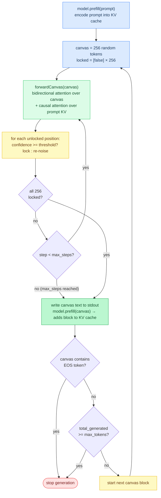

# Chapter 20: Diffusion Language Models

**Prerequisites:** [Chapter 2: The Transformer](02-the-transformer.md) (bidirectional vs. causal attention), [Chapter 5: Memory and Caching](05-memory-and-caching.md) (canvas attends against the prompt KV cache)

**Time:** ~14 min

> After this chapter you can explain block diffusion, canvas denoising, confidence-based acceptance, and how DiffusionGemma chains 256-token blocks.

## Overview

DiffusionGemma is Google's first publicly released **diffusion language model (dLLM)**. Unlike autoregressive LLMs that generate one token at a time from left to right, DiffusionGemma generates entire 256-token blocks simultaneously using iterative denoising, the same idea as image diffusion but applied to discrete text tokens.

This tutorial explains how block diffusion works, how it differs from autoregressive generation, and how Agave implements it.

---

## The Problem with Autoregression

Standard LLMs generate tokens sequentially: token 1, then token 2, then token 3. Each token requires a full forward pass through the model, and token N cannot be computed until token N-1 is done.

This sequential dependency creates a fundamental throughput limit: even with speculative decoding tricks (tutorial 17), the model runs O(output_tokens) forward passes.

---

## Block Diffusion

DiffusionGemma breaks the sequential dependency by generating 256 tokens at once. The process:

### 1. Canvas Initialization

A **canvas** of 256 token positions is initialized with random tokens from the vocabulary. There is no special [MASK] token, positions are filled with arbitrary vocabulary entries (uniform state diffusion).

```text
canvas = [random_tok, random_tok, ..., random_tok]  // 256 positions
```

### 2. Bidirectional Attention

During denoising, the canvas uses **bidirectional attention**, each canvas position can see all other canvas positions simultaneously. This is the key difference from autoregressive attention (where position N only sees positions 1..N-1).

Bidirectional attention lets the model produce internally consistent output: if it decides position 50 should be "Paris", it can use that information when resolving position 1.

### 3. Confidence-Based Acceptance

After each forward pass, the model produces logit scores for every canvas position. For each position:

```text
prob = softmax(logits)[argmax(logits)]  // confidence of best token
if prob >= threshold:
    accept token (lock it)
else:
    replace with new random token (re-noise)
```

**Implementation:** [`src/main.zig`](../../src/main.zig) (`generateDiffusion`, per-position confidence check against `--diffusion-confidence`)

Accepted tokens become **anchors** for future denoising steps. Re-noised positions get fresh random tokens, not the rejected guess, so the model gets a clean slate rather than being biased by a bad early prediction.

### 4. Convergence

This continues for up to `--diffusion-steps` iterations (default 16). The process naturally converges: accepted tokens provide better context, which increases confidence in neighboring positions.

### 5. Block Autoregressive Chaining

Once the 256-token canvas is fully denoised, it becomes part of the KV cache. A new canvas starts, conditioned on all prior prompt + generated tokens. This allows outputs longer than 256 tokens.

---

## Architecture Details

DiffusionGemma is built on the Gemma 4 26B A4B backbone:
- 30 layers: pattern of 5 sliding-window + 1 global attention (repeat 5×)
- 128 experts MoE with top-8 routing
- 2816 hidden dimension; dual attention: sliding-window heads (dim 256, 16/8 Q/KV) and global heads (dim 512, 16/8 Q/KV)
- BF16 SafeTensors only (no GGUF yet)
- Tensor prefix: `model.decoder.layers.N.*`

Key differences from standard Gemma 4:
- **Fused expert weights**: `experts.gate_up_proj` stores gate+up concatenated in a single 2D tensor `[n_experts * 2*ff, hidden]` instead of separate tensors
- **Per-layer scalar**: `layer_scalar` applied to attention output
- **Canvas attention**: bidirectional within the 256-token canvas region (no causal mask)

---

## Agave Implementation

Agave implements DiffusionGemma in `src/models/diffusion_gemma.zig`:

### Two Forward Modes

**Encoder (`forward()`)**  
Standard causal autoregressive forward for processing the prompt. Adds tokens to the KV cache. Same as other models.

**Canvas denoiser (`forwardCanvas(canvas, logits_out)`)**  
Takes a 256-token canvas, runs bidirectional attention over all canvas positions against the prompt KV cache, and returns logits for all 256 positions. Does NOT add canvas tokens to the KV cache (canvas K/V is computed transiently).

### Canvas Attention Kernel

`scaledDotProductAttentionCanvas()` in `src/ops/attention.zig`:

For each canvas query token:
1. Score against all prompt tokens (from KV cache), causal, all visible
2. Score against all 256 canvas tokens, bidirectional (no causal mask)
3. Softmax over all scores
4. Accumulate V from prompt cache + canvas V vectors

This is structurally identical to how VLM image tokens work in Gemma 4: image/canvas tokens attend to each other bidirectionally and can see all preceding prompt context.

### Denoising Loop (in `generateDiffusion()`)



```text
1. Encode prompt (model.prefill)
2. For each canvas block:
   a. canvas = [random tokens]
   b. For step in 0..max_steps:
      i.  forwardCanvas(canvas) → logits[256 * vocab_size]
      ii. For each position: if confidence >= threshold, lock; else re-noise
      iii. If all locked: break
   c. Append canvas text to output
   d. model.prefill(canvas) → adds canvas to KV cache for next block
   e. Stop if canvas contains EOS, or total_generated >= max_tokens
```

**Implementation:** [`src/main.zig`](../../src/main.zig) (`generateDiffusion` via `Model.forwardCanvas`), [`src/models/model.zig`](../../src/models/model.zig) (vtable), [`src/models/diffusion_gemma.zig`](../../src/models/diffusion_gemma.zig) (`forwardCanvas`)

---

## Usage

```bash
# Basic usage (download BF16 weights first)
agave pull google/diffusiongemma-26B-A4B-it
agave diffusiongemma-26B-A4B-it/ "Explain quantum computing"

# Control denoising steps (more steps = higher quality, slower)
agave diffusiongemma-26B-A4B-it/ --diffusion-steps 48 "..."

# Stricter confidence threshold (harder to lock, more refinement)
agave diffusiongemma-26B-A4B-it/ --diffusion-confidence 0.8 "..."

# Smaller canvas for shorter outputs
agave diffusiongemma-26B-A4B-it/ --diffusion-canvas 128 "..."
```

---

## Performance Characteristics

DiffusionGemma's theoretical advantage:
- Generates 256 tokens per denoising step (vs 1 per autoregressive step)
- Typical convergence in 12-16 steps → 12-16 forward passes for 256 tokens (one `forwardCanvas` per step)
- Autoregressive equivalent: 256 forward passes

Reported throughput: ~1,288 tokens/sec on H200 (FP8), ~6× autoregressive baseline.

Agave v1 implementation runs canvas attention serially (one token at a time through the layer loop). A batched prefill path that processes all 256 canvas tokens in a single GPU dispatch would approach the theoretical speedup.

---

## Comparison: Diffusion vs Autoregressive vs Speculative

| Method | Passes per 256 tokens | Causal? | Self-correction? |
|--------|----------------------|---------|-----------------|
| Autoregressive | 256 | Yes | No |
| Speculative (DDTree) | ~64 (4× acceptance) | Yes | No |
| Block diffusion | 12-48 | No | Yes |
| Diffusion + MTP | TBD | Partial | Yes |

The self-correction property is unique to diffusion: if an early token becomes inconsistent with later context, re-noising lets the model fix it. Autoregressive models commit to each token irrevocably.

---

## Gotchas

- **`--max-tokens` rounds up to whole canvas blocks, it doesn't cap output length the way it does in autoregressive mode.** In AR generation, `--max-tokens 50` stops after exactly 50 tokens. In diffusion mode, `generateDiffusion()` computes `max_blocks = ceil(max_tokens / canvas_len)`, so `--max-tokens 50` with the default 256-token canvas still runs one full block and can emit up to 256 tokens before the length check ever fires. To bound output length precisely, shrink `--diffusion-canvas` itself rather than relying on `--max-tokens` alone.
- **The full canvas is written to stdout before the EOS check runs.** Each block emits all of its locked tokens first, then checks whether the block contains EOS to decide whether to start another block. If EOS appears at position 50 of a 256-token canvas, positions 51-255 (whatever the model denoised them to) are still printed as part of that block's output before generation stops.
- **Shrinking the canvas isn't the same trade-off as shrinking `--max-tokens` in AR mode.** Canvas attention is bidirectional across the whole canvas, so `forwardCanvas()` cost scales with canvas size regardless of how much of it turns out to be needed. A smaller canvas means more blocks (more `model.prefill()` calls) for the same total output; it's a granularity knob, not a speed-for-quality trade like reducing `--max-tokens` is in autoregressive generation.

---

**In the code:** [src/models/diffusion_gemma.zig](../../src/models/diffusion_gemma.zig) (canvas forward, block diffusion), [src/ops/attention.zig](../../src/ops/attention.zig) (`scaledDotProductAttentionCanvas`), [src/main.zig](../../src/main.zig) (`generateDiffusion`)

**Next:** [Chapter 21: LoRA Adapters →](21-lora.md) | **Back:** [Chapter 19: PFlash and Block Sparse Attention ←](19-pflash-and-block-sparse.md)

---

## Glossary

**anchor token**, A canvas token that has been accepted (locked) during denoising; provides stable context for resolving remaining positions.

**bidirectional attention**, Attention where each canvas position can see all other canvas positions simultaneously (no causal mask).

**block autoregressive chaining**, Appending a fully denoised canvas to the KV cache and starting a new one conditioned on all prior context.

**canvas**, A fixed-size buffer (default 256 tokens) initialized with random vocabulary tokens that is iteratively denoised to produce output.

**confidence-based acceptance**, Locking a canvas position when the model's softmax probability for its top token exceeds a threshold.

**dLLM (diffusion language model)**, A language model generating text by iteratively denoising random tokens in parallel rather than autoregressively.

**denoising step**, One forward pass over the canvas followed by acceptance/re-noising decisions at each position.

**diffusion-canvas**, CLI parameter setting the canvas size (default 256 tokens).

**diffusion-confidence**, CLI parameter setting the probability threshold for locking a canvas position.

**diffusion-steps**, CLI parameter controlling the maximum denoising iterations per canvas block (default 16).

**re-noising**, Replacing a rejected canvas token with a fresh random token to give the model a clean slate.

**self-correction**, The property unique to diffusion: if an early token becomes inconsistent with later context, re-noising lets the model fix it.

**uniform state diffusion**, Initializing canvas positions with arbitrary vocabulary entries rather than special [MASK] tokens.

**VLM (Vision Language Model)**, A model combining vision encoding and language generation for image understanding tasks.
