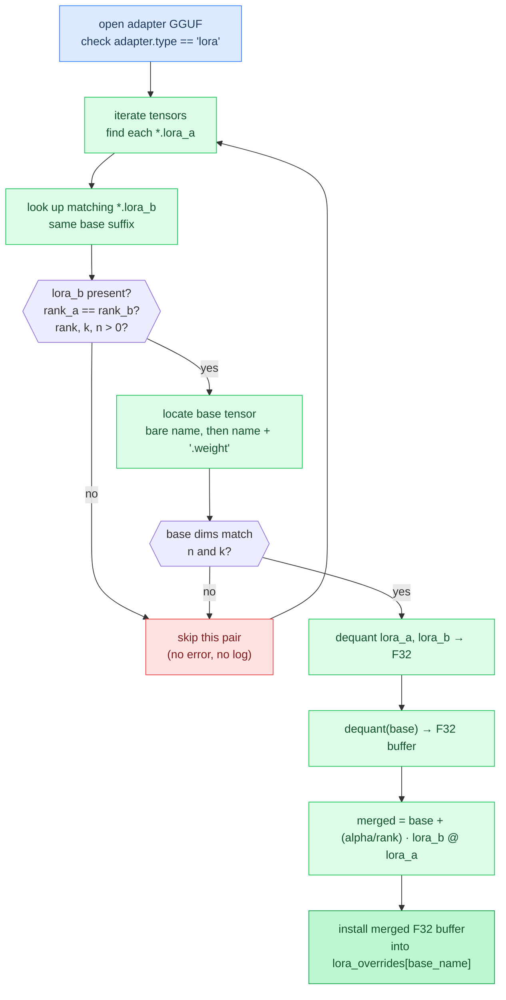

# Chapter 21: LoRA Adapters

**Prerequisites:** [Chapter 4: Quantization](04-quantization.md), [Chapter 14: Format Conventions](14-format-conventions.md)

**Time:** ~12 min

> After this chapter you can explain how LoRA adapters merge into base weights at load time.

## 1. Why Adapters

Fine-tuning a model the ordinary way means updating every weight tensor and saving a full new copy of the model, tens of gigabytes for anything past a few billion parameters. **LoRA** (Low-Rank Adaptation) fine-tunes cheaply by freezing the base weights entirely and training only a small correction on top of them.

For a target weight matrix `W` of shape `[n, k]`, LoRA introduces two much smaller matrices: `A` of shape `[rank, k]` and `B` of shape `[n, rank]`, where `rank` (often called `r`) is a small number like 8, 16, or 64, far below `n` or `k`. The product `B @ A` reconstructs an `[n, k]`-shaped delta, but because it factors through the narrow `rank` dimension, training only touches `rank * (n + k)` parameters instead of `n * k`. Multiple adapters trained this way stay tiny (megabytes, not gigabytes) and any of them can be applied to the same frozen base model.

Agave doesn't train adapters. It **loads** an adapter someone else trained, in the GGUF format `llama.cpp`'s `convert_lora_to_gguf.py` produces, and merges it into the base model's weights once, before generation starts.

## 2. GGUF Adapter Layout

An adapter GGUF is a small file separate from the base model, structured as its own set of metadata keys and tensors:

- `adapter.type` (string): must be `"lora"`. Some producers write `general.type` instead; Agave checks both.
- `adapter.lora.alpha` (f32): the adapter's scaling factor. Defaults to `1.0` if absent.
- `blk.{i}.{name}.lora_a`: shape `[rank, in_features]`, the `A` matrix for one target tensor.
- `blk.{i}.{name}.lora_b`: shape `[out_features, rank]`, the paired `B` matrix.

The tensor name minus its `.lora_a` / `.lora_b` suffix (`blk.{i}.{name}`) is the **base suffix**: the name Agave uses to find the corresponding tensor in the already-loaded base model, first by that bare name, then by the same name with `.weight` appended (most base tensors carry the `.weight` suffix; a handful, per Chapter 14, don't).

## 3. Load-Time Merge

Agave iterates every tensor in the adapter file looking for names ending in `.lora_a`. For each one it finds, it looks up the paired `.lora_b` tensor and the matching base tensor, then computes:

```text
scale = alpha / rank
merged[n, k] = dequant(base[n, k]) + scale * (lora_b[n, rank] @ lora_a[rank, k])
```

`dequant(base[n, k])` expands the base tensor to F32 regardless of its on-disk quantization (Q4_0, BF16, whatever the model shipped as), because the delta itself is dense F32 and there's no quantized-plus-dense addition kernel. The `lora_b @ lora_a` matmul (`[n, rank] × [rank, k] → [n, k]`) is dense too: on macOS with Metal enabled it runs through Accelerate's SGEMM (AMX-accelerated), and everywhere else through a scalar triple loop. Either way the result is added directly into the dequantized base buffer, `merged += scale * (lora_b @ lora_a)`, one tensor at a time.

The merge runs exactly once, during model load, for however many `lora_a`/`lora_b` pairs the adapter file contains, typically the attention and feed-forward projection matrices of every layer. It never runs again during generation.



## 4. Override Map and Hot-Path Transparency

Each merged tensor is written into `lora_overrides`, a hash map on the base model's `GGUFFile` keyed by the base tensor's canonical name. It does not replace anything in the memory-mapped file; the original mmap'd bytes stay exactly as they were on disk.

The map only matters at one call site: `getTensor()`. Every model implementation resolves its weight tensors by calling `fmt.getTensor(name)` while it builds its layer structs, the same access pattern covered in Chapter 14. `getTensor()` checks `lora_overrides` first; on a hit it returns the merged F32 buffer instead of the mmap'd original, with no other change to the caller. Model code never checks whether an adapter was applied, and it never sees `lora_overrides` directly; it just gets back a normal `TensorInfo` pointing at F32 data instead of the original quantized data.

Because this lookup happens during model construction, not inside `forward()`, LoRA adds zero cost to token generation. By the time the first token is generated, every model struct already holds plain pointers into either the original mmap or a merged override buffer, indistinguishable from each other at the call sites that matter.

## 5. Memory Limits

The tradeoff for that transparency is memory. A quantized base tensor (say, Q4_0, roughly 4.5 bits per weight) that gets touched by an adapter becomes a full F32 buffer, roughly 7x the footprint for that one tensor. An adapter that touches every projection matrix in every layer, which is typical, means every one of those tensors balloons to F32 simultaneously, on top of the original quantized weights still sitting in the mmap (unused, but not unmapped). On a large model with many layers, applying a LoRA adapter can add several gigabytes of resident memory beyond the base model's normal footprint. This is a fixed, one-time cost paid at load: it doesn't grow with context length or generation length the way the KV cache does.

## Invocation

LoRA is a single CLI flag; see the [README](../../README.md) for the full flag reference.

```bash
agave model.gguf --lora adapter.gguf "prompt"
```

## Gotchas

- **Wrong adapter type fails the entire load before any tensors are merged.** `applyLoraGguf()` checks `adapter.type` (or `general.type`) once, at the top of the function, before touching any tensors. If it isn't `"lora"`, the function returns `error.NotALoraAdapter` immediately and nothing is merged. This is a hard error, not a partial apply.
- **A bad individual pair is silently skipped, not reported.** Inside the per-tensor loop, a missing `lora_b`, a rank mismatch between `lora_a` and `lora_b`, or a shape mismatch against the base tensor all take the same path: `continue` to the next `lora_a` entry. There's no error, no log line naming the skipped tensor, just one fewer entry in the final `lora_overrides` count that gets printed after loading finishes.
- **Every merged tensor becomes F32, unconditionally.** There's no quantized merge path (no "add a dense delta to a Q4_0 block without fully expanding it" kernel). Expect the memory increase from section 5 for every tensor the adapter actually modifies, proportional to how many of the model's projections the adapter was trained against.

## How This Relates to the Code

**In the code:** [`lora` merge path](../../src/lora.zig)

```text
open adapter → match base tensors → dequant → merge → override map
```

**Next:** [Chapter 22: Distributed Inference →](22-distributed-inference.md) | **Back:** [Chapter 20: Diffusion Language Models ←](20-diffusion-lm.md)

---

## Glossary

**adapter (LoRA adapter)**: A small GGUF file holding `lora_a`/`lora_b` matrix pairs and a scale factor, trained separately from the base model and merged into it at load time.

**alpha**: The `adapter.lora.alpha` scaling metadata value; combined with `rank` to form the merge scale factor `alpha / rank`.

**base suffix**: The tensor name shared by a `lora_a`/`lora_b` pair, obtained by stripping the `.lora_a` or `.lora_b` suffix; used to find the matching base tensor.

**lora_overrides**: A hash map on `GGUFFile`, keyed by base tensor name, holding F32 merged weight buffers that `getTensor()` returns in place of the original mmap'd tensor.

**rank**: The shared inner dimension (`r`) of a LoRA pair's `A` (`[rank, k]`) and `B` (`[n, rank]`) matrices; small relative to `n` and `k`, which is what keeps adapters lightweight.

**scale**: The merge coefficient `alpha / rank`, applied to the `lora_b @ lora_a` product before adding it to the dequantized base weight.
