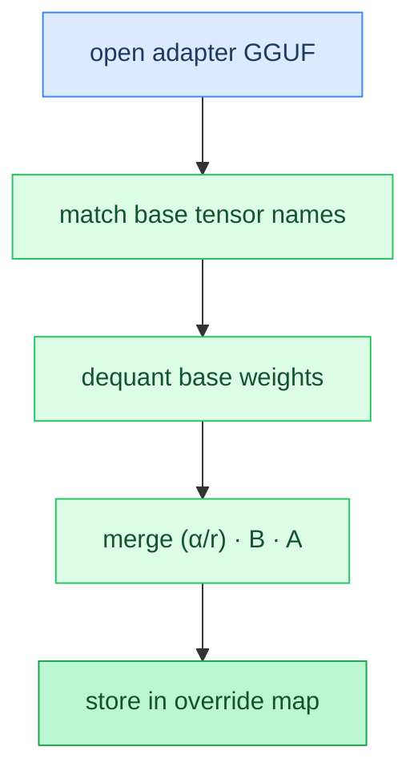

# Chapter 21: LoRA Adapters

**Prerequisites:** [Chapter 4: Quantization](04-quantization.md), [Chapter 14: Format Conventions](14-format-conventions.md)

**Time:** ~12 min

> After this chapter you can explain how LoRA adapters merge into base weights at load time.

<!-- TODO: Task 3 — full prose -->

### Code Flow



## Gotchas

- Placeholder — filled in Task 3.

## How This Relates to the Code

**In the code:** [`lora` merge path](../../src/lora.zig)

```text
open adapter → match base tensors → dequant → merge → override map
```

**Next:** [Chapter 22: Distributed Inference →](22-distributed-inference.md) | **Back:** [Chapter 20: Diffusion Language Models ←](20-diffusion-lm.md)

---

## Glossary

(Terms added in Task 3.)
