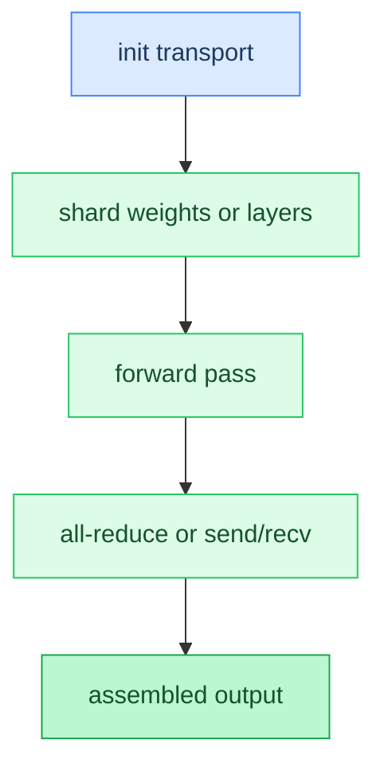

# Chapter 22: Distributed Inference

**Prerequisites:** [Chapter 8: Backends](08-backends.md), [Chapter 12: CPU Parallelism](12-cpu-parallelism.md)

**Time:** ~20 min

> After this chapter you can explain how tensor and pipeline parallelism shard work across devices.

<!-- TODO: Task 4 — full prose -->

### Code Flow



## Gotchas

- Placeholder — filled in Task 4.

## How This Relates to the Code

**In the code:** [`parallel` transport and sharding](../../src/parallel/transport.zig), [`device discovery`](../../src/devices/discovery.zig)

```text
init transport → shard → forward with all-reduce or stage send/recv
```

**Next:** [Chapter 23: Server / HTTP API →](23-server-http-api.md) | **Back:** [Chapter 21: LoRA Adapters ←](21-lora.md) | **Product docs:** [PARALLELISM](../PARALLELISM.md)

---

## Glossary

(Terms added in Task 4.)
