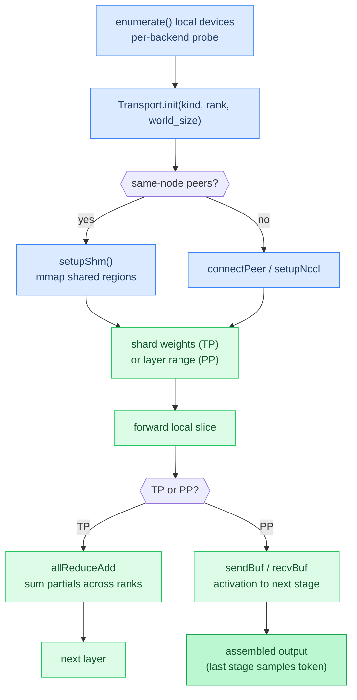

# Chapter 22: Distributed Inference

**Prerequisites:** [Chapter 8: Backends](08-backends.md), [Chapter 12: CPU Parallelism](12-cpu-parallelism.md)

**Time:** ~20 min

> After this chapter you can explain how tensor and pipeline parallelism shard work across devices.

## 1. When One Device Is Not Enough

Every prior chapter assumed the whole model fits on one backend: CPU RAM, or one GPU's VRAM. That assumption breaks in two independent ways. A model can be too *big* (a 70B-parameter model in Q4 quantization is still tens of gigabytes, more than a single consumer GPU holds), or a workload can be too *slow* on one device even though it fits (decode is memory-bandwidth-bound, per Chapter 0, and splitting the weight stream across two GPUs' worth of bandwidth can help). Agave addresses both with two orthogonal ways of splitting a forward pass across multiple **ranks** (the distributed-computing term for one participant in a multi-process job, not related to `argmax`'s "highest-ranked" logit): **tensor parallelism** (TP, split each layer's weights) and **pipeline parallelism** (PP, split the layers themselves). They can combine (hybrid TP+PP), and a related third mode, **disaggregated prefill/decode**, splits the two *phases* of generation across ranks instead of splitting the model.

All of this is wired generically, not per-model. `ModelStorage.initFromArch()` (`src/models/model.zig`) takes a `tp_rank`/`tp_degree` pair and checks `@hasField(M, "tp_rank")` at comptime before setting them; `setPpConfig()` does the same for `pp_rank`/`pp_degree`/`pp_transport`. A model architecture only participates in TP or PP if its struct happens to declare those fields, which today means Qwen 3.5 (`src/models/qwen35.zig`). Everything below describes what happens once those fields are set.

## 2. Tensor Parallelism: Splitting a Layer

TP shards the weight matrices *inside* each transformer layer across `tp_degree` ranks, so each rank holds a fraction of every weight and does a fraction of the arithmetic, then the ranks combine their partial results before moving to the next layer. The FFN block is the concrete case that runs today:

```text
# each rank, same layer
gate_local, up_local = local_gemv(x, W_gate_shard, W_up_shard)   # column-parallel
ffn_partial = local_gemv(activation(gate_local, up_local), W_down_shard)  # row-parallel
all_reduce_sum(ffn_partial)   # Transport.allReduceAdd: every rank ends up with the same full sum
```

The split follows the standard Megatron-LM pattern: `W_gate`/`W_up` are **column-parallel** (each rank gets `n_ff / tp_degree` columns and computes independently, no communication needed yet), and `W_down` is **row-parallel** (each rank holds a slice of rows, so each rank's output is only a partial sum over the full hidden dimension; the ranks must add their partials together to get the real result). One `allReduceAdd` per layer, right after `W_down`, is what makes that addition happen.

In the model code (`Qwen35Model.shardColumnWeight()` / `shardRowWeight()` in `src/models/qwen35.zig`), column-sharding is just a pointer offset into the already-loaded weight (`tp_rank * n_local * row_bytes`), free of any copy. Row-sharding is not free: extracting one rank's *columns* out of a row-major tensor means copying strided data into a contiguous scratch buffer (`tp_row_shard_buf`) before the GEMV can read it linearly.

**Attention is not sharded today.** The comment in `model.zig` is explicit about it: "attention TP needs per-rank KV caches (not yet implemented)." Splitting attention across ranks properly means each rank keeps only its own heads' worth of KV cache, which nobody has built yet. So every layer runs full, un-sharded attention (`tp_degree` forced to `1` for that part), and only the FFN block actually splits work and all-reduces. This means today's TP saves FFN compute and memory, not attention compute, and it's the reason the [PARALLELISM.md](../PARALLELISM.md) benchmark table shows less TP speedup than PP speedup on the same hardware.

Two code paths exist for running dual-rank TP, chosen by whether a network `Transport` is configured for TP:

- **No transport (in-process simulation):** a single `Qwen35Model` instance flips its own `tp_rank` field between `0` and `1` and calls `ffnCompute()` twice in a row inside its own `forward()`, once per rank, reusing the same weight buffers via `shardColumnWeight()`'s pointer-offset trick. The two partial results land in separate scratch buffers and get added together with a plain loop (`self.hidden2[i] += self.attn_out[i]`), the in-process stand-in for `allReduceAdd`. One model, one process, no parallelism speedup, useful for correctness testing without a second machine.
- **With transport:** a single rank per process, real network communication for `allReduceAdd`, real parallel speedup, second machine or second process required.

A separate, third coordinator, `TpGroup` (`src/parallel/tp.zig`), is not the mechanism behind either path above. It allocates `degree` full `ModelStorage` instances, one per rank, each with its own sharded weights, but its own file header says plainly it "only executes rank 0", because all-reduce isn't implemented for it. It is an incomplete scaffold that `main.zig` doesn't call into today, not the code path that runs when you set `tp_degree > 1`.

None of this is reachable from the CLI yet. `main.zig`'s argument validation rejects `--tp > 1` outright, before either path above ever runs (`error: --tp > 1 is not supported yet (tensor-parallel all-reduce is incomplete)`, exit code 2). Everything in this section describes what the model layer does when `tp_degree` is set programmatically, the way `qwen35.zig`'s own tests do it; there is currently no way to reach it through the `agave` binary. `--pp` and `--disagg`, covered next, have no such gate.

## 3. Pipeline Parallelism: Splitting the Layers

PP takes a different cut: instead of splitting every layer's weights, it hands whole contiguous ranges of layers to different ranks. Rank 0 (stage 0) owns the embedding lookup and the first `n_layers / pp_degree` layers; the last stage owns the remaining layers plus the final output projection and sampling. Every decode step becomes a relay race across stages:

```text
# pipeline parallel step, non-last stage
activation = forward_local_layers(x)      # only this stage's layer range
send(activation, next_stage)              # Transport.sendBuf
sampled_token = recv(next_stage)          # Transport.recvBuf: the last stage relays the sampled token back

# last stage
activation = recv(prev_stage)             # Transport.recvBuf
activation = forward_local_layers(activation)
sampled_token = project_and_sample(activation)
send(sampled_token, prev_stage)           # Transport.sendBuf: relayed back for the next decode step
```

In `Qwen35Model.forward()`, this shows up as a layer-range check inside the per-layer loop (`if (li < pp_layer_start or li >= pp_layer_end) continue;`) and a pair of `sendBufs`/`recvBufs` calls that batch the hidden-state vector transfer around the loop. The payload per hop is tiny: one `n_embd`-length f32 vector, a few KB to a few dozen KB depending on model size, nothing like the multi-gigabyte weight tensors TP has to touch.

The tradeoff PP makes is visible in the loop shape itself: during single-token decode, only one stage is doing real work at any instant while the others wait idle for their turn (called the **pipeline bubble**), so PP's per-step latency doesn't improve versus a single device the way TP's parallel FFN compute can. What PP buys instead is *fitting* a model that doesn't fit on one device: `n_layers / pp_degree` layers' worth of weights per rank, instead of every layer's weights on every rank.

## 4. Hybrid and Disaggregated Modes

TP and PP are orthogonal splits (one cuts across a layer, the other cuts across layers), so they compose: a hybrid TP+PP setup groups ranks into `pp_degree` pipeline stages, and within each stage, `tp_degree` ranks tensor-parallelize that stage's layers. Nothing new happens at the transport level, it's the same `allReduceAdd` and `sendBuf`/`recvBuf` primitives, just wired to two different rank groupings at once.

**Disaggregated prefill/decode** (`--disagg`) is a different kind of split: instead of dividing the model, it divides the two *phases* of generation from Chapter 0 across two ranks. Rank 0 runs prefill (batched forward pass over the whole prompt, building the KV cache), then instead of continuing into decode itself, it sends the resulting KV cache over to rank 1, which runs the decode loop from there. The motivation is that prefill and decode have different bottlenecks (compute-bound GEMM vs. memory-bandwidth-bound GEMV, per Chapter 0), so a real deployment might want prefill and decode running on differently-provisioned hardware rather than time-sharing the same GPU between the two.

## 5. Transport: How Ranks Actually Talk

Every collective in the sections above (`allReduceAdd`, `sendBuf`, `recvBuf`) is a method on `Transport` (`src/parallel/transport.zig`), and every one of them dispatches on `self.kind`, a `TransportKind` enum with four values:

- **`tcp`**: plain BSD sockets, blocking `send`/`recv` loops. Works across nodes over any IP network. `allReduceAdd` over TCP sends the local buffer, receives the peer's buffer into a scratch allocation, and adds them element-wise with a SIMD-accelerated loop (`simdAddF32`, 8-wide `@Vector`).
- **`shm`**: POSIX shared memory (`shm_open` + `mmap`), for two ranks on the same machine. Each rank pair gets two named regions, one per direction (`/agave_0to1`, `/agave_1to0`), each with a small atomic-flag header (`ShmHeader.ready`) that the sender sets and the receiver clears. Send and receive are bounded spin-loops on that flag rather than syscalls, zero-copy once the mapping exists.
- **`nccl`**: NVIDIA's collective communication library, loaded at runtime via `std.DynLib.open("libnccl.so.2")` rather than linked at compile time (keeping the zero-external-dependencies build intact; NCCL is an optional runtime plugin, not a build dependency). On the GPU path, `allReduceAdd` hands NCCL a device pointer directly, no host round-trip, when the caller's activation buffer is already resident on-device.
- **`rccl`**: declared as a fourth `TransportKind` variant, and that's it. There's no dlopen path, no function-pointer table, nothing. `Transport.init()` accepts `tcp`, `shm`, and `nccl` and rejects everything else; today that "everything else" is `rccl` alone, and it fails immediately with `error.NotImplemented`. AMD ROCm multi-GPU has no distributed path yet.

Picking a transport is fundamentally a question of topology: are the ranks on the same machine, or different machines? Same-machine ranks can use `shm`'s zero-copy memory bandwidth; different machines need an actual network, `tcp` at minimum, or `nccl` if both sides have NVIDIA GPUs and RDMA-capable NICs. The concept of an automatic choice (same-node peers resolve to `shm`, everything else falls back to `tcp`) exists in the launch layer; see [PARALLELISM.md](../PARALLELISM.md) for the exact flag and detection rule.

## 6. Device Discovery: What's Actually Available

Before any of the above can run, something has to answer "how many devices do I even have, and how much memory does each one hold?" That's `src/devices/discovery.zig`, a pure enumeration step, no allocation, no distributed communication, just probing local hardware. `enumerate()` walks every backend compiled into the binary (Metal, CUDA, ROCm, Vulkan, each behind a comptime `build_options` flag) and calls that backend's native device-listing API: `MTLCopyAllDevices` for Metal, `cuDeviceGetCount`/`cuDeviceGetName` for CUDA, `hipGetDeviceCount` for ROCm, `vkEnumeratePhysicalDevices` for Vulkan. CPU is unconditionally appended last as a fallback that's always "available."

Each discovered device becomes a `DeviceInfo`: a backend tag, a device index, a name, total and available memory, a UMA flag (does this device share physical RAM with the CPU, relevant from Chapter 8 and Chapter 11), and a compute-capability string where the backend exposes one (`sm_121` for CUDA, `Metal` as a placeholder for Apple GPUs). This enumeration is what a launch command uses to pick a specific GPU index when a machine has more than one, and it's entirely local: it says nothing about which devices belong to which rank in a distributed job. That mapping (which rank uses which local device) is a separate, manual decision made at launch time; see [PARALLELISM.md](../PARALLELISM.md) for how a device index is chosen.

### Code Flow



## CLI Invocation

Distributed inference flags from [`src/main.zig`](../../src/main.zig):

| Flag | Short | Default | Description |
|------|-------|---------|-------------|
| `--tp N` | | `1` | Tensor parallelism degree (blocked at CLI today for N>1) |
| `--pp N` | | `1` | Pipeline parallelism stages |
| `--rank N` | | `0` | This node's rank for TP/PP/disagg |
| `--peers ADDR` | | | Peer address (e.g. `192.168.0.2` or `192.168.0.2:9999`) |
| `--transport TYPE` | | `auto` | IPC transport: `auto`, `tcp`, `shm`, `nccl` |
| `--disagg` | | off | Disaggregated prefill/decode (rank 0 prefills, rank 1 decodes) |
| `--list-devices` | | | List available compute devices and exit |
| `--device N` | | `0` | GPU device index for CUDA/ROCm/Vulkan |

```bash
# List available GPUs
agave model.gguf --list-devices

# Select a specific GPU by index
agave model.gguf --backend vulkan --device 1

# Same-node pipeline parallelism (shared memory transport)
agave model.gguf --pp 2 --rank 0 --peers localhost "prompt"

# Cross-node pipeline parallelism (TCP)
agave model.gguf --pp 2 --rank 0 --peers 192.168.0.2 "prompt"

# Pipeline parallelism over NCCL RoCE RDMA
agave model.gguf --pp 2 --rank 0 --peers 10.0.1.2 --transport nccl

# Disaggregated prefill/decode
agave model.gguf --disagg --rank 0 --peers 192.168.0.2

# Hybrid TP+PP (when TP is enabled)
agave model.gguf --tp 2 --pp 2 --rank 0 --peers 192.168.0.2
```

## Gotchas

- **`--tp > 1` is blocked at the CLI today, not just slow or experimental.** The model-layer TP code in section 2 (sharding, `allReduceAdd`, the in-process dual-rank trick) all exists and compiles, but `main.zig`'s argument validation exits with an error before any of it runs if `--tp` is above `1`. Distributed tensor parallelism is not something you can launch through the `agave` binary right now, full stop; it's a model-layer capability without a CLI path to it yet. `--pp` and `--disagg` have no equivalent gate: both are launchable today (see [PARALLELISM.md](../PARALLELISM.md) for the exact invocation).
- **Rank/world-size mismatch hangs or corrupts results, silently.** `Transport.init()` takes `rank` and `world_size` as plain integers with no cross-process handshake to confirm every participant agrees on them. Launch three processes but tell one of them `world_size=2`, or start two ranks both claiming `rank=0`, and there's no error: TCP `connect`/`accept` either mismatches who talks to whom, or `shmSend`/`shmRecv` spin against a peer that never shows up (bounded by `shm_spin_max`, roughly a few seconds at GHz clock rates, before it gives up and logs a timeout and returns zeros) rather than hanging forever, but the run either wedges for that timeout or produces silently wrong output from mismatched collectives, never a clean startup error.
- **Transport choice must match physical topology, or it's slow (or wrong) at the wrong layer.** `shm` requires both ranks to be processes on the same machine, since it's built on `shm_open`/`mmap` of a named segment in the local filesystem's shared-memory namespace; pointing it across two different nodes just fails to find the segment. Choosing `tcp` for two ranks that *are* on the same node is not incorrect, only needlessly slow: it pays full socket send/recv overhead for data that `shm`'s zero-copy mapping could move at memory bandwidth instead.
- **Only two ranks are supported, full stop.** Every SHM region name (`/agave_0to1`, `/agave_1to0`) and every TCP connection (`self.tcp_fds[0]`) in `transport.zig` assumes exactly one peer. There is no ring or tree all-reduce for three or more ranks; `max_peers` exists in the source as a size-8 array bound, but nothing above two ranks is wired to actually use those extra slots.
- **Only the FFN block is genuinely tensor-parallel today.** As covered in section 2, attention always runs at `tp_degree = 1` because per-rank KV cache splitting isn't implemented. Expect TP speedup (or memory savings) proportional to the FFN block's share of the layer, not the whole layer, and don't expect attention-heavy configurations to benefit as much as the FFN math alone would suggest.
- **RCCL is a name in an enum, nothing more.** `TransportKind.rccl` exists so code can pattern-match on it and so future work has a slot to fill in, but `Transport.init()` returns `error.NotImplemented` for it unconditionally. There's no partial ROCm collective path to fall back to.

**In the code:** [`parallel` transport and sharding](../../src/parallel/transport.zig), [`Qwen35Model.forward()` TP/PP wiring](../../src/models/qwen35.zig), [`TpGroup`, rank-0-only, unused](../../src/parallel/tp.zig), [`device discovery`](../../src/devices/discovery.zig)

```text
enumerate local devices
init transport (tcp / shm / nccl) for this rank
shard weights (TP) or assign layer range (PP)
forward local slice
TP: all-reduce partial sums across ranks
PP: send/recv activation to/from the next stage
last stage samples the token, relays it back if PP
```

**Next:** [Chapter 23: Server / HTTP API →](23-server-http-api.md) | **Back:** [Chapter 21: LoRA Adapters ←](21-lora.md) | **Product docs:** [Parallelism](../PARALLELISM.md)

---

## Glossary

**all-reduce**: A collective operation where every rank contributes a partial result and every rank ends up with the sum (or other combination) of all partials; used after tensor-parallel row-sharded matmuls to reconstruct the full result.

**column-parallel**: A weight-sharding style where each rank holds a slice of *output* columns/rows of a weight matrix and can compute its slice independently, with no communication needed until the next sharding boundary.

**disaggregated prefill/decode**: Splitting the two generation phases (Chapter 0's prefill and decode) across two ranks instead of splitting the model, so each phase can run on differently-provisioned hardware.

**pipeline bubble**: The idle time a pipeline-parallel stage spends waiting for its turn during single-token decode, since only one stage does real work at a time; the reason PP improves memory fit more than latency.

**rank**: One participant process in a distributed job, identified by an integer from `0` to `world_size - 1`.

**row-parallel**: A weight-sharding style where each rank holds a slice of *input* rows/columns of a weight matrix, so each rank's local result is only a partial sum that must be all-reduced with the other ranks' partials to get the true result.

**TP (tensor parallelism)**: Splitting the weight matrices inside each transformer layer across ranks, so each rank computes a fraction of the layer's arithmetic and the ranks combine partial results via all-reduce.

**PP (pipeline parallelism)**: Splitting the transformer's layers themselves into contiguous ranges, one range per rank, and relaying the activation forward (and the sampled token backward) between ranks each decode step.

**Transport**: The `src/parallel/transport.zig` abstraction that dispatches all-reduce and send/recv calls to one of `tcp`, `shm`, or `nccl`; `rccl` is declared but not implemented.

**world_size**: The total number of ranks participating in a distributed job.
