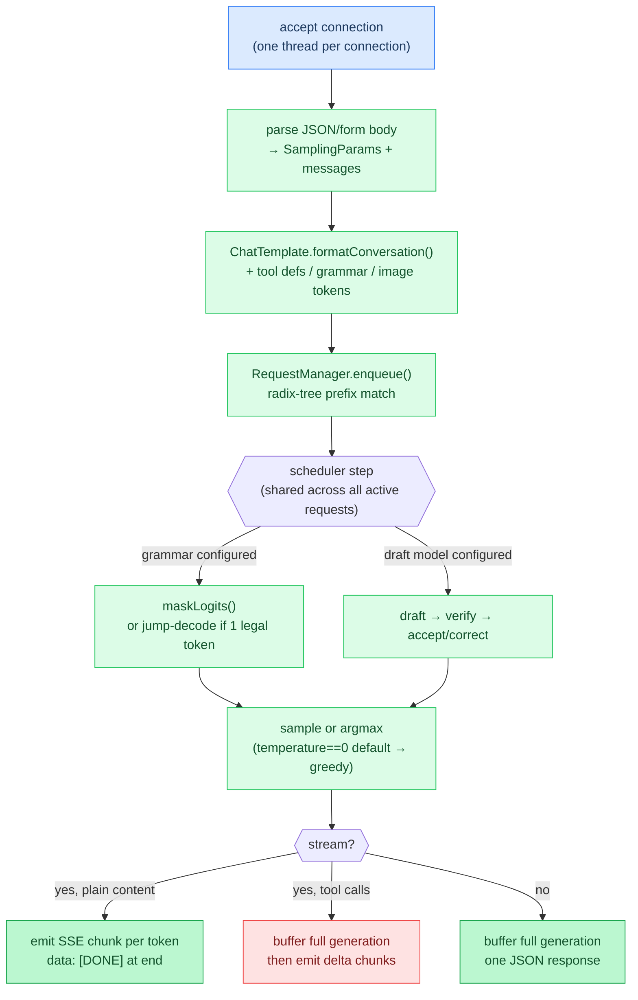

# Chapter 23: Server / HTTP API

**Prerequisites:** [Chapter 7: Sampling](07-sampling.md), [Chapter 15: Chat Templates](15-chat-templates.md)

**Time:** ~18 min

> After this chapter you can explain how HTTP requests flow through session management to token generation.

`--serve` doesn't replace the pipeline from Chapter 0 with something new; it wraps the same tokenize → prefill → decode → sample loop in an HTTP request/response cycle and reuses the same `Model` instance across every request. This chapter follows a request from the socket to a generated token and back, and covers the behavior that only shows up under HTTP: prefix reuse across requests, continuous batching, sleep mode, and how grammar, tools, and vision plug into the same loop rather than forking it. Field-by-field request/response schemas live in [API.md](../API.md); this chapter is about what happens between those fields arriving and a token leaving.

## 1. One Connection, One Thread, One Dispatch Table

`--serve` opens a TCP listener and spawns one OS thread per accepted connection (`handleConnection`, capped at a fixed connection limit; past that, new connections get a `503` instead of queuing indefinitely). Each thread reads one HTTP request, parses method and path, and dispatches on a plain `if (is_post and path == "...")` chain to one of the endpoints in API.md (`/v1/chat/completions`, `/v1/completions`, `/v1/messages`, `/v1/responses`, plus health/metrics/admin routes). There's no separate "web server" abstraction underneath this: parsing, routing, and response writing are all hand-rolled in `server.zig`, consistent with the project's zero-external-dependencies rule.

## 2. Body to Sampling Params: A Parser, Not a Retry Loop

`json.zig` scans the raw request body (JSON for the OpenAI/Anthropic endpoints, form-encoded for the web UI's `/v1/chat`) directly into a `SamplingParams` struct and a messages array, without building a generic JSON tree first. `SamplingParams.temperature` defaults to `0`, and later, in the generation loop, `use_sampling = sampling.temperature > 0` is the single switch between argmax and probabilistic sampling. So an unmodified request is greedy decoding by construction, not a special server default layered on top of Chapter 7's sampler; it's the same `temperature == 0` convention as the CLI.

## 3. Formatting Goes Through the Chat Template, Not Hardcoded Roles

The messages array (plus any system prompt, plus any tool definitions injected as extra system text, section 8) is handed to `ChatTemplate.formatConversation()`, the same per-architecture template logic from Chapter 15. The server never assembles `<|user|>`/`<|assistant|>` markers itself; if a model's template changes, chat endpoints pick it up automatically, and non-chat `/v1/completions` requests skip templating entirely and tokenize the raw prompt string.

## 4. Continuous Batching: Many Requests, One Model

A single model instance can't run two `forward()` calls at once, so concurrent requests can't each just grab the model and block. `--serve` runs a background scheduler (`RequestManager`, `scheduler.zig`) with vLLM-style iteration-level structure: HTTP handler threads don't call `forward()` themselves, they `enqueue()` a request's token IDs and then poll an atomic "tokens generated so far" counter. The scheduler thread runs decode steps, fills admission slots from a waiting queue ordered by cache-aware priority, and evicts finished or cancelled requests, all decoupled from how many client connections happen to be open. A separate, single-mutex direct-forward code path also exists in the same functions as an explicit fallback for when no scheduler is running, but `--serve` always starts one, so in practice every request goes through the scheduler.

One honesty note on concurrency: while the model layer exposes only a single shared KV sequence (one `kv_seq_len` cursor over one block table), the scheduler admits at most one running request at a time (`scheduler.max_running_requests_single_sequence`). Two interleaved requests would both prefill from position 0 into the same physical KV slots and silently corrupt each other's output, so until per-request paged sequences are plumbed through the model vtable, concurrent conversations queue and are served one by one. The waiting queue, priority ordering, timeouts, and cancellation all still operate across the whole queue; only forward execution is serialized.

## 5. Prefix Reuse: Across Requests, and Across Sessions

The OpenAI-style API is stateless on paper (each request resends the full message history), but resending history doesn't mean recomputing it. Every enqueued request's token IDs go through a radix-tree index over previously completed sequences (`RadixTree`, `kvcache/manager.zig`): the scheduler looks up the longest prefix of the incoming token IDs that matches any cached sequence, not just the immediately prior request. Today the match feeds cache-hit metrics and queue priority (a request that's mostly a cache hit doesn't wait behind a cold one just because it arrived later); reusing the matched blocks to skip re-prefill needs the same per-request sequence wiring as batched decoding, and is tracked as the next step for both.

## 6. Speculative Decoding Rides the Same Prefix Cache

If a draft model is configured, it participates inside the same per-request generation loop as the target model (Chapter 17's draft/verify/accept/correct cycle), not as a separate pass. Because drafting happens against whatever KV state the request already has, a prefix-cache hit and speculative decoding compose for free: the draft model starts proposing from wherever the cached prefix left off, it doesn't need to know the prefix was reused rather than freshly prefilled.

## 7. Grammar and JSON Schema: a Logit Mask Applied Every Step

`grammar` and `json_schema` fields compile into a `Grammar` and a `GrammarState` once per request. Before each sampling step, `maskLogits()` zeroes out vocabulary entries the parser's current state can't legally accept next, so argmax or sampling only ever choose among grammar-valid continuations; there's no separate "generate then validate then retry" loop. One optimization rides on top of this: when the grammar state has exactly one legal next token, the server takes it directly and skips the forward pass entirely ("jump decoding"), a real latency win on the highly-constrained tail of a schema (closing braces, fixed field names) where the model has no actual choice to make.

## 8. Tools and Vision Extend the Prompt, Not the Loop

Tool definitions are rendered into plain text and injected into the system prompt before templating; the model isn't given a structured "tool mode", it's prompted to emit `<tool_call>...</tool_call>` tags, which the server then parses back out and reshapes into OpenAI's `tool_calls` JSON. Vision works the same way at the input end: a base64 image in the request's content array is decoded (PNG only), resized to the model's expected input, run through a vision encoder, and the resulting visual token embeddings are spliced into the prompt at the image's position before the forward pass, so the model sees "extra tokens," not a distinct code path. Because the vision encoder and its scratch buffers are shared server state, image requests take a `vision_mutex` before the main inference mutex, serializing concurrent image encodes against each other and against decode.

## 9. Buffered JSON vs. SSE: Different Shapes, Not Just Different Chunking

Non-streaming requests run the full generation loop to completion (or a stop condition), then serialize one JSON response body. Streaming requests (`"stream": true`) get SSE headers immediately and then, for plain content, poll the scheduler's per-request token buffer and emit one `data: {...}` chunk per newly visible token as it's produced, ending with `data: [DONE]`. Streaming with tool calls is the exception worth knowing about: the server generates the *entire* completion first, then splits any detected `<tool_call>` tags into synthetic delta chunks afterward. Setting `stream: true` on a tool-using request gets you SSE framing, not token-level latency; the first byte still waits for the whole generation to finish.

## 10. Prefill-Only Mode: No Cache Means No Session

A server can be started with KV cache allocation skipped entirely (`ctx_size` forced to `0` at model init). Everything in sections 5 and 6 depends on there being a KV cache to roll back to or reuse; without one, there's nothing to prefix-match against, so every request is necessarily a self-contained forward pass with no session continuity. That's a deliberate trade for prefill-only workloads, scoring or embedding-style use where each input stands alone, rather than a degraded version of chat serving.

## 11. Sleep Mode Is a Status Flag, Not a Suspend

A background thread checks idle time every ten seconds; once the server has gone longer than the configured idle threshold with no requests, it sets an atomic `sleeping` flag. Nothing is actually torn down or unloaded: weights stay resident, the KV cache stays allocated, the scheduler keeps running. The flag exists purely so an external orchestrator polling `/health` can decide to do something about it (scale down, redirect traffic); the very next incoming request clears the flag immediately, and that request pays no special wake-up cost since nothing was ever put to sleep.

### Code Flow



## CLI Quick Reference

Server-related flags from [`src/main.zig`](../../src/main.zig):

| Flag | Short | Default | Description |
|------|-------|---------|-------------|
| `--serve` | `-s` | | Start HTTP server (OpenAI + Anthropic API) |
| `--port` | `-p` | `49453` | Server port |
| `--host` | | `127.0.0.1` | Bind address: IPv4, `localhost`, `0.0.0.0`, or `0` |
| `--api-key` | | | API key for auth. Prefer `AGAVE_API_KEY` (env wins if both set). Required for non-loopback binds |
| `--sleep-after N` | | `0` (disabled) | Enter sleep mode after N seconds idle; signals `/health` sleeping:true |
| `--max-batch-size N` | | `8` | Max requests batched per scheduler cycle; takes effect once per-request paged KV is wired (admission is one-at-a-time today) |
| `--rate-limit-rpm N` | | `0` (unlimited) | Max requests per minute; enables token-bucket rate limiting |
| `--rate-limit-tpm N` | | `0` (unlimited) | Max prompt tokens per minute; enables token-bucket rate limiting |
| `--conv-store PATH` | | `~/.cache/agave/conversations.json` | Persist web-UI conversations as JSON (atomic replace) |
| `--no-conv-store` | | | Do not persist or restore conversations (in-memory only) |
| `--no-kv-cache` | | | Prefill-only / embedding server (no decode-phase KV cache) |

```bash
# Basic server
agave model.gguf --serve

# Custom port and host (prefer env so the key is not in the process list)
AGAVE_API_KEY=mysecret agave model.gguf --serve --port 8080 --host 0.0.0.0

# Sleep mode after 5 minutes idle
agave model.gguf --serve --sleep-after 300

# Raise the batch width for when per-request paged KV lands (serialized today)
agave model.gguf --serve --max-batch-size 16

# Rate limiting (60 req/min, 100k prompt tokens/min)
agave model.gguf --serve --rate-limit-rpm 60 --rate-limit-tpm 100000

# Prefill-only / embedding server
agave model.gguf --serve --no-kv-cache

# Persist conversations somewhere other than ~/.cache/agave/conversations.json
agave model.gguf --serve --conv-store /var/lib/agave/conversations.json
```

## Gotchas

- **Streaming with tool calls isn't actually streamed.** Every other streaming path emits one SSE chunk per token as it's produced. The tool-call path (section 9) runs the full generation to completion first and only then slices it into delta chunks, so `"stream": true` plus `tools` gets you the SSE response *shape* without the token-level latency the shape implies.
- **Default sampling is deterministic, not "no config = random."** `temperature` defaults to `0` in `json.zig`, and the server's own `use_sampling` check treats `0` as "off," meaning greedy argmax. A request with no sampling fields set will reproduce the same output for the same prompt and KV state; that's the documented default in API.md, not an accidental lack of randomness.
- **Buffered and streaming responses aren't the same JSON shape with different pacing.** The buffered response is one object with a complete `choices[0].message`; the streaming response is a sequence of partial `delta` objects ending in `data: [DONE]`. Code written against one shape will not parse the other; see API.md's streaming section for the exact chunk formats per endpoint.
- **Prefix reuse depends on the client resending an unmodified prefix.** The radix-tree cache (section 5) matches on exact token-ID equality from the start of the sequence. Editing an earlier message, not just appending a new one, changes every token from that point forward, so the cached prefix stops at the edit and everything after it reprefills from scratch, even though most of the conversation "looks" unchanged to a human reading it.
- **Web-UI conversations are written to disk by default.** `~/.cache/agave/conversations.json` (or `--conv-store`) holds message text. A process restart restores the list; the KV cache is not in that file, so the next request re-prefills. Use `--no-conv-store` when the host must not retain prompts.

**In the code:** [`server` request handling](../../src/server/server.zig), [`json` parsing](../../src/server/json.zig), [`scheduler` continuous batching](../../src/server/scheduler.zig)

```text
accept connection (one thread per connection)
parse body → SamplingParams, messages, tools, stream flag
format chat template → tokenize
enqueue into scheduler → radix-tree prefix match, cache-aware priority
scheduler step: grammar mask / jump-decode, draft+verify if speculative
sample (temperature==0 default → greedy)
stream: emit SSE chunks (buffered first if tool calls) | else: buffer JSON response
```

**Next:** [Chapter 24: Advanced Features →](24-advanced-features.md) | **Back:** [Chapter 22: Distributed Inference ←](22-distributed-inference.md) | **Product docs:** [API](../API.md)

---

## Glossary

**continuous batching**: A scheduling strategy where a background thread runs one shared decode step across every active request per iteration, rather than each connection blocking on its own full generation; lets a single model instance serve many concurrent requests.

**greedy decoding**: Always picking the highest-scoring logit (argmax) rather than sampling from a distribution; the server's default when `temperature` is `0`.

**jump decoding**: Skipping the forward pass entirely when a grammar's current state allows exactly one legal next token, since sampling would produce that token anyway.

**prefix reuse (server)**: Matching an incoming request's token IDs against the longest already-cached prefix in the shared radix-tree KV cache (Chapter 5), so only the tokens past the match need prefilling.

**SSE (Server-Sent Events)**: A one-way, text-based streaming protocol (`data: ...` lines over a `text/event-stream` HTTP response) used for incremental chat/completion output, terminated by a `data: [DONE]` line.

**sleep mode**: A status flag set after a configurable idle period with no requests, surfaced via `/health` for external orchestrators; does not unload weights or free the KV cache, and clears automatically on the next request.
