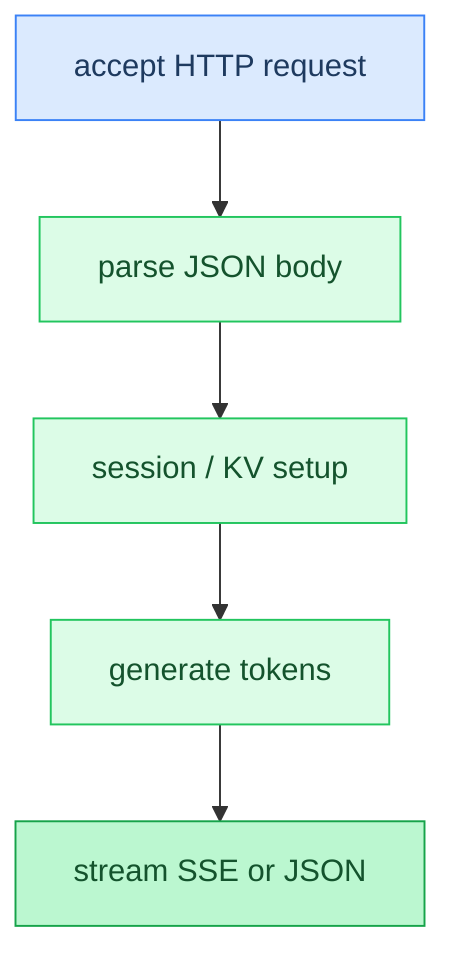

# Chapter 23: Server / HTTP API

**Prerequisites:** [Chapter 7: Sampling](07-sampling.md), [Chapter 15: Chat Templates](15-chat-templates.md)

**Time:** ~18 min

> After this chapter you can explain how HTTP requests flow through session management to token generation.

<!-- TODO: Task 5 — full prose -->

### Code Flow



## Gotchas

- Placeholder — filled in Task 5.

## How This Relates to the Code

**In the code:** [`server` request handling](../../src/server/server.zig), [`json` parsing](../../src/server/json.zig)

```text
accept → parse → session/KV → generate → stream or JSON
```

**Next:** [Appendix: Troubleshooting →](appendix-troubleshooting.md) | **Back:** [Chapter 22: Distributed Inference ←](22-distributed-inference.md) | **Product docs:** [API](../API.md)

---

## Glossary

(Terms added in Task 5.)
