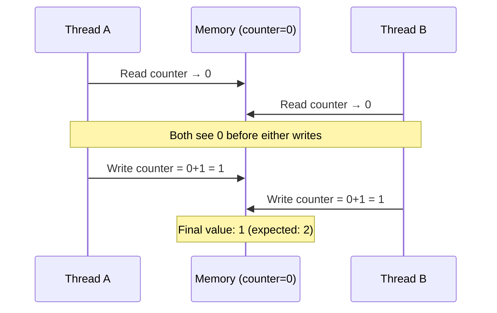
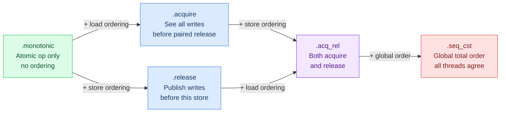
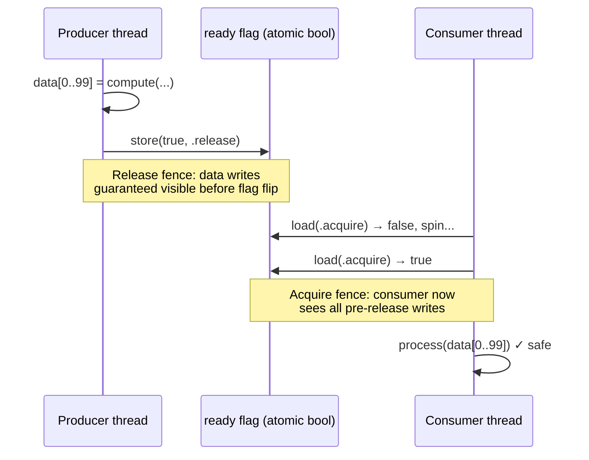
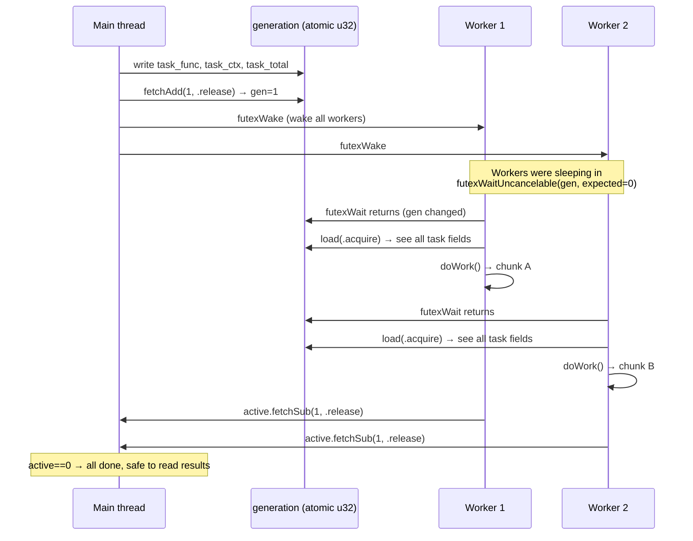
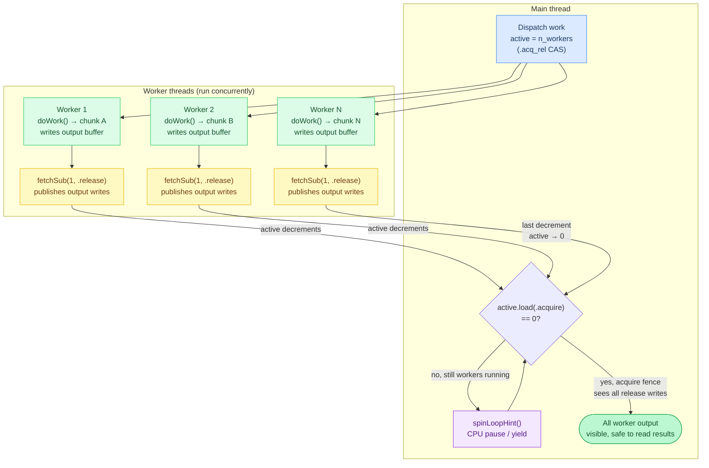
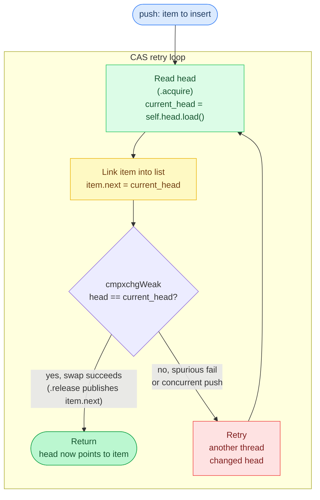

# Appendix: Atomic Operations and Memory Ordering

**Prerequisites:** [Chapter 12: CPU Parallelism](12-cpu-parallelism.md#memory-ordering) (thread pool, futex wake/wait)

> After this appendix you can explain `std.atomic.Value`, memory ordering levels, and lock-free patterns in Agave.

Multi-threaded code needs **synchronization** to coordinate between threads. Zig provides **atomic operations**, CPU instructions that read-modify-write memory **atomically** (as one indivisible operation, preventing race conditions).

## The Problem: Race Conditions

Two threads reading and writing the same memory without coordination can interleave in ways that corrupt data -- each sees a stale value, and the last write wins.



Without atomics, concurrent writes corrupt data:

```text
# WRONG: race condition
counter: usize = 0

workerThread():
    counter += 1     # read counter, add 1, write back: 3 separate operations

# if 2 threads run workerThread() concurrently:
#   Thread A reads counter=0
#   Thread B reads counter=0   <- both read 0 before either writes
#   Thread A writes counter=1
#   Thread B writes counter=1  <- overwrites A's update
#   final value: 1 (expected: 2)
```

**The issue:** `counter += 1` is **not atomic**, it compiles to:

```asm
mov  r0, [counter]   ; Read
add  r0, 1           ; Modify
mov  [counter], r0   ; Write
```

Between any two instructions, another thread can run and see inconsistent state.

## Atomic Operations

**`std.atomic.Value(T)`** provides atomic read-modify-write operations:

```text
counter = atomic.Value(usize).init(0)

workerThread():
    counter.fetchAdd(1, .monotonic)    # atomic increment

# guaranteed: 2 threads -> counter = 2
```

**Implementation:** [`src/thread_pool.zig`](../../src/thread_pool.zig) (`task_counter.fetchAdd(grain, .monotonic)`)

**How it works:** `fetchAdd` compiles to a single CPU instruction (e.g., x86 `lock add` or ARM `ldadd`) that the hardware guarantees is atomic.

### Common Operations

```text
val = atomic.Value(u32).init(10)

old  = val.fetchAdd(5, .monotonic)     # returns old value, adds delta: old=10, val=15
old2 = val.fetchSub(3, .monotonic)     # returns old value, subtracts delta: old2=15, val=12

swapped = val.cmpxchgStrong(12, 20, .monotonic, .monotonic)
if swapped == null:
    ...   # swap succeeded: val=20
else:
    ...   # swap failed: val still 12, someone else changed it

current = val.load(.monotonic)         # atomic read
val.store(50, .monotonic)              # atomic write
```

## Memory Ordering

**Memory ordering** controls **when other threads see your writes** and **when you see their writes**. Stronger orders give more guarantees but cost more CPU cycles.



### The Four Orders (Weakest to Strongest)

#### .monotonic: No Synchronization

**Guarantees:**

- Operation is atomic (no torn reads/writes)
- **No** ordering guarantees relative to other operations

**Use for:** Simple counters where you don't care about ordering.

```text
counter = atomic.Value(usize).init(0)

# Thread A
counter.fetchAdd(1, .monotonic)

# Thread B
val = counter.load(.monotonic)
# val could be 0 or 1: no guarantee when the write becomes visible
```

**Example from thread pool:**

```text
start = task_counter.fetchAdd(grain, .monotonic)
```

**Implementation:** [`src/thread_pool.zig`](../../src/thread_pool.zig) (`task_counter.fetchAdd`)

**Why monotonic?** The counter value doesn't carry ordering information, it's just work assignment. Each thread grabs a chunk independently.

#### .acquire (Load) / .release (Store): Publish/Subscribe

**Release** (on store): All writes **before** this store become visible to other threads **before** the store itself.

**Acquire** (on load): All writes that happened **before** a release store are visible **after** this load.

**Use for:** Handing off data between threads.



```text
ready = atomic.Value(bool).init(false)
data: [100]u8

# producer thread
for i in 0..100:
    data[i] = compute(i)              # fill data
ready.store(true, .release)           # publish: data writes happen-before this store

# consumer thread
while not ready.load(.acquire): ()    # wait until ready
# now safe to read data: all writes are visible
for d in data:
    process(d)
```

**Guarantee:** If consumer sees `ready=true`, it's guaranteed to see the fully-filled `data` array.

**Example from thread pool:**

```text
# main thread: publish work (simplified: real code also CASes `active`
# before writing task fields, and sets task_grain)
task_func = func
task_ctx = ctx
task_total = total
task_grain = effective_grain
task_counter.store(0, .release)
generation.fetchAdd(1, .release)      # all writes happen-before this
io.futexWake(&generation, n_workers)

# worker thread: subscribe
new_gen = generation.load(.acquire)   # see all writes before the release
if new_gen == local_gen: continue     # spurious wakeup
local_gen = new_gen
# safe to read task_func, task_ctx, task_total, task_grain
```

**Implementation:** [`src/thread_pool.zig`](../../src/thread_pool.zig) (dispatch and `workerLoop`)

#### .seq_cst: Sequential Consistency

**Guarantees:** All threads see all operations in the **same global order**.

**Use for:** When you need total ordering (rare).

**Cost:** Slowest, requires full memory fence on most architectures.

**Avoid unless necessary**, acquire/release is sufficient for most cases.

### Choosing Memory Ordering

| Use Case | Load | Store | Rationale |
| -------- | ---- | ----- | --------- |
| Simple counter | `.monotonic` | `.monotonic` | Just need atomicity, not ordering |
| Work-stealing queue | `.acquire` | `.release` | Hand off work between threads |
| Shutdown flag | `.acquire` | `.release` | Ensure all cleanup happens before shutdown visible |
| Lock-free data structure | `.acquire` | `.release` | Synchronize data structure updates |
| (Rare) Total order needed | `.seq_cst` | `.seq_cst` | All threads must agree on operation order |

**Agave uses:** Mostly `.monotonic` for counters, `.acquire`/`.release` for handoff, **never `.seq_cst`**.

## Real-World Examples from Agave

### Thread Pool Work Counter

```text
task_counter: atomic.Value(usize) = 0

doWork():
    func  = task_func or return
    ctx   = task_ctx or return
    total = task_total
    grain = task_grain

    loop:
        start = task_counter.fetchAdd(grain, .monotonic)
        if start >= total: break
        end = min(start + grain, total)
        func(ctx, start, end)
```

**Implementation:** [`src/thread_pool.zig`](../../src/thread_pool.zig) (`task_counter`, `doWork`)

**Why `.monotonic`?**

- We only care about **which chunk** each thread gets
- No data dependency between chunks
- No synchronization needed, each thread works independently

### Generation Counter (Thread Wake-Up)

A futex (fast userspace mutex) lets sleeping threads block cheaply and wake precisely. The generation counter acts as the signal: workers sleep while the counter matches their local copy, and wake the moment the main thread bumps it.



```text
generation: atomic.Value(u32) = 0

# main thread: post work
# CAS claims the pool atomically (0 -> n_workers); a concurrent parallelFor
# call falls back to running inline. active is set *before* task fields so
# workers can never start with stale state.
if active.cmpxchgWeak(0, n_workers, .acq_rel, .monotonic) is still_active:
    func(ctx, 0, total)          # concurrent call: run inline instead
    return

# post task fields (published to workers by the generation.fetchAdd release below)
task_func = func
task_ctx = ctx
task_total = total
task_grain = effective_grain
task_counter.store(0, .release)      # reset counter
generation.fetchAdd(1, .release)     # publish: all task fields valid
io.futexWake(&generation, n_workers)
```

**Implementation:** [`src/thread_pool.zig`](../../src/thread_pool.zig) (`active` CAS claim, dispatch)

**Why `.release`?**

- Ensures `task_func`, `task_ctx`, `task_total` are visible to workers **before** they see the generation bump
- Without release, workers could see new generation but stale task fields → undefined behavior

```text
# worker thread: consume work
workerLoop(pool):
    local_gen: u32 = 0
    loop:
        pool.io.futexWaitUncancelable(&pool.generation, local_gen)
        if pool.shutdown.load(.acquire): return

        new_gen = pool.generation.load(.acquire)   # see all task fields
        if new_gen == local_gen: continue          # spurious wakeup, generation unchanged
        local_gen = new_gen
        pool.doWork()
        pool.active.fetchSub(1, .release)          # signal completion
```

**Implementation:** [`src/thread_pool.zig`](../../src/thread_pool.zig) (`workerLoop`)

**Why `.acquire`?**

- Ensures worker sees all writes (task fields) that happened-before the `.release` store on main thread
- Without acquire, worker might see partial task state

### Active Thread Counter



```text
active: atomic.Value(u32) = 0

# worker: signal completion
pool.active.fetchSub(1, .release)

# main thread: wait for completion
while pool.active.load(.acquire) != 0:
    atomic.spinLoopHint()
```

**Implementation:** [`src/thread_pool.zig`](../../src/thread_pool.zig) (`active`, spin-wait for completion)

**Why `.release`/`.acquire`?**

- Workers' writes to output buffers must be visible to main thread when `active` reaches 0
- Release on `fetchSub` publishes all worker writes
- Acquire on `load` ensures main thread sees all worker writes

### Shutdown Flag

```text
shutdown: atomic.Value(bool) = false

# main thread: signal shutdown
shutdown.store(true, .release)
generation.fetchAdd(1, .release)
io.futexWake(&generation, n_workers)

# worker: check shutdown
if pool.shutdown.load(.acquire): return
```

**Implementation:** [`src/thread_pool.zig`](../../src/thread_pool.zig) (`shutdown`), [`src/server/scheduler.zig`](../../src/server/scheduler.zig) (`is_cancelled`, the same store-release/load-acquire pattern for request cancellation)

**Why `.release`/`.acquire`?**

- Ensures all cleanup (e.g., closing files, flushing buffers) happens-before shutdown is visible
- Workers see a consistent view of cleaned-up state

## Compare-and-Swap (CAS)

**Problem:** Update a value only if it hasn't changed since you last read it.

**Example:** Lock-free stack push:



```text
push(item):
    loop:
        current_head = head.load(.acquire)
        item.next = current_head

        # try to swap: if head still equals current_head, set it to item
        result = head.cmpxchgWeak(current_head, item,
                                   success_order = .release,   # publishes item.next
                                   failure_order = .acquire)    # see why it failed

        if result == null:
            return               # success: head was current_head, now it's item
        # failure: head changed, retry with the new head value
```

**cmpxchgWeak vs cmpxchgStrong:**

- **Weak:** May spuriously fail (return failure even if values match). Faster on some architectures (ARM).
- **Strong:** Only fails if values don't match. Slightly slower.

**Use weak in loops** (spurious failure just retries), **strong for one-shot CAS**.

## Spin Loop Hint

When spinning (busy-waiting), hint the CPU to save power:

```text
while pool.active.load(.acquire) != 0:
    atomic.spinLoopHint()    # maps to `pause` (x86) or `yield` (ARM)
```

**Implementation:** [`src/thread_pool.zig`](../../src/thread_pool.zig) (spin-wait with `spinLoopHint`)

**What it does:**

- **x86:** `pause`, reduces power consumption, lets hyperthreading switch to other logical core
- **ARM:** `yield`, hints scheduler to switch to another thread
- **Without hint:** CPU burns 100% power, spins at max frequency

**Cost:** ~5-10 cycles per hint (negligible).

## Fence

**Explicit memory barrier**, rarely needed in Zig (acquire/release is usually sufficient).

```text
atomic.fence(.release)     # all writes before this are visible
... some non-atomic write ...
atomic.fence(.acquire)     # all writes after this see prior writes
```

**Use when:** Synchronizing non-atomic writes with atomic operations.

**Example (rare):**

```text
# non-atomic writes
data[0] = 42
data[1] = 43

atomic.fence(.release)             # publish data writes

ready.store(true, .monotonic)      # signal ready (no need for release here, the fence did it)
```

**Agave doesn't use fences**, acquire/release on atomic operations is clearer and sufficient.

## Common Pitfalls

### Pitfall 1: Using Non-Atomic for Synchronization

```text
# WRONG: data race
flag: bool = false     # not atomic

# Thread A
data.fill()
flag = true             # write

# Thread B
if flag:                 # read
    data.process()       # may see partially-filled data
```

**Fix:** Use `std.atomic.Value(bool)` with proper ordering.

### Pitfall 2: Missing Acquire/Release

```text
# WRONG: missing release
counter = atomic.Value(usize).init(0)

# producer
data[0] = compute()
counter.store(1, .monotonic)      # should be .release

# consumer
if counter.load(.monotonic) == 1:  # should be .acquire
    process(data[0])                # may see stale data
```

**Fix:** Use `.release` on store, `.acquire` on load.

### Pitfall 3: Assuming Atomicity Without Explicit Atomic Type

```text
# WRONG: not atomic on all platforms
x: u64 = 0

# Thread A
x = 123        # may be two 32-bit stores on 32-bit platforms

# Thread B
val = x         # may read a torn value (high/low half from different writes)
```

**Fix:** Use `std.atomic.Value(u64)` for guaranteed atomicity.

### Pitfall 4: Overusing .seq_cst

```text
# WRONG: unnecessarily slow
counter = atomic.Value(usize).init(0)
counter.fetchAdd(1, .seq_cst)    # should be .monotonic
```

**Fix:** Use weakest ordering that provides required guarantees.

## Performance Characteristics

**Atomic operation cost** (Apple M4, approximate):

| Operation | Ordering | Latency | Throughput |
| --------- | -------- | ------- | ---------- |
| `load` | `.monotonic` | ~1 cycle | ~1 per cycle |
| `load` | `.acquire` | ~1-2 cycles | ~1 per cycle |
| `store` | `.monotonic` | ~1 cycle | ~1 per cycle |
| `store` | `.release` | ~1-3 cycles | ~0.5 per cycle |
| `fetchAdd` | `.monotonic` | ~5 cycles | ~1 per 3 cycles |
| `fetchAdd` | `.acquire`/`.release` | ~10 cycles | ~1 per 5 cycles |
| `cmpxchgWeak` | `.monotonic` | ~10 cycles | ~1 per 10 cycles |
| `cmpxchgWeak` | `.release` | ~15 cycles | ~1 per 15 cycles |
| Non-atomic load/store | N/A | ~1 cycle | ~2 per cycle |

**Takeaways:**

- Atomics are 1-10× slower than non-atomic ops
- Stronger ordering = slower
- Still very fast in absolute terms (nanoseconds)

**When to use:**

- ✅ Synchronization between threads
- ✅ Counters with infrequent updates
- ❌ Hot-path per-element operations (use SIMD instead)

## Best Practices

1. **Start with `.monotonic`**, upgrade to `.acquire`/`.release` only when needed
2. **Never use `.seq_cst`** unless you can articulate why total ordering is required
3. **Pair `.release` stores with `.acquire` loads** for handoff
4. **Use non-atomic for thread-local data** (faster)
5. **Profile before optimizing**, atomics are usually not the bottleneck

## Testing for Race Conditions

**ThreadSanitizer (TSan)** detects data races at runtime:

```bash
# Note: -Dsanitize-thread is not currently in build.zig: it would need to be
# added as a build option before TSan can be used. The standard way to run
# tests is `zig build test`, which produces zig-out/bin/agave-unit-test.
zig build test

# If TSan support is added to build.zig in the future:
# zig build test -Dsanitize-thread
# ./zig-out/bin/agave-unit-test

# Output if race detected:
# WARNING: ThreadSanitizer: data race
#   Write of size 8 at 0x7b0400000000 by thread T2:
#     #0 workerThread thread_pool.zig:123
#   Previous read of size 8 at 0x7b0400000000 by thread T1:
#     #0 doWork thread_pool.zig:115
```

**Use TSan in CI** to catch races before production (once `-Dsanitize-thread` is added to `build.zig`).

---

**In the code:** [src/thread_pool.zig](../../src/thread_pool.zig) (extensive use of atomics for synchronization), [src/server/scheduler.zig](../../src/server/scheduler.zig) (atomic cancellation flag)

**Related:** [Chapter 12: CPU Parallelism](12-cpu-parallelism.md#memory-ordering), [Zig std.atomic documentation](https://ziglang.org/documentation/master/std/#std.atomic)

**Back:** [Appendix: Profiling and Debugging ←](appendix-profiling.md)

---

## Glossary

**.acquire**, Atomic load ordering ensuring all writes before a paired `.release` store are visible after this load.

**.monotonic**, Weakest atomic ordering: guarantees atomicity but no cross-thread synchronization of surrounding memory.

**.release**, Atomic store ordering ensuring all prior writes are visible before this store becomes visible.

**.seq_cst (sequential consistency)**, Strongest ordering: all threads see all operations in the same global order; slowest, rarely needed.

**atomic operation**, A CPU instruction performing a read-modify-write on memory as one indivisible step, preventing race conditions.

**CAS (Compare-And-Swap)**, An atomic operation updating a value only if it currently matches an expected value.

**cmpxchgStrong**, A CAS variant that only fails if values genuinely differ; used for one-shot CAS.

**cmpxchgWeak**, A CAS variant that may spuriously fail; faster on ARM, best in retry loops.

**fence**, An explicit memory barrier ordering non-atomic writes relative to atomic operations.

**futex (fast userspace mutex)**, A kernel primitive letting threads sleep cheaply until a memory location changes.

**hyperthreading**, Intel's simultaneous multithreading where two logical cores share one physical core's execution units.

**race condition**, A bug where two threads read and write the same memory without coordination, corrupting data.

**spinLoopHint**, A CPU hint (`pause` on x86, `yield` on ARM) reducing power during busy-wait loops.

**std.atomic.Value(T)**, Zig's atomic wrapper providing load, store, fetchAdd, and compare-and-swap with configurable ordering.

**torn read/write**, Reading a partially-updated value when a multi-byte write is split across two CPU operations.
