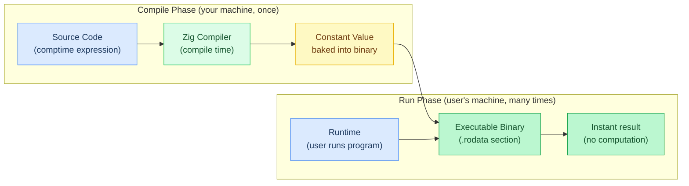
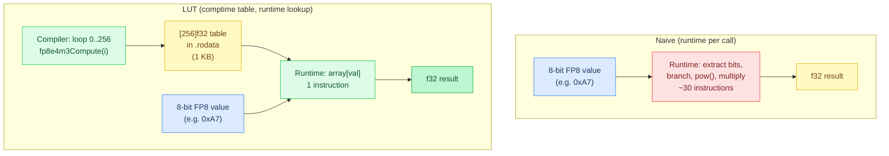
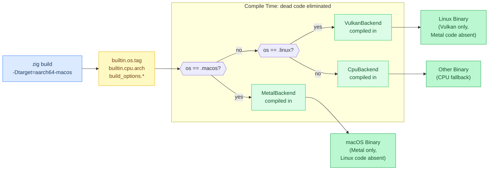
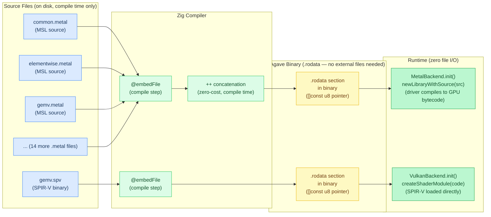
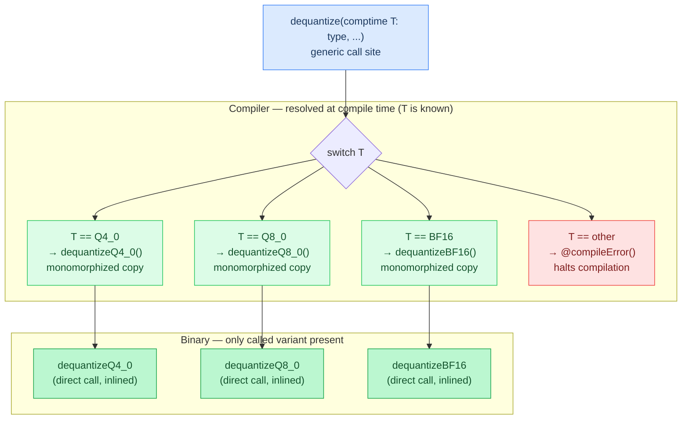
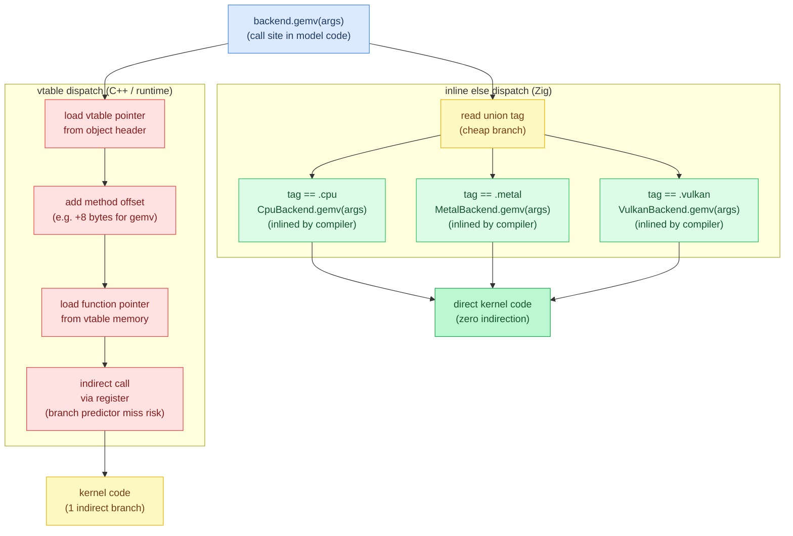
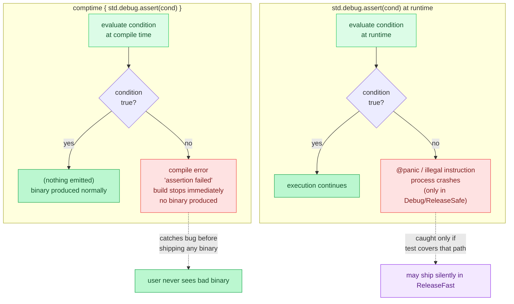

# Appendix: Compile-Time Optimization

**Prerequisites:** [Chapter 4: Quantization](04-quantization.md) (dequantization LUTs), [Chapter 9: CPU SIMD Optimization](09-cpu-simd-optimization.md#real-world-example-rmsnorm) (comptime-specialized kernels)

> After this appendix you can explain `comptime` dispatch, `@embedFile`, lookup tables, and `inline else` tagged-union expansion.

Zig's `comptime` feature executes code **at compile time**, generating optimized runtime code with zero overhead. Agave uses this extensively for lookup tables, feature detection, and type-specialized dispatch.

## comptime Basics

**comptime** means "computed at compile time". The compiler evaluates the expression during compilation, and the result is baked into the binary.



```text
table_size = 256                    # regular constant
doubled = comptime(table_size * 2)  # computed at compile time -> 512

# the binary contains the value 512, not the multiplication
```

**When to use comptime:**

- Building lookup tables
- Feature detection based on target platform
- Type-level computations
- Format string validation

## Lookup Tables

Pre-computing values at compile time eliminates runtime arithmetic.



### FP8 E4M3 Dequantization Table

**Naive approach** (runtime conversion):

```text
fp8e4m3ToF32(val):                    # naive, runtime conversion
    sign = (val >> 7) & 1
    exp  = (val >> 3) & 0xF
    mant = val & 0x7

    bias = 7
    sign_mult = sign == 1 ? -1.0 : 1.0

    if exp == 0:                      # subnormal
        return sign_mult * (mant / 8.0) * 2^(1 - bias)
    else:                             # normal
        frac = 1.0 + (mant / 8.0)
        return sign_mult * frac * 2^(exp - bias)
```

**Cost per call:** ~20-30 instructions (bit shifts, branches, floating-point arithmetic, `pow()` call).

**Optimized approach** (comptime lookup table):

```text
# build the 256-entry lookup table at compile time
fp8e4m3_lut: [256]f32 = comptime {
    for i in 0..256:
        table[i] = fp8e4m3Compute(i)     # computed once, at compile time
    return table
}

# runtime dequantization is a single array lookup
fp8e4m3ToF32(val):
    return fp8e4m3_lut[val]
```

**Implementation:** [`src/ops/quant.zig`](../../src/ops/quant.zig) (`fp8e4m3_lut`, `fp8e4m3ToF32`)

**Cost per call:** 1 instruction (load from `.rodata` section).

**Speedup:** 20-30× faster for the dequantization itself. In a full GEMV, this saves ~5-10% total time.

### comptime Block Syntax

```text
table: [N]T = comptime {
    ... compute result ...
    return result           # returns from the comptime block
}
```

**Key points:**

- `blk:` is a labeled block
- `break :blk value` returns from the block
- The entire block runs at compile time
- `result` becomes a compile-time constant

### IQ4_NL Dequantization Table

**IQ4_NL** uses a fixed dequantization table (not computed at runtime). Length and monotonicity are verified by a unit test, not a `comptime` assert:

```text
iq4nl_table: [16]i8 = [
    -127, -104, -83, -65, -49, -35, -22, -10,
    1, 13, 25, 38, 53, 69, 89, 113,
]

# usage (callers index the table directly):
# val = iq4nl_table[nibble] * scale
```

**Implementation:** [`src/ops/quant.zig`](../../src/ops/quant.zig) (`iq4nl_table`)

**Why a table?** IQ4_NL uses **non-linear quantization**. The step sizes aren't uniform. Small values have fine steps, large values have coarse steps. This gives better accuracy than linear Q4.

**Test verification** (`src/ops/quant.zig`):

```text
test "iq4nl_table":
    expect(iq4nl_table.len == 16)
    for i in 1..16:
        expect(iq4nl_table[i] > iq4nl_table[i - 1])   # strictly monotonic
```

This runs during `zig build test`, not as a `comptime` assert. If the table is malformed, the test fails, but a normal `zig build` would not catch it.

**Implementation:** [`src/ops/quant.zig`](../../src/ops/quant.zig) (`test "iq4nl_table"`)

## Feature Detection

Zig's `builtin` module provides platform information at comptime.



### Target OS Detection

```text
initBackend():
    if comptime(os == macos):
        return Backend.metal(MetalBackend.init())
    else if comptime(os == linux):
        return Backend.vulkan(VulkanBackend.init())
    else:
        return Backend.cpu(CpuBackend.init())
```

**Implementation:** [`src/backend/backend.zig`](../../src/backend/backend.zig) (backend selection dispatcher)

**Dead code elimination:** The compiler generates **only the code for the target platform**. If compiling for macOS, the Linux and CPU branches are **completely removed** from the binary.

### CPU Feature Detection

```text
has_avx2 = comptime(cpu.features.isEnabled(x86.Feature.avx2))

gemv(...):
    if comptime(has_avx2):
        gemvAVX2(...)      # 256-bit SIMD
    else:
        gemvSSE2(...)      # 128-bit SIMD fallback
```

**Implementation:** [`src/ops/math.zig`](../../src/ops/math.zig) (comptime SIMD width dispatch)

**Benefit:** No runtime CPU detection overhead. The compiler knows at build time which CPU features are available (based on `-mcpu` flag or target triple).

### Build Options

```text
# build.zig
backend_options.addOption(bool, "enable_metal", true)
backend_options.addOption(bool, "enable_cuda", false)

# backend.zig
MetalBackend = build_options.enable_metal
    ? import("metal.zig").MetalBackend
    : NullBackend
```

**Implementation:** [`build.zig`](../../build.zig) (`-Denable-<model>` / backend toggles), [`src/backend/backend.zig`](../../src/backend/backend.zig) (`build_options` gated imports)

**Effect:** If `enable_metal=false`, the Metal backend is **not compiled at all** — `@import("metal.zig")` never happens, reducing binary size and compile time.

## @embedFile for Kernel Source

Shader source code can be embedded directly into the binary at compile time.



### Metal Shader Embedding

```text
# concatenate all MSL files at compile time (17 files total: common, elementwise,
# norm, rope, gemv, gemm, sdpa, sdpa_tree, deltanet, gemv_tiled, megakernel,
# mega_common, and 5 per-model megakernel variants)
msl_source = embedFile("common.metal")
    ++ embedFile("elementwise.metal")
    ++ embedFile("norm.metal")
    ++ ... (14 more .metal files)

init():
    # compile MSL source at runtime (driver compiles to GPU bytecode)
    library = device.newLibraryWithSource(msl_source)
    ...
```

**Implementation:** [`src/backend/metal.zig`](../../src/backend/metal.zig) (`msl_source` concatenation of all 17 embedded `.metal` files)

**Benefits:**

1. **Single binary:** No need to ship separate `.metal` files
2. **No file I/O:** No `std.fs.cwd().openFile()` at runtime
3. **Compile-time concatenation:** Multiple files merged into one string at zero cost

**Alternative (runtime file loading):**

```text
# BAD: runtime file I/O
file = open("shaders/gemv.metal")
defer close(file)
source = readAll(file)
defer free(source)
```

**Problems:**

- Requires shipping shader files alongside binary
- File path resolution (where is the binary run from?)
- Runtime allocation + I/O
- Error handling (file not found, permission denied)

**@embedFile eliminates all of these.**

### SPIR-V Binary Embedding

Vulkan uses pre-compiled SPIR-V bytecode:

```text
gemv_spirv = embedFile("gemv.spv")

init():
    shader_module = vk.createShaderModule(device, code = gemv_spirv)
    ...
```

**Implementation:** [`src/backend/vulkan.zig`](../../src/backend/vulkan.zig) (`@embedFile` for pre-compiled SPIR-V)

**SPIR-V is binary data** — `@embedFile` works with any file type, not just text.

## Type-Specialized Functions

Generate different code for each type at compile time.

### Generic Dequantization

```text
dequantize(comptime T, quant, output):
    switch T:
        Q4_0 -> dequantizeQ4_0(quant, output)
        Q8_0 -> dequantizeQ8_0(quant, output)
        BF16 -> dequantizeBF16(quant, output)
        else -> compileError("unsupported quantization type")

# usage: dequantize(Q4_0, quant_data, f32_output)
# compiles down to a direct call to dequantizeQ4_0, no switch at runtime
```

**Implementation:** [`src/ops/quant.zig`](../../src/ops/quant.zig) (comptime-dispatched dequantization per format)

**No runtime dispatch** — the switch is resolved at compile time, and only the relevant function is called.



### Tagged Union Dispatch (inline else)

```text
Backend: union(cpu, metal, vulkan, cuda, rocm, webgpu)

    gemv(self, ...):
        switch self:
            inline else -> |be| be.gemv(...)     # expands to one case per variant
```

**What `inline else` does:**

```text
# expands to:
switch self:
    cpu    -> |be| be.gemv(...)
    metal  -> |be| be.gemv(...)
    vulkan -> |be| be.gemv(...)
    cuda   -> |be| be.gemv(...)
    rocm   -> |be| be.gemv(...)
    webgpu -> |be| be.gemv(...)
```

**Implementation:** [`src/backend/backend.zig`](../../src/backend/backend.zig) (`inline else` tagged-union dispatch)

**Benefit:** Compiler sees all calls, can inline them. No function pointer indirection.



## Format String Validation

Compile-time format string checking prevents runtime errors.

```text
# GOOD: format string validated at compile time
log.info("Temperature: {d}, Tokens: {d}", [temp, n_tokens])

# BAD: wrong number of arguments -> compile error
log.info("Temperature: {d}, Tokens: {d}", [temp])
# error: expected 2 format arguments, found 1

# BAD: wrong type specifier -> compile error
log.info("Temperature: {d}", ["0.5"])
# error: cannot format string with 'd' (expected number)
```

**C comparison:**

```c
printf("Temperature: %d, Tokens: %d\n", temp);  // Runtime crash or garbage
```

Zig catches this at compile time.

## Comptime Assertions

Validate assumptions at compile time.



### Array Size Validation

```text
quant_block_elems = 32
Q4_0_Block: extern struct { scale: f16, quants: [16]u8 }   # 16 bytes = 32 nibbles

comptime:
    assert(sizeOf(Q4_0_Block) == 18)      # 2 + 16 = 18 bytes
    assert(16 * 2 == quant_block_elems)   # 16 bytes x 2 nibbles/byte
```

**Implementation:** [`src/ops/quant.zig`](../../src/ops/quant.zig) (`q4_0_block_bytes = 18`: 2-byte scale + 16 bytes of nibbles)

**Effect:** If you change `quants` to `[15]u8`, compilation fails with an assertion error.

### Alignment Validation

```text
comptime:
    assert(alignOf(KVCache) == 64)   # must be cache-line aligned
```

### Type Size Checks

```text
comptime:
    assert(sizeOf(f32) == 4)
    assert(sizeOf(bf16) == 2)
    assert(sizeOf(V8) == 32)   # 8 x f32
```

**Implementation:** [`src/ops/math.zig`](../../src/ops/math.zig) (`V8` vector type and comptime size checks)

**Why?** If porting to a weird platform where `f32` isn't 32 bits, these fail at compile time instead of producing silent data corruption at runtime.

## Practical Examples

### MXFP4 Lookup Table

```text
# MXFP4 uses E2M1 format (2-bit exponent, 1-bit mantissa)
# 4-bit nibble -> 16 possible values, stored as a literal constant table
mxfp4Lookup(nibble):
    table = [0.0, 0.5, 1.0, 1.5, 2.0, 3.0, 4.0, 6.0,
             0.0, -0.5, -1.0, -1.5, -2.0, -3.0, -4.0, -6.0]
    return table[nibble & 0xF]

# for the scaled variant (nibble value x block scale), see nvfp4Dequant.
# the mantissa term for E2M1 is 0.5 * mant (not 1.0 * mant):
#   mant=0 -> 0.0 addend, mant=1 -> 0.5 addend, giving 1.0 and 1.5 for normal values
```

**Implementation:** [`src/ops/quant.zig`](../../src/ops/quant.zig) (`mxfp4Lookup`, `nvfp4Dequant`)

**Single-level lookup:** nibble → base value via literal table (no module-level symbol). For NVFP4 scaled dequantization, `nvfp4Dequant` combines `mxfp4Lookup` with a block scale.

### Quantization Block Sizes

Block byte sizes are defined as named module-level constants in `backend.zig`:

```text
q4_0_block_bytes: usize = 18    # 2-byte scale + 16 bytes of nibbles
q8_0_block_bytes: usize = 34    # 2-byte scale + 32 bytes of i8 values
q4_k_block_bytes: usize = 144
q6_k_block_bytes: usize = 210
...
```

**Usage:** reference the constant directly by name:

```text
bytes_per_block = backend.q4_0_block_bytes    # 18
num_blocks = ceilDiv(total_bytes, backend.q4_0_block_bytes)
```

**Implementation:** [`src/backend/backend.zig`](../../src/backend/backend.zig) (`q4_0_block_bytes` and per-format block-byte constants)

**Benefit:** Named constants are self-documenting, always available at comptime, and require no function call overhead.

## Performance Impact

**FP8 dequantization** (measured on Apple M4):

| Method | Cycles/call | Speedup |
| ------ | ----------- | ------- |
| Runtime computation | ~30 cycles | 1× |
| Comptime LUT | ~1 cycle | 30× |

**Binary size impact:**

| Feature | Binary size increase |
| ------- | -------------------- |
| FP8 E4M3 LUT (256 × 4 bytes) | +1 KB |
| MXFP4 LUT (16 × 4 bytes) | +64 bytes |
| IQ4_NL LUT (16 × 1 byte) | +16 bytes |
| Embedded Metal shaders (~50 KB source) | +50 KB |

**Trade-off:** Small binary size increase for significant runtime speedup.

## Common Patterns

### Conditional Compilation

```text
use_simd = comptime(cpu.arch == x86_64 or cpu.arch == aarch64)

dotProduct(a, b):
    if comptime(use_simd):
        return dotProductSIMD(a, b)
    else:
        return dotProductScalar(a, b)
```

**Implementation:** [`src/ops/math.zig`](../../src/ops/math.zig) (`dotProduct`, SIMD-vectorized reductions)

### Type-Generic Containers

```text
RingBuffer(comptime T, comptime size):
    return struct:
        data: [size]T
        head: usize = 0

        push(item):
            data[head] = item
            head = (head + 1) % size

# usage:
conv_state = RingBuffer(f32, 4).init()   # 4-element f32 ring buffer
```

**Implementation:** [`src/models/nemotron_h.zig`](../../src/models/nemotron_h.zig) (`conv_states` ring buffer, `causalConv1dSilu` in [`src/ops/ssm.zig`](../../src/ops/ssm.zig))

**Each instantiation** (`RingBuffer(f32, 4)`, `RingBuffer(u32, 8)`) generates **separate specialized code**.

### Compile-Time String Manipulation

```text
kernel_name = "gemv_" ++ dtype_name    # comptime string concat

loadKernel(comptime dtype):
    name = comptime(kernelName(dtype))   # e.g. "gemv_q4_0"
    return library.newFunctionWithName(name)

kernelName(comptime dtype):
    return "gemv_" ++ tagName(dtype)     # "gemv_" + "q4_0" -> "gemv_q4_0"
```

**Implementation:** [`src/backend/metal.zig`](../../src/backend/metal.zig) (comptime kernel name construction for pipeline lookup)

## Anti-Patterns

### Don't Overuse comptime

**BAD:** Using comptime for simple runtime values

```text
temperature = comptime 0.7    # pointless, it's already a constant
```

**GOOD:** Just use `const`

```text
temperature: f32 = 0.7
```

### Don't Compute Heavy Things at Comptime

**BAD:** Large nested loops at comptime slow down compilation

```text
huge_table = comptime {
    for i in 0..1_000_000:
        table[i] = expensiveComputation(i)   # runs at compile time
    return table
}
```

**Effect:** Compilation takes minutes instead of seconds.

**Better:** Use codegen (separate script generates the table, output checked into repo) or load from file at runtime.

### Don't Use comptime for Mutable State

**WRONG:** This doesn't work

```text
comptime_counter: usize = 0   # error: comptime variables can't be var

getNextId():
    comptime:
        comptime_counter += 1   # error: comptime mutation not allowed
        return comptime_counter
```

**comptime is for constants**, not mutable state.

## Best Practices

1. **Use comptime for lookup tables** when the table is small (<10 KB) and frequently accessed
2. **Use comptime for feature detection** to eliminate dead code
3. **Use @embedFile for resources** that ship with the binary
4. **Use comptime assertions** to validate invariants
5. **Don't use comptime for runtime configuration** — use `const` or runtime parameters instead

## Gotchas

- **Verification only protects what you attach it to.** `iq4nl_table` is checked in a unit test; `Q4_0_Block`'s size check is a `comptime` assert. Adding a new lookup table or packed struct without its own test or `comptime { std.debug.assert(...) }` gets none of that protection automatically: the pattern has to be repeated deliberately at every new table.

---

**In the code:** [src/ops/quant.zig](../../src/ops/quant.zig) (fp8e4m3_lut, iq4nl_table), [src/backend/metal.zig](../../src/backend/metal.zig) (@embedFile for MSL shaders), [src/backend/backend.zig](../../src/backend/backend.zig) (inline else dispatch), [build.zig](../../build.zig) (build_options)

**Related:** [Zig Language Reference — comptime](https://ziglang.org/documentation/master/#comptime), [Chapter 9: CPU SIMD Optimization](09-cpu-simd-optimization.md#real-world-example-rmsnorm) (uses comptime LUTs)

**Next:** [Appendix: Profiling and Debugging →](appendix-profiling.md) | **Back:** [Appendix: Mathematical Operations ←](appendix-math.md)

---

## Glossary

**@compileError** — A Zig builtin halting compilation with a custom error message.

**@embedFile** — A Zig builtin reading a file at compile time and embedding its contents as a byte-string constant in `.rodata`.

**build_options** — Compile-time configuration values set in `build.zig` and imported via `@import("build_options")`.

**comptime** — Zig's compile-time execution feature: expressions evaluated during compilation whose results are baked into the binary.

**comptime assertion** — A `std.debug.assert()` evaluated at compile time; failure halts compilation before producing a binary.

**conditional compilation** — Using comptime feature detection (OS, CPU, build flags) to select code paths, ensuring only relevant code is compiled.

**dead code elimination** — The compiler's removal of code branches that can never execute, reducing binary size.

**inline else** — A Zig switch pattern expanding to separate cases per tagged-union variant at compile time, enabling inlining without vtable dispatch.

**IQ4_NL** — A 4-bit non-linear quantization format using 16 non-uniformly-spaced dequantization values for better accuracy.

**lookup table (LUT)** — A pre-computed array where a runtime input indexes directly into the result, replacing expensive arithmetic.

**monomorphized** — When a generic function is duplicated for each type it is instantiated with, producing separate optimized copies.

**.rodata** — The read-only data section of an executable; compile-time constants and embedded files are stored here.
