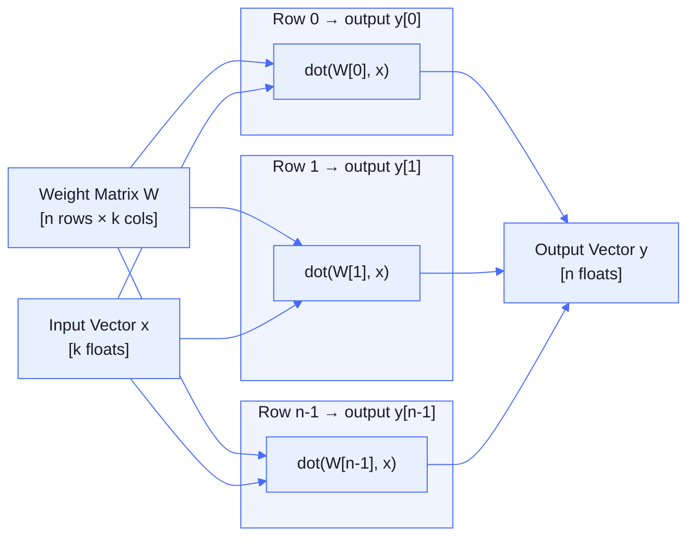
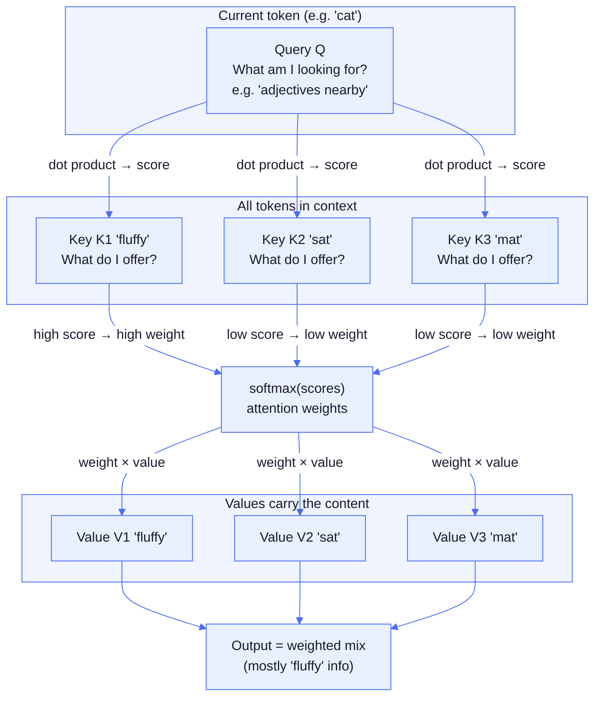
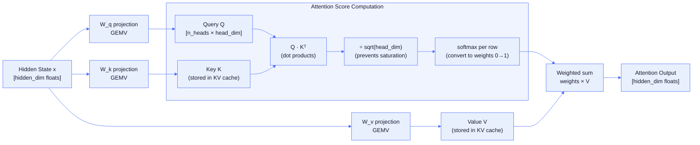
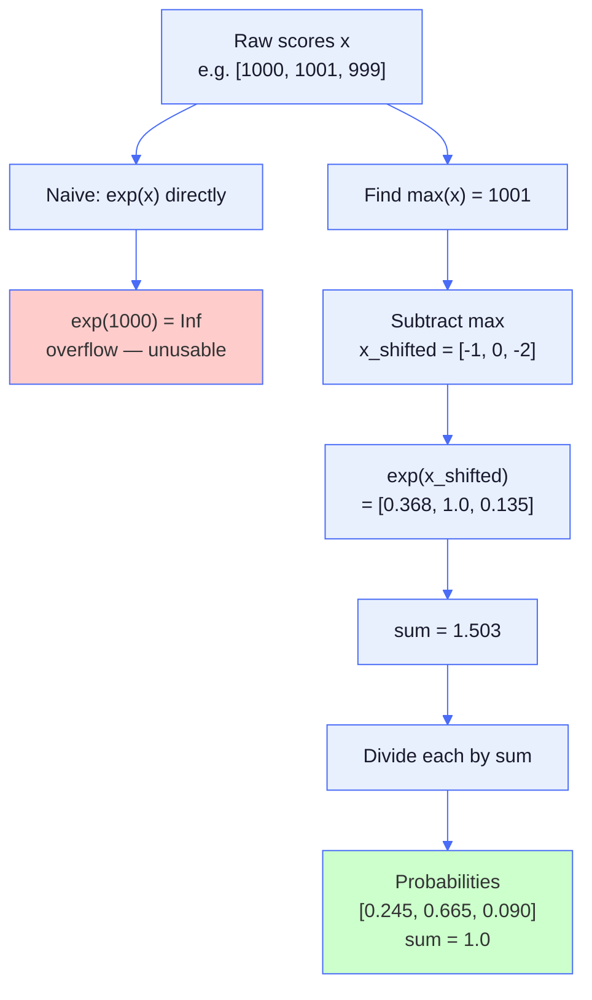
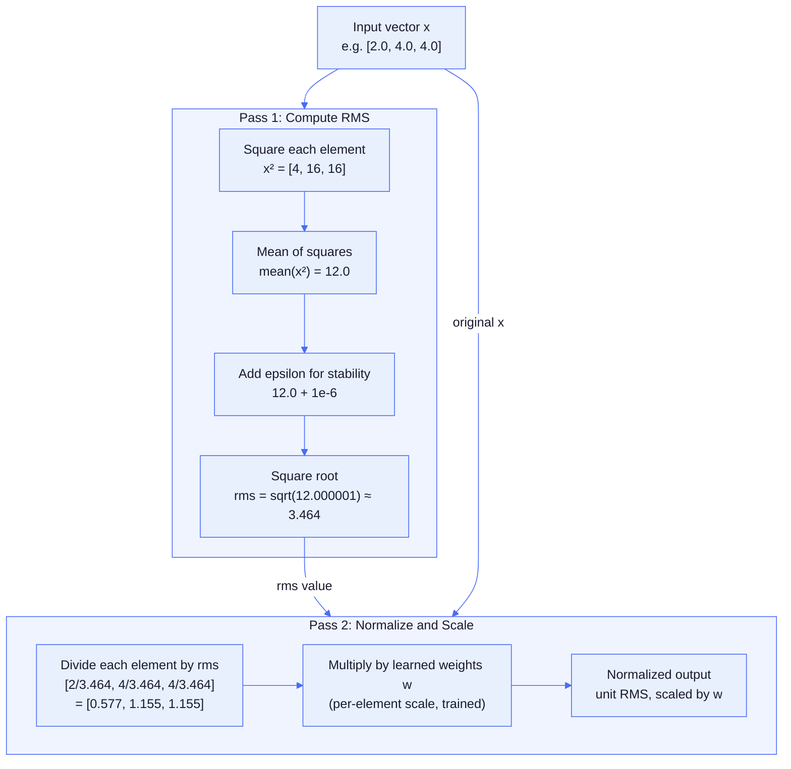
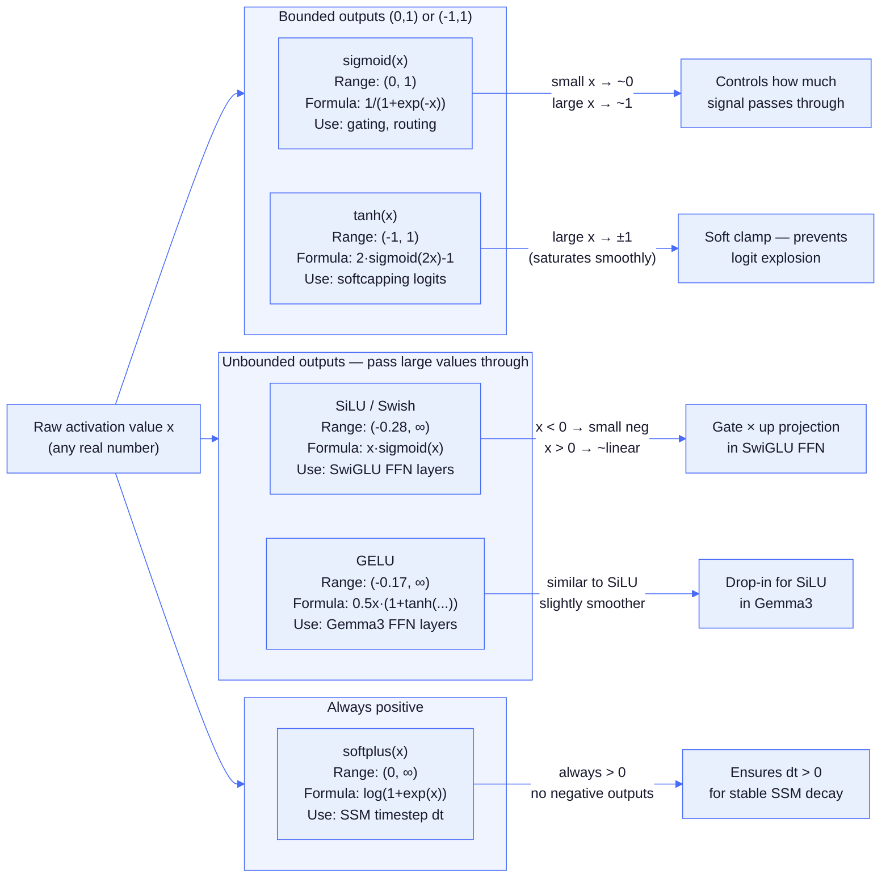
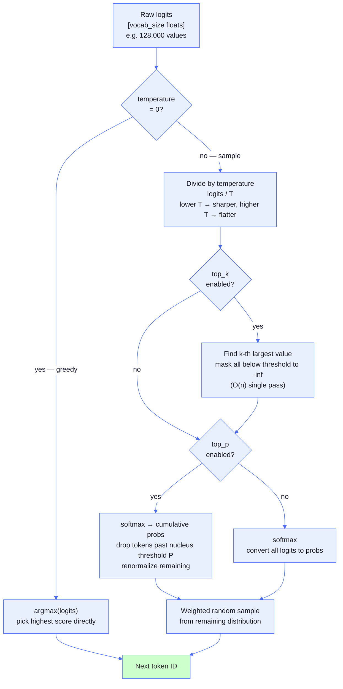
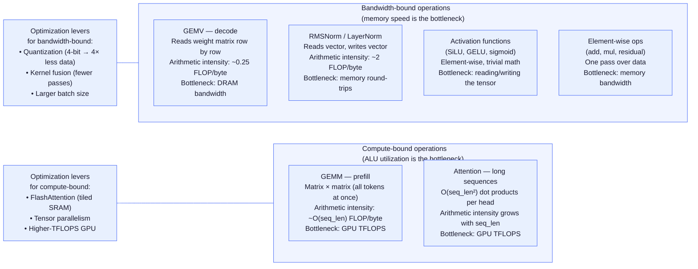

# Appendix: Mathematical Operations Reference

A quick reference for the core mathematical operations used in LLM inference. Written for systems programmers — think of these as the "library functions" that get called thousands of times per token.

## Vector and Matrix Operations

### Dot Product

Multiply corresponding elements and sum:

```
dot(a, b) = a[0]*b[0] + a[1]*b[1] + ... + a[n-1]*b[n-1]
          = sum_i(a[i] * b[i])
```

**Usage**: Core of attention scores (`Q · K`), computing similarity between vectors.

**Performance**: O(n), bandwidth-bound (reads 2n values, writes 1 scalar).

### Matrix-Vector Multiply (GEMV)

Each output element is a dot product of a matrix row with the input vector. The weight matrix is streamed from memory one row at a time, and each row produces one output scalar.



```
y[i] = sum_j(W[i][j] * x[j])

Example (3×4 matrix × 4-element vector):
[w00 w01 w02 w03]   [x0]   [w00*x0 + w01*x1 + w02*x2 + w03*x3]
[w10 w11 w12 w13] × [x1] = [w10*x0 + w11*x1 + w12*x2 + w13*x3]
[w20 w21 w22 w23]   [x2]   [w20*x0 + w21*x1 + w22*x2 + w23*x3]
                    [x3]
```

**Usage**: Every linear projection in the model (Q/K/V projections, FFN layers, output logits).

**Performance**: O(n×k) multiply-accumulates. For decode (generating one token at a time), this is ~95% of inference time. Memory-bandwidth bound — reading the weight matrix is the bottleneck.

### Outer Product

Forms a matrix from two vectors (column × row):

```
A[i][j] = a[i] * b[j]

Example (3-element × 4-element):
[a0]              [a0*b0  a0*b1  a0*b2  a0*b3]
[a1] × [b0 b1 b2 b3] = [a1*b0  a1*b1  a1*b2  a1*b3]
[a2]              [a2*b0  a2*b1  a2*b2  a2*b3]
```

**Usage**: DeltaNet state updates (`S += k ⊗ v` where `⊗` is outer product).

**Performance**: O(n×m), produces an n×m matrix from two vectors.

## Attention-Specific Operations

### Q/K/V Projections

**What they are**: Three different linear transformations (matrix-vector multiplies) of the same input hidden state, using three different learned weight matrices.

```
Given input hidden state x (e.g., 2048-dimensional vector):

Q = W_q @ x    (Query projection)
K = W_k @ x    (Key projection)
V = W_v @ x    (Value projection)

Each weight matrix transforms x into a different representation:
- W_q: [n_heads × head_dim, hidden_dim] → produces Query
- W_k: [n_kv_heads × head_dim, hidden_dim] → produces Key
- W_v: [n_kv_heads × head_dim, hidden_dim] → produces Value
```

**Example** (simplified, single head, hidden_dim=4, head_dim=3):
```
x = [1.0, 2.0, 3.0, 4.0]

W_q = [[0.1, 0.2, 0.3, 0.4],      Q = W_q @ x = [3.0,
       [0.5, 0.6, 0.7, 0.8],  →                  7.0,
       [0.9, 1.0, 1.1, 1.2]]                     11.0]

W_k = [[0.2, 0.3, 0.4, 0.5],      K = W_k @ x = [4.0,
       [0.6, 0.7, 0.8, 0.9],  →                  8.0,
       [1.0, 1.1, 1.2, 1.3]]                     12.0]

W_v = [[0.3, 0.4, 0.5, 0.6],      V = W_v @ x = [5.0,
       [0.7, 0.8, 0.9, 1.0],  →                  9.0,
       [1.1, 1.2, 1.3, 1.4]]                     13.0]
```

**Why three different projections?**

- **Query (Q)**: Represents "what this token is looking for" in other tokens
- **Key (K)**: Represents "what this token offers" to be matched against queries
- **Value (V)**: Represents "the actual information this token carries"

The Q and K projections are used to compute **attention scores** (how much each token should attend to each other token). The V projection contains the actual information that gets mixed based on those scores.



### Attention Score Computation

Once we have Q and K, we compute similarity scores via dot products:

```
For token i attending to token j:
score[i][j] = (Q[i] · K[j]) / sqrt(head_dim)

Example (continuing from above, head_dim=3):
Q[0] = [3.0, 7.0, 11.0]
K[0] = [4.0, 8.0, 12.0]

score = (3.0×4.0 + 7.0×8.0 + 11.0×12.0) / sqrt(3)
      = (12 + 56 + 132) / 1.732
      = 200 / 1.732
      ≈ 115.5
```

The division by `sqrt(head_dim)` (called **scaled** dot-product attention) prevents scores from growing too large as head_dim increases, which would make softmax too peaked.

**Full attention mechanism**:
```
1. Compute Q, K, V for all tokens
2. Compute scores: S[i][j] = (Q[i] · K[j]) / sqrt(head_dim)
3. Apply softmax per row: weights[i][j] = softmax(S[i])
4. Weighted sum of values: output[i] = sum_j(weights[i][j] × V[j])
```



**Multi-head attention**: Repeat this process with different W_q, W_k, W_v matrices for each head, concatenate outputs.

### Convolution (1D Causal)

Sliding window that combines nearby values using learned weights. "Causal" means it only looks backward (at past inputs):

```
y[t] = w[0]*x[t] + w[1]*x[t-1] + w[2]*x[t-2] + ... + w[k-1]*x[t-k+1]
     = sum_i(w[i] * x[t-i])   for i in 0..kernel_size
```

**Example** (kernel_size=3, weights=[0.5, 0.3, 0.2]):
```
x = [a, b, c, d, e]
y[0] = 0.5*a
y[1] = 0.5*b + 0.3*a
y[2] = 0.5*c + 0.3*b + 0.2*a
y[3] = 0.5*d + 0.3*c + 0.2*b
y[4] = 0.5*e + 0.3*d + 0.2*c
```

**Usage**: DeltaNet and Mamba-2 preprocessing — mixes information from recent time steps before the recurrence.

**Implementation**: Ring buffer stores last k-1 inputs to avoid shifting arrays.

## Normalization Operations

### Softmax

Converts raw scores into probabilities that sum to 1.0:

```
softmax(x)[i] = exp(x[i]) / sum_j(exp(x[j]))
```

**Example**:
```
Input:  [2.0, 1.0, 0.1]
Exp:    [7.39, 2.72, 1.11]    (sum = 11.21)
Output: [0.66, 0.24, 0.10]    (sum = 1.00)
```

**Usage**: Attention weights (convert attention scores to probabilities), MoE routing (select experts), sampling (convert logits to token probabilities).

**Numerical stability trick**: Subtract max before exp to prevent overflow. The diagram below shows why the naive path fails and what the stable path does instead.



### RMS Normalization (RMSNorm)

Scale vector to unit RMS (Root Mean Square), then apply learned weights:

```
rms = sqrt(mean(x²) + eps)
rmsNorm(x, w) = (x / rms) * w
```

**Example** (eps=1e-6, weight=[1.0, 1.0, 1.0]):
```
x = [2.0, 4.0, 4.0]
mean(x²) = (4 + 16 + 16) / 3 = 12
rms = sqrt(12 + 1e-6) ≈ 3.464
output = [2.0/3.464, 4.0/3.464, 4.0/3.464] * w
       ≈ [0.577, 1.155, 1.155]
```

**Usage**: Applied before every attention and FFN sublayer. Stabilizes training and inference by preventing activation magnitudes from exploding.

**Why RMS not mean**: Simpler (no mean subtraction), empirically just as effective as LayerNorm.



### L2 Normalization

Scale vector to unit length (magnitude = 1), no learnable weights:

```
magnitude = sqrt(sum(x[i]²) + eps)
l2Norm(x) = x / magnitude
```

**Usage**: DeltaNet Q/K normalization before recurrence (prevents numerical instability in the state update).

## Activation Functions

Non-linear transformations applied element-wise (independently to each value).

### SiLU (Swish)

Smooth activation with gating property:

```
silu(x) = x * sigmoid(x)
        = x / (1 + exp(-x))
```

**Shape**: Smooth S-curve that's negative for x<0, close to linear for x>3.

**Usage**: Most FFN layers (SwiGLU), causal convolution, SSM gating.

### GELU (Gaussian Error Linear Unit)

Smoother than ReLU, approximates Gaussian CDF:

```
gelu(x) ≈ 0.5 * x * (1 + tanh(sqrt(2/π) * (x + 0.044715*x³)))
```

**Usage**: Gemma3 FFN (instead of SiLU).

### Sigmoid

Maps any value to (0, 1):

```
sigmoid(x) = 1 / (1 + exp(-x))
```

**Output range**: (0, 1) — never exactly 0 or 1.

**Usage**: Gating (how much signal to let through), MoE routing (GLM-4), attention gate (Qwen3.5).

### Softplus

Smooth approximation of ReLU, always positive:

```
softplus(x) = log(1 + exp(x))
```

**Approximation**: Linear for x > 20, `≈ exp(x)` for x < -20.

**Usage**: SSM `dt` (timestep) computation — ensures positive decay factors.

### Tanh (Hyperbolic Tangent)

Maps any value to (-1, 1):

```
tanh(x) = (exp(x) - exp(-x)) / (exp(x) + exp(-x))
        = 2*sigmoid(2*x) - 1
```

**Usage**: Logit softcapping in Gemma3 (`tanh(x/cap) * cap` clamps to ±cap smoothly).

### Activation Function Comparison



## Sampling Operations

### Argmax

Find the index of the maximum value:

```
argmax(x) = index i where x[i] is largest

Example:
x = [0.1, 0.8, 0.3, 0.5]
argmax(x) = 1    (x[1] = 0.8 is largest)
```

**Usage**: Greedy decoding (temperature=0) — always pick the highest-scoring token.

**Implementation**: Two-pass linear scan, O(n). First pass finds the maximum value (SIMD-vectorised); second pass finds its index.

### Temperature Scaling

Scale logits to control randomness before softmax:

```
adjusted_logits = logits / temperature

temperature → 0:   peaked distribution (greedy)
temperature = 1:   unchanged
temperature → ∞:   uniform distribution
```

**Effect**: Lower temp → more deterministic (top token dominates). Higher temp → more random (flatter probabilities).

### Top-K Selection

Keep only the K highest-scoring tokens, set rest to -∞:

```
1. Scan all tokens once to find the k-th largest value (min-replacement scan, O(n))
2. In a single SIMD pass: mask tokens below that threshold to −∞ and apply exp
3. Renormalize by dividing by the accumulated sum
```

**Usage**: Prevent sampling extremely unlikely tokens at high temperatures.

### Top-P (Nucleus Sampling)

Keep smallest set of tokens whose cumulative probability ≥ P:

```
1. Sort tokens by probability descending
2. Accumulate probabilities until sum ≥ P
3. Keep those tokens, mask rest
4. Renormalize
```

**Adaptive**: When model is confident (one token = 90%), keeps 1-2 tokens. When uncertain (many similar scores), keeps dozens.

### Sampling Pipeline



## Special Operations

### Reduction Operations

**Sum**: `sum(x) = x[0] + x[1] + ... + x[n-1]`

**Mean**: `mean(x) = sum(x) / n`

**Max**: `max(x)` = largest element

**Usage**: Building blocks for softmax (sum/max), normalization (mean), reductions in GPU kernels.

**GPU implementation**: Parallel reduction — each thread reduces a chunk, then combine results in shared memory using tree reduction.

### Element-wise Operations

Applied independently to each element:

```
add(a, b)[i] = a[i] + b[i]
mul(a, b)[i] = a[i] * b[i]
```

**Usage**: Residual connections (`x = x + f(x)`), gating (`output = data * gate`).

**Performance**: Memory-bandwidth bound (2 reads + 1 write per element), trivially parallel.

---

## Common Patterns

### GEMV dominates inference

Matrix-vector multiply is ~95% of decode time. Every linear layer (`Linear(in, out)`) is a GEMV:

- Q/K/V projections: 3 GEMVs per layer
- Attention output projection: 1 GEMV per layer
- FFN: 3 GEMVs per layer (gate, up, down)
- Output logits: 1 GEMV (largest — vocab_size rows)

A 28-layer model with vocab_size=128K does ~197 GEMVs per token.

### Bandwidth vs Compute Bound

**Bandwidth-bound** (GEMV, normalization, activations): Time spent waiting for memory reads/writes dominates. Arithmetic is trivial. Quantization helps enormously (4× less data to read).

**Compute-bound** (attention for long sequences, matrix-matrix multiply during prefill): Arithmetic dominates. GPU compute power matters more than memory speed.

For single-token decode, everything is bandwidth-bound.



### In-place vs Allocating

**In-place** (modifies input): `rope(x)` rotates x directly. Zero allocations.

**Allocating** (creates output): `softmax(x)` operates **in-place** over two passes (find max, then exp+normalize). No allocation — the input buffer is reused as output.

Inference hot path is allocation-free — all buffers pre-allocated, operations reuse scratch space.

---

**See also**:
- Chapter 2 (attention, RoPE, RMSNorm)
- Chapter 3 (activation functions, MoE)
- Chapter 4 (GEMV, quantization)
- Chapter 6 (convolution, outer product, SSM recurrence)
- Chapter 7 (sampling operations)

**Next:** [Appendix: Compile-Time Optimization →](appendix-compile-time.md) | **Back:** [Chapter 17: Speculative Decoding ←](17-speculative-decoding.md)
