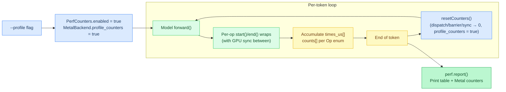
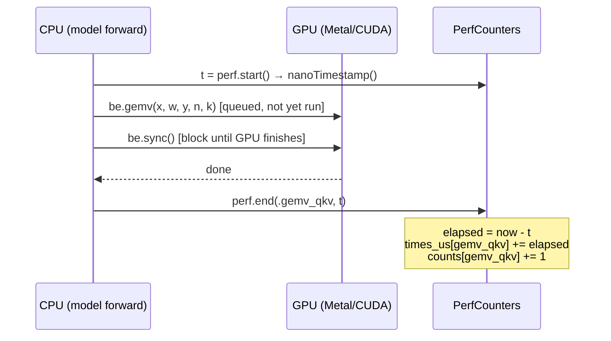
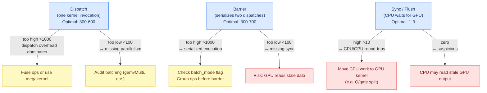
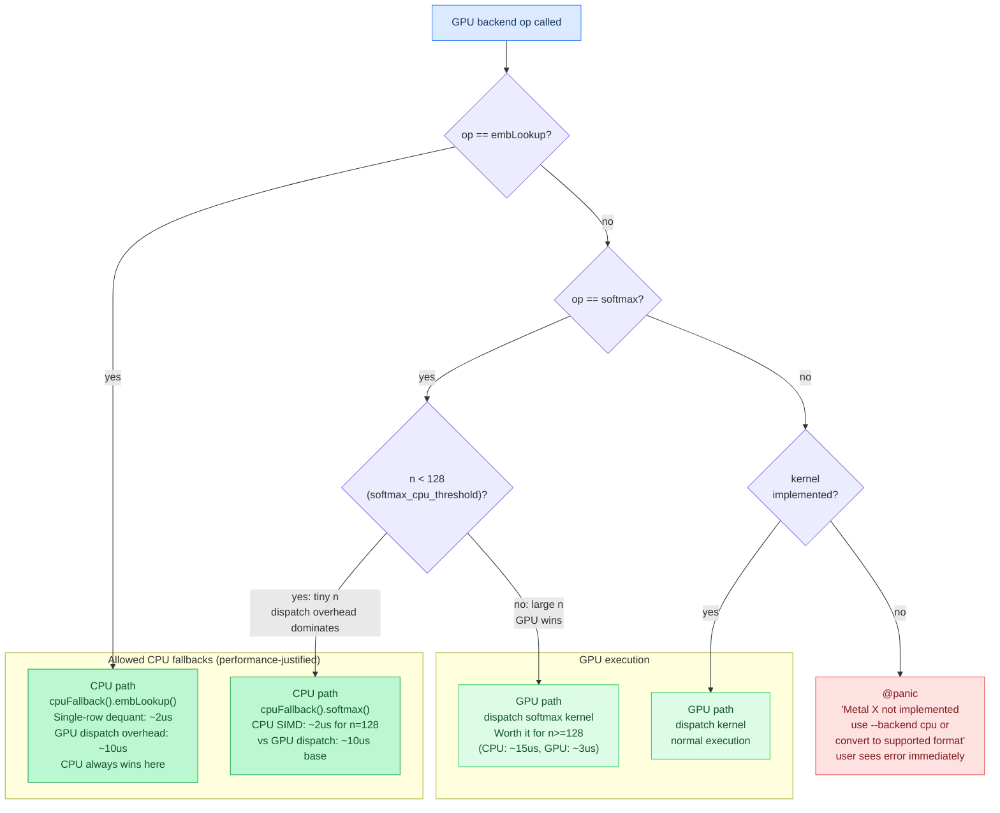
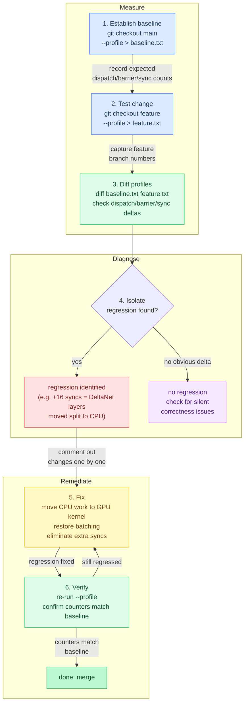
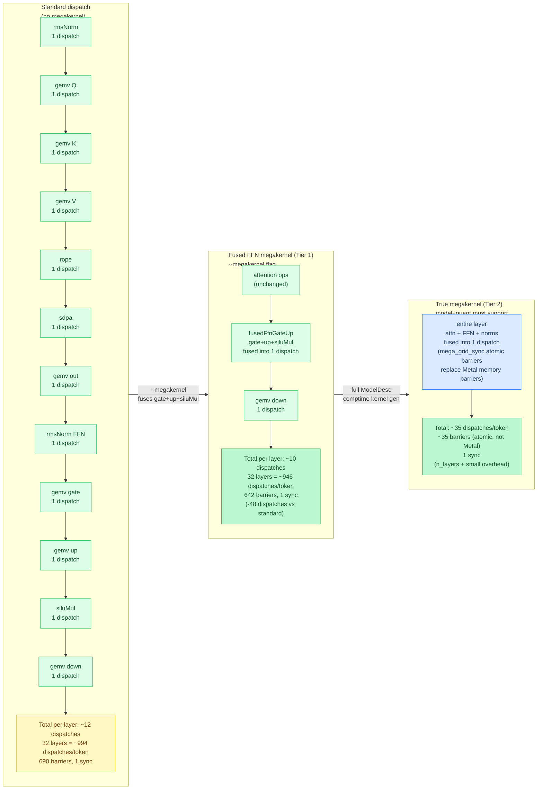

# Appendix: Profiling and Debugging

**Prerequisites:** [Chapter 11: Metal Backend Internals](11-metal-backend-internals.md#profiling-counters), [Chapter 13: Batched Dispatch and Fusion](13-batched-dispatch-and-fusion.md)

> After this appendix you can use `--profile` to identify bottleneck ops, read dispatch counters, and diagnose regressions.

Performance regressions are silent — the model still runs, but slower. **Profiling** makes performance visible. Agave has built-in instrumentation for dispatch counts, barriers, syncs, and per-operation timing.

## --profile Flag

The `--profile` flag threads timing instrumentation through the entire inference pipeline, collecting per-operation durations and backend counters that are printed after each token.



**Enable profiling:** Add `--profile` to any inference command.

```bash
./zig-out/bin/agave model.gguf --profile "Test prompt"
```

**Output per token:**

```
Token 15: "world" (151ms)
  embedLookup: 0.2ms
  layer 0: 8.1ms (rmsNorm: 0.3ms, gemv×3: 6.2ms, rope: 0.1ms, sdpa: 1.3ms, ...)
  layer 1: 8.0ms
  ...
  layer 31: 8.1ms
  final_norm: 0.3ms
  lm_head_gemv: 12.1ms

Metal counters:
  Dispatches: 994
  Barriers: 690
  Syncs: 1
```

**What profiling adds:**

- **Per-operation timing:** Each gemv, rmsNorm, sdpa, etc. timed individually
- **Backend counters:** Dispatch/barrier/sync counts (Metal, CUDA, ROCm)
- **Total time per layer:** Aggregated time for each transformer layer

**Cost of profiling:** ~50% throughput loss due to additional GPU syncs (timing requires flushing command buffers).

**When to use:**

- ✅ Debugging performance regressions
- ✅ Identifying bottlenecks (which op is slow?)
- ✅ Verifying optimizations (did gemvMulti reduce dispatches?)
- ❌ Production inference (too slow)

## Profiling Implementation

### Timing Individual Operations

```text
Op: enum { emb_lookup, rms_norm, gemv_qkv, gemv_out, gemv_ffn,
           deinterleave, rope, sdpa, sigmoid_mul, silu_mul,
           gelu_mul, add, deltanet, total_layer }

PerfCounters:
    counts: [n_ops]u64 = 0
    times_us: [n_ops]u64 = 0
    n_tokens: u64 = 0
    enabled: bool = false

    start():
        if not enabled: return 0
        # reads CLOCK_REALTIME directly via the private nanoTimestamp() helper,
        # avoiding Io virtual dispatch overhead in the hot path
        return nanoTimestamp()

    end(op, t0):
        if not enabled: return
        elapsed = (nanoTimestamp() - t0) / 1000
        times_us[op] += elapsed
        counts[op] += 1
```

**Implementation:** [`src/perf.zig`](../../src/perf.zig) (`Op`, `PerfCounters.start`/`end`)

### Instrumented Operation

Without a GPU sync between dispatch and timing, you'd measure only the CPU's time to queue the command (~5 µs) rather than the actual GPU execution. The sequence below shows why the sync is mandatory for accurate per-op numbers.



```text
t = perf.start()

be.gemv(x, w, y, n, k)
be.sync()                    # flush GPU work so timing reflects real execution

perf.end(gemv_qkv, t)
```

**Implementation:** [`src/models/qwen35.zig`](../../src/models/qwen35.zig) (`perf.start`/`sync`/`perf.end` wrapping around `gemv`)

**Key:** GPU work is deferred. Without `sync()`, you'd measure only the CPU dispatch time (~5 µs), not the actual GPU execution time.

**Trade-off:** `sync()` per operation serializes execution → 50% throughput loss. This is why profiling is only enabled by the `--profile` flag.

### Per-Layer Usage

Each operation in the forward pass is wrapped with `start()`/`end()`:

```text
# attention layer
t = perf.start()
be.rmsNorm(x, w, eps)
perf.end(rms_norm, t)

t = perf.start()
be.gemvMulti(qkv_ops)
perf.end(gemv_qkv, t)

t = perf.start()
be.rope(q, k, freqs, pos)
perf.end(rope, t)

t = perf.start()
be.sdpa(q, k, v, out, ...)
perf.end(sdpa, t)
```

**Implementation:** [`src/models/qwen35.zig`](../../src/models/qwen35.zig) (attention layer, per-op `start`/`end` wraps)

After generation completes, `perf.report()` prints a table with call counts, total time, average time, and percentage breakdown per operation.

## Backend Dispatch Counters

### Metal Counters

The three Metal counters measure different levels of GPU work granularity. A dispatch is one kernel invocation; a barrier serializes two consecutive dispatches; a sync flushes the GPU command queue back to the CPU. Each has an "optimal" range -- deviating in either direction signals a specific class of problem.



```text
MetalBackend:
    dispatch_count: u32 = 0
    barrier_count: u32 = 0
    sync_count: u32 = 0
    profile_counters: bool = false

    encode(...):
        ... dispatch kernel ...
        if profile_counters: dispatch_count += 1

        ... insert barrier ...
        if not batch_mode:
            ... barrier ...
            if profile_counters: barrier_count += 1

    flush():
        ... commit command buffer ...
        if profile_counters: sync_count += 1
```

**Implementation:** [`src/backend/metal.zig`](../../src/backend/metal.zig) (`dispatch_count`, `barrier_count`, `sync_count`, gated by `profile_counters`)

**Reset per token:**

```text
resetCounters():
    dispatch_count = 0
    barrier_count = 0
    sync_count = 0
    profile_counters = true
```

**Implementation:** [`src/backend/metal.zig`](../../src/backend/metal.zig) (`resetCounters`)

**Print at first decode token:**

```text
# only when --profile is on, first decode token
if perf.enabled and kv_seq_len == 1:
    if comptime(os == macos):
        switch be:
            metal -> |be| log.warn("Metal stats: {dispatch_count} dispatches, "
                                    "{barrier_count} barriers, {sync_count} syncs")
            else -> ()
```

**Implementation:** [`src/models/qwen35.zig`](../../src/models/qwen35.zig) (Metal stats print, gated on `perf.enabled` and `kv_seq_len == 1`)

Note: counters come from the `.metal` tagged-union variant, not a `g_profile` global. Printing requires `perf.enabled` (`--profile`) and `kv_seq_len == 1` so it fires once on the first decode step.

### Interpreting Counts

**Dispatch count:**

- **High (>1000):** Many small kernels, dispatch overhead may dominate
- **Optimal (300-600):** Batched/fused ops, minimal overhead
- **Too low (<100):** Likely missing parallelism opportunities

**Barrier count:**

- **High (>1000):** Serialized execution, GPU can't overlap work
- **Optimal (300-700):** Batching used where possible
- **Too low (<100):** Risky — may be missing necessary synchronization

**Sync count:**

- **High (>10):** Excessive CPU/GPU round-trips, throughput loss
- **Optimal (1-3):** Only at necessary points (argmax, embedding lookup)
- **Zero:** Suspicious — CPU likely reading stale GPU data

**Example:** Qwen3.5 optimization reduced syncs from 18 → 1 per token (+15% throughput).

## Missing Kernel Policy

**Golden rule:** GPU backends must **never silently fall back to CPU**. Missing kernels must `@panic` with a clear error message.

### Enforcement

```text
gemvMlxQ(x, weight, scales, biases, y, n, k, bits):
    pipeline = switch bits:
        4 -> pipe_gemv_mlx_q4
        6 -> pipe_gemv_mlx_q6
        8 -> pipe_gemv_mlx_q8
        else -> panic("Metal MLX GEMV: unsupported bit width")
    ... dispatch ...
```

**Implementation:** [`src/backend/metal.zig`](../../src/backend/metal.zig) (`gemvMlxQ`, 4/6/8-bit pipelines, `@panic` on anything else)

**Error message requirements:**

1. **What's missing:** name the unsupported configuration
2. **Workaround:** suggest `--backend cpu` or a supported quantization format

Note: 4-bit, 6-bit, and 8-bit are all supported on Metal. The panic fires for any other value (e.g., bits=3) with the message "Metal MLX GEMV: unsupported bit width".

### Why @panic?

**Alternative (silent fallback):**

```text
# ANTI-PATTERN: silent fallback, do not do this
gemvMlxQ(...):
    if bits == 6:
        be.sync()             # flush GPU
        cpuGemvMlxQ(...)      # silently run on CPU instead
        return
    ... GPU path ...
```

**Problem:** User expects GPU performance, gets CPU performance, **doesn't realize** until they profile. Silent regressions are the worst kind.

**With @panic:**

```
$ ./agave model-6bit-mlx.gguf "Hello"
thread 1 panic: Metal MLX 6-bit GEMV not implemented — use --backend cpu or convert to 4-bit
```

User **immediately knows** there's an issue and has clear next steps.

### CPU Fallback Exceptions



**Only two cases allow CPU fallback:**

#### 1. embLookup (Single-Row Read)

```text
embLookup(table, token_id, output, dim):
    # single-row lookup is faster on CPU than GPU dispatch overhead.
    # cpuFallback() flushes first, so any pending GPU writes (e.g. a preceding
    # rmsNorm output) are visible before the CPU reads the embedding table.
    cpu = cpuFallback()
    cpu.embLookup(table, token_id, output, dim)
```

**Implementation:** [`src/backend/metal.zig`](../../src/backend/metal.zig) (`embLookup`, permitted CPU fallback)

**Why CPU is faster:**

- GPU dispatch overhead: ~10 µs
- Single-row dequant on CPU: ~2 µs (SIMD)
- GPU would be faster for batch embedding lookup, but not single-token decode

#### 2. Tiny Softmax (Below Threshold)

```text
softmax_cpu_threshold: usize = 128

softmax(data, n):
    if n < softmax_cpu_threshold:
        # dispatch overhead dominates for tiny softmax.
        # cpuFallback() flushes pending GPU work so the CPU reads current data.
        cpu = cpuFallback()
        cpu.softmax(data, n)
        return
    ... GPU path ...
```

**Implementation:** [`src/backend/metal.zig`](../../src/backend/metal.zig) (`softmax_cpu_threshold`, `softmax`, permitted CPU fallback)

**Why threshold?**

- GPU dispatch: ~10 µs base cost
- Softmax(128): ~2 µs on CPU SIMD
- Softmax(1024): ~15 µs on CPU, ~3 µs on GPU (worth the dispatch)

**Both exceptions are documented** with comments explaining the performance justification.

## Debugging Performance Regressions

### Workflow



1. **Establish baseline:** Run with `--profile` on main branch

   ```bash
   git checkout main
   ./zig-out/bin/agave model.gguf --profile "Test" > baseline.txt
   ```

2. **Test change:** Run with `--profile` on feature branch

   ```bash
   git checkout feature
   ./zig-out/bin/agave model.gguf --profile "Test" > feature.txt
   ```

3. **Compare:**

   ```bash
   diff baseline.txt feature.txt
   ```

   **Look for:**

   - Increased dispatch/barrier/sync counts
   - Slower individual operations
   - New operations (unexpected CPU fallbacks?)

4. **Isolate:** Comment out parts of the change to identify the culprit

5. **Fix:** Once identified, fix the regression

6. **Verify:** Re-run profile, confirm counters match baseline

### Example: Identifying a Regression

Illustrative `--profile` shape (not a `BENCHMARKS.md` row). Numbers show the *kind* of counter move you look for:

**Before (baseline):**

```
Metal stats: low dispatches, barriers matched to batch groups, 1 sync
Token time: lower
```

**After (regression):**

```
Metal stats: more dispatches, many more barriers, many syncs
Token time: higher
```

**Analysis:**

- Extra dispatches → something new is being launched
- Extra barriers → batching was removed somewhere
- Extra syncs → major red flag: CPU/GPU round-trips added

**Investigation:** Sync count matching DeltaNet layer count often means Q/gate split fell back to CPU.

**Root cause:** Q/gate split moved from GPU kernel to CPU memcpy:

```text
# REGRESSION: CPU memcpy requires a sync before and after
be.sync()                       # sync 1 (GPU -> CPU)
for h in 0..nh:
    memcpy(...)                 # CPU memcpy
# next GPU op needs the data -> sync 2 (CPU -> GPU)
```

**Fix:** Move split to GPU kernel (eliminates 16 syncs/token).

## Tracy Integration

Agave doesn't currently use Tracy, but here's how you'd integrate it:

### Build with Tracy

```text
# build.zig (hypothetical — Agave has zero external dependencies today)
tracy = b.dependency("tracy")
exe.linkLibrary(tracy.artifact("tracy"))
exe.addCSourceFile(tracy.path("public/TracyClient.cpp"), flags = ["-DTRACY_ENABLE"])
```

### Instrument Code

```text
gemv(...):
    zone = tracy.ZoneScoped()
    defer tracy.ZoneEnd(zone)

    ... operation ...
```

### View Results

```bash
./tracy-profiler  # GUI shows flamegraph, GPU timelines, memory allocations
```

**Benefits:**

- Visual timeline (see parallelism, gaps)
- GPU queue visualization
- Memory allocation tracking

**Cost:** ~5-10% overhead (lower than `--profile` because no forced syncs).

## Common Profiling Patterns

### Bottleneck Identification

```bash
./agave model.gguf --profile "Test" 2>&1 | grep "ms" | sort -rn -k2
```

**Output (sorted by time):**

```
  lm_head_gemv: 12.1ms
  layer 15: 8.2ms
  layer 0: 8.1ms
  gemv×3: 6.2ms
  sdpa: 1.3ms
  rmsNorm: 0.3ms
```

**Interpretation:** `lm_head_gemv` is the bottleneck (vocab projection, large matrix).

### Regression Detection (CI)

```bash
# In CI pipeline
./agave model.gguf --profile "Test" > current.txt
./agave-baseline model.gguf --profile "Test" > baseline.txt

# Extract sync count
current_syncs=$(grep "syncs" current.txt | awk '{print $NF}')
baseline_syncs=$(grep "syncs" baseline.txt | awk '{print $NF}')

if [ "$current_syncs" -gt "$baseline_syncs" ]; then
    echo "Regression: sync count increased from $baseline_syncs to $current_syncs"
    exit 1
fi
```

**Prevents:** Silent performance regressions from merging.

### Megakernel Profiling



Combining `--profile` with `--megakernel` shows the impact of kernel fusion on dispatch and barrier counts:

```bash
# Standard dispatch
./agave model.gguf --profile "Test"
# Metal: 994 dispatches, 690 barriers, 1 sync

# With fused FFN megakernel (Tier 1)
./agave model.gguf --profile --megakernel "Test"
# Metal: 946 dispatches, 642 barriers, 1 sync
# (48 fewer dispatches vs standard; not exactly 2 per layer because
#  totals include fixed per-token overhead outside the 32 FFN layers)

# With true megakernel (Tier 2, when available for model+quant)
# Metal: ~35 dispatches, ~35 barriers, 1 sync
# (entire layer runs as single dispatch; n_layers + small overhead)
```

True megakernels show the most dramatic reduction -- dispatch count drops from hundreds to roughly `n_layers + overhead`. This is because each layer becomes a single dispatch with internal `mega_grid_sync` atomic barriers replacing Metal memory barriers.

### Comparative Profiling

```bash
# Compare two quantization formats
./agave model-q4.gguf --profile "Test" | grep "Token time"
./agave model-mlx.gguf --profile "Test" | grep "Token time"

# Compare two backends
./agave model.gguf --backend Metal --profile "Test" | grep "dispatches"
./agave model.gguf --backend CPU --profile "Test" | grep "layer 0"
```

## Performance Debugging Checklist

When investigating slow performance:

- [ ] Run with `--profile` to get baseline numbers
- [ ] Check sync count (should be ≤3 per token)
- [ ] Check dispatch count (should be 300-600 for typical model)
- [ ] Identify slowest operation (sort profiling output)
- [ ] Compare against expected performance (other quantization formats, backends)
- [ ] Check for unexpected CPU fallbacks (CPU time in GPU-expected ops)
- [ ] Verify batching is used (gemvMulti, rmsNormMulti, etc.)
- [ ] Check for missing fusion opportunities (sequential ops that could be fused)

## Best Practices

### Development

1. **Profile before optimizing:** Measure first, optimize second
2. **One change at a time:** Isolate what caused the improvement/regression
3. **Keep baseline numbers:** Document expected performance for each model+backend combo

### CI/CD

1. **Benchmark on merge:** Run performance suite on every PR
2. **Regression threshold:** Fail CI if throughput drops >5%
3. **Track over time:** Graph performance trends (detect gradual degradation)

### Production

1. **Never use --profile in production:** 50% throughput loss
2. **Use metrics instead:** Log tokens/sec, TTFT, latency percentiles
3. **A/B test optimizations:** Roll out changes to subset of traffic first

## Gotchas

- **Comparing profiled numbers across runs without `--profile` on both sides is meaningless.** The 50% throughput hit from forced GPU syncs applies unevenly across operations (small ops feel it more than large ones), so a profiled run's *relative* percentages between operations are trustworthy, but its *absolute* tok/s is not comparable to an unprofiled run's tok/s. Always compare profiled-vs-profiled or unprofiled-vs-unprofiled, never mix the two when judging a regression.

---

**In the code:** [src/perf.zig](../../src/perf.zig) (profiling infrastructure), [src/backend/metal.zig](../../src/backend/metal.zig) (dispatch counters), [src/main.zig](../../src/main.zig) (--profile flag handling)

**Related:** [Chapter 11: Metal Backend Internals](11-metal-backend-internals.md#profiling-counters), [Chapter 13: Batched Dispatch and Fusion](13-batched-dispatch-and-fusion.md#real-world-example-qwen35-optimization-journey)

**Next:** [Appendix: Atomic Operations →](appendix-atomics.md) | **Back:** [Appendix: Compile-Time Optimization ←](appendix-compile-time.md)

---

## Glossary

**--profile flag** — CLI flag enabling per-operation timing instrumentation; incurs ~50% throughput loss due to forced GPU syncs.

**barrier count** — Number of GPU memory barriers per token; high counts indicate serialized execution.

**batch_mode** — Metal flag suppressing per-dispatch memory barriers for better throughput.

**cpuFallback()** — Metal method that flushes GPU work and returns a CPU backend reference for permitted fallback operations.

**dispatch count** — Number of GPU kernel invocations per token; optimal range 300–600.

**megakernel** — A fused GPU kernel combining multiple operations into a single dispatch, reducing dispatch and barrier overhead.

**missing kernel policy** — The rule that GPU backends must `@panic` on unimplemented kernels, never silently falling back to CPU.

**Op enum** — Enumeration of profiled operation types (emb_lookup, rms_norm, gemv_qkv, sdpa, etc.) indexing into counter arrays.

**PerfCounters** — The profiling struct accumulating per-operation call counts and microsecond durations.

**performance regression** — A silent slowdown where the model still runs correctly but at lower throughput.

**resetCounters()** — Function zeroing all dispatch/barrier/sync counters at the start of each token's profiling window.

**softmax_cpu_threshold** — Minimum vector size (128) below which GPU softmax is slower than CPU SIMD, triggering a permitted fallback.

**sync count** — Number of CPU/GPU round-trip flushes per token; should be ≤3.
