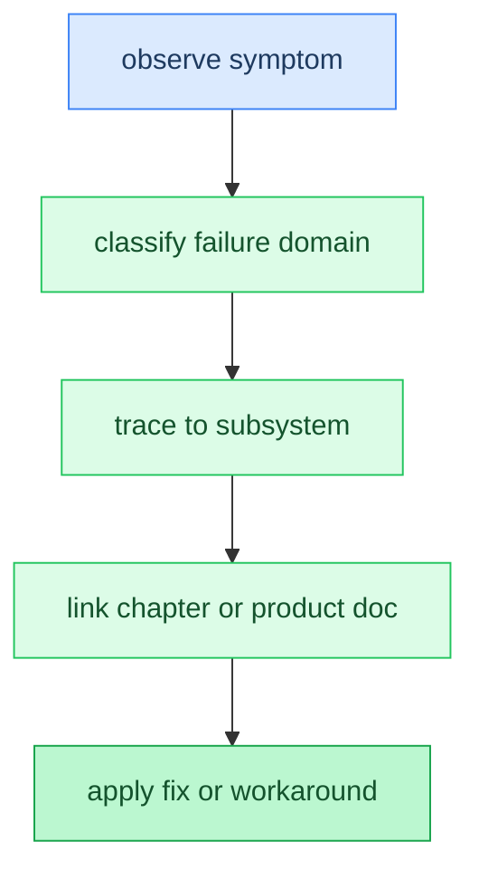

# Appendix: Troubleshooting

**Time:** ~10 min

> After this appendix you can diagnose common inference failures from symptoms to likely causes.

<!-- TODO: Task 6 — full prose -->

### Code Flow



## Gotchas

- Placeholder — filled in Task 6.

## How This Relates to the Code

**In the code:** [`main` load/generate path](../../src/main.zig), [`backend` dispatcher](../../src/backend/backend.zig), [`server` request handling](../../src/server/server.zig)

```text
observe symptom → classify (OOM / garbage / backend / format / distributed / server)
→ trace to subsystem (KV, sync, dispatcher, quant, transport, HTTP parse)
→ link to tutorial chapter or product doc → verify fix
```

**Next:** [Appendix: Mathematical Operations Reference →](appendix-math.md) | **Back:** [Chapter 23: Server / HTTP API ←](23-server-http-api.md)

---

## Glossary

(Terms added in Task 6.)
