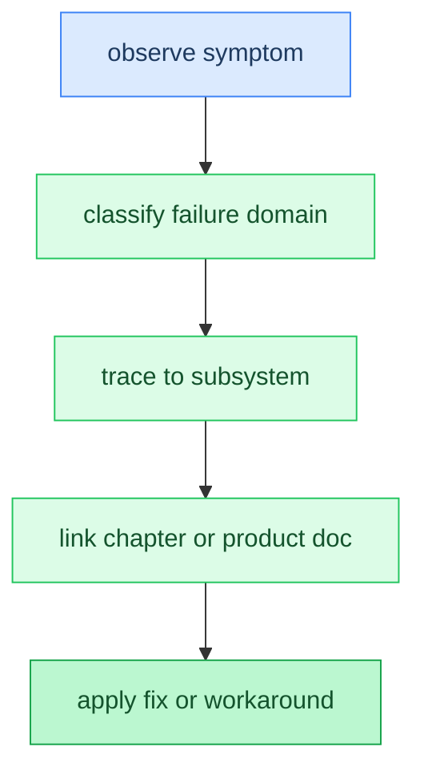

# Appendix: Troubleshooting

**Time:** ~10 min

> After this appendix you can diagnose common inference failures from symptoms to likely causes.

Most inference failures fall into one of a handful of shapes: the process dies (OOM), the process runs but the output is wrong (garbage or degenerate text), the wrong hardware path gets used, or something involving multiple processes (distributed ranks, HTTP clients) never completes. This appendix works backward from what you observe to the subsystem responsible, then points at the chapter or product doc that covers that subsystem in depth rather than repeating flag lists here. As Chapter 0's gotchas already flagged, several of the worst failures here (missing GPU sync, format convention mismatches) are **silent**: no error message, no crash, just wrong or slow output, which is why the "what to check" column matters more than any exception text.

## Symptom → Likely Cause → What to Check

### 1. Out of memory / context too large

**Symptom:** The process is killed or exits with an allocation failure, either at load time or partway through a long generation.

**Likely cause:** Total memory pressure is the sum of three independently-growing pieces: the quantized weights (fixed once a model and quant are chosen), the **KV cache** (grows with context length and shrinks only through eviction, Chapter 5), and any CLI overrides that add scratch buffers (larger batch sizes, higher `--tp`/`--pp` degree). Any one of these looking reasonable in isolation doesn't mean the sum fits in RAM or VRAM.

**What to check:** Chapter 5's KV cache sizing and eviction sections, and the `--ctx-size auto` context-fitting behavior described in the product docs (fits the context window to whatever memory is actually available instead of failing at a fixed size).

### 2. Garbage output

**Symptom:** The model loads and generates without any error, but the text is nonsensical, repetitive, or unrelated to the prompt.

**Likely cause:** This is almost always a **silent correctness failure**, not a crash-worthy bug, and has three common sources: a missing GPU **sync** before the CPU reads logits (Chapter 0's first gotcha), a GGUF/SafeTensors convention mismatch applied to the wrong format (Chapter 14), or a RoPE (rotary position embedding) parameter read from the wrong metadata key. Quantization block misinterpretation (reading a Q4_K block as Q4_0, for example) produces the same symptom.

**What to check:** Chapter 0's sync-before-argmax gotcha, Chapter 14's format convention differences and checklist (including its `rope_theta` metadata nesting note for RoPE parameter sourcing), and Chapter 4's block quantization layout.

### 3. Backend selection confusion

**Symptom:** `--backend` appears to be ignored, or the binary silently runs on a slower backend than expected (e.g., CPU when a GPU is present).

**Likely cause:** Without an explicit `--backend`, Agave auto-selects using a fixed priority per platform (Metal on Apple Silicon, CUDA then Vulkan on Linux+NVIDIA, and so on) and falls back silently to the next entry if the preferred backend fails to initialize, no error is raised for a successful fallback.

**What to check:** Chapter 8's backend dispatcher and the platform/primary/fallback table it documents; confirm which backend actually ran via the startup model info banner (`Backend: ...`) or the `backend` field in JSON output, not the end-of-run stats line, which reports only token counts and timing.

### 4. Quantization quality artifacts

**Symptom:** A quantized model's output differs slightly from the full-precision original, or two quant types of the same model disagree on some outputs.

**Likely cause:** Some accuracy loss is expected and scales with bit width. The question is whether the divergence you're seeing is that expected loss or an actual bug (wrong block size, wrong scale/zero-point math).

**What to check:** Chapter 4's block quantization and expected-accuracy sections; cross-reference against `docs/TEST_MATRIX.md`'s KV quantization and cross-converter tables, which record known-good baselines for comparison.

### 5. GGUF vs SafeTensors mismatch

**Symptom:** The identical model, loaded once as GGUF and once as SafeTensors, produces different quality output (one coherent, one garbage or subtly wrong).

**Likely cause:** The two formats disagree on tensor split order, GQA (grouped-query attention) head mapping, dimension order, and whether certain tensors need init-time conversion. A convention meant for one format silently corrupts the other instead of erroring.

**What to check:** Chapter 14 in full, particularly its format checklist and the GGUF-vs-SafeTensors equivalence test pattern it describes.

### 6. GLM-4 degenerate output

**Symptom:** GLM-4.7 Flash produces degenerate output (repetitive or incoherent tokens) regardless of backend.

**Likely cause:** This is a known broken GGUF conversion, not an Agave bug. The same failure reproduces in llama.cpp against the same GGUF file, which rules out an Agave-side format or kernel issue.

**What to check:** `docs/TEST_MATRIX.md`'s Known Issues section for the current status and any workaround notes; don't spend time chasing this one inside Agave's own code first.

### 7. Distributed hang

**Symptom:** A run using `--pp` or `--disagg` starts but never produces a token; all ranks appear to block indefinitely. (`--tp > 1` is different: Chapter 22 notes the CLI rejects it outright at startup with an explicit error, since tensor-parallel all-reduce isn't wired up yet, so a hang there points at something else entirely.)

**Likely cause:** Distributed collectives (KV transfer for `--pp`, prefill/decode handoff for `--disagg`) wait for every participating rank before proceeding, so a rank/world-size mismatch across peers, an unreachable peer address, or a transport chosen on one rank but not the other (TCP vs shared memory vs NCCL) all present the same way: silence, not an error.

**What to check:** Chapter 22's pipeline-parallelism and disaggregated prefill/decode sections, including its notes on which paths are actually reachable from the CLI today, and `docs/PARALLELISM.md` for transport selection and peer address configuration.

### 8. Server errors

**Symptom:** HTTP requests to `--serve` return error status codes, or hang without a response.

**Likely cause:** A malformed request body that the hand-rolled JSON parser rejects, a missing or incorrect bearer token when `--api-key` is set, or every connection/scheduler batch slot already in use (past the connection limit, new connections get a `503` rather than queuing, per Chapter 23).

**What to check:** Chapter 23's request lifecycle (parsing, continuous batching, admission) and `docs/API.md` for the field-by-field request schema per endpoint.

### Code Flow



## Gotchas

- **A successful backend fallback prints nothing wrong.** If the preferred backend for a platform fails to initialize, Agave moves to the next one in the fallback chain (Chapter 8) without an error, so "it ran" doesn't mean "it ran on the backend you expected." The end-of-run stats line only reports token counts and timing; check the startup model info banner or the JSON `backend` field for which backend actually executed.
- **Metal pipeline creation can fail silently past the threadgroup memory limit.** Kernels whose combined threadgroup memory (`q_local + kv_block + out_acc + scores + shared`) exceeds 32 KB fail to build, and without the error logging in `makePipeline`, that failure can look like a hang or an unrelated crash further downstream instead of a clear compile error.
- **Reproduce before debugging.** For symptom 6 (GLM-4) in particular, confirm the same failure occurs in llama.cpp against the same GGUF before investigating Agave's own code; it saves chasing a bug that isn't there.

Every entry above traces back to one of a small number of subsystems: KV cache sizing and eviction (`src/kvcache/manager.zig`), the sync-then-argmax step every model's `forward()` performs, the backend dispatcher's fallback chain, the format loaders' convention branching, the distributed transport layer, and the HTTP server's request parsing and scheduler. None of these are unique failure surfaces invented for this appendix, they're the same code paths Chapters 4, 5, 8, 14, 22, and 23 already describe; troubleshooting is just entering that code from the symptom end instead of the explanation end.

**In the code:** [`main` load/generate path](../../src/main.zig), [`backend` dispatcher](../../src/backend/backend.zig), [`server` request handling](../../src/server/server.zig)

```text
observe symptom → classify (OOM / garbage / backend / format / distributed / server)
→ trace to subsystem (KV, sync, dispatcher, quant, transport, HTTP parse)
→ link to tutorial chapter or product doc → verify fix
```

**Next:** [Appendix: Mathematical Operations Reference →](appendix-math.md) | **Back:** [Chapter 24: Advanced Features ←](24-advanced-features.md)

---

## Glossary

**bearer token**: The credential expected in the request's `Authorization` header when the server is started with `--api-key`; a mismatch or missing header produces an auth error rather than a hang.

**degenerate output**: Repetitive or incoherent generated text, distinct from a crash, that signals a correctness bug (or a broken source model) rather than an infrastructure failure.

**dispatcher fallback chain**: The per-platform priority order (e.g. Metal then CPU on Apple Silicon) the backend dispatcher walks when no `--backend` is forced and the preferred backend fails to initialize.

**rank/world mismatch**: A distributed-inference misconfiguration where ranks disagree on total participant count, transport, or peer addresses, so collective operations (all-reduce, KV transfer) block waiting for a peer that never arrives.

**silent correctness failure**: A run that completes without error but produces wrong output, because the true cause (missing sync, wrong format convention, misread metadata) has no exception path of its own. See Chapter 14 for the term's origin.
